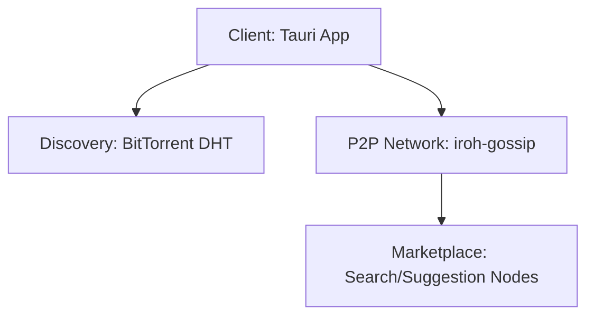

日本語 | [English](./README.md)

# kukuri

Nostr と iroh-gossip、BitTorrent Mainline DHT を基盤にした、完全分散型のトピック指向ソーシャルアプリです。

## これは何か

kukuri は Tauri デスクトップアプリと周辺サービスで構成され、中央サーバーに依存しないトピック共有体験を提供します。イベント配信は iroh-gossip、ピア発見は DHT、データモデルは Nostr 互換イベントを採用しています。

## クイックスタート

### 前提

- Node.js 20+
- pnpm（Corepack 経由）
- Rust toolchain
- Docker（Docker テストランナーと community node 用）

### インストール

```bash
chmod +x scripts/install-dev-tools.sh
./scripts/install-dev-tools.sh

corepack enable pnpm
cd kukuri-tauri
corepack pnpm install --frozen-lockfile
```

### 起動（デスクトップアプリ）

```bash
cd kukuri-tauri
corepack pnpm tauri dev
```

### テスト / Lint（最小）

```bash
# Docker でフルテスト
./scripts/test-docker.sh all

# フロントエンドテスト（Linux/macOS/WSL2）
cd kukuri-tauri
pnpm test

# Rust テスト（Linux/macOS/WSL2）
cd kukuri-tauri/src-tauri
cargo test
```

> **Windows**: `pnpm test` / `cargo test` をホストで直接実行せず、`./scripts/test-docker.ps1 <suite>` を使ってください。

## モノレポ構成

```
.
├── kukuri-tauri/           # デスクトップアプリ（React + Tauri）
├── kukuri-cli/             # DHT ブートストラップ/リレー CLI
├── kukuri-community-node/  # community node サービス
├── docs/                   # 設計/実装/運用ドキュメント
├── scripts/                # 開発/テスト自動化
└── docker/                 # Docker 関連
```

| 名称 | パス | 役割 | 起動 / テスト |
| --- | --- | --- | --- |
| デスクトップアプリ | `kukuri-tauri/` | Tauri + React クライアント | `cd kukuri-tauri && pnpm tauri dev` / `pnpm test` |
| Rust コア（Tauri） | `kukuri-tauri/src-tauri/` | Rust バックエンド + SQLite | `cd kukuri-tauri/src-tauri && cargo test` |
| CLI ノード | `kukuri-cli/` | DHT ブートストラップ/リレー CLI | `cd kukuri-cli && cargo build --release` / `cargo test` |
| Community node | `kukuri-community-node/` | Community node サービス群 | `cd kukuri-community-node && docker compose up -d` / `cargo test --workspace --all-features` |

## 開発フロー

### 主要コマンド

```bash
# デスクトップアプリ
cd kukuri-tauri
pnpm tauri dev
pnpm tauri build
pnpm lint
pnpm format
pnpm type-check
pnpm test

# Rust（Tauri）
cd kukuri-tauri/src-tauri
cargo test
cargo clippy -D warnings

# CLI
cd kukuri-cli
cargo test
cargo build --release
```

### Docker テストランナー

```bash
# Docker で全テスト
./scripts/test-docker.sh all

# Windows（PowerShell）
./scripts/test-docker.ps1 all
```

## 設定

### 環境変数ファイル

- `./.env.example`（ブートストラップ/リレーのシークレット等）
- `./kukuri-cli/.env.example`（CLI のログ/ネットワーク設定）
- `./kukuri-community-node/.env.example`（community node サービス設定）

#### Community node のセットアップ

```bash
cd kukuri-community-node
cp .env.example .env
```

#### 手動検証用 P2P ブートストラップ（任意）

```bash
docker compose -f docker-compose.test.yml up -d p2p-bootstrap
# ...検証後...
docker compose -f docker-compose.test.yml down --remove-orphans
```

## アーキテクチャ（概要）



## CI

CI は `./.github/workflows/test.yml` で定義されており、Docker テスト、Linux ネイティブテスト（Rust + TS）、community node テスト、フォーマットチェック、Windows ビルドチェック、デスクトップ E2E を含みます。

## 貢献・サポート

- 大きな変更の前に Issue で相談してください。
- 変更内容は `./docs/` の方針に合わせて整理してください。
- 変更対象に応じたテストを実行してください（Quickstart / 開発フロー参照）。

## ライセンス

MIT。詳細は [LICENSE](./LICENSE) を参照してください。
