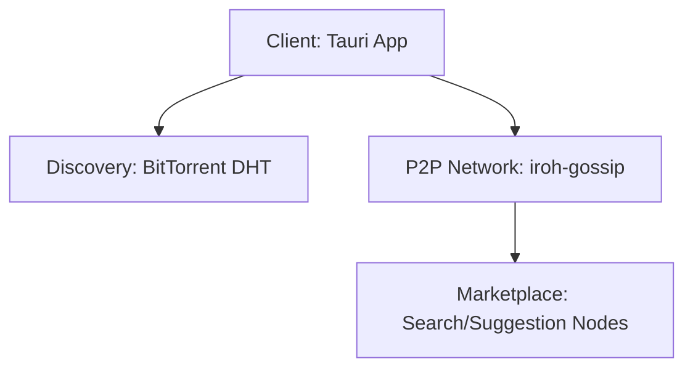

English | [日本語](./README.ja.md)

# kukuri

A fully decentralized, topic-first social app built on Nostr, iroh-gossip, and BitTorrent Mainline DHT.

## What it is

kukuri is a Tauri desktop application and supporting services that enable topic-based social sharing without relying on central servers. It uses iroh-gossip for fast event distribution and DHT-based discovery for peer connectivity, with Nostr-compatible events as the data model.【F:docs/SUMMARY.md†L5-L12】【F:docs/02_architecture/system_design.md†L12-L68】

## Quickstart

### Prerequisites

- Node.js 20+
- pnpm (via Corepack)
- Rust toolchain
- Docker (for the Docker test runner and community node)

【F:docs/01_project/setup_guide.md†L18-L83】【F:docs/01_project/setup_guide.md†L168-L204】

### Install

```bash
chmod +x scripts/install-dev-tools.sh
./scripts/install-dev-tools.sh

corepack enable pnpm
cd kukuri-tauri
corepack pnpm install --frozen-lockfile
```

【F:docs/01_project/setup_guide.md†L32-L47】【F:docs/01_project/setup_guide.md†L74-L118】【F:kukuri-tauri/package.json†L6-L23】

### Run (desktop app)

```bash
cd kukuri-tauri
corepack pnpm tauri dev
```

【F:AGENTS.md†L12-L18】

### Test / Lint (short list)

```bash
# Full test suite in Docker
./scripts/test-docker.sh all

# Frontend tests (Linux/macOS/WSL2)
cd kukuri-tauri
pnpm test

# Rust tests (Linux/macOS/WSL2)
cd kukuri-tauri/src-tauri
cargo test
```

【F:scripts/test-docker.sh†L1-L81】【F:kukuri-tauri/package.json†L9-L23】【F:AGENTS.md†L15-L21】

> **Windows**: Use `./scripts/test-docker.ps1 <suite>` instead of running `pnpm test` / `cargo test` directly on the host.【F:AGENTS.md†L17-L21】

## Monorepo layout

```
.
├── kukuri-tauri/           # Desktop app (React + Tauri)
├── kukuri-cli/             # Bootstrap/relay CLI for DHT
├── kukuri-community-node/  # Community node services
├── docs/                   # Design, implementation, and runbooks
├── scripts/                # Dev/test automation
└── docker/                 # Docker assets
```

【F:AGENTS.md†L1-L8】

| Name | Path | What it does | How to run / test |
| --- | --- | --- | --- |
| Desktop app | `kukuri-tauri/` | Tauri + React client | `cd kukuri-tauri && pnpm tauri dev` / `pnpm test`【F:AGENTS.md†L12-L18】【F:kukuri-tauri/package.json†L6-L23】 |
| Rust core (Tauri) | `kukuri-tauri/src-tauri/` | Rust backend, migrations, SQLite | `cd kukuri-tauri/src-tauri && cargo test`【F:AGENTS.md†L15-L21】 |
| CLI node | `kukuri-cli/` | DHT bootstrap + relay CLI | `cd kukuri-cli && cargo build --release` / `cargo test`【F:kukuri-cli/README.md†L23-L44】【F:AGENTS.md†L15-L17】 |
| Community node | `kukuri-community-node/` | Minimal community node services | `cd kukuri-community-node && docker compose up -d` / `cargo test --workspace --all-features`【F:kukuri-community-node/README.md†L5-L14】【F:.github/workflows/test.yml†L178-L205】 |

## Development workflow

### Common commands

```bash
# Desktop app
cd kukuri-tauri
pnpm tauri dev
pnpm tauri build
pnpm lint
pnpm format
pnpm type-check
pnpm test

# Rust (Tauri)
cd kukuri-tauri/src-tauri
cargo test
cargo clippy -D warnings

# CLI
cd kukuri-cli
cargo test
cargo build --release
```

【F:AGENTS.md†L12-L25】

### Docker test runner

```bash
# Run everything in Docker
./scripts/test-docker.sh all

# Windows (PowerShell)
./scripts/test-docker.ps1 all
```

【F:scripts/test-docker.sh†L1-L81】【F:AGENTS.md†L17-L21】

## Configuration

### Environment files

- `./.env.example` (bootstrap/relay secrets and defaults)
- `./kukuri-cli/.env.example` (CLI logging/network defaults)
- `./kukuri-community-node/.env.example` (community node services)

【F:.env.example†L1-L15】【F:kukuri-cli/.env.example†L1-L11】【F:kukuri-community-node/.env.example†L1-L46】

#### Community node setup

```bash
cd kukuri-community-node
cp .env.example .env
```

【F:kukuri-community-node/README.md†L5-L10】

#### P2P bootstrap for manual validation (optional)

```bash
docker compose -f docker-compose.test.yml up -d p2p-bootstrap
# ...run your checks...
docker compose -f docker-compose.test.yml down --remove-orphans
```

【F:docs/01_project/setup_guide.md†L124-L141】

## Architecture (high-level)



【F:docs/02_architecture/system_design.md†L12-L40】

## CI

CI is defined in `./.github/workflows/test.yml` and includes Docker test suites, native Linux tests (Rust + TS), community node tests, format checks, Windows build checks, and desktop E2E scenarios.【F:.github/workflows/test.yml†L1-L233】

## Contributing & Support

- Open an issue to discuss changes before large work.
- Keep changes scoped and aligned with the existing docs under `./docs/`.
- Run the relevant tests for the area you touched (see Quickstart and Development workflow).

## License

MIT. See [LICENSE](./LICENSE).
