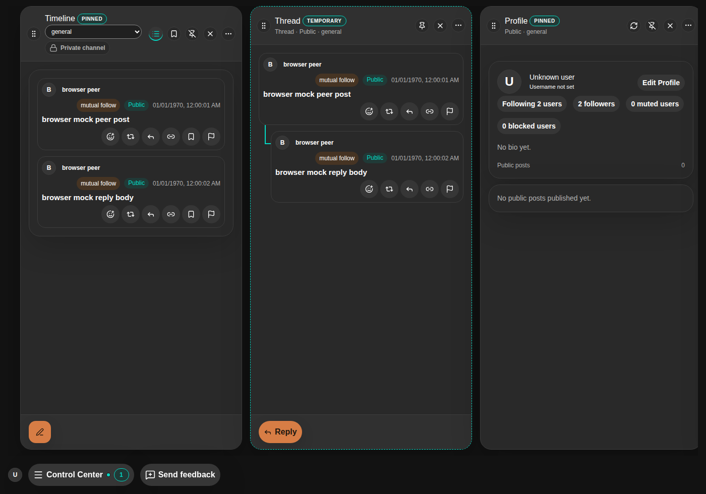

English | [日本語](./README.ja.md)

# kukuri

kukuri is a topic-first P2P social app. Find a topic you care about, join a public conversation, or move into a smaller private channel while keeping your identity rooted on your own device.



## Download the Builder Preview

> [!IMPORTANT]
> kukuri is currently a **Builder Preview for testers**, not a stable general release.

**[Download the latest Windows Preview](https://github.com/KingYoSun/kukuri/releases/latest)**

| Platform | Current support |
| --- | --- |
| Windows 10 / 11 | NSIS installer from the latest GitHub Release |
| Linux | Run from source; no packaged installer yet |
| macOS | No package is currently provided |

Preview installers may be unsigned. Windows SmartScreen can therefore show a warning; check the release notes before running the installer.

For detailed setup and recovery help, see the [user quickstart](./docs/runbooks/mvp-user-quickstart.md) and [troubleshooting guide](./docs/runbooks/mvp-troubleshooting.md).

## What You Can Do

- Find and follow topics, then publish posts and replies in threaded conversations.
- Keep public posts and private channels under the same topic instead of splitting the community into separate spaces.
- Follow people, react, repost, quote, bookmark posts, and mute authors locally.
- Exchange direct messages with mutual connections and share images or videos.
- Receive local and operating-system notifications for replies, mentions, follows, reposts, and messages.
- Keep your identity and local state across restarts, temporary offline periods, and Preview updates.

## Try It in 3 Minutes

1. Install and launch the Windows Preview, or [run it from source on Linux](#development-quickstart).
2. Wait a few seconds for the preloaded Community Node to become `ready`, then open a starter topic.
3. Publish a public post and reply to an existing post.
4. Create or join a private channel under the same topic.
5. Open `Settings -> Release`, export the diagnostic report, and send feedback through GitHub.

The default diagnostic report omits secret keys, authentication tokens, private-channel secrets, invite/share tokens, direct-message bodies, and local database paths.

## Preview Status and Limits

- The packaged Preview currently targets Windows 10 and 11 only. Linux remains source-run, and macOS has no package.
- A direct message needs another test peer and a mutual relationship. P2P behavior is easiest to evaluate with two devices or two isolated app instances.
- Live, Metaverse, and game-room surfaces are still evolving. Some extended features remain staged behind developer mode, and the Stream surface does not yet include a media player.
- Preview updates are expected to preserve identity, local database state, Iroh data, Community Node settings, private-channel capabilities, and the notification inbox. Keep the app data directory before uninstalling or resetting if you need to retain local state.
- This is testing software. Please attach a sanitized diagnostic report when reporting connectivity, upgrade, or recovery problems.

See the [Builder Preview plan](./docs/progress/2026-04-16-mvp-builder-preview-plan.md) for the current milestone and the [release runbook](./docs/runbooks/release.md) for packaging and data-safety gates.

## How kukuri Works

- **Your identity stays with you.** The signing key is stored locally. A Community Node is not your account owner or home server.
- **P2P is the foundation.** Connectivity prefers direct P2P, then relay-supported P2P, and uses relay fallback only when the earlier paths cannot carry the data.
- **Community Nodes provide scoped assistance.** A node may help with bootstrap, authentication, topic rendezvous, connectivity, indexing, moderation, or reporting. It is not the permanent canonical store for user posts, profiles, or the social graph, and it has no network-wide authority.
- **Different data has different paths.** Structured shared state is synchronized through `docs`, media and large payloads through `blobs`, and `hints` only notify peers that something may need to be synchronized.
- **Nostr compatibility is intentionally limited.** kukuri keeps useful identity, signed-envelope, and selected tag semantics; it is not a full Nostr client and does not use a relay-first internal sync model.
- **Moderation remains scoped.** A moderation event or safety advisory is optional trust input from its issuing node, not a command applied to the entire network. Each client decides how to use it.

The durable responsibility boundary is documented in [P2P-first Community Node responsibilities](./docs/architecture/p2p-first-community-node-responsibility-boundary.md).

## Available Today

| Area | Current Builder Preview capability |
| --- | --- |
| Topics and posts | Topic discovery, public posts, replies and threads, reactions, reposts, quotes, bookmarks, and local mute |
| Private conversation | Invite-only, friends-only, and friends-plus channels with epoch-aware membership; pairwise mutual-only direct messages |
| People and activity | Public profiles, follow/unfollow, mutual and friend-of-friend context, local and OS notifications |
| Media | Image and video attachments in posts and direct messages |
| Connectivity and recovery | Static-peer links, seeded DHT discovery, Community Node assistance, offline-capable local state, restart recovery, and late-join backfill |
| Preview operations | In-app update checks, sanitized diagnostics, feedback links, provenance display, and distributed report routing |

The [foundation progress record](./docs/progress/2026-03-10-foundation.md), accepted [ADRs](./docs/adr/), tests, and [harness scenarios](./harness/scenarios/) define the detailed shipped baseline.

## Longer-Term Direction

- Optional search, discovery, recommendation, gateway, and bridge services can grow around the P2P core without becoming mandatory canonical stores.
- Community Node trust, moderation, policy-assist, and operator tooling can evolve within each node's declared capability and authority scope.
- Live, Metaverse, game, and richer media experiences can mature without changing the topic-first ownership and synchronization boundaries.

These are directions, not a promise that every capability is available in the current Preview.

## Feedback and Community

- Report reproducible bugs and regressions in [GitHub Issues](https://github.com/KingYoSun/kukuri/issues).
- Use [GitHub Discussions](https://github.com/KingYoSun/kukuri/discussions) for questions, product ideas, UX proposals, and early discussion of larger changes.
- Include the sanitized report from `Settings -> Release` for connectivity, updater, and recovery problems.
- Community Node operators are welcome to report deployment, disclosure, moderation, and distributed-reporting feedback through the same GitHub entry points.

## Contributing

Contributions are welcome in code and beyond it: bug reports, UI/UX proposals, documentation, translations, tests, implementation work, and Community Node operational feedback all help.

For a substantial feature, protocol change, responsibility-boundary change, or large refactor, start a Discussion before implementation. Keep bug reports focused in Issues, and use the repository's tests and documentation as the source of truth for behavior.

### Development Quickstart

Prerequisites:

- Git
- Rust `1.92.0` (pinned by `rust-toolchain.toml`)
- Node.js `^20.19.0` or `>=22.12.0`
- pnpm `10.16.1` through the commands below
- The platform dependencies from the [development runbook](./docs/runbooks/dev.md); Windows development also needs the [Tauri prerequisites](https://v2.tauri.app/start/prerequisites/#windows)
- Docker only for Community Node integration tests and local Community Node stacks

```bash
git clone https://github.com/KingYoSun/kukuri.git
cd kukuri

npx pnpm@10.16.1 install --dir apps/desktop
cargo xtask doctor

cd apps/desktop
npx pnpm@10.16.1 tauri:dev
```

Run the normal validation paths from the repository root:

```bash
cargo xtask check
cargo xtask test
cargo xtask e2e-smoke
```

For browser-only frontend work, use `npx pnpm@10.16.1 --dir apps/desktop dev`. The [development runbook](./docs/runbooks/dev.md) lists targeted checks, UI validation, Community Node workflows, and platform-specific setup.

## Documentation

- [Documentation index](./docs/README.md)
- [Builder Preview plan](./docs/progress/2026-04-16-mvp-builder-preview-plan.md)
- [Foundation and shipped baseline](./docs/progress/2026-03-10-foundation.md)
- [User quickstart](./docs/runbooks/mvp-user-quickstart.md)
- [Troubleshooting](./docs/runbooks/mvp-troubleshooting.md)
- [Development runbook](./docs/runbooks/dev.md)
- [Release runbook](./docs/runbooks/release.md)
- [P2P-first Community Node responsibility boundary](./docs/architecture/p2p-first-community-node-responsibility-boundary.md)
- [Architecture Decision Records](./docs/adr/)
- [Third-party notices](./docs/THIRD_PARTY_NOTICES.md)

## License

[MIT](./LICENSE)
