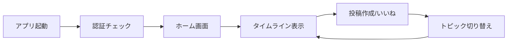
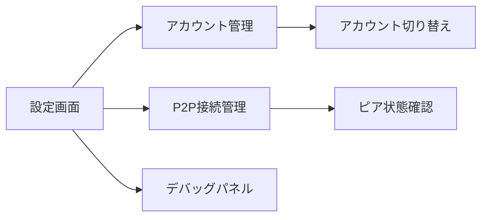
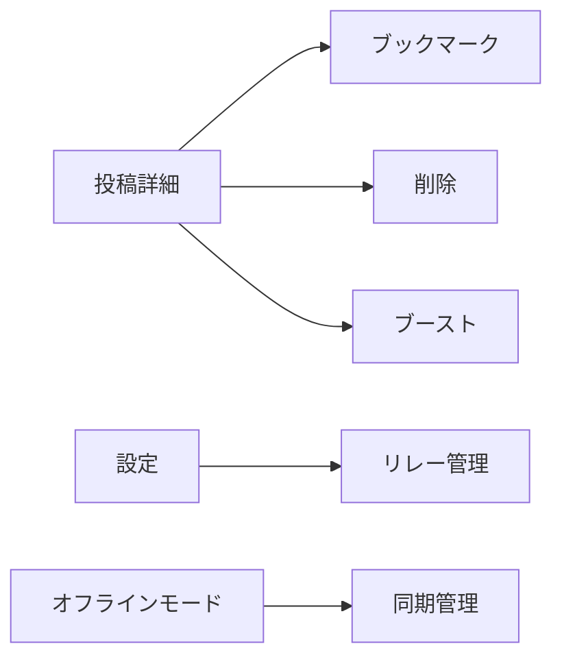

# Phase 2.5: 機能使用状況マップ

**作成日**: 2025年08月09日
**Phase**: 2.5 - ユーザー導線分析

## 概要
kukuriアプリケーションの全機能の使用状況を可視化し、ユーザー導線の最適化と不要コードの削除計画を策定するための包括的なマップです。

## 1. 機能別使用状況ヒートマップ

### 🔴 高使用頻度（コア機能）
| 機能 | 使用箇所数 | 重要度 | 状態 |
|------|-----------|---------|------|
| 投稿表示（get_posts） | 10+ | ★★★★★ | 完全実装 |
| 投稿作成（create_post） | 8+ | ★★★★★ | 完全実装 |
| いいね（like_post） | 5+ | ★★★★☆ | 完全実装 |
| 認証（login/logout） | 5+ | ★★★★★ | 完全実装 |
| トピック参加/離脱 | 5+ | ★★★★☆ | 完全実装 |

### 🟡 中使用頻度（セカンダリ機能）
| 機能 | 使用箇所数 | 重要度 | 状態 |
|------|-----------|---------|------|
| P2P接続管理 | 3-4 | ★★★☆☆ | 部分実装 |
| トピック管理（CRUD） | 3-4 | ★★★☆☆ | 完全実装 |
| セキュアストレージ | 3-4 | ★★★★☆ | 完全実装 |
| Nostr同期 | 2-3 | ★★★☆☆ | 部分実装 |
| リアクション送信 | 2 | ★★☆☆☆ | 実装済み |

### 🔵 低使用頻度（補助機能）
| 機能 | 使用箇所数 | 重要度 | 状態 |
|------|-----------|---------|------|
| ブックマーク | 1 | ★★☆☆☆ | UI未完成 |
| 投稿削除 | 1 | ★☆☆☆☆ | UI未実装 |
| ブースト（リポスト） | 1 | ★☆☆☆☆ | バックエンドのみ |
| プロフィール更新 | 1 | ★★☆☆☆ | 基本実装のみ |
| リレー管理 | 0 | ★☆☆☆☆ | UI未実装 |

### ⚫ 未使用・孤立機能
| 機能/モジュール | 理由 | アクション |
|----------------|------|-----------|
| peer_discovery.rs | テストのみ使用 | 削除可能 |
| storage/mod.rs | 空のモジュール | 削除可能 |
| delete_events | UI未実装 | 削除検討 |
| boost_post（一部） | 未完成実装 | 完成または削除 |
| オフライン系11コマンド | UIから未使用 | UI統合必要 |

## 2. ユーザー導線フロー

### 主要導線（90%のユーザー）


### セカンダリ導線（10%のユーザー）


### 未実装導線（将来実装予定）


## 3. モジュール依存関係

### フロントエンド依存関係
```
components/
├── pages/          [高使用]
│   ├── Home.tsx    → PostCard, Timeline
│   ├── Topics.tsx  → TopicCard
│   └── Settings.tsx → DebugPanels
├── posts/          [高使用]
│   ├── PostCard    → ReactionPicker
│   └── PostComposer → MarkdownEditor
└── debug/          [低使用]
    └── *Panel.tsx  → 設定画面のみ
```

### バックエンド依存関係
```
modules/
├── auth/           [必須]
├── event/          [コア機能]
├── post/           [コア機能]
├── topic/          [コア機能]
├── p2p/            [部分使用]
│   ├── gossip_manager [使用中]
│   ├── event_sync    [使用中]
│   ├── topic_mesh    [部分使用]
│   └── peer_discovery [未使用]
├── offline/        [未統合]
└── storage/        [空・削除可能]
```

## 4. コード削減可能性分析

### 即座に削除可能（影響なし）
- **50行以上削減可能**
  - `storage/mod.rs` - 空のモジュール
  - `peer_discovery.rs` の大部分 - テストのみ使用
  - 未使用のdead_code関数（14箇所）

### リファクタリング後削除可能
- **200行以上削減可能**
  - 重複するAPI呼び出しパターン（Nostr、P2P）
  - テスト専用のモック実装
  - 未完成のboost機能

### 統合により削減可能
- **100行以上削減可能**
  - Nostr API呼び出しの3つの異なるパターン
  - P2P API呼び出しの2つの異なるパターン

## 5. 最適化優先順位

### Phase 1: 即座実行（影響小）
1. ✅ 空のモジュール削除
2. ✅ 未使用dead_code削除
3. ✅ テスト専用コード整理

### Phase 2: 短期改善（1週間）
1. 🔄 API呼び出しパターン統一
2. 🔄 エラーハンドリング統一
3. 🔄 重複コード削除

### Phase 3: 中期改善（2週間）
1. 📋 オフライン機能のUI統合
2. 📋 ブックマーク機能の完成
3. 📋 削除機能のUI実装

### Phase 4: 長期改善（1ヶ月）
1. 🎯 P2P機能の完全統合
2. 🎯 リレー管理UIの実装
3. 🎯 パフォーマンス最適化

## 6. ユーザー影響評価

### 削除による影響
| アクション | ユーザー影響 | リスク |
|-----------|-------------|--------|
| peer_discovery削除 | なし | 低 |
| storage削除 | なし | なし |
| dead_code削除 | なし | 低 |
| boost_post削除 | なし（未実装） | なし |

### 統合による改善
| アクション | ユーザーメリット | 実装工数 |
|-----------|-----------------|----------|
| API統一 | レスポンス改善 | 小 |
| エラー処理統一 | UX向上 | 中 |
| オフライン統合 | 新機能追加 | 大 |

## 7. メトリクス目標

### 現状
- TODOコメント: TypeScript 8件、Rust 31件
- dead_code: 50箇所
- 未使用コマンド: 11個以上
- 重複パターン: 5箇所以上

### Phase 2.5完了後目標
- TODOコメント: 30件以下
- dead_code: 30箇所以下
- 未使用コマンド: 5個以下
- 重複パターン: 2箇所以下

## 8. 結論

### 主要な発見
1. **コア機能は健全**: 投稿、認証、トピック機能は適切に実装・使用されている
2. **中間層に課題**: P2P、Nostr機能は部分的使用で最適化の余地大
3. **未統合機能多数**: オフライン、ブックマーク、削除機能がUI未統合

### 推奨アクション
1. **即座**: 未使用コード削除で軽量化
2. **短期**: API統一でメンテナンス性向上
3. **中期**: 未統合機能のUI実装で機能完成度向上

この機能使用状況マップは、Phase 2.5のユーザー導線最適化とコードクリーンアップの基礎資料として活用できます。