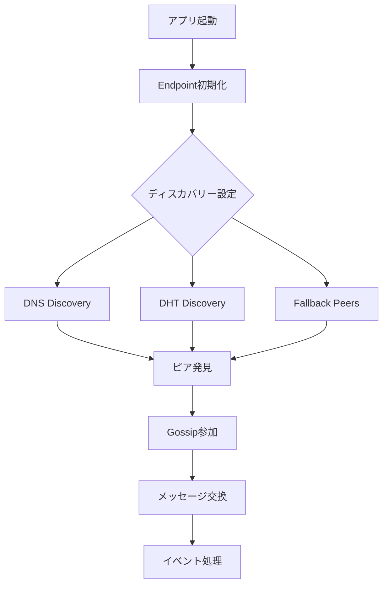
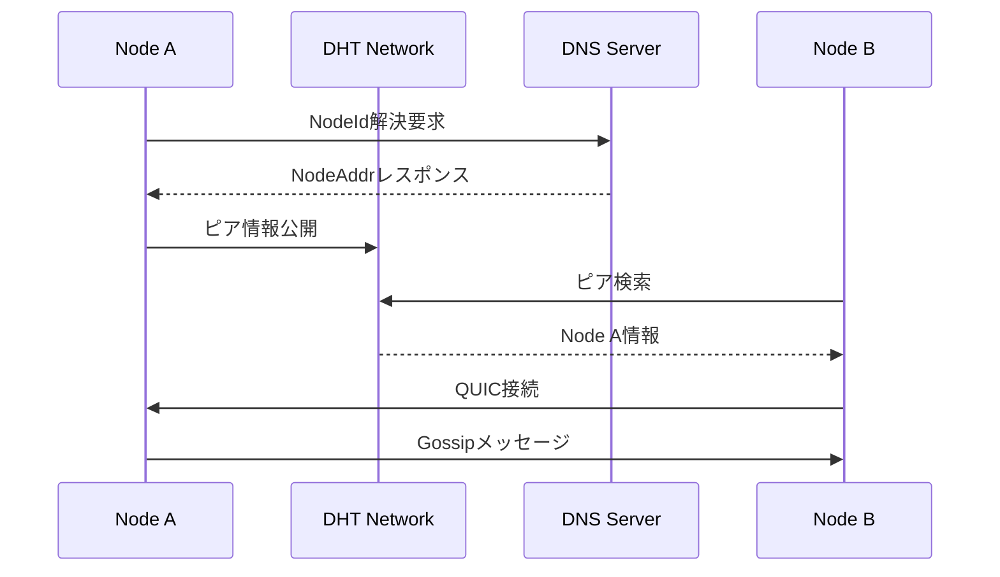

# DHT基盤Discovery Layerアーキテクチャ

**作成日**: 2025年08月16日
**最終更新**: 2025年08月16日

## 概要

kukuriプロジェクトでは、irohのビルトインDHTディスカバリー機能を活用して、完全分散型のピア発見を実現します。BitTorrent Mainline DHTを基盤とすることで、中央サーバー依存を排除し、真の分散性、検閲耐性、スケーラビリティを提供します。

## 主要コンポーネント

### 1. irohディスカバリーメカニズム

#### 利用可能なディスカバリー方法
```rust
Endpoint::builder()
    .discovery_n0()      // DNSディスカバリー（Number 0）
    .discovery_dht()     // DHTディスカバリー（BitTorrent Mainline）
    .discovery_local()   // ローカルディスカバリー（mDNS風）
    .discovery_pkarr()   // Pkarrリレーサーバー
```

#### 現在の実装
- **DNS**: デフォルトで有効（Number 0の公開DNSサーバー）
- **DHT**: `discovery-pkarr-dht`フィーチャーフラグで有効化
- **ローカル**: 将来実装予定
- **Pkarr**: HTTPベースのリレー（ローカル環境構築済み、Docker Composeで利用可能）

### 2. DHT統合アーキテクチャ



### 3. エンドポイント設定

```rust
pub struct DiscoveryConfig {
    pub enable_dns: bool,        // DNSディスカバリー
    pub enable_dht: bool,        // DHTディスカバリー
    pub enable_local: bool,      // ローカルディスカバリー
    pub bootstrap_peers: Vec<String>, // フォールバックピア
}
```

## データフロー

### ピア発見フロー
1. **初期化**: irohエンドポイントの作成
2. **ディスカバリー起動**: 複数の方法を並行実行
   - DNS経由でNodeId解決
   - DHT経由でピア情報取得
   - フォールバックピアへの直接接続
3. **接続確立**: 発見したピアとQUIC接続
4. **Gossip参加**: トピックベースの通信開始

### メッセージフロー


## セキュリティモデル

### 1. 認証と暗号化
- **NodeId**: Ed25519公開鍵ベース
- **QUIC**: TLS 1.3による暗号化
- **署名検証**: 全メッセージの完全性保証

### 2. 攻撃対策

#### Sybil攻撃
- NodeIdの計算コスト
- 接続数制限
- レピュテーションシステム（将来実装）

#### DDoS攻撃
- レート制限
- 接続タイムアウト
- バックオフアルゴリズム

#### プライバシー保護
- 最小限のメタデータ公開
- IPアドレスのローテーション
- リレーサーバー経由の通信オプション

## パフォーマンス要件

### レイテンシ
- **初回ディスカバリー**: 5-10秒以内
- **接続確立**: 1-3秒以内
- **メッセージ配信**: 100ms以内（同一地域）

### スケーラビリティ
- **ノード数**: 10,000+対応
- **同時接続**: 最大50ピア/ノード
- **メッセージレート**: 1000msg/秒

### リソース使用
- **メモリ**: 100MB以下
- **CPU**: 5%以下（アイドル時）
- **帯域幅**: 適応的調整

## 実装詳細

### 1. DHTディスカバリー実装
```rust
// src-tauri/src/infrastructure/p2p/discovery.rs
pub struct DhtDiscovery {
    endpoint: Arc<Endpoint>,
    config: DiscoveryConfig,
    metrics: Arc<Mutex<DiscoveryMetrics>>,
}

impl DhtDiscovery {
    pub async fn start(&self) -> Result<()> {
        // DHT参加
        self.join_dht().await?;
        
        // 定期的な再公開
        self.start_republish_loop().await?;
        
        // メトリクス収集
        self.start_metrics_collection().await?;
        
        Ok(())
    }
}
```

### 2. フォールバック機構
```rust
pub async fn bootstrap_with_fallback(
    endpoint: &Endpoint,
    config: &DiscoveryConfig,
) -> Result<Vec<NodeAddr>> {
    let mut discovered_peers = Vec::new();
    
    // 並行ディスカバリー
    let (dht_peers, dns_peers, fallback_peers) = tokio::join!(
        discover_via_dht(endpoint),
        discover_via_dns(endpoint),
        connect_to_fallback(endpoint, &config.bootstrap_peers)
    );
    
    // 結果の統合
    discovered_peers.extend(dht_peers?);
    discovered_peers.extend(dns_peers?);
    discovered_peers.extend(fallback_peers?);
    
    // 重複排除
    discovered_peers.dedup();
    
    Ok(discovered_peers)
}
```

## 監視とメトリクス

### 収集するメトリクス
```rust
pub struct DiscoveryMetrics {
    pub peers_discovered: u64,
    pub dht_queries: u64,
    pub dns_queries: u64,
    pub connection_attempts: u64,
    pub successful_connections: u64,
    pub discovery_latency: Duration,
    pub message_count: u64,
}
```

### ヘルスチェック
- DHTアクティブ状態
- DNS到達性
- ピア接続数
- メッセージフロー率

## 移行計画

### Phase 1: 基本実装（完了）
- [x] Cargo.tomlにDHTフィーチャー追加
- [x] エンドポイント初期化更新
- [x] フォールバック機構実装

### Phase 2: 最適化（進行中）
- [ ] 接続プール管理
- [ ] メトリクス収集
- [ ] パフォーマンスチューニング

### Phase 3: 拡張（計画中）
- [ ] Pkarrリレー統合
- [ ] ローカルディスカバリー
- [ ] カスタムディスカバリーサービス

## トラブルシューティング

### よくある問題

#### ピアが見つからない
1. DHTフィーチャーが有効か確認
2. ファイアウォール設定確認
3. DNSディスカバリーも併用
4. フォールバックピアを設定

#### 接続が不安定
1. NAT設定を確認
2. タイムアウト値を調整
3. リレーサーバーを活用

## 参考資料

- [iroh Discovery Documentation](https://www.iroh.computer/docs/concepts/discovery)
- [BitTorrent DHT Specification](https://www.bittorrent.org/beps/bep_0005.html)
- [実装ガイド](../03_implementation/dht_integration_guide.md)
- [新計画書](../01_project/activeContext/iroh-native-dht-plan.md)