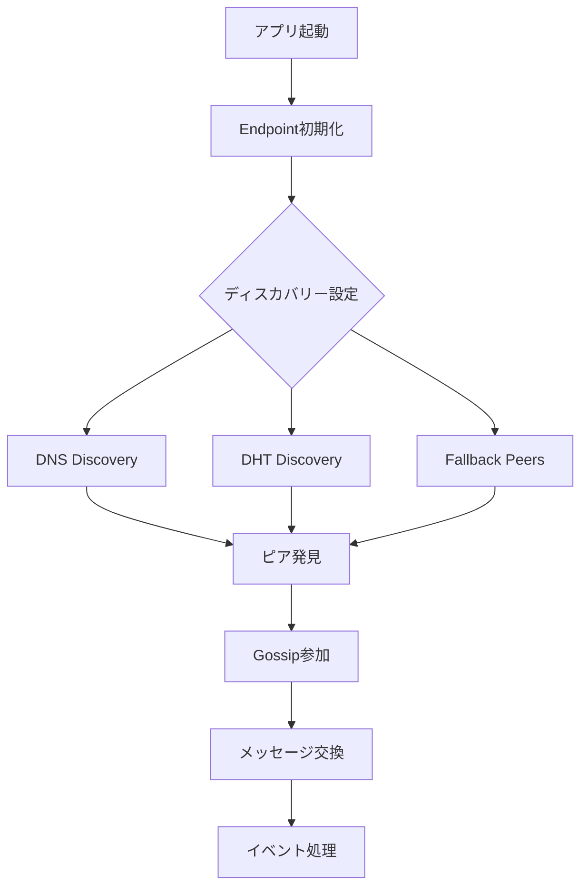
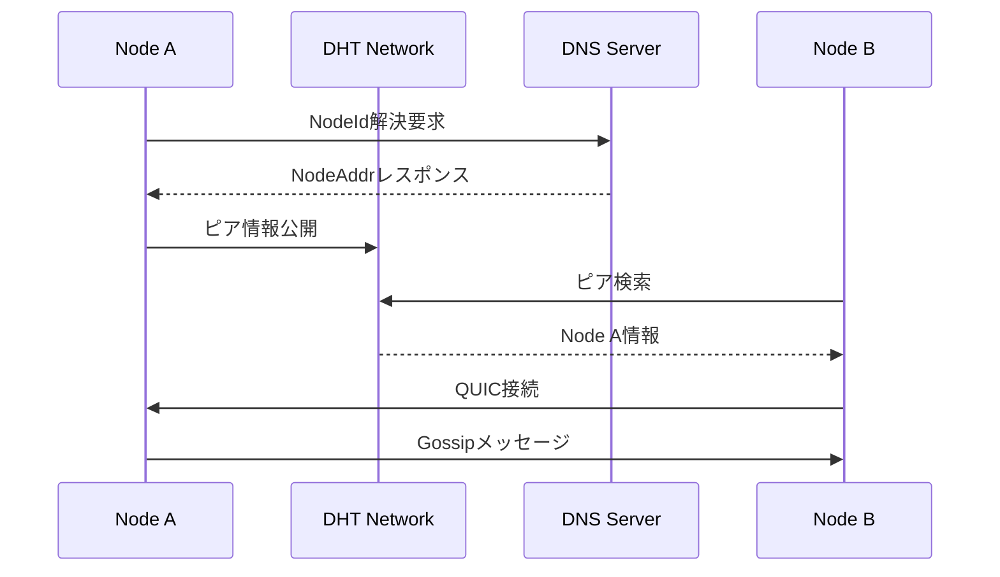

# DHT基盤Discovery Layerアーキテクチャ

**作成日**: 2025年08月16日
**最終更新**: 2026年02月02日

## 概要

kukuriプロジェクトでは、irohのビルトインDHTディスカバリー機能を活用して、完全分散型のピア発見を実現します。BitTorrent Mainline DHTを基盤とすることで、中央サーバー依存を排除し、真の分散性、検閲耐性、スケーラビリティを提供します。

## 主要コンポーネント

### 1. irohディスカバリーメカニズム

#### 利用可能なディスカバリー方法（現行API）
```rust
use iroh::discovery::{
    dns::DnsDiscovery,
    mdns::MdnsDiscovery,
    pkarr::{PkarrPublisher, dht::DhtDiscovery},
};

let mut builder = Endpoint::builder().clear_discovery();

// DNS（n0）
builder = builder.discovery(PkarrPublisher::n0_dns());
builder = builder.discovery(DnsDiscovery::n0_dns());

// Mainline DHT
builder = builder.discovery(
    DhtDiscovery::builder()
        .include_direct_addresses(true)
        .n0_dns_pkarr_relay(),
);

// ローカルディスカバリー（必要時のみ）
builder = builder.discovery(MdnsDiscovery::builder());
```

#### 現在の実装
- **DNS**: デフォルトで有効（n0 DNS + PkarrPublisher）
- **DHT**: `discovery-pkarr-dht` を有効化し Mainline DHT を使用
- **ローカル**: `discovery-local-network` 有効時のみ（通常は無効）

### 2. DHT統合アーキテクチャ



### 3. エンドポイント設定

ユーザー向け設定は `NetworkConfig` に集約され、内部では `DiscoveryOptions` が使用されます。`enable_dht` は **Mainline DHT** を意味し、内部表現の `enable_mainline` にマップされます。

```rust
// src-tauri/src/shared/config.rs
pub struct NetworkConfig {
    pub bootstrap_peers: Vec<String>,
    pub max_peers: u32,
    pub connection_timeout: u64,
    pub retry_interval: u64,
    pub enable_dht: bool,   // Mainline DHT
    pub enable_dns: bool,
    pub enable_local: bool,
}

// src-tauri/src/infrastructure/p2p/discovery_options.rs
pub struct DiscoveryOptions {
    pub enable_dns: bool,
    pub enable_mainline: bool,
    pub enable_local: bool,
}

impl From<&NetworkConfig> for DiscoveryOptions {
    fn from(cfg: &NetworkConfig) -> Self {
        Self {
            enable_dns: cfg.enable_dns,
            enable_mainline: cfg.enable_dht,
            enable_local: cfg.enable_local,
        }
    }
}
```

## データフロー

### ピア発見フロー
1. **初期化**: irohエンドポイントの作成
2. **ディスカバリー起動**: 複数の方法を並行実行
   - DNS経由でNodeId解決
   - DHT経由でピア情報取得
   - フォールバックピアへの直接接続
3. **接続確立**: 発見したピアとQUIC接続
4. **Gossip参加**: トピックベースの通信開始

### メッセージフロー


## セキュリティモデル

### 1. 認証と暗号化
- **NodeId**: Ed25519公開鍵ベース
- **QUIC**: TLS 1.3による暗号化
- **署名検証**: 全メッセージの完全性保証

### 2. 攻撃対策

#### Sybil攻撃
- NodeIdの計算コスト
- 接続数制限
- レピュテーションシステム（将来実装）

#### DDoS攻撃
- レート制限
- 接続タイムアウト
- バックオフアルゴリズム

#### プライバシー保護
- 最小限のメタデータ公開
- IPアドレスのローテーション

## パフォーマンス要件

### レイテンシ
- **初回ディスカバリー**: 5-10秒以内
- **接続確立**: 1-3秒以内
- **メッセージ配信**: 100ms以内（同一地域）

### スケーラビリティ
- **ノード数**: 10,000+対応
- **同時接続**: 最大50ピア/ノード
- **メッセージレート**: 1000msg/秒

### リソース使用
- **メモリ**: 100MB以下
- **CPU**: 5%以下（アイドル時）
- **帯域幅**: 適応的調整

## 実装詳細

### 1. DiscoveryOptions 適用
```rust
// src-tauri/src/infrastructure/p2p/iroh_network_service.rs
let static_discovery = Arc::new(StaticProvider::new());
let builder = Endpoint::builder().secret_key(secret_key);
let builder = discovery_options.apply_to_builder(builder);
let builder = builder.discovery(static_discovery.clone());
let endpoint = builder.bind().await?;
```

### 2. フォールバック機構とJSON仕様

フォールバックは `bootstrap_config` と `dht_bootstrap::fallback` を中心に実装されています。優先順は **環境変数 → ユーザー設定 → 同梱JSON** で、`NodeId@host:port` 形式のみ接続対象です。

補足（JSON仕様）:
- ブートストラップは `bootstrap_nodes.json` に環境別で宣言する。
- 推奨（採用される）: `"<node_id>@<host:port>"`
- 参考（採用しない）: `"<host:port>"`（NodeIdがないため接続対象外。検証時に警告）
- Tauri: `bootstrap_config.rs` が with_id/socket_only/invalid を検証・ログ出力し、`NodeId@Addr` のみ接続に利用。
- CLI: `--peers` 未指定時に `KUKURI_BOOTSTRAP_CONFIG` と `KUKURI_ENV|ENVIRONMENT` を参照して `NodeId@host:port` を読み込む。

## 監視とメトリクス

### 収集するメトリクス
```rust
pub struct DiscoveryMetrics {
    pub peers_discovered: u64,
    pub dht_queries: u64,
    pub dns_queries: u64,
    pub connection_attempts: u64,
    pub successful_connections: u64,
    pub discovery_latency: Duration,
    pub message_count: u64,
}
```

### ヘルスチェック
- DHTアクティブ状態
- DNS到達性
- ピア接続数
- メッセージフロー率

## 移行計画

### Phase 1: 基本実装（完了）
- [x] Cargo.tomlにDHTフィーチャー追加
- [x] エンドポイント初期化更新
- [x] フォールバック機構実装

### Phase 2: 最適化（進行中）
- [ ] 接続プール管理
- [ ] メトリクス収集
- [ ] パフォーマンスチューニング

### Phase 3: 拡張（計画中）
- [ ] ローカルディスカバリー
- [ ] カスタムディスカバリーサービス

## トラブルシューティング

### よくある問題

#### ピアが見つからない
1. DHTフィーチャーが有効か確認
2. ファイアウォール設定確認
3. DNSディスカバリーも併用
4. フォールバックピアを設定

#### 接続が不安定
1. NAT設定を確認
2. タイムアウト値を調整

## 参考資料

- [iroh Discovery Documentation](https://www.iroh.computer/docs/concepts/discovery)
- [BitTorrent DHT Specification](https://www.bittorrent.org/beps/bep_0005.html)
- [実装ガイド](../03_implementation/dht_integration_guide.md)
- [新計画書](../01_project/activeContext/iroh-native-dht-plan.md)
