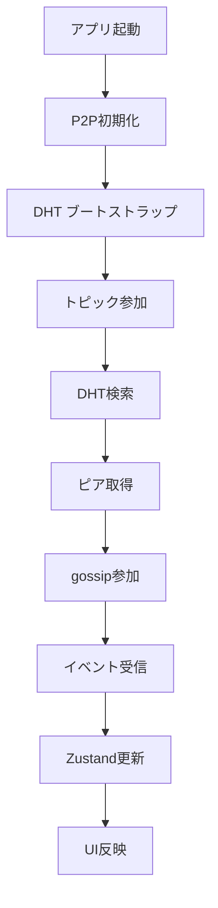

# DHT基盤Discovery Layerアーキテクチャ

**作成日**: 2025年08月16日
**最終更新**: 2025年08月16日

## 概要

kukuriプロジェクトにおいて、Cloudflare Workersベースの中央集権的な発見層から、BitTorrent Mainline DHTを基盤とする完全分散型の発見層へ移行します。この変更により、真の分散性、検閲耐性、スケーラビリティを実現します。

## 主要コンポーネント

### 1. distributed-topic-tracker
- **バージョン**: 0.1.1
- **役割**: iroh-gossipのブートストラップをDHTベースで実現
- **API Doc**: https://docs.rs/crate/distributed-topic-tracker/latest/json

### 2. AutoDiscoveryBuilder
```rust
AutoDiscoveryBuilder::default()
    .rate_limit(10)      // 分あたりレコード制限
    .retries(3)          // リトライ回数
    .jitter(500)         // ジッター (ms)
```

### 3. AutoDiscoveryGossip
- gossipインスタンスのラッパー
- イベント（メッセージ、ピア接続）のハンドリング
- TopicIdと共有シークレットの管理

## データフロー



## セキュリティモデル

### 共有シークレット管理
- Ed25519署名による認証
- DefaultSecretRotationによる定期的な回転
- keyringを使用したセキュアストレージ

### 攻撃対策
- **Sybil攻撃**: 共有シークレットとレート制限
- **DDoS**: レート制限とジッター
- **プライバシー**: 最小限のアドレス公開

## 統合ポイント

### 1. P2Pモジュール（src-tauri/src/p2p/）
- `bootstrap.rs`: DHT統合の中核実装
- `init.rs`: エンドポイントセットアップ

### 2. Tauriコマンド（src-tauri/src/commands/p2p.rs）
```rust
#[tauri::command]
async fn init_p2p() -> Result<()>
```

### 3. イベントハンドリング
```rust
match event {
    GossipEvent::Message { from, content } => {
        // Nostrイベント処理
    }
    GossipEvent::PeerConnected(peer) => {
        // ピア接続処理
    }
}
```

## パフォーマンス要件

### レスポンスタイム
- 初回ブートストラップ: 5-10秒以内
- ピア発見: 3-5秒以内
- メッセージ配信: 100ms以内（ローカルピア）

### スケーラビリティ
- 数千ノード規模での動作
- 背景パブリッシャーによる定期再公開（5分間隔）

## テスト戦略

### ユニットテスト
- AutoDiscoveryBuilderの設定検証
- モックDHTでのピア発見シミュレーション

### E2Eテスト（Docker Compose）
```yaml
version: '3.8'
services:
  node-a:
    image: kukuri-test
    environment:
      - ROLE=seed
  node-b:
    image: kukuri-test
    environment:
      - ROLE=peer
```

シナリオ：
1. ノードAがトピック参加
2. ノードBが発見・接続
3. メッセージ交換確認

## フォールバック機構

DHT失敗時の段階的フォールバック：
1. リトライ（3回、ジッター付き）
2. 既知ピアリスト（ローカルストレージ）
3. ハードコードされたブートストラップノード（暫定）

## 監視とデバッグ

### ログ
- tracing crateによるDHTクエリ/イベントログ
- ログレベル: DEBUG（開発）、INFO（本番）

### メトリクス（将来実装）
- ピア数
- DHT応答時間
- メッセージ配信レイテンシ

## 移行計画

### Phase 1: プロトタイプ（1-2週間）
- 基本的なDHT統合
- 最小限のテスト

### Phase 2: 最適化（1週間）
- パフォーマンスチューニング
- E2Eテスト完備

### Phase 3: 本番リリース
- ドキュメント更新
- 監視体制確立

## 既知の制約

- インターネット接続必須（オフライン動作非対応）
- モバイル環境でのバッテリー消費（将来の最適化課題）
- DHTの初期検索遅延（最大10秒）

## 関連ドキュメント

- [実装計画詳細](../01_project/activeContext/distributed-topic-tracker-plan.md)
- [システム設計書](./system_design.md)
- [P2P実装ガイド](../03_implementation/p2p_implementation.md)