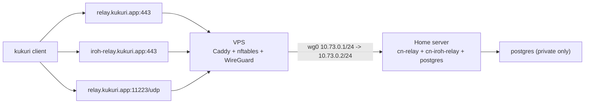

# Home Relay + VPS WireGuard Edge

最終更新日: 2026年03月06日

## 目的

- `cn-relay` / `cn-iroh-relay` は自宅サーバーのまま維持する。
- 公開 IP / 固定ドメイン / TLS 終端は VPS に集約する。
- Cloudflare は `DNS only` のみ使い、`Cloudflare Tunnel` は relay 系データプレーンには使わない。
- `postgres` は自宅サーバーの内部ネットワークに閉じたままにする。

## 構成



## この構成で固定する値

- WireGuard subnet: `10.73.0.0/24`
- VPS tunnel IP: `10.73.0.1`
- Home tunnel IP: `10.73.0.2`
- public relay domain: `relay.kukuri.app`
- public iroh relay domain: `iroh-relay.kukuri.app`
- public UDP port: `11223/udp`
- public WireGuard port: `51820/udp`

## VPS 側

### 1. DNS

- `relay.kukuri.app` を VPS の public IP に向ける
- `iroh-relay.kukuri.app` を VPS の public IP に向ける
- Cloudflare Proxy は `OFF` (`DNS only`)

### 2. リポジトリを clone

```bash
git clone https://github.com/<your-org>/kukuri.git
cd kukuri
cp scripts/vps/home-relay-edge.env.example scripts/vps/home-relay-edge.env
```

### 3. `scripts/vps/home-relay-edge.env` を編集

最低限ここを埋める。

```dotenv
PUBLIC_IFACE=eth0
WG_ENDPOINT_HOST=relay.kukuri.app
WG_VPS_ADDRESS=10.73.0.1/24
WG_HOME_CLIENT_ADDRESS=10.73.0.2/24
WG_HOME_ALLOWED_IPS=10.73.0.2/32
HOME_WG_IP=10.73.0.2
WG_SERVER_PRIVATE_KEY=<vps-private-key>
WG_HOME_PUBLIC_KEY=<home-public-key>
WG_HOME_PRESHARED_KEY=<shared-psk>
RELAY_DOMAIN=relay.kukuri.app
IROH_RELAY_DOMAIN=iroh-relay.kukuri.app
HOME_RELAY_HTTP_PORT=8082
HOME_IROH_RELAY_HTTP_PORT=3340
HOME_RELAY_UDP_PORT=11223
```

### 4. セットアップ実行

```bash
sudo ./scripts/vps/setup-home-relay-edge.sh scripts/vps/home-relay-edge.env
```

このスクリプトは次を行う。

- Debian / Ubuntu と Rocky / AlmaLinux / RHEL 系の `dnf` host をサポートする
- `wireguard-tools` / `nftables` / `caddy` を導入
- `firewalld` や `ufw` が有効なら停止・無効化し、`nftables` 管理へ寄せる
- `/etc/wireguard/wg0.conf` を生成
- `/etc/caddy/sites-enabled/kukuri-home-relay-edge.caddy` を生成
- `/etc/nftables.conf` を生成
- `/root/wg0-home-client.conf` を生成

Rocky / AlmaLinux / RHEL 系では、`wireguard-tools` のために `epel-release` を導入し、`caddy` は公式 rpm repository を追加してから導入する。

再実行時は `Caddyfile` の import 対象を `/etc/caddy/sites-enabled/*.caddy` に固定し、`*.bak.*` のバックアップファイルが site 定義として読まれないようにする。

既に旧版スクリプトで `ambiguous site definition` が出ている場合は、次を 1 回だけ実行してからスクリプトを再実行する。

```bash
sudo mkdir -p /etc/caddy/backup
sudo find /etc/caddy/sites-enabled -maxdepth 1 -type f ! -name '*.caddy' -exec mv {} /etc/caddy/backup/ \;
sudo sed -i 's#import /etc/caddy/sites-enabled/\\*#import /etc/caddy/sites-enabled/*.caddy#g' /etc/caddy/Caddyfile
sudo caddy validate --config /etc/caddy/Caddyfile
```

## Home 側

### 1. WireGuard client

VPS 側スクリプトが出力した `/root/wg0-home-client.conf` をベースに、自宅サーバーの `PrivateKey` を埋めて `/etc/wireguard/wg0.conf` を作る。

テンプレート例:

```ini
[Interface]
Address = 10.73.0.2/24
PrivateKey = <home-private-key>

[Peer]
PublicKey = <server-public-key>
PresharedKey = <same-as-WG_HOME_PRESHARED_KEY>
Endpoint = relay.kukuri.app:51820
AllowedIPs = 10.73.0.1/32
PersistentKeepalive = 25
```

起動:

```bash
sudo systemctl enable --now wg-quick@wg0
```

### 2. `kukuri-community-node/.env`

`kukuri-community-node/.env.home-vps-edge.example` をベースに `.env` を作る。

relay 系で重要なのはこの 8 項目。

```dotenv
RELAY_PUBLIC_URL=wss://relay.kukuri.app/relay
RELAY_P2P_PUBLIC_HOST=relay.kukuri.app
RELAY_P2P_PUBLIC_PORT=11223
RELAY_IROH_RELAY_MODE=custom
RELAY_IROH_RELAY_URLS=https://iroh-relay.kukuri.app
RELAY_HOST_BIND_IP=10.73.0.2
RELAY_P2P_HOST_BIND_IP=10.73.0.2
IROH_RELAY_HOST_BIND_IP=10.73.0.2
```

意味:

- `RELAY_PUBLIC_URL`: WebSocket / HTTP 入口の公開 URL
- `RELAY_P2P_PUBLIC_HOST` / `RELAY_P2P_PUBLIC_PORT`: `/v1/p2p/info` で広告する P2P 入口
- `RELAY_IROH_RELAY_URLS`: kukuri client に配る custom relay URL
- `*_HOST_BIND_IP`: Home 側 service を WireGuard IP のみに bind する

### 3. 起動

```bash
cd kukuri-community-node
cp .env.home-vps-edge.example .env
# 必要な secret / DB 値を編集
docker compose --profile bootstrap up -d --build
docker compose run --rm cn-cli migrate
docker compose run --rm cn-cli config seed
```

## 実装修正点

- `cn-relay` は `RELAY_P2P_PUBLIC_HOST` / `RELAY_P2P_PUBLIC_PORT` を優先して `/v1/p2p/info` を返す
- `RELAY_PUBLIC_URL` と P2P advertised endpoint を分離した
- `docker-compose.yml` は `RELAY_HOST_BIND_IP` / `RELAY_P2P_HOST_BIND_IP` / `IROH_RELAY_HOST_BIND_IP` を受け取る

## 確認項目

### VPS

```bash
sudo wg show
sudo systemctl status wg-quick@wg0
sudo systemctl status caddy
sudo nft list ruleset
curl -fsS https://relay.kukuri.app/v1/p2p/info | jq
```

### Home

```bash
ip addr show wg0
ss -ltnup | grep -E '(:8082|:3340|:11223)'
docker compose ps
```

期待値:

- `relay.kukuri.app/v1/p2p/info` の `bootstrap_hints` が `relay.kukuri.app:11223` を返す
- `relay_urls` が `https://iroh-relay.kukuri.app` を返す
- Home 側の `8082/tcp`, `3340/tcp`, `11223/udp` は `10.73.0.2` に bind される
