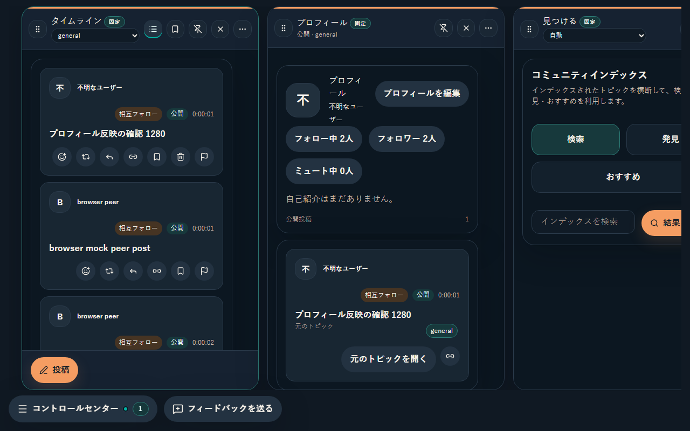

# #913 公開投稿後のプロフィール反映

## 現在判定

- Scope revision: `2026-09-08-913-plan-v1`（ユーザー承認済み）。
- 基準commit: `a5ebf1abdb1071c0d32b73bc30ae6d0477883e57`。
- リスク区分: B。frontendの取得・表示更新の修正。Rustの変更は既存テストへのassertion追加のみで、永続化・署名・network・同意guardは変更しない。
- 状態: 実装・ローカル全体検証完了。PR #945の最終head CIを確認後にmergeする。
- [Issue #913](https://github.com/KingYoSun/kukuri/issues/913) の先頭に固定AC/INVAR、INV-1〜5、TR-1〜6を記録。過去のDebian/peer0・peer1の観測は元の報告とコメントとして保持する。

## 原因と変更

初期配置はTimelineとProfileを同時に持つが、Profileの初回取得とsection再取得はactive判定に依存していた。投稿成功時の `refreshVisibleTimelineAfterPublish` もTimeline/Threadだけを再取得しており、非activeなProfileのstateが更新されなかった。

- 自己Profileの存在に基づいて初回・section再取得を行う。
- 公開投稿成功後は既存Profile loaderをTimelineと並行に呼ぶ。自己authorの詳細Columnがあればそのcacheも更新し、選択中の別authorは置き換えない。private投稿や閉じたProfileに余分な取得を追加しない。
- 自己Profileとauthor詳細はauthor replicaの確定済み投稿を表示する。optimistic draftは投稿元のTimeline/Threadに残し、pending/failedを公開投稿件数に加えない。
- loaderのrequest IDで古い成功・失敗応答を棄却し、最新の表示を巻き戻さない。
- Profileの読み込み中・errorをemptyと区別する。既存一覧を保持し、未取得0件の数値は未確定表示とし、errorに既存文言のRetry操作を付ける。
- ADR 0015に無ピア時のローカル表示と件数の意味を追記する。全期間総数API、専用projection、通信経路は追加しない。

## 修正前の再現

`DesktopShellPage.profile.test.tsx` の `publishing refreshes the inactive profile column without changing the active timeline` は、create API成功とプロフィールAPIに同じ本文が存在することを確認した後、非active ProfileのDOMに本文がなく失敗した（1 failed / 5 skipped）。

section loaderの追加testも、非active Profileが空のまま、遅れた旧成功で新しい一覧が消える、遅れた旧失敗でreadyがerrorになる、の3件で失敗した（3 failed / 5 passed）。これらのredはUI更新漏れと応答競合の証拠であり、ピア不足の推測とは分ける。

## AC / INVARの証跡

| 条件 | 実装・test / evidence |
| --- | --- |
| AC-1 | 投稿成功→`refreshVisibleTimelineAfterPublish`→Profile loader。非active Profile統合test、`profile-post-refresh.spec.ts` の日本語1280/1024/390px操作 |
| AC-2 | `desktop_runtime_persists_posts_and_author_identity_after_restart` に実runtimeの無ピアProfile読出し・重複なしを追加。既存 `create_public_post_persists_profile_post_doc_and_lists_profile_timeline` と `profile_timeline_reads_author_public_posts_across_untracked_topics`。ADR 0015の追記 |
| AC-3 | 初回loading、error→Retry→emptyの統合test。`retains confirmed posts on profile failure and recovers on retry` で既存データ保持 |
| AC-4 | 既存Profileへの画面切替・topic横断testとruntimeのrestart後2件のassertion |
| INVAR-1 | 既存private exclusion / signer mismatch contracts、private Column投稿のProfile非混入assertion、別selected authorを保持するloader test、成人向けメディア取得0の既存test |
| INVAR-2 | 既存Profile/repost/topic横断testsを維持。author docs/read pathや署名検証は無変更 |
| INVAR-3 | 古い成功/失敗応答の棄却test、pending/failed public draftを確定Profileへ加えないactions test、browserで投稿が1回だけ現れ件数+1を確認 |
| INVAR-4 | dirty Profile draftを保持するloader test、非activeのまま更新する統合/browser test。既存Column、Timeline、Thread、reply、mediaの回帰tests |

## inventory / transition確認

| 対象 | 入口・caller確認と変更 |
| --- | --- |
| INV-1 | `createOptimisticPostActions`の公開post/reply/repost/retryは `submitOptimisticPost` に集約。`useDesktopShellActions` → `DesktopShellPage` がrefresh callbackを配線。Profileへの未確定挿入を除去し、確定後取得を追加 |
| INV-2 | `loadProfileSection` のcallerは `loadShellSections`、Profile effect、公開投稿後refresh、Retry。`refreshVisibleShellData` は `runLoadTopics`、投稿後refresh、手動Timeline refresh、DataEffectsの既存interval/focus/visibilityから呼ばれる。既存Timeline pollingは変更せず、全section再取得を投稿後に加えない |
| INV-3 | `loadAuthorSection` はselected author effect、`loadShellSections`、公開投稿後の自己author更新から呼ぶ。pubkey別request IDとcacheを維持し、selected状態への書込みを一致するauthorだけに限定 |
| INV-4 | Tauri `commands/posts.rs` とCLI command登録→`runtime/content_profile_api.rs`→AppService。write/readの登録、docs key、署名、subscription、外部送信は無変更。runtime testのみassertion追加 |
| INV-5 | `useTimelineViewModels`→`DesktopShellPrimaryWorkspace`→`ProfileOverviewPanel`/`TimelineFeed`。件数の独立cacheなし。loading/errorのempty抑制とRetryだけ追加 |

INVは5群のまま。追加triggerはINV-2の投稿成功と明示Retry、INV-3の自己author更新。新たなIPC/network/sensitive sinkは0。対象外に未登録の将来surfaceは含めない。

TR-1/2はProfile統合/browser、TR-3はloaderのerror/retryと投稿失敗、TR-4はprivate/author分離、TR-5はruntimeのpeer0/restartおよび既存実peerテスト、TR-6は応答順testと確定feedへの重複なしに対応する。現行Profileには追加ページを読むUI callerがなく、cursorはAPIの返却を保持する既存契約を維持する。未実装のProfileページ送り機能をこのIssueで追加しない。

## 検証結果

| 検証 | 結果 |
| --- | --- |
| 非active Profile / loader targeted tests | 原因再現red→修正後green。frontend全152ファイル・1,219件成功 |
| actions / adult-content gate | 20 passed。対象hashへの禁止取得0のassertion維持 |
| 実runtimeのProfile永続往復 | 最終差分のtargeted 1 passed。再起動前後のpeer0、保存済み公開投稿2件、重複なしを確認 |
| 日本語browser操作 | 1280×800、1024×800、390×800の3ケース成功。投稿後の件数+1、重複0、active Timeline維持、狭幅Profileへの移動後表示を確認 |
| lint / typecheck | 最終差分で成功（`cargo xtask check`に含む） |
| `cargo xtask check` / `cargo xtask test` | ともに成功。Rust 886件・harness 22件・frontend 1,219件成功。check初回のformat差分を`cargo fmt --all`で修正。並行xtask.exeのWindowsファイルロックによる再実行失敗後、test完了後の直列実行で成功 |
| `desktop-ui-check`相当の構成gate | 重複するlint/typecheck/Vitestは上記結果を使用し、Storybook build、browser全67件、Windows visual smoke全14件を個別実行して成功 |
| Linux visual CI | 実装commit `9b2a0ed6` の `linux-desktop-ui` 成功（run `34193096837`）。baseline変更なし。最終headのCI結果はPRに記録 |

frontend全体の初回実行は20件失敗した。19件はProfileにも同じ投稿が表示されることによる単数DOM検索の曖昧さで、元の検証対象のTimeline内へselectorを限定した。残るAccountKeyPanelの1件は並行実行中の5秒timeoutで、製品変更なしのtargeted再実行で成功した。判定条件やmedia禁止取得assertionは弱めていない。

browser全体の初回は59成功・8失敗で、失敗は同じ投稿がProfileにも表示されたことによる単数検索の曖昧さだった。既存の投稿→Thread操作をTimelineに限定し、全67件の成功を確認した。

## UI証跡と確認の限界

- 変更分類: 不具合修正。Profileを自己公開投稿の確認面として維持し、layout/tokenや入力導線の再設計はしない。
- 日本語darkのbrowser実操作で、TimelineとProfileの同時表示、投稿後のactive維持、狭幅でのProfile表示を確認した。スクリーンショットは下記。
- browser mockの成功はLinux/Tauri実機や実peerのGUI確認とは区別する。Debian 13の報告環境とWindows/Tauri GUIでの手動再現は未実施。UIの自動再現と実runtimeの永続化・peerテストで変更層を検証する。
- 本変更にはnative input、WebView固有API、layout/色の変更がなく、screen reader/High Contrast等の網羅的な再監査やdesign review recordは追加しない。実機確認の未実施を成功と記載しない。
- 視覚baseline比較はLinux CIで確認する。Windowsのvisual stepは画面到達smokeのみ。

[1024px](assets/913/profile-public-post-1024.png) / [390px](assets/913/profile-public-post-390.png)

## 終了判定

固定AC/INVAR、INV-1〜5、TR-1〜6に上記証跡を対応付け、実装上のblockerは0。区分Bの局所UI修正であり、認証・同意等のshared guard、親Issue、Reopen作業を含まないため独立監査の必須条件には該当しない。最終headのCI、merge commitとの対象差分一致、Complete判定は[PR #945](https://github.com/KingYoSun/kukuri/pull/945)とIssueの現在判定へ記録する。
