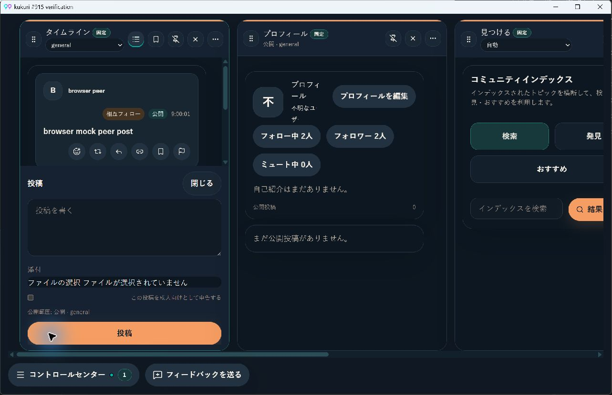
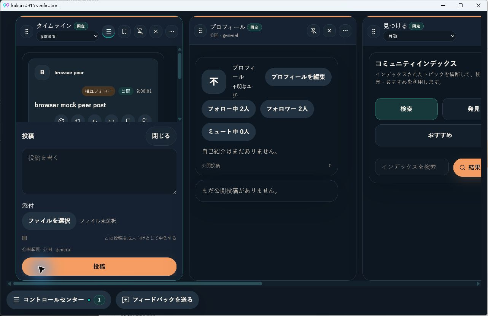
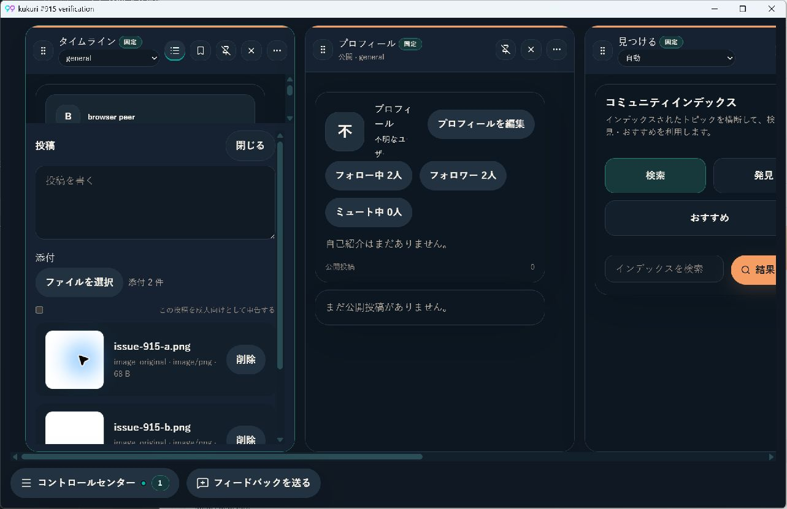

# Issue #915: 日本語の添付操作と選択状態

## 現在の状態

- Issue: [#915](https://github.com/KingYoSun/kukuri/issues/915)
- Scope revision: `915-r1`（2026-09-08承認）
- 区分: B（局所UI入力の不具合修正）。親Issue・Reopen・shared guard変更ではないため独立監査は非該当。
- 基準commit: `17c401a60ac92fde26eaaad078f02b8700a1025c`
- 状態: ローカル実装・UI検証完了。CIとLinux視覚baselineを確認中。
- 承認範囲: 実装、commit、PR、必須CI成功後のmerge。

## 目的・変更境界

日本語表示で「見つける」の見出しと投稿添付欄を理解できることを目的とする。現行の見出しはすでに翻訳済みのため回帰検証で保護し、可視のnative file inputを翻訳済みbuttonとdraft由来の件数表示に置き換える。共有composerの投稿・返信・DM・引用リポストは同じ入力契約を維持する。

OSのファイルダイアログ内部、他surfaceの翻訳監査、画像/動画処理、送信、network、同意guard、storage契約の変更は対象外。既存のButton/Inputを使い、新しいライブラリや共通guardを追加しない。

## 固定AC / INVAR

| ID | Yes / Noで判定する条件 |
| --- | --- |
| AC-1 | 設定→表示で日本語に切り替えた後、および保存済み日本語設定で再読込した後、見つけるの対象見出しが「コミュニティインデックス」と表示される |
| AC-2 | 日本語のcomposerに「ファイルを選択」と、添付0件なら「ファイル未選択」が可視表示される。ブラウザー/OS言語が英語でも、アプリ内に標準入力の `Choose Files` / `no files selected` 等が露出しない |
| AC-3 | 添付がある場合は現行draftに対応する件数を日本語表示し、既存一覧でファイル名・プレビューを確認・削除できる。削除・入力reset・キャンセル・部分失敗で表示とdraftが食い違わない |
| AC-4 | `en` / `zh-CN` でも追加文言が翻訳され、表示言語の切替時にボタン・状態・accessible nameが追従する。対象の日本語UIに残す原文はファイル名等の利用者データ・固有名・技術識別子に限る |
| AC-5 | pointerとkeyboardで選択を開始でき、誤投稿・focus消失・他Columnの入力起動がなく、1280×800と狭いColumnでボタン・件数・長いファイル名が操作を妨げない |
| INVAR-1 | 既存の画像/動画の複数選択、変換・poster生成、追加・削除、同一ファイルの再選択、添付付き投稿を維持する。選択ボタン自体はsubmitしない |
| INVAR-2 | pending/引用リポスト時の添付禁止、投稿/返信/DMそれぞれの送信先とdraft分離、既存の本文・返信元・引用元を維持する。locale切替やcomposer開閉でdraftを失わない |
| INVAR-3 | 既存の見つける検索・Node選択・同意guard、network/IPC/storage契約を変えない。翻訳のための新たな外部送信や状態永続化を追加しない |

## 固定surface inventoryと状態遷移

| ID | 入口・trigger | shared helper | 読み書き・外部副作用 | 必要なguard / invariant | 対象transition | test / scenario |
| --- | --- | --- | --- | --- | --- | --- |
| INV-1 | 設定→表示でlocale変更、保存済みlocaleで起動/再読込→見つける表示 | i18n resource、`CommunityIndexWorkspace` | 既存locale保存・翻訳描画。検索処理は維持 | AC-1/4、INVAR-3 | TR-1 | `parity.test.ts`、`localization-layout.spec.ts`、`community-index.spec.ts` |
| INV-2 | `ColumnComposerFooter` の投稿・返信・DM・引用リポスト→添付ボタン/keyboard | `ComposerPanel` → file input → `handleColumnDraftAttachmentSelection` | ローカルFile読取、既存メディア変換とdraft追加。選択時に投稿しない | AC-2/5、INVAR-1/2 | TR-2/3/6/7 | `ComposerPanel.test.tsx`、`ColumnComposerFooter.test.tsx`、browser操作 |
| INV-3 | 選択完了、キャンセル、変換失敗、削除、入力reset、投稿成功によるdraft更新 | `handleColumnDraftAttachmentSelection`、`ComposerDraftPreviewList`、footerのdraft projection | draftとpreview更新・破棄。既存の送信は既存submitだけ | AC-3、INVAR-1/2 | TR-3/4/5 | `DesktopShellPage.mediaComposer.test.tsx`、composer/footer tests |
| INV-4 | 複数Column、composer開閉、draftありでlocale切替 | `columnDraftKey` / `setColumnDraft`、i18n、footer | 対象Columnのdraftだけ参照・更新 | AC-4/5、INVAR-2/3 | TR-1/7 | footer tests、`localization-layout.spec.ts` |

変更前→変更後の差分はINV-2の可視native inputを翻訳済みbuttonへ置き換え、INV-3のdraft件数表示を追加すること。production入口、送信sink、guardの追加・削除は予定しない。実装時に `ComposerPanel` のcallerと選択handlerの接続を再確認し、Story/testを含む利用箇所を更新する。別入口が見つかった場合は既存契約への到達性で分類する。

## 状態遷移

| ID | 事前状態 | event / sequence | 期待状態 | 許可するI/O | 禁止する副作用 | test / scenario |
| --- | --- | --- | --- | --- | --- | --- |
| TR-1 | 英語表示、または保存済み日本語設定 | 設定でjaへ変更→見つける/投稿を開く→再読込。draftありでen/zh-CNへ変更も確認 | 対象文言がlocaleへ追従、draftを保持 | 既存locale保存・描画 | 翻訳のための追加取得、draft消失 | localization browser、i18n tests |
| TR-2 | 添付0件・入力可能 | pointer/Enter/Spaceで選択開始→キャンセル | 日本語の未選択表示と元のfocus/本文を保持 | native dialog表示のみ | submit、draft追加、別Columnの入力起動 | composer test、browser filechooser、実機 |
| TR-3 | 添付0件または既存添付あり | 画像と動画を複数選択→変換完了→input reset | 成功分を既存draftへ追加、件数と一覧を表示 | 既存メディア処理 | 全置換、posterの二重計数、resetによる誤った0件表示 | mediaComposer / footer tests |
| TR-4 | 添付あり | 一部削除→全削除→同じファイルを再選択。添付付き投稿成功後も確認 | 件数更新→未選択→再追加。送信成功後は既存のdraft resetに追従 | 既存preview破棄、既存submit | 残骸表示、二重送信、再選択不能 | mediaComposer / footer tests |
| TR-5 | 添付あり/なし | 不正形式・動画poster失敗・一部だけ成功、または選択済みからdialogをキャンセル | 既存errorを表示、成功分だけ件数へ反映、キャンセル時は既存draft保持 | 既存の失敗処理 | 失敗分の架空件数、既存添付消失 | 既存動画失敗test＋targeted追加 |
| TR-6 | pending、または引用リポスト | button/inputへ選択操作を試す | 添付禁止のまま | 描画のみ | filechooser起動、選択handler実行、誤投稿 | composer/footer tests |
| TR-7 | 投稿/返信/DMの複数Columnに異なるdraft | 一方の添付操作→composer閉じる/開く→locale変更 | 対象inputだけ起動し、各draft/宛先/返信元を維持 | 対象draft更新 | 他Columnへの添付混入、focus消失 | footer tests、browser実操作 |

本変更にserver 401、認証retry、永続migration、revoked stateは追加されないため、新しい遷移行は不要。見つけるの既存同意guardは既存suiteで回帰確認する。

## 再現と実装

- 修正前に `ComposerPanel.attachments.test.tsx` を実行し、6件失敗。日本語の可視選択buttonが存在しないこと、およびdraft由来の選択件数が表示されないことを再現した。
- native inputの内部ラベルはDOMテキストではないため、文字列の不在だけでは修正証拠にしない。可視button、hidden input、実pointer/keyboardによるfilechooser発火を確認する。
- `CommunityIndexWorkspace` の見出しは既存の `shell:communityIndex.title` →「コミュニティインデックス」を維持。設定からjaへ切り替え、見つける表示と再読込をbrowserで確認した。

## 検証

| 検証 | 結果 |
| --- | --- |
| 修正前のcomponent契約 | 6件失敗。日本語button / 選択件数の欠落を確認 |
| 対象Vitest | composer・footer・media・i18nの86件成功 |
| 追加delta検証 | partial failure / cancel / pending / 引用リポストを含む4ファイル21件成功。footerの期待labelの大文字小文字を既存契約に合わせて再実行 |
| `cargo xtask desktop-ui-check` | lint/typecheck、Vitest 160ファイル1,271件、Storybook build、browser 88件、visual到達smoke16件成功 |
| 最終差分lint | 変更したTS/TSXのESLint成功 |
| Windows Tauri/WebView | 専用profile＋製品frontend/mock APIの隔離ホスト、1280×800、ja/dark。見出し・可視日本語button・native dialog起動・Escapeキャンセル・Enter再開・複数画像選択・削除と件数更新を確認 |
| Linux/Chromiumの視覚比較 | [baseline run 34211627895](https://github.com/KingYoSun/kukuri/actions/runs/34211627895)成功。16枚中差分はcomposerの1枚のみで、目視確認後に採用。最終CI比較はPRのcheckで確認する。Windowsのvisualは比較skipであり代替ではない |
| `git diff --check` | 成功 |

Linux baselineのcomposer画像は、添付button/状態表示とその高さ変更に加えて、旧画像に残っていた既存の英語文言（Publish等）・読み込み中プロフィールも現行描画へ揃う。これらの製品実装は基準commitから変更していない。他15枚はbyte単位で一致し更新していない。

### 条件と証跡の対応

| 条件 | 実装・証跡 |
| --- | --- |
| AC-1、INV-1、TR-1 | `composer-localization.spec.ts` の設定ja→見つける→再読込。既存見出しとresourceは無変更 |
| AC-2/4、INV-2/4、TR-1/2 | `ComposerPanel` の翻訳済みbutton・hidden input、`common.json` 3locale。`ComposerPanel.attachments.test.tsx` のlocale切替と、browser 3locale×2theme |
| AC-3、INV-3、TR-3/4/5 | `draftMediaItems.length` から件数を導出。componentの2つの内部attachment→1件、mediaComposerの混合選択→2件、poster失敗→0件、部分成功/キャンセル/全削除/同一file再選択を確認 |
| AC-5、INV-2/4、TR-2/7 | browserでpointer/Enter/Spaceからfilechooser発火、focus・本文保持、1280/900/390幅でcontainment。componentの2インスタンスで他inputのclick 0回 |
| INVAR-1、TR-2〜5 | mediaComposer既存の画像/動画/送信検証と追加21件。選択操作だけのsubmit 0回、同一fileを再度選択可能 |
| INVAR-2、TR-6/7 | footerのpending、reactionsの引用リポストでbutton/inputの両方disabled。既存footerのdraft開閉・宛先分離とcomposerのlocale切替で本文保持 |
| INVAR-3 | production差分はcomposer描画と翻訳resourceのみ。`useDesktopShellActions`、footer、Node guard、API、storageの製品実装は無変更。既存community-index browser suiteを全体88件で実行 |

inventoryは4群を確認し、分類済み4・不適合0・未分類0。変更はINV-2の可視input置換とINV-3の件数表示追加のみで、production入口・sink・guardの増減はない。

### UI証跡と未確認範囲

基準commitのWindows WebViewはOS側も日本語のため、報告された英語文言そのものはこの環境では再現しない。標準入力への依存と可視操作の変更を同じホスト・viewportで比較した。

- Linuxの報告環境（Debian 13 / 当時の配布版）とWindowsを混同しない。Debian 13実機は利用できず未確認。Linux/Chromium CIはnative dialogの実機確認を代替しない。ユーザー指定のCI成功後merge運用に従い、この制約をPRに明記する。
- Windows確認用ホストはTauriのWebViewと製品frontendを使い、backend APIは既存browser mock。実サーバへの接続/投稿は行わない。ホスト起動時のCommon Controls manifest不足は確認用exeのmanifestを補って解消し、製品Rustコードへ変更を入れていない。
- OS dialog内部のlocaleは対象外。アプリ内のラベル・状態をアプリlocaleで描画する。ファイル名・MIME/role等の既存識別子は改称しない。
- 色/token変更、design language変更、共有設計規則の追加はなく、新しいUI review recordは不要。既存Buttonのfocus/disabledを利用し、statusを説明として関連付ける。screen reader/High Contrastの独立した適合認証は行っていない。
- Rust/backend、network、永続化は変更せず、そのslice専用scenarioは追加しない。日常integrationの`cargo xtask check` / `cargo xtask test`はCIへ委ね、frontendのpath別必須gateをローカルで完走した。
- 一般的な翻訳監査や他のfile inputへの展開はNon-goal。固定条件外の新要件を追加していない。
