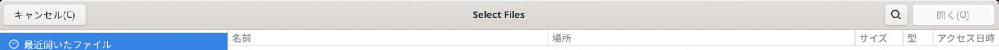
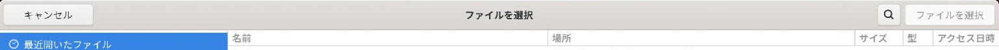
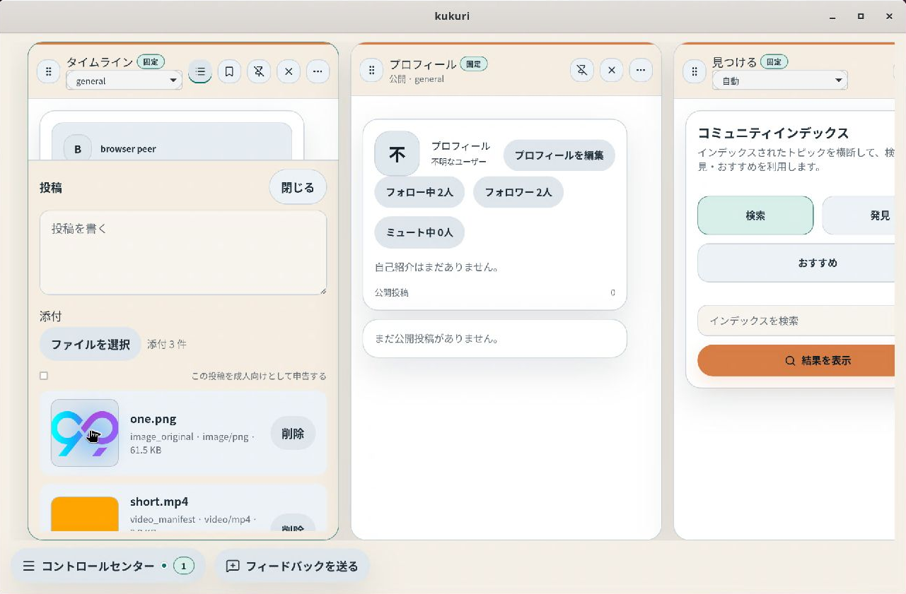

# #915 再オープン対応：日本語表示と native ファイル選択の作業記録

## 現在の判定・承認範囲

- 作成日: 2026-09-10（JST）。対象: [#915 表示言語を日本語にしても一部ラベルが英語のまま残る](https://github.com/KingYoSun/kukuri/issues/915)。
- 現在判定: In progress。r2 の実装と検証を進行中。独立監査・必須 CI・merge 後確認が揃うまで Complete としない。
- Scope revision: `915-r2`（2026-09-10 承認済み）。前回の `915-r1` を上書きせず、2026-09-10 JST までの再報告を取り込む。承認された以下の AC / INVAR / INV / TR を固定した。
- 基準 commit: `48690af9126096bfca1b99e792a69817366318c0`。Windows と `local2:~/kukuri` の HEAD が一致し、調査開始時点で両方の追跡差分はない。
- リスク区分: B。Reopen のため独立監査を必須とする。native 対応は WebKitGTK の既存選択要求に返す UI の置換に限定した。新規ファイル読取 IPC、filesystem 権限、送信/認証/同意 guard、永続化形式の追加・変更はない。
- 2026-09-10 に本計画の実行、commit、PR、必須 CI 成功後の merge が承認された。再確認を待たず必要な検証と独立監査を満たして進める。
- 運用の正本: [PLANS.md](../../PLANS.md)、[Issue lifecycle](../../docs/runbooks/issue-lifecycle.md)、[開発手順](../../docs/runbooks/dev.md)、[path 別検証](../../REFACTORING.md)、[DESIGN.md](../../DESIGN.md)、[ADR 0014](../../docs/adr/0014-uiux-dev-flow.md)、[UI 実装配置](../../docs/architecture/desktop-ui-implementation.md)。

## 目的・対象外

日本語を選んだ利用者が、設定、投稿のファイル選択、リアクション登録、接続関連の診断を日本語で理解でき、言語切替・再起動後にも同じ表示契約を保つ。

対象は下の INV-1〜6 と、その共有 helper の影響先。主な操作は言語切替、ファイルの選択・取消・再選択、診断の閲覧。既存の画面構造、色、送信先、draft、focus、crop、設定保存、診断の事実を維持する。不具合修正として扱い、全面的な UI 再設計は行わない。

対象外は接続不調自体の修正、接続状態判定・再試行 CTA・空診断の意味の再設計（[#959](https://github.com/KingYoSun/kukuri/issues/959) が所有）、protocol / transport / 同意 / 認証 / storage 契約変更、全アプリの無制限な翻訳監査、OS 全体の言語変更。#959 と重なる timeout の表示翻訳は #915 が所有し、通信上の原因を直したとは扱わない。

ファイル選択ダイアログの **タイトルは今回の対象**。OS の場所一覧・メニュー等すべてをアプリ locale に合わせることは対象外だが、タイトルを OS 管理だからという理由で未解決のまま完了扱いにはしない。

## 再オープンの根拠と前回との差

前回の [作業記録](../../docs/progress/2026-09-08-915-japanese-ui-labels.md) と [PR #947](https://github.com/KingYoSun/kukuri/pull/947) は、見つける見出し・composer 内の可視入力・件数を対象とした。OS ダイアログ内部と他画面は明示的に対象外であり、Debian 13 実機も未確認だった。今回の報告をすべて「#947 が新たに壊した Regression」とは断定しない。

| 再報告 | 根拠・現行コードで確認した事実 | r2 での扱い |
| --- | --- | --- |
| 言語 / LANGUAGE | [再報告](https://github.com/KingYoSun/kukuri/issues/915#issuecomment-5605906318)。`src/i18n/locales/ja/settings.json:82` の値が `言語 / Language`。`LocaleSelect` が表示・accessible name に使用 | r1 対象外から追加。表示設定と共有する初回同意画面を含む |
| Select Files | [報告](https://github.com/KingYoSun/kukuri/issues/915#issuecomment-5606059996)、[Reopen](https://github.com/KingYoSun/kukuri/issues/915#issuecomment-5606243477)。composer は hidden HTML file input を起動している | r1 の対象外を撤回してタイトルを追加。実 Linux WebView で生成元と再現を確定 |
| 診断の英語・内部名 | [追加一覧](https://github.com/KingYoSun/kukuri/issues/915#issuecomment-5606631374)、[画像](https://github.com/KingYoSun/kukuri/issues/915#issuecomment-5606644478)、[timeout 全文](https://github.com/KingYoSun/kukuri/issues/915#issuecomment-5606791858)。`useSettingsViewModels` は mode/connect_mode と複数 last_error を未変換で投影。`connectionPathLabel` は英語固定 | r1 対象外から追加。診断値の翻訳と日本語要約を表示層で行う |
| CN 機能一覧 | `communityNodeDependency.ts` が role / capability / authority の配列を raw のまま表示 | 同じ診断報告として追加。既知値と未知値、利用可能と予定を区別 |
| リアクション Choose File / no file selected | [追加報告](https://github.com/KingYoSun/kukuri/issues/915#issuecomment-5607364117)。`ReactionsPanel.tsx:140` に可視 native input がある | r1 対象外から追加。crop・登録の既存動作を保護 |
| Community Index / composer 内の Choose Files | 再報告では継続確認が要求されている。前回修正済みのコードは存在するが、今回実機での成否は未確認 | r1 AC-1〜5 / INVAR-1〜3 を継続回帰。実際に失敗すれば before/after から Existing-gap / Regression を分類 |

再発防止では「翻訳キーが存在する」「DOM に英単語がない」「filechooser イベントが出る」「CI が green」を別々の証拠として扱う。どれも native ダイアログのタイトル確認を代替しない。アプリ locale、OS/session locale、WebView/portal の locale を分けて記録する。

## 完了条件

以下は r2 の条件。r1 の同名 ID と混同せず、引用時は Scope revision を併記する。

| ID | Yes / No で判定する条件 | 作業・証跡 |
| --- | --- | --- |
| AC-1 | ja の言語欄の見出しと accessible name が「言語」で、`/ Language` がない。表示設定と初回同意の共有入口、保存済み ja での再起動にも適用される。選択肢の English / 简体中文 等の自称は維持 | T2・T5、TR-1 |
| AC-2 | 投稿・返信・DM の添付とリアクション登録で、アプリ内の選択操作・未選択・選択状態が locale に従う。native 標準入力の英語ラベルが可視領域へ露出しない | T2・T3・T5、TR-2〜4 |
| AC-3 | Ubuntu 24 の製品 Tauri/WebView で、対象 picker のタイトルが ja 選択時に日本語。起動後 en→ja、保存済み ja、OS/session と app の言語が異なる条件でもタイトルが app locale に従い、Windows の対象入力も壊れない | T1・T3・T6、TR-1〜4 |
| AC-4 | 接続・ディスカバリー・CN 診断と Control Center の対象表示に日本語ラベルが付く。`seeded_dht` / `direct_or_relay` / 接続経路 / 既知機能名が raw 値だけで表示されない | T4・T5・T6、TR-5〜7 |
| AC-5 | `timed out waiting for initial topic join` と `topic join pending: timed out waiting for initial topic join` に同じ意味の日本語要約が出る。既知値だけを正確に分類し、未知のエラーは日本語の汎用要約＋診断用原文を示す。回復後は古いエラーを残さない | T4・T5、TR-5〜7 |
| AC-6 | 見つける見出し「コミュニティインデックス」と r1 の添付動作が維持される。ja / en / zh-CN の切替で可視文言・accessible name・診断要約が追従し、既存の draft・設定未保存値・crop 結果が失われない | T2〜T6、TR-1〜7 |
| AC-7 | 1280×800 と狭幅で切れ・重なりがなく、pointer / Enter / Space / Escape と focus 復帰が機能する。変更前後の同条件実機証跡、必須検証、固定 head に対する独立監査 PASS が揃う | T5〜T8 |

| ID | 維持する契約 |
| --- | --- |
| INVAR-1 | composer の複数画像/動画、poster を除く draft 件数、部分成功、削除、同一ファイル再選択、pending / 引用リポストの添付禁止、Column・投稿/返信/DM ごとの宛先分離を維持。選択・取消・locale 切替だけでは投稿しない |
| INVAR-2 | リアクションは既存の画像/GIF 選択→crop→検索キー→明示的な保存で登録する。picker/crop の取消や読取失敗で既存 draft を失わず、選択しただけで登録しない |
| INVAR-3 | 翻訳で wire 値、raw error、manifest、node role、設定、同意文書本文・同意状態を変更しない。CN の available / planned と authority の適用 / 非適用を混ぜず、未知値を既知の権限・成功状態へ変換しない |
| INVAR-4 | `Direct P2P -> Relay Supported P2P -> Relay Fallback` の意味と優先度を保持。リレー補助 P2P を fallback と表示せず、接続方式の設定値 `direct_or_relay` を現在の実通信経路と取り違えない |
| INVAR-5 | locale は既存の端末内保存だけ。翻訳の追加取得・外部送信・network 設定適用を増やさない。native 経路を追加する場合も選択したファイルだけを読む。取消・禁止状態で読取/投稿/登録の副作用は 0、任意 path 読取や包括的な filesystem 権限を追加しない |

## 固定 surface inventory

path は特記しない限り `apps/desktop/` 配下。T1 で各群の登録点・caller を再確認し、追加発見を分類する。単なる件数一致で網羅としない。

| ID | 入口・trigger | helper / 対象 path | 読み書き・副作用 / guard | TR・test |
| --- | --- | --- | --- | --- |
| INV-1 | 設定→表示、初回同意、locale 保存失敗→再試行、再起動 | `src/components/LocaleSelect.tsx` → `AppearancePanel` / `ConsentGateView`、`src/i18n/{bootstrap,changeLocale,locale}.ts`、3 locale の `settings.json` | 既存 locale 保存・描画。初回同意 pending は変更不可、文書正文/送信 guard は維持 | TR-1、bootstrap / locale / SettingsPanels / consent tests、`initial-locale.spec.ts` |
| INV-2 | 投稿・返信・DM・引用リポスト→添付→削除/送信、見つける表示 | `ComposerPanel` ← `ColumnComposerFooter`、`handleColumnDraftAttachmentSelection`、`CommunityIndexWorkspace` | 既存 File 読取・変換・draft・submit。pending/引用禁止、Column 分離 | TR-1〜3、`ComposerPanel.attachments.test.tsx`、footer / mediaComposer / reactions tests、`composer-localization.spec.ts` |
| INV-3 | 設定→リアクション→画像選択→crop→登録/取消 | `ReactionsPanel.tsx` → `ImageCropDialog`、`onCreateAsset` の既存 caller | 単一 File、object URL、crop draft、明示保存時だけ既存 API。取消・失敗で保持 | TR-2/4、SettingsPanels、既存 reaction/crop tests、追加 component/browser 契約 |
| INV-4 | Control Center、設定→接続 / 開発者→接続、topic 別診断、background refresh | `DesktopShellControlCenter::connectionPathLabel`、`useSettingsViewModels`、`ConnectivityPanel`、`shell/presentation.ts` | 表示 projection のみ。sync/topic の raw state を改変せず、エラー消去・locale 再投影に追従 | TR-5/6、`useDesktopShellViewModels.test.tsx`、presentation / shellChrome / SettingsPanels tests |
| INV-5 | 設定/開発者→ディスカバリー、seed editor、エラー更新 | `useSettingsViewModels` → `DiscoveryPanel`、`localizeConnectivityStatusDetail` とその対象 caller | mode/connect_mode、error の描画。seed 保存、env lock、再試行挙動は不変 | TR-5/6、view model / SettingsPanels / browser 診断 fixture |
| INV-6 | CN 診断、manifest 取得成功/失敗、複数 node、locale 切替 | `communityNodeDependency::buildCommunityNodeDependencyView`、`CommunityNodePanel`、`useSettingsViewModels` | capability / authority / role / lastError を表示用変換。認証・同意・global apply は不変 | TR-6/7、dependency / view model / CommunityNodePanel tests |
| INV-7 | Linux main WebView の既存 HTML file input 選択要求 | `src-tauri/src/file_dialog.rs::install` → WebKit `run-file-chooser` → GTK native chooser → 元の `FileChooserRequest::select_files` / `cancel` | 現在の `document.documentElement.lang` を参照し同梱 resource で title/cancel/filter を表示。選択ファイル、multiple、MIME filter は既存要求から受け取る。Rust でファイルを読まず、cancel は選択を返さない | TR-1〜4、native locale test、Ubuntu の実選択と browser の既存 File 処理 tests |

変更予定は INV-1 の翻訳値、INV-2/3 の選択 UI と必要な native adapter、INV-4〜6 の表示変換。診断用純関数は既存の presentation / view model の責務に置き、server の状態やエラー値を日本語へ書き換えない。

T1 では `type='file'` / `type="file"` と既存 dialog wrapper の一覧も比較する。プロフィール、avatar、Metaverse、端末バックアップ等は別用途として記名し、共通部品変更の影響先なら回帰対象、独立した未翻訳なら New-requirement とする。全 file input の一括置換はしない。`LocaleSelect` の全 caller と、picker を共通化する場合の全 caller は検証対象から外さない。

INV-7 の caller は `ComposerPanel`（multiple、image/video）、`ReactionsPanel`（単一 image/GIF）、`ProfileEditorPanel`（単一 image）、`DesktopShellAuxiliaryPanels` の avatar 選択（単一 VRM）、`DomeCustomizationControls` の texture（単一 image）、`MetaverseRoomControls` の avatar 選択（単一 VRM）の6箇所。CodeGraph と `input type=file` 登録点から確認した。既存の File/onChange 契約を維持し、各画面の登録・保存 handler へ直結する新経路は作っていない。`chooseDeviceBackupSource/Destination` は plugin-dialog の別経路で、この WebKit hook の対象外。

INV-3 の影響先として `SettingsDrawer` の `keepMounted` を追加した。利用はリアクション section のみで、初めて開くまで mount せず、他 section に移動中は hidden とする。初回同意や他の設定 section の mount、guard、データ取得は維持する。ファイル/crop draft はメモリー内だけで保持し、端末へ新規保存しない。

## 状態遷移と禁止する副作用

| ID | 事前状態 → event / sequence | 期待状態・許可する I/O | 禁止する副作用・確認方法 |
| --- | --- | --- | --- |
| TR-1 | fresh / 保存済み ja / 保存失敗、en→ja→zh-CN→ja、画面再表示・再起動 | 現行の locale 優先順位を維持。文言・accessible name・次に開く dialog title を更新、draft 保持。保存失敗は現行説明と再試行 | 同意送信、設定以外の永続 mutation、draft 消失。初回同意 pending の無効状態も回帰 |
| TR-2 | 空/選択済み → pointer/Enter/Space → picker 取消 → 再開 | 正しいタイトル、選択元に focus 復帰、空表示または既存 draft を保持 | 別 Column の起動、submit、登録、取消時読取が 0。browser filechooser は発火のみ、タイトルは実機 |
| TR-3 | composer の複数画像/動画 → 一部失敗 → 削除 → 同一 file 再選択 → 明示送信 | 成功分だけ追加・計数、poster 二重計数なし、既存送信/reset を維持 | pending/引用時は picker・読取 0。二重送信、誤宛先、取消での消失なし |
| TR-4 | reaction 画像/GIF → crop 取消/確定 → 再選択 → 保存失敗/成功 | crop 取消では確定済み draft を維持、確定後だけ選択状態更新、locale 変更で draft 保持 | 選択だけの asset 登録 0、URL 漏れ/壊れた preview、保存中の競合を回帰。新規 read 経路なら失敗/空/不許可も test |
| TR-5 | 接続なし/診断なし → join timeout → 更新 → 回復 | 既知 timeout の日本語要約、原文は診断詳細として保持、回復時に要約を消去 | timeout を接続済みや fallback 成功と表示しない。翻訳による再接続・seed 適用 0 |
| TR-6 | 同じ raw state で ja↔en↔zh-CN、既知/未知 mode・経路・error | locale へ再投影。未知値は日本語汎用ラベルと必要な原値、URL/ID/ファイル名は維持 | 未知経路を Direct P2P と断定、部分一致で無関係なエラーを timeout 扱い、raw state 書換えなし |
| TR-7 | 複数 CN の ready/loading/error 混在、既知/未知 capability、available/planned、再取得 | node ごとの意味を保持した翻訳と原値、既存の信頼・権限境界説明を保持 | 他 node の成功を混在 node へ適用、認証/同意/取得/再試行挙動の変更なし |

## 実行記録

- 2026-09-10: r2 計画の実行・commit・PR・CI 後 merge を承認済み。状態 In progress。
- Windows/Linux 基準 HEAD を照合。CodeGraph と実装の caller を確認。local2 の cargo xtask doctor 成功。
- Ubuntu GNOME/Wayland を RDP で観測。修正前の製品 Tauri を専用 profile / 既存 frontend mock で起動し、アプリ/OS が日本語でも title が `Select Files` になることを再現。保存した基準 binary の SHA-256 は `88e4fdaf2defc70cbd2370cd0d688d6c5533b6c5acbc0630d8c8ce7cad012321`。
- `SettingsLocalization.test.tsx` と `settingsLocalization.test.ts` は修正前4件失敗。言語欄、リアクションの可視選択操作、mode、未知エラーの表示不足を確認した。
- `settings-localization.spec.ts` の reaction draft は、選択→crop確定→表示設定へ移動→ja→リアクションへ戻る sequence で選択名が消えることを修正前に再現。r2 AC-6 / INVAR-2 の Existing-gap として入力欄の保持へ統合し、同じ test が修正後成功した。
- native 実装判断: HTML/document lang が日本語でも既定タイトルが英語であり、WebKitGTK の要求 hook で明示 title を付けた。plugin の path→File 読取経路を新設する案は採らず、元の WebKit File API を維持する方法で承認済み AC を満たす。GTK/WebKitGTK は Tauri の既存依存と同じ version の直接参照だけを追加し、lockfile の version 更新はない。
- native 候補版では同じ OS/session で「ファイルを選択」を確認。画像2枚＋H.264動画1本を選択し、posterを含む既存変換後の「添付 3 件」、Enterで再開できることを確認した。実 backend 通信・投稿の証跡とは分ける。

| 段階 | 作業と現時点の証跡 |
| --- | --- |
| T1 | 上記の再現、固定 inventory / TR、基準 binary と source の照合 |
| T2 | 言語ラベル、reaction の hidden input / 翻訳 button / 確定 draft 名、取消と再選択。SettingsLocalization / SettingsPanels の tests |
| T3 | Linux `file_dialog`、同梱3locale、multiple / filter / cancel を維持。native test と実機画像 |
| T4 | `diagnosticLabels` の既知値・未知値・exact timeout と原文保持、settings view model / CN dependency / Control Center への接続。raw store は不変 |
| T5 | 追加7 browser tests、6ファイル89 unit tests成功。全体ゲートを実行中。初回 Windows 全体は1312成功・旧表示期待の2件失敗。期待を新しい要約＋同じ原文へ更新し、関連33件が成功。test削除・skipなし |
| T6 | Ubuntu RDP の native title と複数画像/動画。Windows・言語切替/再起動等の残りを確認中 |
| T7 | 固定 head の独立監査は未実施 |
| T8 | 必須 CI / merge / merge 後確認は未実施 |

| 必須/関連検証 | 現時点の結果 |
| --- | --- |
| local2 `cargo xtask doctor` | 成功。clone の古い node_modules に plugin-dialog が欠落していたため `CI=true pnpm install --frozen-lockfile` で lockfile に同期 |
| Windows `cargo xtask tauri-check` | 成功 |
| Linux `cargo test --manifest-path apps/desktop/src-tauri/Cargo.toml --lib` | 57件成功（native locale・既存 startup/consent/exit/backup 等を含む） |
| Linux `cargo xtask e2e-smoke` | desktop_smoke_post_persist、6steps成功。native chooserやpeer接続の代替ではない |
| Linux `CI=true pnpm exec playwright test --project=visual` | 20件成功。snapshot 比較を実施、baseline 更新なし |
| Linux `CI=true cargo xtask desktop-ui-check` | 実行中 |

### 実機画像

タイトル比較は個人の最近使ったファイル一覧を含めず、タイトル/標準操作領域だけを切り出した。

| Ubuntu 変更前 | Ubuntu 変更後 |
| --- | --- |
|  |  |

未確認の項目を成功とは扱わない。実装・検証・独立監査は進行中であり、Complete ではない。
