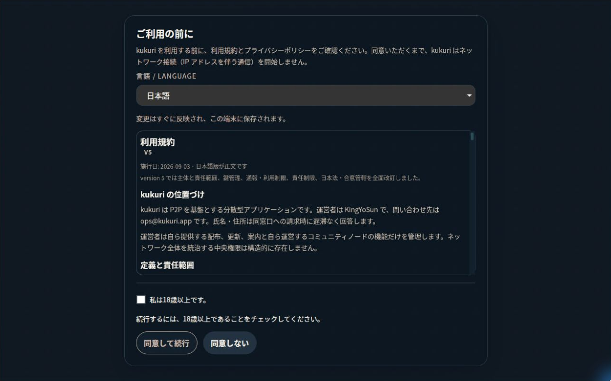
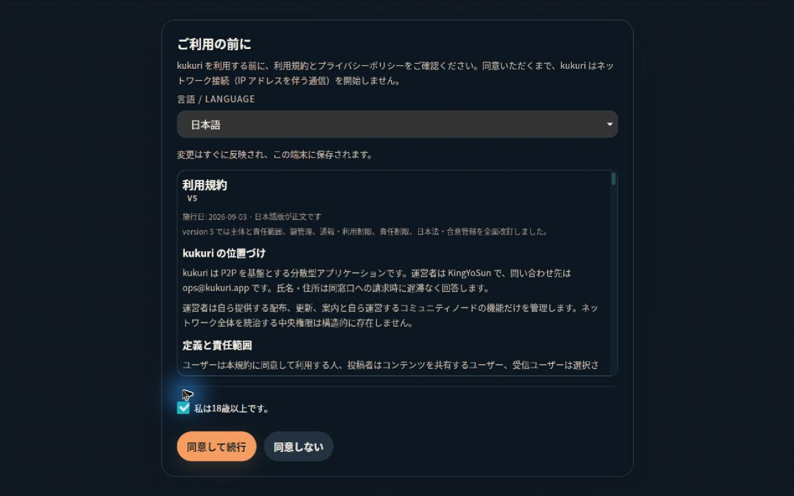
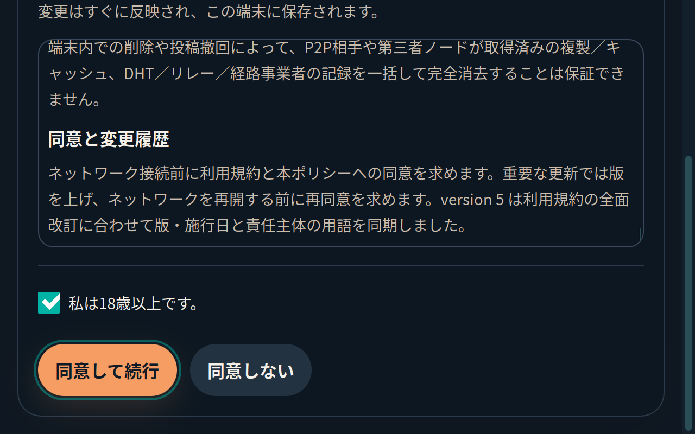
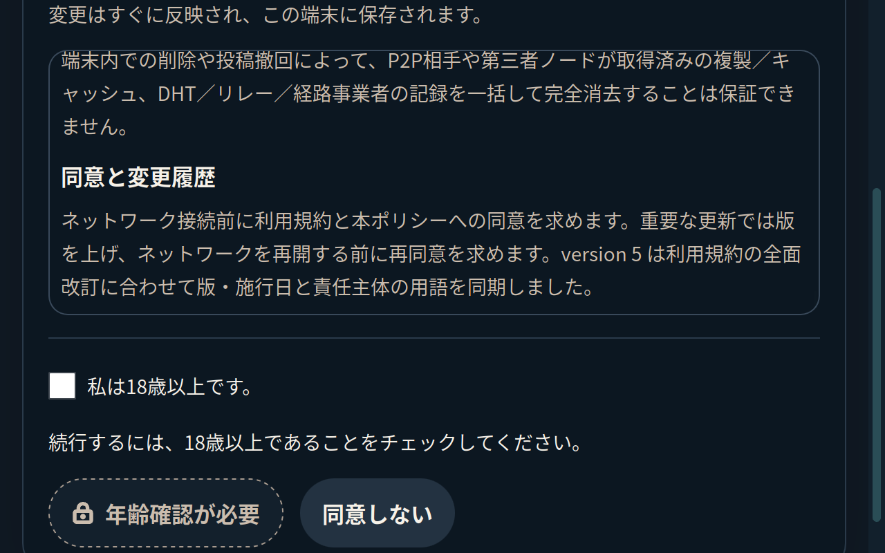

# #916 再オープン対応: 年齢未確認の同意ボタン

- Issue: [#916](https://github.com/KingYoSun/kukuri/issues/916)
- 状態: 実装・検証・独立監査完了。mergeと最終CIの現在判定は[PR #969](https://github.com/KingYoSun/kukuri/pull/969)とIssueを参照。
- Scope revision: `916-r1`を維持。2026-09-10に再開計画と実装・commit・PR・CI成功後のmergeを承認済み。
- 基準commit: `f74243c3c2001d5c257e67ca5c77d9b01de0091f`
- リスク区分: C。UI分類: 不具合修正。

固定AC-1〜5 / INVAR-1〜4、inventory、状態遷移は[初回作業記録](2026-09-09-916-consent-gate-affordance.md)を継承する。過去のPASSは当時の対象条件に対する記録であり、再オープン後の完了根拠にはしない。

## 問題と変更結果

未チェック時のボタンにも通常の「同意して続行」というaction名があり、明るい実線の輪郭は有効なoutline buttonと区別しづらかった。操作前から理由文は見えるが、ボタン自身が押せるように見えるというAC-2のExisting-gapを扱う。

未チェック時はボタン内に鍵アイコンと「年齢確認が必要」相当の状態名を表示し、中立色の背景・破線の境界・影なしで示す。選択後は従来のprimaryと「同意して続行」、pendingは既存の処理中文字に切り替わる。native disabled、年齢guard、同意IPC、保存・runtime・復元の条件は変えない。クリック時のtoastを追加するためにdisabledを解除しない。

対象は `ConsentGateView`、gate専用CSS、3localeのgateキーと対応tests。共有Button、global token、法務文書の本文・版、CN同意・CLI・backupの仕様変更は対象外。

## 修正前の再現と見逃しの原因

[再測定報告](https://github.com/KingYoSun/kukuri/issues/916#issuecomment-5606278898)は `0.2.1-preview.1` / Linux / ja / clean profile。[添付画像](https://github.com/KingYoSun/kukuri/issues/916#issuecomment-5606306158)を直接確認したところ、未選択のボタンは灰青色・明るい輪郭だった。「オレンジ寄り」という報告文をCSSの未適用と同一視せず、公開AppImageでも確認した。

- 公開artifact: `kukuri_0.2.1_amd64.AppImage`、Release `v0.2.1-preview.1`。
- 公開source: `f2cdb5cacf02218b34291a35754b55a15c2f564e`。
- SHA-256: `9f4990ae0913a9682a23d28779ea0791f7e53c2c8eab1f64ec7c33e52995df3b`。GitHub Release asset digestと取得fileが一致。
- 実行環境: Ubuntu 24.04.5 LTS / x86_64、GNOME Wayland session中のXWaylandアプリ。RDPで表示と実pointer入力を確認。X window client領域1280×800を`xwininfo`で確認した。
- 新しい専用profileで日本語初回起動→無効ボタンclick→年齢選択→解除を確認。未選択は灰青色・実線輪郭・通常action名、選択後はprimaryとなった。起動logはruntimeを同意まで延期し、profileには同意ファイルが作成されなかった。
- `/proc/<pid>/maps`でAppImage内のWebKit/GTKをロードしていることを確認。公開native inventoryのWebKitは`2.50.4-0ubuntu0.22.04.1`。host WebKit2.52.6とは区別する。

画像は同じRDP撮影からアプリclient領域だけを切り出したもの。色・文字・描画内容は加工していない。報告者の元の実行fileそのもののhashは得ていないため、上記を同じ公開版の再測定として区別する。

専用disabled CSSの未適用や後続差分によるRegressionは確認されなかった。問題は有効な操作に見える状態表現である。既存browser testはdisabled属性、ARIA、到達性、IPC回数を保護していたが、ボタン自身の状態名と実効背景・影・境界を検査していなかった。旧実機確認も隔離ホストとsynthetic応答で、報告された配布版は対象外だった。

新しいbrowser testをproduction変更前に実行し、ja/darkで `Expected: 年齢確認が必要 / Received: 同意して続行` の失敗を確認した。同じtestの修正後成功と、配布物の同条件before/afterを組み合わせる。disabled属性や単なるRGBの差だけで識別性を判定しない。

追加で、code commit `b0f00db5`の[Visual Baseline run](https://github.com/KingYoSun/kukuri/actions/runs/34443468155)は成功したが、同意画面の出力が旧baselineとbyte一致することを確認した。全画面の`maxDiffPixelRatio: 0.01`に今回のbutton変更が収まっていた。対象画面だけ0.001へ強化し、無効/有効button単体の比較を追加した。Ubuntu24 / Chromium / fonts-noto-cjkで3画像を生成し、その他のbaselineは変更せず、[CIのLinux browser/visual比較](https://github.com/KingYoSun/kukuri/actions/runs/34444093428/job/102765013102)でも成功した。全画面のgreenを単独の識別性証拠にしない。

## inventoryと境界の対応

既存6group / TR-1〜8を維持し、production IPC・保存sink・別consumerの追加/削除は0。INV-2の表示と試験だけが変わる。

| 条件 / inventory / transition | 実装と確認 |
| --- | --- |
| AC-1/2、INV-2、TR-1〜3 | 理由文とdescriptionは維持。Viewの状態名・鍵アイコン、`base.css`のgate内disabled。新browser testは3locale×2themeで背景・background-image・影・破線・状態名、pointer/Spaceによる選択/解除、reload、同意IPC0を確認 |
| AC-3/5、INV-2、TR-4/5 | 既存layout matrixと390×541の拒否→選択→保存失敗→解除を維持。文書末尾、focus、狭幅/低高さ/zoomを確認 |
| AC-4/5、INVAR-1〜3、INV-1/3/4、TR-1〜7 | `App::handleAccept`の年齢/`acceptInFlight` guardとpayload/status/restore分岐は不変。AppのIPC回数・引数・error/retry/renewed/restore、locale既存test |
| INVAR-1〜3、INV-5、TR-1/6/7 | SINK-1の保存、SINK-2の初期化、SINK-3のrestore activationはRust production不変。保存不変・host未構築・Tauri invoke禁止・restore状態表を既存testとsourceで確認 |
| INVAR-4、INV-6、TR-8 | gate ancestor外の共有Button/StartupStatusScreen/AboutPanel/CNは不変。CSSはpending時のgate内拒否ボタンにも適用される。既存画面のselector・diff・test/visualを確認 |

CodeGraphと登録点/参照の確認による独立予備監査で、保存sinkの逆引きを補足した。

- `record_app_consents`のcallerはTauri commandとCLI `ClientSession::accept_consents`。
- `save_app_consent_store`にはCLI `main.rs::accept_consents`の直接callerもある。`--accept-documents` / `--age-confirmed` / 非空languageとProfileLeaseのguardがあり、INV-6の不変consumerに分類する。
- `reset_app_consent_at_path`経由の復元リセットをINV-5 / TR-7に分類する。保存pathは`db_path.with_extension("app-consent.json")`。
- SINK-2の`build_desktop_state`→`ClientHost::start_if_consented`は構築前に再検査する。startup/受諾/restore rollbackのcallerは不変。
- SINK-3のactivationはstartup/受諾と共有CLI orchestrator、frontend applyはAppのstartup ready/受諾readyの2箇所。成功前のapplyを増やしていない。
- 共有Buttonの48 import元に新しいconsumerはなく、今回の表示はgate ancestor内に限られる。locale保存は年齢/同意保存と別の既存副作用として分類する。

独立監査でinventory合計6 / 適合6 / 不適合0 / 未分類0、blocker0、PASSと判定した。[監査記録](2026-09-10-916-reopen-independent-audit.md)はcode/test head `df35d7f6`と実機・実行証拠を対象にする。以後の記録追記は製品/test差分0を確認する。

## 検証結果

| 検証 | 現在の結果 |
| --- | --- |
| 修正前browser | ja/darkの状態名assertが失敗。再現証拠を修正前に保存 |
| 同意browser | 新6件＋既存26件、32 passed。production Vite build＋mock IPC。配布アプリの確認とは区別 |
| targeted Vitest | App / design-contract / css-vars: 3 files、17 passed |
| `cargo xtask doctor` | 成功 |
| `cargo xtask check` | Windowsで成功 |
| `cargo xtask test` | WindowsでRust 543 passed / 1 failed、358未実行、既存設定4 skipped。`transport_custom_relay_bootstrap_seed_reports_relay_supported_p2p`で期待RelaySupportedP2pに対しRelayFallbackとなりfail-fast。テスト実行fileのファイアウォール確認も表示されたが、原因確定とは扱わない。Windows全体成功に読み替えず、下記Linux CIで補完 |
| Linux Rust全体 | [CI](https://github.com/KingYoSun/kukuri/actions/runs/34444093428/job/102765013105)で926 passed / 既存4 skipped、harness22 passed、doctest成功。Windowsで失敗した同じtransport testも成功 |
| 同意・復元host境界 | 現行差分でtargeted 7 passed。年齢拒否時の保存不変、欠落/破損時fail-closed、同意前のaccount/runtime未構築、復元状態表/失敗時rollbackを確認。211 skippedはfilter非選択分であり全体成功件数ではない |
| `CI=true cargo xtask desktop-ui-check` | `local2`のcommit `df35d7f6`で成功。lint/typecheck、Vitest 165 files / 1314 passed、Storybook、browser 152 passed、visual比較20 passed |
| Storybook addon-a11y | 8state×3locale×2theme=48条件で違反0。native実発話の適合証明とは区別 |
| 実contrast | 12条件の文字contrast最小4.79:1、無効境界最小4.69:1。[計測値](../ui-reviews/assets/issue-916-reopen-contrast.json)。CSS transition完了後の実効値を使用 |
| WebKitGTK実200% zoom | Ubuntu24 / host WebKit2.52.6の隔離ホストで成功。同じfrontendを使用、synthetic IPC。実配布物の起動確認とは別に記録（下記） |
| Tauri境界 | [package CI](https://github.com/KingYoSun/kukuri/actions/runs/34443470080/job/102763151877)でlib57 passed。invoke/localeの同意前guard、文書/年齢/restoreを含む。実updaterの別2testも成功 |
| 配布候補実機 / Windows実機 | 下記の通常AppImageとWindows通常Tauriで確認。Windowsの確認画面解消後に実入力を行い、同意未保存も独立照合 |
| PR head独立監査 / CI | `df35d7f6`の11 checksすべて成功、独立監査PASS。記録追記後のCIとmerge後照合はPR/Issueの現在判定に記録 |

Windowsのintegration検証には実在を確認したSDK `10.0.22621.0` のucrt/um x64 directoryをprocessのLIBに追加する。製品のbuild設定は変更しない。LinuxローカルでもCI未設定のvisualは比較skipであるため、Linux/Chromiumの比較を別に実行する。

### 実200% zoom

`WebKit2.WebView.set_zoom_level(2.0)`と`get_zoom_level()`、1280×800のwindowからDOM640×400への変化を確認した。CSS transform、RDPの表示拡縮、単なるviewport縮小とは異なる。本文末尾までnative wheelで移動し、Tab→Space→Tabでcheckbox選択と受諾button focus、Shift+Tab→Space→Tabで解除と拒否button focus、無効buttonへのnative pointerで同意IPC0を確認した。

本文はclientHeight190、scrollTop4661＋190＝scrollHeight4851で末尾に到達。横scrollWidth628≤640。選択時の受諾button下端365、解除時396≤400でclipしない。[状態・入力・実効styleの記録](../ui-reviews/assets/issue-916-reopen-webkit-zoom.json)。

確認用ホストの準備時にはGIのcairo converter不足とwheel入力数不足を検出した。Gdkで実windowを撮影し、末尾まで届く入力を送って同じassertを再実行した。これらを製品修正前の再現には数えず、上記のfailures空の最終実行を採用する。AppImageの同意保存/起動を代替する試験とは扱わない。

### 通常配布物とWindowsの実機確認

- AppImageは[run 34443470080](https://github.com/KingYoSun/kukuri/actions/runs/34443470080)の`kukuri-linux-x86_64-test`から取得した検証署名版。公開Releaseへは配布していない。
- SHA-256: `a0a2825d3d95b3307ae8ca70a53b718e569ff7b1097371ff976dc1c1100ea2f3`。Windowsでの取得file、metadata、Ubuntuへ転送したfileが一致。
- `source-commit.txt`はPRの合成merge `e6018dbc922567c0bb7952e75cfa125b6779523b`。git objectを取得し、`b0f00db5`と全tree一致を確認。b0→監査head `df35d7f6`はvisual test/PNGのみで製品treeは同一。
- Ubuntu24の同じRDP環境、XWayland、1280×800、ja/darkで無効表示、選択後primary、Spaceで再解除、本文末尾とfooterの分離を確認。RDP経由wheel/dragでscrollが反映されなかったため、同じLinux windowへXTestのwheelを送り、RDPで結果を確認した。表示・checkbox・Tab/Space/EnterはRDPで確認した。
- 未保存チェックを選択してprocess再起動後にfalseへ戻ることを確認。強制`systemctl restart`時はSIGBUSを観測したため、通常のGUI終了成功とは扱わない。再起動後は同意待ちになり、保存なしを確認した。
- 明示選択後のTab→Enterで同意記録2件と年齢申告1件を保存し、runtime初期化後の通常Community Node案内へ進んだ。拒否/無効操作は別の新規profileで採取し、同意fileと`accounts.json`が存在しないことをcollectorと独立したSSH確認で照合した。
- Windowsは通常の `pnpm tauri:build --debug --no-bundle`、WebView2 `152.0.4191.66`。exe SHA-256は`824b57af9194be74e9e48766e380ae6601633658888ed1cbef6e1a0611d9204a`。pointer選択、Tabで有効button focus、Shift+Tab/Spaceで解除、無効clickを確認し、同意保存なし。mock IPCではない。

実機のsource/hash・時刻・保存有無は[実機確認要約](../ui-reviews/assets/issue-916-reopen-native-checks.json)、画像と確認範囲は[UI review](../ui-reviews/2026-09-10-consent-gate-blocked-action.md)を参照する。公開版から候補までには既にmerge済み#915の言語選択表示修正も含むが、公開版と本Issue基準commitの`ConsentGateView`/`base.css`は同一であり、今回のボタン変更と区別できる。

音声screen reader、OS設定としてのWindows High Contrast、Windows側の実200% engine zoomは未確認。自動a11y/forced-colorsやLinuxの実zoomを全OSでの確認と呼ばない。

## 完了条件

固定AC/INVARの証跡、Ubuntu24の通常配布候補のsource/hashと実描画、必要なWindows/入力/zoom確認、独立監査PASSと必須CIを揃える。PRは`Refs #916`とし、merge後に対象tree/surfaceを照合してIssue現在判定を更新する。具体的blocker0・未分類0になるまでCloseしない。未確認条件を成功へ読み替えず、変更のない範囲の全監査を繰り返さない。
