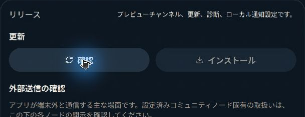
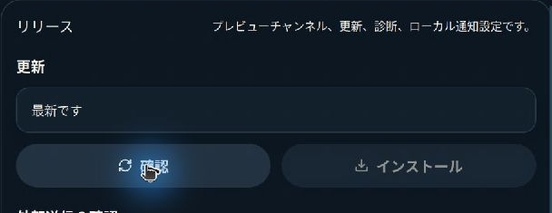
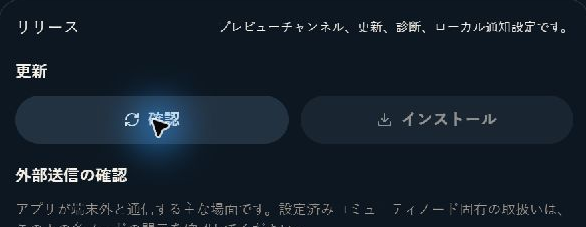
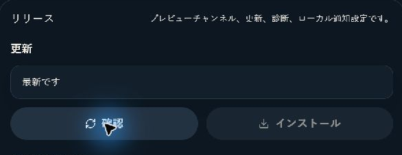
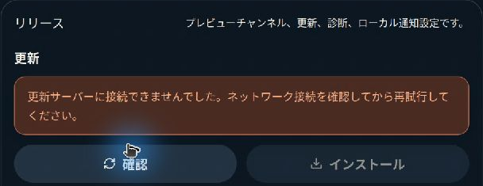
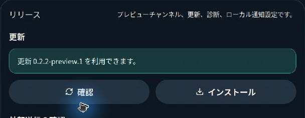
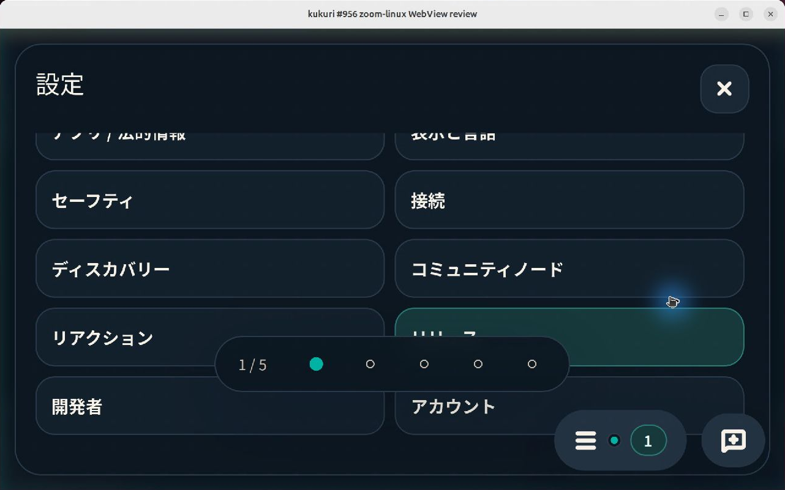
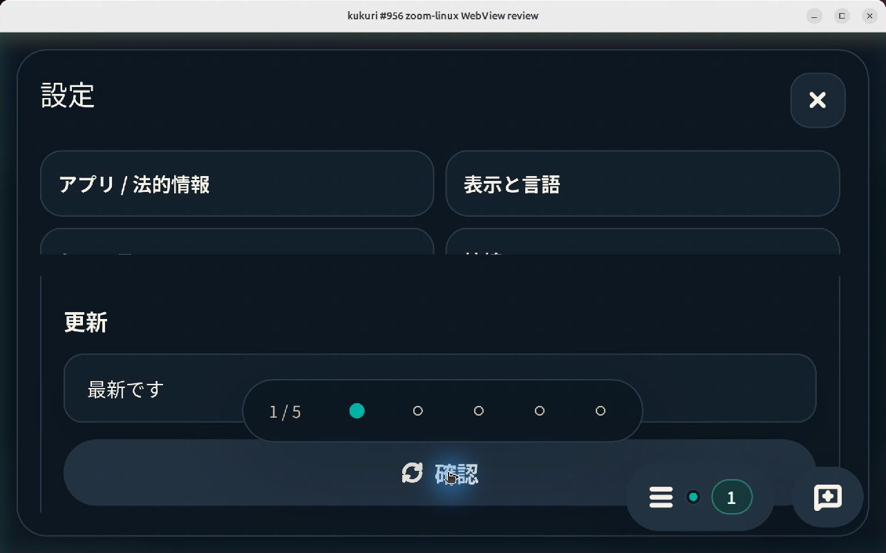
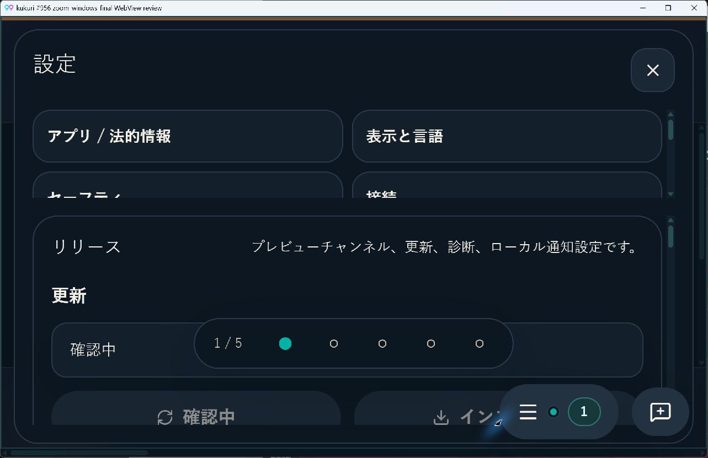

# #956 更新確認の進捗・結果表示

## 対象と判断

- Issue: [#956](https://github.com/KingYoSun/kukuri/issues/956)
- Scope revision: `956-2026-09-10-v1`（計画承認済み）
- 基準commit: `31220fdc357c6a61158d24e85efc26adb006818c`
- リスク区分: B。既存の更新状態を表示する責務に閉じる修正。
- 目的: 通常モードの「コントロールセンター → リリースと更新 → 確認」で、進捗、完了結果、失敗理由と回復方法を理解できること。
- 対象外: 配信先、署名、同意、IPC、更新周期、更新履歴の永続化、インストール／再起動方式。
- 正本: [DESIGN](../../DESIGN.md) 4〜7節、[ADR 0014](../adr/0014-uiux-dev-flow.md)、[Issue lifecycle](../runbooks/issue-lifecycle.md)、[検証マトリクス](../../REFACTORING.md#path別検証マトリクス)。

## 原因と修正

`DesktopShellSettingsDrawer`はDeveloper modeを`ReleasePanel.showDiagnostics`へ渡す。更新状態の一覧は診断欄だけにあり、通常モードで`checking`と`up_to_date`を表示する箇所がなかった。storeは正常に状態を更新するため、更新処理や通信方式を変える必要はなかった。

`ReleasePanel`に診断フラグと独立したlive regionを置き、確認中・最新・更新ありを表示する。確認ボタンは確認中のラベルと`aria-busy`を持ち、既存のbusy guardで重複実行を抑止する。前回見つかったバージョンがある再確認では、その値が前回の結果であると明示する。失敗は`lastError`のtruthinessではなく`failed`状態で表示し、空理由でも既存の汎用回復文を示す。raw errorとmanifest等は診断モードに限定する。

実機200% zoomでは既存のSettings navが高さを使い切り、更新欄の表示領域が0になった。AC-5のExisting-gapとして、幅759px以下かつ高さ600px以下でnavを20dvhに制限した。navと内容は既存の個別scrollを利用し、通常サイズの構造は変えない。新しいtimer、store、IPC、CSS tokenは追加していない。

## 固定条件と証跡

| ID | 条件 | 実装・検証 |
| --- | --- | --- |
| AC-1 | 通常モードで確認中の文字、pending、無効ボタンが見える | `ReleasePanel.tsx`。`normal mode reports a pending check and its completed result`の3locale、native両OS |
| AC-2 | 最新／更新ありとバージョンが見える。idleを最新と偽らない | 同component test、`available updates announce the version without downloading or exposing diagnostics`、`rechecking identifies the previous version as a previous result` |
| AC-3 | 理由・再試行を表示し、空理由でも失敗が分かる。成功後に古いエラーが残らない | `failed checks always explain recovery and clear the error on retry`、既存のDeb取消／失敗・404回復tests、browser失敗→成功 |
| AC-4 | 連打・周期確認を重複させず、Drawer再表示で状態を失わない | 実store actionと遅延promiseのcomponent test、既存`useAppUpdateStore.test.ts`と`DesktopShellPage.updateSchedule.test.tsx`、browser開閉とIPC件数 |
| AC-5 | production導線、3locale、pointer／keyboard、狭い幅・200%で操作でき、状態がAccessibilityへ公開される | `release-update-feedback.spec.ts` 18条件、Storybook 90条件、native通常倍率／200%、UIA・Orca確認 |
| INVAR-1 | store、busy guard、起動／30分周期を維持 | store／schedulerの製品差分0。既存scheduler testと実action test |
| INVAR-2 | 確認だけではdownload／install／restartしない。検証済み更新・あとでを保持 | 既存store／panel tests、browser fixtureで禁止IPC 0件 |
| INVAR-3 | raw error／manifestは診断に限定する | 通常モードのcomponent・browser negative assertion、既存の分類別回復文 |
| INVAR-4 | Drawerの開閉、focus、他section、Column／draftを維持 | browser開閉、既存shell tests、native Escape後のControl Center focus復元。低い画面ではnav／本文のscrollを別々に維持 |

### Surface inventory

CodeGraphの`explore`／`node`を先に使用し、登録点と参照を照合した。`ReleasePanel`の製品callerは`DesktopShellSettingsDrawer`、状態を所有する`checkForUpdate`の製品callerはpanel、shell起動／interval、`downloadUpdate`のpendingなし分岐。`formatUpdateStatus`はReleasePanelで使用する。CSS対象はSettingsDrawerの既存nav全体である。

| ID | 入口・trigger | helper | 読み書き・副作用 | guard / invariant | transition | test / evidence |
| --- | --- | --- | --- | --- | --- | --- |
| INV-1 | Control Center、Settings release選択、`settings=release`、再表示 | SettingsDrawer → ReleasePanel | メモリstate購読・描画 | INVAR-1、3、4 | TR-1、6 | component、browser、native |
| INV-2 | 確認・手動再試行 | checkForUpdate → appUpdater.check | 既存`check_app_update`とメモリstate | busy guard、INVAR-1、2 | TR-2〜5 | 実actionの遅延promise、browser IPC件数 |
| INV-3 | shell起動、30分interval | DesktopShellPage → checkForUpdate | 既存更新確認 | 既存guard・cleanup | TR-2〜6 | scheduler test |
| INV-4 | download、pendingなし分岐、あとで／再起動 | downloadUpdate、restartAndInstall | 既存download／install／restart | INVAR-2 | TR-5、7 | 既存store／panel tests |
| INV-5 | 診断／locale切替、story | formatUpdateStatus、classifyUpdateError | 表示のみ | INVAR-3、4 | TR-1〜7 | locale別tests、stories、a11y |
| INV-6 | 低い狭幅viewport／200% zoom | SettingsDrawerのnav／body、既存CSS | 描画・各領域scroll | INVAR-4、AC-5 | TR-8 | 640×400のproduction導線、native 200%、既存Settings browser tests |

INV-6のmemberはSettingsDrawerが`sections.map`で描画する全`settings-section-*`で列挙する。現行ではabout、appearance、safety、connectivity、discovery、community-node、reactions、release、developer、account。sink・更新入口の追加／削除0、表示group追加1、合計6group、未分類0。Bの単独Issueでshared guard・親Issue・Reopenに該当せず、独立監査は必須条件に該当しない。

### 状態遷移

| ID | 事前状態 | sequence | 期待結果 | 許可するI/O | 禁止する副作用 | 証跡 |
| --- | --- | --- | --- | --- | --- | --- |
| TR-1 | idle | release表示 | 最新と表示しない | 既存画面読込 | 新規確認trigger | component |
| TR-2 | idle／前回結果 | 確認→応答待ち→連打 | 確認中・disabled | 確認1件 | 重複確認・install | 実store action／browser |
| TR-3 | checking | 更新なし | 最新・確認可能 | メモリ更新 | 自動download／restart | component／native |
| TR-4 | checking | 更新あり | バージョン・既存action | メモリ更新 | 自動install | component／browser／Ubuntu |
| TR-5 | checking／failed | 拒否→再試行→成功 | 理由→確認中→結果 | 明示確認 | 古いエラー残留、無限retry | 空理由・network・既存エラーtests |
| TR-6 | checking／結果 | 閉じる→完了→開く／locale切替 | 現在結果・文脈維持 | 既存処理の完了 | state初期化・追加確認 | remount／browser |
| TR-7 | downloading／ready／installing | 手動・周期確認、あとで | 検証済み更新の保持 | 明示された既存操作 | pending破棄、二重install | 既存store／scheduler |
| TR-8 | 通常倍率 | 狭く低いviewport／200%→scroll→確認 | 本文領域が残り、確認と結果へ到達 | 描画のみ | 本文の高さ0、更新actionの不可到達 | failing-before／passing-after browser、native |

アプリ再起動時の結果永続化、複数nodeへのglobal apply、401再認証、DB rollbackは表示修正の対象外。追加の調査・一般化は行わない。

## 変更前後

- 最初のcomponent再現: 13件中6件が失敗。`aria-busy`、確認中／最新のlive region、空理由のalertの欠落を検出。既存7件は成功。
- 修正後: 同条件が成功。前回バージョンの再確認を加えた最終component suiteは14件成功。
- 拡大再現: 640×400の`toBeInViewport`が`viewport ratio 0`で失敗。nav制限後は同じ条件を含む18件が成功。
- native: 同じ基準frontendと修正後frontendを、同じTauri検証ホストと8秒の更新IPC fixtureで比較。通常モード・日本語・dark。WindowsはWebView2 152、1280×800、Ubuntu 24.04.5 LTSはWebKitGTK 2.52.6、1280×753（ウィンドウ装飾を除く）。200%ではそれぞれ640×400／640×376。Ubuntuは`ssh local2`と接続済みGNOME／Waylandのリモートデスクトップを使用。

更新欄を同じ矩形で切り出した比較。検証ホストの一時的なWindows manifest不足は修復して再起動し、製品の更新結果とは区別した。

| 環境 | 変更前・確認完了後 | 変更後・確認完了後 |
| --- | --- | --- |
| Ubuntu |  |  |
| Windows |  |  |

拡大表示は既存のnavと本文を個別にscrollして操作する。

## 検証結果

- `cargo xtask check`: Windows成功。
- `cargo xtask desktop-ui-check`: Windows成功（165 files／1320 tests、ブラウザ177、視覚スモーク20）。その後の追加component testは14件成功、640×400を加えたbrowserは18件成功。
- Linux初回UI gate: 1319 tests成功、無関係な`DesktopShellPage.columnScope.test.tsx`のprivate Thread操作1件が5000ms timeout。testの変更・timeout引上げなしで同fileと最終更新component testを単独実行し、16件成功。
- Linux targeted gate: Storybook、browser177件、`CI=1 cargo xtask desktop-visual-test`20件成功。baseline更新不要。
- 最終CSS差分のLinux `CI=1 cargo xtask desktop-ui-check`: 成功（165 files／1321 tests、Storybook、browser183件、視覚比較20件）。既存のタイムアウトは再発していない。baseline更新不要。
- `cargo xtask rust-test`: Ubuntu成功（non-CN package、harness、doctest）。frontend testはUI gateと共通なので、`cargo xtask test`による二重実行は省略。
- `cargo xtask oversized-files`、`git diff --check`: 成功。
- Storybookの更新section（5状態×3locale×2theme×1280／390／640px）: 90条件でWCAG 2 A/AA、2.1 AA、2.2 AAのaxe指摘0、section内横overflow0。640pxは高さ400pxでも確認。
- pointerで開始、keyboard Enter、Escape、再表示はbrowserとnativeで確認。ネイティブ200%も確認→結果へ遷移。新しいmotion／色tokenは追加せず、既存primitiveを使用。
- Accessibility: Windows UIAで状態文字と無効ボタンを確認。Ubuntu Orcaの音声出力ログで「確認中 push button 無効」を確認。完了結果の自動読み上げはこのOrca／WebKitGTK組合せでは確認できておらず、live regionのDOM契約とaxe成功、視覚表示の成功と区別する。

本件は更新状態の表示と到達性の修正であり、公開feedのnetwork障害、配布packageの実インストール、署名検証の実機再実行は行っていない。nativeは製品frontendを使うIPC fixtureで、実feedへの確認成功とは扱わない。Debian 13固有の実機確認も未実施。更新関連store・IPC wrapper・schedulerの既存regression testは維持している。

## 追加発見と終了条件

- AC-5に含まれる200%の本文不可到達をExisting-gapとして同差分で修正し、INV-6／TR-8へ対応させた。
- 最初のa11y計測でStoryFrame全体を誤って対象にし、未変更の外部送信説明欄のlight contrast等も拾った。測定対象を変更した更新sectionへ修正して90条件を再実行した。更新section外の再設計・contrast変更は本件に追加しない。
- 最終差分の必須CI成功とmerge後の対象tree一致を確認してIssueをCloseする。

## Reopen（2026-09-12、Scope revision `956-2026-09-12-v2`）

### 観測と原因

v0.2.2-preview.1（PR #971を含む）のDebian 13実機で、「最新です」表示の状態から確認を押しても8秒後の画面が押す前と同一だった（Issue comment 3件、クリーン初回セッションを含む）。Windows実機では確認中が一瞬だけ見えた。

原因は修正の欠落ではなく知覚の欠落である。確認は`checking`→`up_to_date`へ数百msで戻り、結果が前回と同じなら画面に差分が残らない。IPC停止なら確認中が残り、失敗ならalertが出るため、他の仮説は観測と一致しない。固定AC-1／AC-2は技術的には満たすが「この確認が実行・完了した」ことが利用者に残らないExisting-gapとして扱い、ユーザー承認のもとで次を追加した。実機確認は不要と承認された。

| ID | 条件 | 実装・検証 |
| --- | --- | --- |
| AC-6 | 確認完了時に完了時刻（時:分:秒）を結果と共に通常モードで表示し、結果が前回と同じでも確認ごとに更新する。失敗時も同様 | `UpdateState.lastCheckedAt`（`releaseReadiness.ts`）、`useAppUpdateStore.ts`の確認完了3分岐、`ReleasePanel.tsx`の`checkedAt`行、既存`formatLocalizedTime`。`an immediate up-to-date result shows when this check completed`（3locale）、`a failed check also shows when it completed`、store `checkForUpdate records when a %s check completed`（3結果）、browser 18条件 |
| AC-7 | 確認開始から最低1秒は確認中のaccessible name・`aria-busy`・無効を保つ。1秒を超える確認は完了まで続く。結果の反映は遅らせない | `useAcknowledgedPending`を`ProfileRefreshButton`から機械的に抽出して両者で使用。`a fast check keeps the check button pending for one second`、`a slow check stays pending beyond one second`、既存`ProfileRefreshButton.test.tsx` 4件は無変更で成功 |

時刻の粒度は計画時に時:分としたが、ユーザー判断（2026-09-12）で秒まで表示する既存`formatLocalizedTime`に変更した。時刻の表示だけのための自動scroll／focus移動は追加しない（INVAR-4）。download／install失敗では直前の確認時刻を保持し、確認の失敗だけが時刻を更新する。

### inventory / transitionの差分

入口・sink・groupの増減は0。INV-2（確認入口）の表示sinkに完了時刻行、ボタンに1秒のacknowledgementが加わる。INV-3（起動／30分周期）の確認完了もstore経由で同じ時刻行を更新する。INV-5のStory `UpToDate`／`UpdateAvailable`／`UpdateCheckFailed`に固定時刻を追加した。

| ID | 事前状態 | sequence | 期待結果 | 許可するI/O | 禁止する副作用 | 証跡 |
| --- | --- | --- | --- | --- | --- | --- |
| TR-9 | up_to_date（時刻T0） | 確認→即完了（更新なし） | 最新です＋時刻T1、T0は消える | 確認IPC 1件 | download／install、追加確認 | component 3locale、browser |
| TR-10 | idle／up_to_date | 確認→100msで完了 | 結果は即反映、ボタンは1000msまで確認中・無効、以後有効 | 確認IPC 1件 | 連打による2件目の確認 | component fake timers |
| TR-11 | checking（1秒超） | 1500ms経過→完了 | 完了まで確認中、完了後に有効。unmountでtimer 0 | 確認IPC 1件 | timer残留 | component |
| TR-12 | up_to_date | 確認→失敗 | 理由＋時刻。raw errorは診断限定 | 確認IPC 1件 | 診断文字の露出 | component、browser |

### 変更前後

- component／store: 追加8件が変更前に失敗（`release.update.checkedAt`欠落、`lastCheckedAt`未定義、100ms完了後にボタン有効）。変更後は対象4 fileの39件成功。
- browser `release-update-feedback.spec.ts`: src変更を退避した変更前は18件すべて`Expected substring: "Checked at"` / `Received: "Up to date"`で失敗。変更後は18件成功（Playwright 1.62.1、環境同梱Chromiumを`executablePath`で指定）。
- 既存component testの2箇所は、即時完了後も1秒間ボタンが確認中のままになる新契約に合わせ、有効化を待ってからクリックするよう変更した。assertionの削除・弱体化はない。

### 検証結果

（実行中。完了後に更新する）

### 独立監査（PR head ace4c6d15e7a67001c488b1d04f3635d91005076）

別コンテキストの監査担当が、固定AC / INVARと対象差分 `fd96677..ace4c6d` から入口・sink・状態遷移を再構築した。

- 対象 commit: `ace4c6d15e7a67001c488b1d04f3635d91005076`
- Scope revision: `956-2026-09-12-v2`
- リスク区分: B（Reopen）
- inventory: 合計6 / 適合6 / 不適合0 / 未分類0。`checkForUpdate` caller（ReleasePanel、DesktopShellPage起動／30分interval、downloadUpdateのpendingなし分岐）、`useAcknowledgedPending` caller（ReleasePanel、ProfileRefreshButton）、`lastCheckedAt` の書き込み4箇所・読み取り1箇所、`updateStateFromError` / `updateFailureFromError` の caller 4箇所を登録点から再生成し、作業記録の記載と差0。
- AC / INVAR evidence: AC-1〜7、INVAR-1〜4 すべてに実装箇所と test 名を対応付け。TR-2／7（busy guard と `checkPending` による click 抑止、周期確認の rising edge）、TR-9〜12（時刻更新、1秒 timer の clear と unmount 解放、download／install 失敗時の前回時刻保持、raw error の診断限定）を code と test で照合。hook 抽出は state／ref／callback／effect が抽出前と同一で、`ProfileRefreshButton.test.tsx` は無変更。
- 実行した validation: 対象4 file の Vitest 39件成功、`tsc --noEmit` 成功、変更9 file の eslint 成功、`git diff --check` 指摘なし。browser spec、Storybook、visual gate、`cargo xtask` は監査範囲外（本節の「検証結果」と CI に委ねる）。
- blocker: 0件
- non-blocker（Optional-hardening）: (1) `a slow check stays pending beyond one second` の unmount 時 timer 0 は既に発火済み timer を数えており、生きた timer の解放は共有 hook の `ProfileRefreshButton.test.tsx` で担保。(2) download／install 失敗時の `lastCheckedAt` 保持は code reading で確認、test では未 assert。(3) download／install 失敗の alert にも前回の確認時刻が付く（作業記録どおり、INVAR-3 に抵触しない）。(4) browser spec は1秒の下限自体を assert せず、component fake-timer test で担保。記録面: 本節の「検証結果」を最終結果で埋めること。
- 判定: PASS
