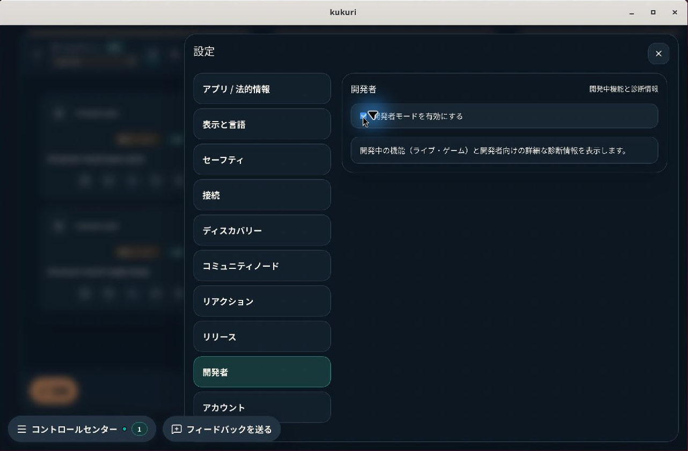
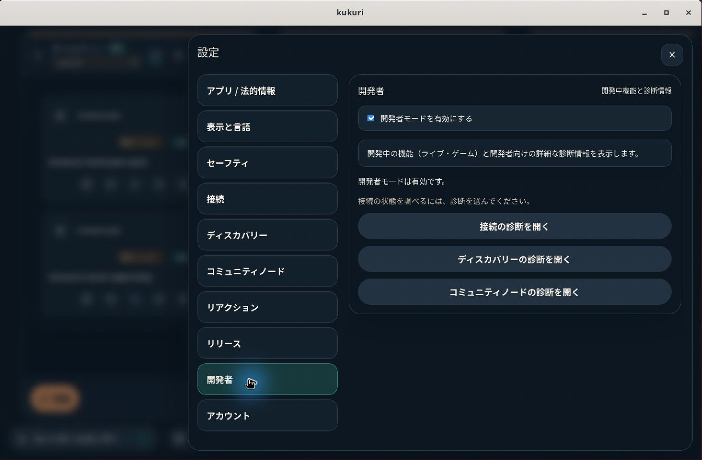

# #958 開発者モードの状態表示と診断導線

## 対象と判断

- Issue: [#958](https://github.com/KingYoSun/kukuri/issues/958)
- Scope revision: `958-2026-09-10-v1`（2026-09-10承認、検証は09-11に継続）
- 基準commit: `df40dec0a38af4ff9bbcb7c4efa40b4f1004e40c`
- リスク区分: B。設定内の表示・移動に限定し、認証、同意、network、モード保存形式を変更しない。
- 状態: 実装とローカル必須検証を完了。CI／mergeの最終結果はIssueのCurrent statusとPRを参照する。
- UI分類: 既存画面の改善、既存診断設定への短い導線追加。
- 利用者／目的: 接続不調を調べる利用者が、有効化の結果と次の操作を同じ画面で理解する。
- 対象外: 新規診断画面、追加fetch／retry、接続・認証設定変更、実験機能の公開条件変更、設定全体の再設計。

工程は[Issue運用手順](../runbooks/issue-lifecycle.md)、視覚契約は[DESIGN.md](../../DESIGN.md)、確認方法は[ADR 0014](../adr/0014-uiux-dev-flow.md)、配置は[UI実装配置](../architecture/desktop-ui-implementation.md)に従う。承認済み計画の詳細を本記録へ集約し、非追跡の計画ファイルを後続作業の必須参照にしない。

## 変更

`DeveloperPanel` は現在のモードから有効／無効の状態文を描画し、ON時だけ接続・ディスカバリー・コミュニティノードの診断ボタンを表示する。状態文は `role="status"` と `aria-atomic` を持つ。有効化だけで自動遷移せず、トグルにfocusを残す。

`DesktopShellSettingsDrawer` のsection変更を既存navと共有し、モードの保存処理は従来のまま使う。ボタンを選ぶとdrawerを開いたままsection／URLを更新し、unmountされるボタンから移動先navへfocusを引き継ぐ。既存Notice・Button・SettingsActionRowを使用し、新規token・primitive・fetch・timerは追加していない。

日本語・英語・簡体字中国語を同期した。英語は狭幅の既存レイアウト検査に合わせ、`Connection diagnostics`／`Discovery diagnostics`／`Community node diagnostics` の短いラベルを採用した。

### 追加発見と扱い

狭幅で最初の診断ボタンに既存dock／page indicatorが重なった。`elementFromPoint` による実際のhit targetで再現し、AC-4に対するExisting-gapとして修正した。設定drawerを74、backdropを73とし、dockの72／indicatorの71より上、既存Dialogの80以上より下に置く。

この修正後、既存community-indexの保存検査は「reloadで復元されたmodalの背後にあるControl Center」をクリックできなくなった。テストは復元済みdrawer／sectionを明示的に検証する手順へ変更した。manual／auto選択の保存・再読込assertionは維持し、背景への強制clickや既存assertionの削除で通していない。

## 固定条件と証跡

| 条件 | 完了条件 | 実装／検証 |
| --- | --- | --- |
| AC-1 | OFF→ON直後、同じ設定画面に有効状態と次の診断操作が現れる | `DeveloperPanel`、shellの即時表示test、同条件のLinux画像 |
| AC-2 | 3ボタンから対応する既存診断へ移動し、drawer／section／URLが一致する | `changeSettingsSection`、3件のshell遷移test、browserの3導線 |
| AC-3 | OFF／再ON／設定再表示／保存済みONからの起動で現在値に一致する | controlled component test、shell再mount、browserのON／OFF reload、Tauri実機 |
| AC-4 | 3locale・2theme・標準／狭幅で操作でき、keyboard／pointerと戻る／閉じるが成立する | 12条件のbrowser test、keyboard test、hit target test、既存localization layout、Storybook／axe |
| INVAR-1 | 既定OFF・保存key／値・復元・実験機能表示とOFF時route fallbackを維持する | `developerMode.ts`／`slices/chrome.ts`は変更なし、既存developerMode shell tests |
| INVAR-2 | OFF時は詳細診断を隠し、ticket importと既存設定入口を維持する | 既存診断非表示test、settings panels／Control Center回帰 |
| INVAR-3 | 移動で追加保存・認証・token変更を起こさず、workspace／入力文脈・URL同期を保つ | 未保存ticket／seed保持test、mutation spy、既存navigation／community-index保存test |

対象testは [shell](../../apps/desktop/src/shell/DesktopShellPage.developerMode.test.tsx)、[component](../../apps/desktop/src/components/settings/SettingsPanels.test.tsx)、[browser](../../apps/desktop/tests/playwright/developer-mode.spec.ts)、[visual](../../apps/desktop/tests/playwright/visual.spec.ts)。

## Surface inventoryと状態遷移

| ID | 入口・trigger | helper／owner | 読み書き・副作用 | 条件／transition | 証跡 |
| --- | --- | --- | --- | --- | --- |
| INV-1 | DeveloperPanel checkbox／props更新 | drawer、既存setter／writeDeveloperMode | 既存store／localStorage、状態描画 | AC-1／3、INVAR-1、TR-1／2 | component／shell |
| INV-2 | 3診断ボタン: connectivity、discovery、community-node | changeSettingsSection／syncRoute | active section／URL／focus | AC-2、INVAR-3、TR-3／5 | shell／browser |
| INV-3 | SettingsDrawer全nav、Control Centerのsettings入口、settings deep link | settingsSections登録簿／onSectionChange／既存openSettings | drawer開閉、section、既存focus復元 | INVAR-2／3、TR-3／4 | browser／既存settings回帰 |
| INV-4 | 再mount／起動／設定再表示 | readDeveloperMode→slices/chrome.ts | 既存保存値読込、描画 | AC-3、INVAR-1、TR-4 | shell／browser／Tauri |
| INV-5 | モード変更による既存consumer更新 | Control Center、Connectivity／Discovery／CommunityNode／ReleasePanel、実験機能route処理 | 診断／実験機能の表示、既存fallback | INVAR-1／2、TR-2／4 | 既存developerMode／settings tests |
| INV-6 | drawerが開いた時のpointer／描画 | shell-settings-drawer／backdrop、dock／indicator | 描画・hit targetのみ | AC-4、TR-6 | hit target test、visual、community-index再読込 |

inventory差分はINV-1の状態描画、INV-2の3入口追加、および実画像から到達性を確認したINV-6。追加のstorage／API sinkはない。6 groupを分類し、未分類0。

CodeGraphで入口・callerを確認した上で `rg` で実登録を照合した。DeveloperPanelのcallerはproduction drawer、stories、SettingsPanels.test。`readDeveloperMode` のproduction callerは `slices/chrome.ts`、`writeDeveloperMode` のproduction callerはdrawerのみ。`showDiagnostics` は上記4panelに渡される。section変更の新helperは既存navと新しい診断callbackの2入口で使う。nav全memberは `settingsSections` と `SettingsSection`、Control Center全入口は `DesktopShellControlCenter.tsx` の `openSettings` 呼出しから再列挙できる。

| ID | 事前状態／sequence | 期待状態・許可I/O | 禁止する副作用 | 検証 |
| --- | --- | --- | --- | --- |
| TR-1 | fresh／OFF、開発者設定→ON | 同画面に状態と3導線、既存保存、toggle focus維持 | 自動遷移、接続成功の誤表示 | 先行失敗test→成功、Linux画像 |
| TR-2 | ON→OFF→ON | 状態文／action追従、既存保存とroute fallback | stale案内、OFFでの詳細表示 | component／shell／browser |
| TR-3 | ON→各診断→navで開発者→閉じる | section／URL／focus一致、既存navigation | drawer再openの要求、入力破棄、追加mutation | 3件shell、keyboard／pointer browser |
| TR-4 | 保存済みON／OFF→再表示／reload／起動 | 保存値に一致、既存読込 | 表示専用stateとの不一致 | shell再mount、browser reload、Tauri |
| TR-5 | 接続error／診断不足→診断へ | 移動可能、既存のerror表示を保持 | false success、追加retry／認証／保存 | `diagnostic shortcuts preserve unsaved input...` |
| TR-6 | 狭幅でON、設定背後にdock | 診断ボタンが実pointerを受ける、閉じると既存workspaceへ | overlayによる操作妨害、modal背後への誤操作 | `narrow settings keep...`、既存community-index回帰 |

新しい非同期処理、401再認証、権限変更、複数対象mutationを導入しないため、その新規transitionは非該当。区分Bの単独Issueで、親Issue・Reopen・認証等のshared guard変更を含まないため独立監査は必須対象外。CSSのmodal重なりはUIの到達性として確認する。

## 修正前後の再現

1. 基準版にshell再現testを追加して実行。既存5件は成功し、新規4件が状態文／診断ボタン欠落で失敗した。
2. 実装後、componentとshellの対象2ファイルは29件成功。既定ONのtest setupを上書きしてOFFからの実操作を検証した。
3. narrowのhit target再現testは修正前 `false`、重なり順修正後 `true`。既存のno-wrap検査で英語ラベルの折り返しも検出し、短い文言で修正した。

Linuxの同じnative window・日本語・dark・OFF→ON直後を比較する。画像はリモートデスクトップの接続先等を除き、アプリ部分だけを切り出した。

| 変更前 | 変更後 |
| --- | --- |
|  |  |

## 検証条件と結果

| 検証 | 条件／結果 |
| --- | --- |
| doctor | local2、Ubuntu 24.04.5 LTS、成功 |
| `cargo xtask check` | Linux、成功。Rust／Tauri／lint／typecheck |
| targeted Vitest | Windows、SettingsPanels + DesktopShellPage.developerMode、29件成功 |
| targeted Playwright | Windows、developer-mode + 既存狭幅localization、17件成功 |
| `cargo xtask desktop-lint` | Windows、成功。最終差分の `pnpm lint`／`pnpm typecheck` も成功 |
| `cargo xtask test` | Linux、成功。non-CN Rust tests／doctestsとfrontend 167ファイル・1,348件成功 |
| desktop-ui-checkの各工程 | 初回失敗後、lint／typecheck／Vitestは上記gateで再確認。残りはLinuxの `desktop-storybook`、`desktop-browser-test`（211件）、`desktop-visual-test`（24件）で成功。`CI=1` のpixel比較を含む。成功済みVitestの重複実行は省略 |
| Storybook | Linuxでbuild成功。Disabled／Enabled／Narrowを描画し、Spaceで状態更新。axe 4.13.0のWCAG 2 A／AA・2.1 AA・2.2 AA該当ruleで各storyの違反0／未確定0 |
| 本番画面axe | Chromium、1280×800、en、dark／light、OFF／ON。4条件とも違反0／未確定0 |
| reflow／forced colors | Chromiumで640×400（1280×800の200%相当）とforced-colors／reduced-motionを確認。scrollで3ボタンへ到達しhit targetを維持 |
| Tauri実機 | Windows WebView2／Ubuntu WebKitGTK 2.52.6。日本語dark、有効／無効状態と3診断へのpointer操作を確認。LinuxではSpaceで再ON後、同じdev port／app dataでprocessを再起動し、有効状態と3導線の復元を確認 |
| 差分・大型ファイル | `git diff --check` と `cargo xtask oversized-files` が成功。既存の大型ファイル警告のみでratchet増加なし |

nativeのデータは `VITE_KUKURI_DESKTOP_MOCK=1` の既存fixtureを使用し、backend app dataを検証用pathへ分離した。これは本番Reactを実WebViewで描画・操作した証跡であり、実network／認証の試験ではない。SSHはbuild／検証に、接続済みリモートデスクトップはUbuntuの描画・実入力に使用した。DISPLAY等はuser sessionから観測して使用し、推測値で別sessionへ表示していない。

### 初回失敗と再確認

- 最初のLinux desktop-ui-check／checkは新規RTL testの未対応 `exact` optionをtypecheckが検出。optionを除き再実行した。
- 次の全Vitest実行中にlocale／test同期を行ったため、5件が旧locale cacheと新test名の不一致で失敗した。また既存Live lifecycle 1件が5秒timeout。変更が止まったtreeでの `cargo xtask test` は1,348件すべて成功し、timeoutも再現しなかった。初回失敗を成功結果に混ぜない。
- browser全体は初回210件成功、1件がmodal背後へのclickでtimeout。上記の復元済み設定を検証する手順に修正した。途中のテスト変数変更の誤りも訂正し、最終の全211件が成功した。保存assertionとprivate disclosureの既存検査を維持している。
- snapshotはLinux／Chromium・CJK fontありで生成した。最終の採用画像は `--update-snapshots=all` で開発者4枚と重なり順の影響がある既存設定3枚に限定して再生成し、目視した。新しい開発者画面の比較許容率は0.001で、操作妨害はpixel比較と独立したhit target testでも保護する。最終のvisual全24件も成功した。

### 確認の限界

実OSのHigh Contrast切替とscreen readerの音声聴取は未実施。forced-colorsの描画、live regionのsemantic、keyboard／pointer、axeをそれぞれの確認範囲として記録し、包括的なWCAG適合や音声確認の代替とはしない。新規motion、重い描画、データ取得がないため性能benchmarkは非該当。UI review recordが必要な設計体系変更や例外承認はなく、本記録とPRのpreviewを証跡とする。
