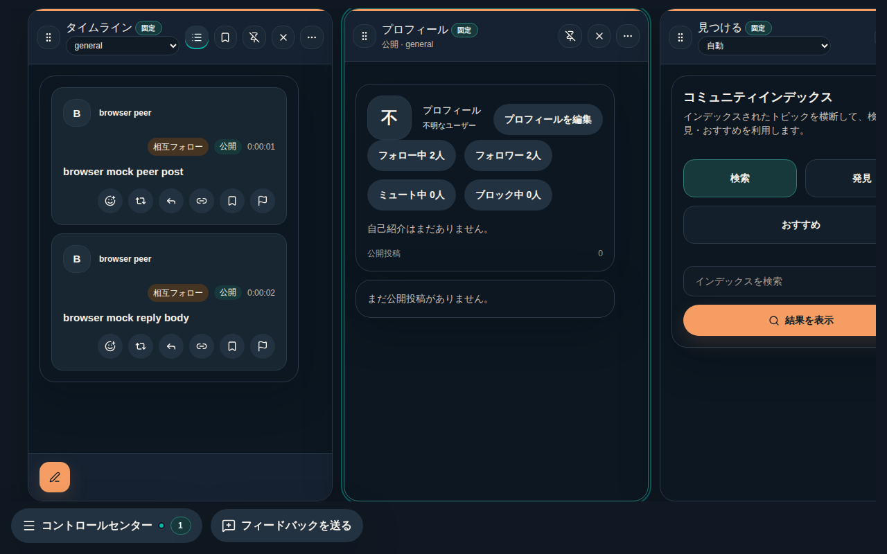
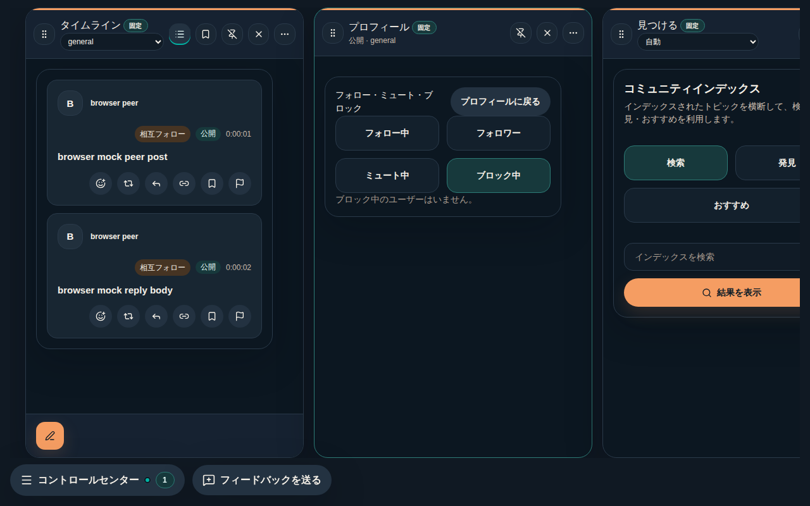
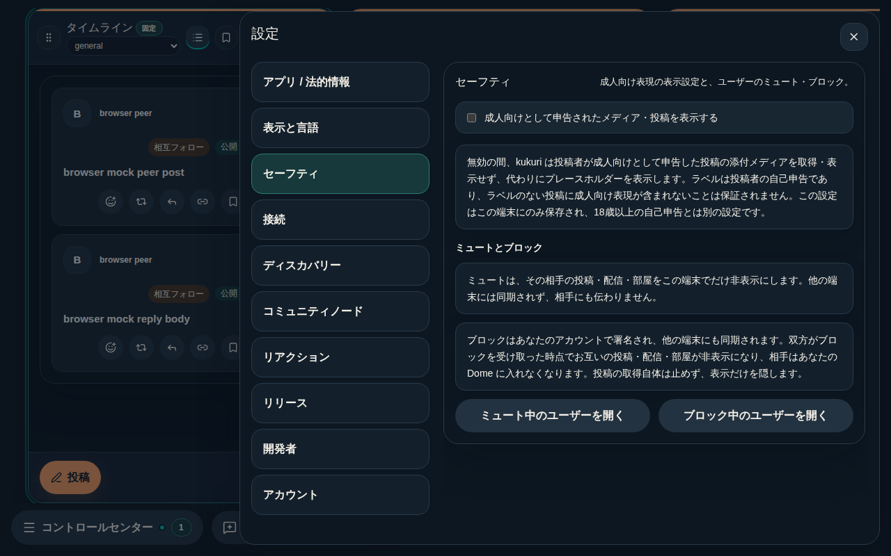

# #961 ブロック導線の発見性と、ブロック関係の投稿非表示

## 現在判定

- Scope revision: `2026-09-11-961-plan-v2`（ユーザー承認済み。v1 の導線・一覧・説明に「ブロック双方向の投稿非表示」を追加）。
- 基準commit: `910f5ad`。
- リスク区分: B。新しい入口は既存の shared helper `handleBlockAction` と既存 sink `block_author / unblock_author` を経由し、guard・IPC・外部送信・永続化の仕様は変えない。読み出し経路の非表示 helper は 6 caller を持つため、本記録に全 caller を列挙する。
- 状態: 実装・targeted validation 完了。PR の CI を確認後に merge する。
- [Issue #961](https://github.com/KingYoSun/kukuri/issues/961) の先頭に固定 AC-1〜5 / INVAR-1〜5、INV-1〜6、TR-1〜7 を記録。元の報告は本文末尾に当時の観測として保持する。

## 原因と変更

ブロック API と、投稿・通知から相手を開いた作者詳細のブロックボタンは実装済みだった。欠けていたのは自分のプロフィールと設定から辿れる導線と一覧で、`ProfileConnectionsView` が `following | followed | muted` に固定されていた。またブロックは署名済み edge の同期と Dome の access 判定（ADR 0043）だけに使われ、投稿の表示は変えていなかった。

- `ProfileConnectionsView` に `blocking` を追加し、route 正規化、store 既定値、Profile section loader、mock、view model を揃えた。
- プロフィール概要に「ブロック中 N人」導線、一覧に「ブロック中」タブ・ブロック中バッジ・行ごとのブロック／解除ボタンを追加した。自分自身の行には出さない。
- 設定 > セーフティにミュートとブロックの違いの説明と、ミュート／ブロック一覧へ遷移するボタンを追加した。遷移は Profile Column を前面にしてから connections 画面を開き、設定を閉じる。一覧は複製しない。
- 通報ダイアログのローカル操作にブロックを並べ、既存の案内文と一致させた。
- app-api の読み出し経路 6 箇所が使う非表示集合を `current_hidden_author_pubkeys`（muted ∪ 自分がブロックした相手 ∪ 自分をブロックした相手）に置き換えた。取得・保存・通知・DM・follow・Dome 判定は変えない。ADR 0022 に追記した。
- `blocked_by` の一覧・バッジは出さない（ユーザー判断で Non-goal に固定）。

## 修正前の再現

- Rust: `blocking_author_hides_posts_until_unblocked`、`blocked_by_author_hides_their_posts_until_revoked_but_mute_persists`、`repost_of_blocked_author_is_hidden`、`blocked_author_is_filtered_from_live_and_game_lists_in_both_directions` の 4 件が、ブロック中でも timeline / thread / profile / bookmarks / live / game に投稿が残ることで red（`left: true, right: false`）。
- frontend: `routes.unit.test.ts`（`blocking` が不正値扱い）、`ProfileConnectionsPanel.test.tsx` 2 件（Blocked タブ・Block ボタン不在）、`AuthorDetailCard.test.tsx`（通報ダイアログに Block なし）、`SettingsPanels.test.tsx`（説明・導線不在）、`DesktopShellPage.profile.test.tsx` 3 件（件数導線・一覧からのブロック・設定からの遷移が不在）の 8 件が red。
- 修正後、上記 12 件と既存のミュート契約 7 件が green。

## AC / INVAR の証跡

| 条件 | 実装・test / evidence |
| --- | --- |
| AC-1 | `ProfileOverviewPanel` の `blockingCount` ボタン、`routes.ts` の `isProfileConnectionsView`。`profile overview connection count buttons open the requested connections tab`（hash に `connectionsView=blocking`）、`routes.unit.test.ts` |
| AC-2 | `ProfileConnectionsPanel` の `onToggleBlock` → `handleBlockAction`。成功後は既存の `loadTopics` → `loadProfileSection` で一覧・件数を再取得。`blocking from the muted list moves the user into the blocked list`、`connection rows expose block and unblock next to mute` |
| AC-3 | `SafetyPanel` の説明 2 件と導線 2 件、`DesktopShellSettingsDrawer` の `openSocialConnections`（設定を閉じ、Profile Column を前面にして一覧を開く）。3 locale の `settings.safety.social.*`。`safety panel explains mute versus block and opens each list`、`safety settings open the blocked users list and close the drawer`、`localization-layout.spec.ts` の `connectionsView=blocking` route |
| AC-4 | `AuthorDetailCard` の `localActions` に Block。`author report local actions offer block next to mute` |
| AC-5 | `current_hidden_author_pubkeys` と 6 caller。Rust 4 contracts（双方向、Revoked で再表示、mute 併用、repost、live / game） |
| INVAR-1 | 既存ミュート contracts 7 件、`following` への正規化 test、既存タブの統合 test を維持 |
| INVAR-2 | frontend の新入口はすべて `handleBlockAction` 経由。`blockAuthor` の spy で pubkey を確認。Rust の write path は無変更 |
| INVAR-3 | `the local author row never offers block` |
| INVAR-4 | `AuthorSocialView` と `list_social_connections` は無変更。UI は `blocked_by` を描画しない（`routes.unit.test.ts` で `blocked_by` を不正値として維持） |
| INVAR-5 | `persist_block_edge_doc`、replica 購読、`spatial_access_support` は差分なし（`git diff` で確認） |

## inventory / transition 確認

| 対象 | 入口・caller 確認と変更 |
| --- | --- |
| INV-1〜3 | `handleBlockAction` の caller は作者詳細（`DesktopShellAuxiliaryPanels`）、一覧行（`DesktopShellPrimaryWorkspace` → `ProfileConnectionsPanel`）、通報ダイアログ（`AuthorDetailCard` の `localActions`）。sink は `socialBlockApi` → `block_author / unblock_author` のみ |
| INV-4 | `listSocialConnections('blocking')` の caller は `loadProfileSection` だけ。読み取りのみ |
| INV-5 | `SafetyPanel` → `openSocialConnections` → `setSettingsOpen(false)` + `focusPrimarySection('profile')` + `openProfileConnections(view)`。書き込みなし |
| INV-6 | `current_hidden_author_pubkeys` の caller: `timeline.rs` の `list_profile_timeline` / `list_bookmarked_posts` / `list_timeline` / `list_thread`、`live.rs` の `list_live_sessions_scoped`（2 箇所の再取得を含む）、`game.rs` の `list_game_rooms_scoped`。`rg current_muted_author_pubkeys` の残存 caller は helper 内部の 1 件のみ |

TR-1/2/3 は frontend の統合 test と unit test、TR-4 は一覧の空状態 test、TR-5 は route unit test と `localization-layout.spec.ts`、TR-6/7 は Rust contracts に対応する。

## 検証結果

| 検証 | 結果 |
| --- | --- |
| Rust targeted（新規 4 件 + 既存ミュート／ブロック契約 8 件） | 12 passed |
| `cargo test -p kukuri-app-api --lib` | 190 passed |
| `cargo fmt --check` / `cargo clippy -p kukuri-app-api --all-targets -D warnings` | 成功 |
| `cargo xtask desktop-lint`（eslint + tsc） | 成功 |
| frontend targeted（8 ファイル） | 新規・既存 121 件成功。`profile overview aggregates public posts across topics and excludes private channel posts` の 1 件はこの実行環境で 10 秒 timeout。基準 commit（差分を退避した状態）でも同じ timeout で失敗するため、今回の差分の回帰ではなく環境の遅さと判断し、CI の結果で確認する |
| `cargo xtask desktop-test` | 1412 passed / 13 failed。13 件はすべて shell-integration の 5 秒・10 秒 timeout。基準 commit でも同じ timeout で失敗し、`--testTimeout=30000`（対象 test 固有の `10_000` は一時的に `60_000`）で 65 件すべて成功したため環境の遅さと判断。CI で最終確認 |
| Playwright browser targeted（`localization-layout`（`connectionsView=blocking` route 追加）、`settings-localization`、`hash-routing`、`profile-post-refresh`、`shell.smoke`、`extended-flow`） | 51 passed。環境の Chromium build が pin と異なるため、`PLAYWRIGHT_BROWSERS_PATH` に同 build への symlink を置いて実行 |
| `cargo xtask desktop-storybook` | 成功 |
| 視覚回帰（`CI=1` で baseline 比較） | 21 passed / 5 failed。失敗 5 件は ja / zh の日本語 glyph 全体が差分になるフォント差（`fonts-noto-cjk` なし）で、diff 画像に layout 差はない。timeline / author pane など Profile Column を含む英語 shot は baseline 内。baseline は更新せず CI の `linux-desktop-browser` で確認する |

## UI 証跡と確認の限界

- 変更分類: 既存画面の改善。対象利用者は迷惑ユーザーに遭遇した利用者。単一目的は「ブロックへの到達と状態確認」。主要操作はプロフィール概要 → ブロック中一覧 → ブロック／解除、設定 > セーフティ → 一覧。非目標は確認ダイアログ、`blocked_by` の表示、Column メニューの内容固有操作。
- 維持する挙動: 既存タブとルート正規化、ミュートの端末内挙動、通報導線。
- 対象 platform / state: browser（Linux Chromium）、1280 / 1024 / 390px、dark / light、ja / en / zh-CN、一覧の loading / error / 0 件 / 複数件。
- 未確認: Tauri / WebView 実機（Linux / Windows）での日本語表示と screen reader。browser mock の成功は実機の証明ではない。
- CodeGraph の CLI / MCP はこの環境で利用できず、探索は `rg` とファイル読みで行った。

## 証跡画像（ja、dark、1280×800、browser mock）

