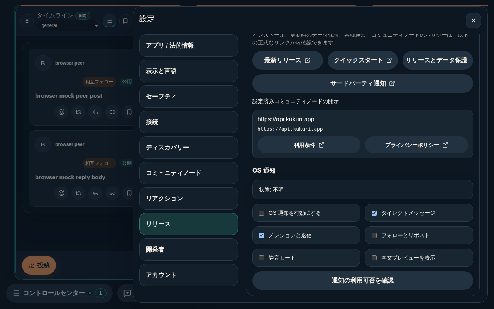
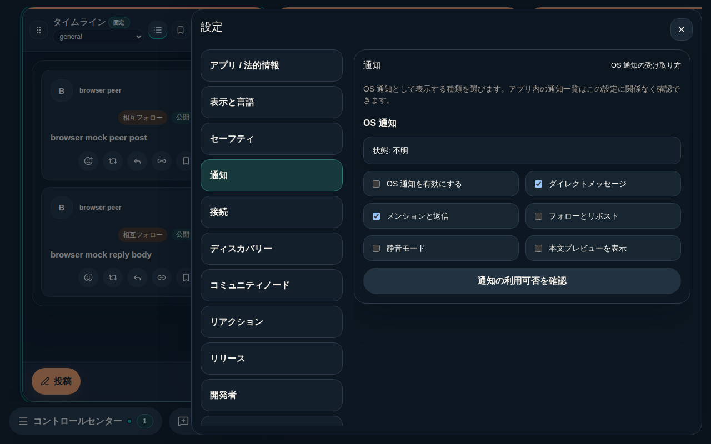
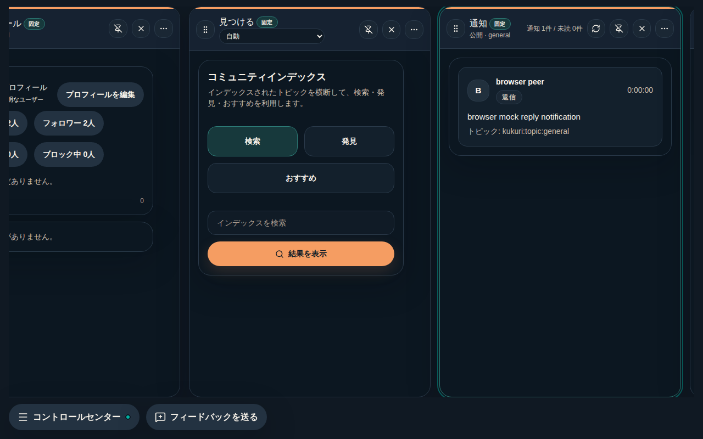
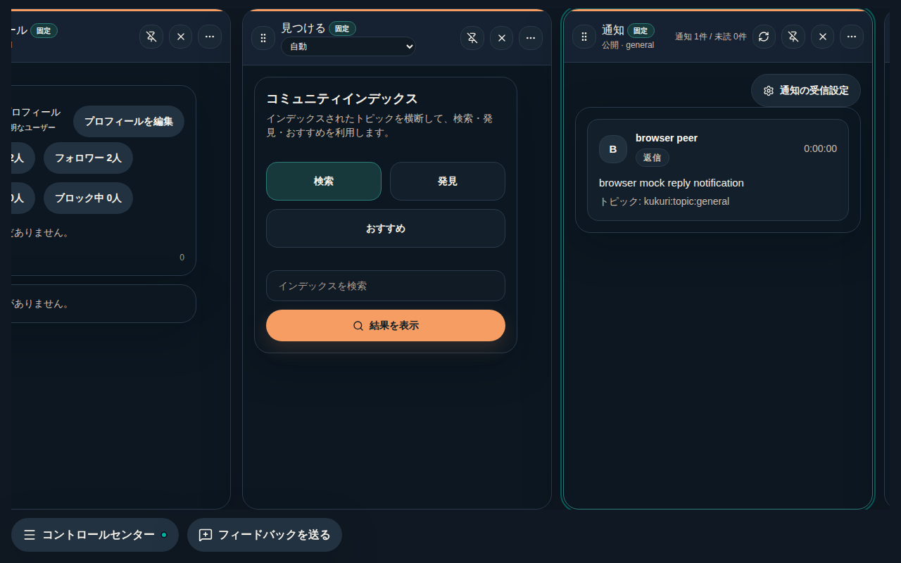
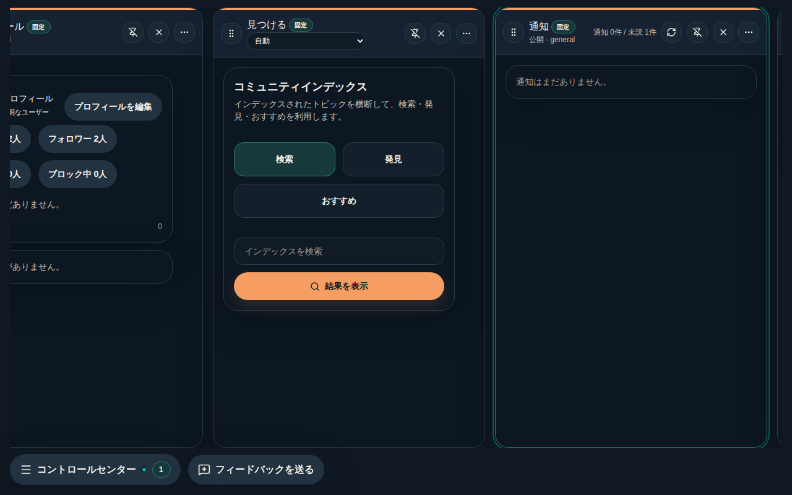
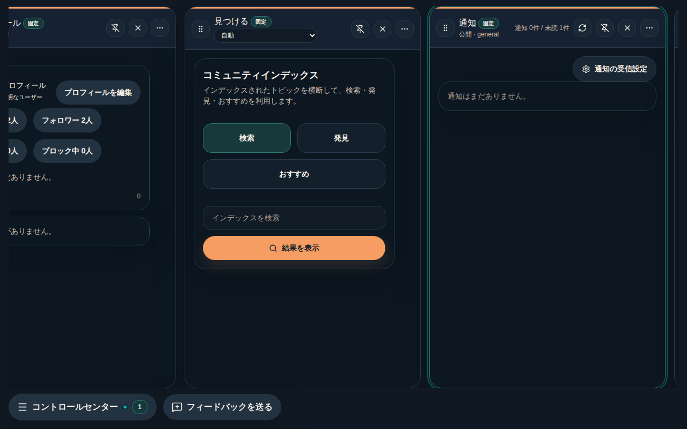
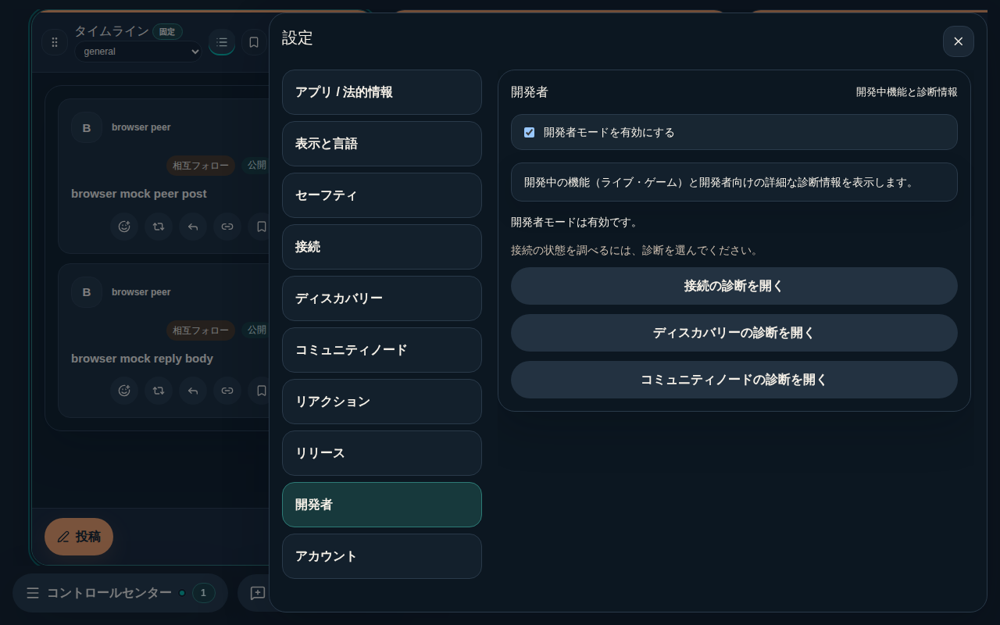
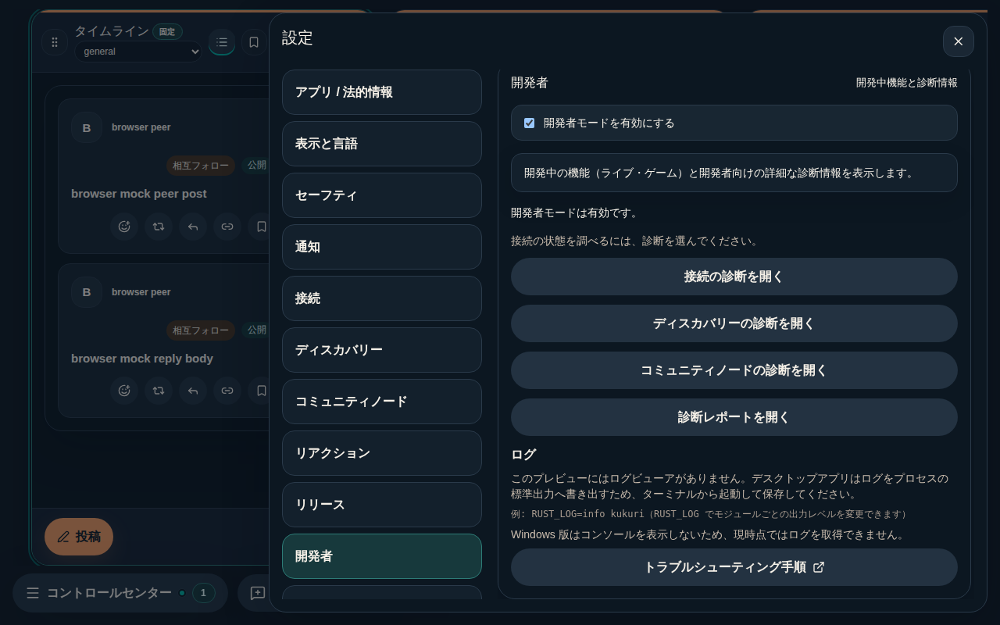
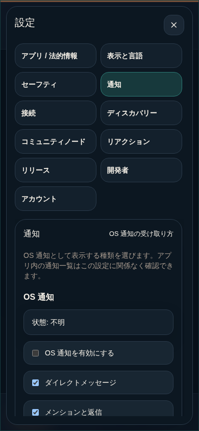

# #962 通知の受信設定の入口と、開発者向けログ所在の明示

- 判定: In progress（実装・ローカル検証完了。CI／merge の最終結果は Issue の Current status と PR を参照する）
- Scope revision: `962-2026-09-11-v1`（ユーザー承認済み。推奨案: 通知 section の追加、通知一覧からの導線、開発者 section での診断レポート導線とログ所在の明示。アプリ内ログビューア本体は #978 へ分離）
- 基準commit: `b51005b`
- リスク区分: B。設定内の表示・移動と既存 block の移設のみ。保存 key／値、`set_os_notification_settings` の mirror、認証、network、診断レポートの除外規則は変更しない。
- UI分類: 既存画面の改善 + 設定 section の追加（新規画面ではなく既存 block の移設）。利用者は通知の受け取り方を変えたい利用者と、不調時にログを探す開発者モードの利用者。単一目的は「通知設定とログの所在を設定内から見つけられる」こと。
- 対象外: アプリ内ログビューア本体（#978）、通知設定の保存形式・backend mirror・権限確認の変更、Control Center への通知設定 entry、バックアップ／復元の発見性（#967）。
- 正本: [Issue運用手順](../runbooks/issue-lifecycle.md)、[ADR 0014](../adr/0014-uiux-dev-flow.md)、[DESIGN](../../DESIGN.md) 4.2、[UI実装配置](../architecture/desktop-ui-implementation.md)、[troubleshooting runbook](../runbooks/mvp-troubleshooting.md)。

## 調査で固定した事実

- OS 通知の 6 項目（有効化、DM、メンションと返信、フォローとリポスト、静音モード、本文プレビュー）と権限確認は `ReleasePanel.tsx` の最下部にだけあり、設定一覧では「リリース」（説明「プレビュー更新、診断、OS 通知です」）に属していた。通知カラム、空状態、Control Center から辿れない。保存は `kukuri:os-notification-settings:v1` で、`useOsNotificationBridge` が backend の `set_os_notification_settings` へ mirror する。
- ログは `apps/desktop/src-tauri/src/tracing.rs` の標準出力向け `tracing_subscriber::fmt` だけで、ファイル・メモリ保持・IPC はない。Windows の release build は `windows_subsystem = "windows"` でコンソールを持たない。`RUST_LOG` の説明は `docs/runbooks/dev.md` にあり、利用者向け troubleshooting には無かった。
- 開発者 section の診断ボタンは接続・ディスカバリー・コミュニティノードの 3 つで、開発者モードON時だけリリース section に現れる診断レポート（コピー／書き出し）へは辿れなかった。
- section id の登録点は `components/shell/types.ts`、`shell/routes.ts`（`SETTINGS_SECTION_COPY`／`isSettingsSection`）、`shell/slices/chrome.ts` の deep link 正規化、`DesktopShellSettingsDrawer.tsx` の index 配列、3 locale の `shell.settingsSections`、Playwright の `settings-section-<id>` testid、設定 nav を含む視覚 baseline。
- CodeGraph はこの環境に無く、`rg` とファイル読みで探索した。

## 変更

- 設定に「通知」section（`notifications`）を「セーフティ」の直後に追加し、OS 通知 block を `NotificationsPanel.tsx` へ移設した。読み書きと権限確認は `lib/useOsNotificationSettings.ts` の `useOsNotificationSettings`／`useOsNotificationPermission` に置き、ReleasePanel は診断レポート用に同じ hook で現在値を読むだけにした。保存 key、既定値、bridge は変更していない。
- `DesktopShellSettingsDrawer.tsx` の section 登録を index から id 参照（`sectionCopy(id)`）へ変え、`routes.ts`／`chrome.ts`／3 locale を同期した。リリース section の説明から通知を外した。
- 通知一覧の本文先頭に「通知の受信設定」ボタンを置き、既存の `handleOpenSettingsSection('notifications')` で設定を開く。0 件の空状態でも同じ位置に出るため、DESIGN 4.2 の「empty は次の行動を示す」を満たす。
- `DeveloperPanel.tsx` の診断ボタンに「診断レポートを開く」（リリース section へ）を加え、ON 時だけ「ログ」節で専用ビューアが無いこと、標準出力と `RUST_LOG` による取得方法、Windows では取得できないこと、troubleshooting runbook への外部リンクを表示する。
- `docs/runbooks/mvp-troubleshooting.md` に「ログの確認」と「通知の受信設定」の節を追加し、Diagnostics 節に開発者モードの前提を追記した。
- Storybook に `NotificationsPanel` の Browser／Available／Unavailable／Checking／Narrow を追加し、ReleasePanel の通知 story を移した。Playwright に `notification-settings.spec.ts`（ja dark 1280／en light 390）と視覚 `settings-notifications-wide-dark` を追加し、`localization-layout.spec.ts` の section 一覧に `notifications` を加えた。

### 追加発見と扱い

- 通知カラムの header に action icon を足した最初の実装では、ja 1280 の 3 Column 幅で Column title「通知」が「通…」、scope「公開 · general」が「公開 · g…」に欠けた（変更前は欠けていない）。対象差分による Regression として merge 前に修正し、導線を一覧本文へ移して header は変更前のままにした。要約文を先に縮める CSS も試したが「固定」バッジが折り返したため採用していない。
- 通知設定パネルの header 要約が長く、狭い header で title「通知」が縦に折り返した。要約を短くし、説明文を本文へ置いた。
- `chrome.ts` の deep link 正規化に `account` が含まれず `?settings=account` が既定 section へ落ちる。固定 AC 外の既存事実であり、今回は変更していない（New-requirement として別途扱う）。

## 修正前の再現

- 基準 commit に新規 test だけを追加して実行。`routes.unit.test.ts`（`notifications` が不正値扱い）、`DesktopShellPage.notificationSettings.test.tsx` 4 件（通知 section 不在、deep link 不在、一覧からの導線不在、空状態の導線不在）、`SettingsPanels.test.tsx` 1 件と `DesktopShellPage.developerMode.test.tsx` 1 件（診断レポート導線とログ節不在）の 7 件が失敗し、`ReleasePanel.notifications.test.tsx` を `NotificationsPanel.test.tsx` へ移した 1 ファイルが import 不能で失敗した。
- 実装後、上記 8 件を含む対象ファイルが成功した。
- 変更前後の画像は base commit の build を別 worktree で serve して同条件（ja、dark、1280×800、browser mock）で撮影した。

| 変更前 | 変更後 |
| --- | --- |
|  |  |
|  |  |
|  |  |
|  |  |

狭幅（390）の通知 section: 

## AC / INVAR の証跡

| 条件 | 実装・test / evidence |
| --- | --- |
| AC-1 | `SETTINGS_SECTION_COPY`／`sectionCopy('notifications')`／`NotificationsPanel`。`settings expose a notifications section with the OS notification preferences`（リリース section に通知 checkbox が無いことも確認）、`routes.unit.test.ts` |
| AC-2 | `DesktopShellNotificationsSurface` の「通知の受信設定」→ `handleOpenSettingsSection('notifications')`。`the notifications inbox action opens the notification settings section without touching read state`、`the empty notifications inbox offers the notification settings as its next action`、browser spec 2 件 |
| AC-3 | `DeveloperPanel` の `release` 導線と `developer.logs.*`。`developer panel links to the diagnostic report and explains where logs live only while enabled`、`developer settings open the diagnostic report without leaving the drawer`、browser spec |
| AC-4 | `notification-settings.spec.ts`（ja dark 1280、en light 390、keyboard Enter／Escape、1280／700／390 での横 overflow なし）、`localization-layout.spec.ts` の 3 locale 狭幅 nav、Storybook Narrow story、上記画像 |
| INVAR-1 | `releaseReadiness.ts`／`useOsNotificationBridge.ts` は無変更。`releaseReadiness.test.ts`、`NotificationsPanel.test.tsx`（旧 ReleasePanel.notifications の 7 件を同じ assertion で移行）、deep link test の localStorage 値確認 |
| INVAR-2 | `isSettingsSection` に `notifications` を追加、既存 id は維持。`routes.unit.test.ts`、`hash-routing.spec.ts`、`settings hash route opens the drawer...` |
| INVAR-3 | 一覧からの導線 test で `markNotificationRead`／`markAllNotificationsRead` の呼出回数が不変。`diagnostic shortcuts preserve unsaved input and show connection errors without mutations` を維持 |
| INVAR-4 | `buildSafeDiagnosticReport` と export 処理は無変更。`diagnostic report excludes secret-bearing fields and includes release state` を維持 |

## Surface inventory と状態遷移

| ID | 入口・trigger | helper／owner | 読み書き・副作用 | 条件／transition | 証跡 |
| --- | --- | --- | --- | --- | --- |
| INV-1 | 設定 nav「通知」、deep link `?settings=notifications` | `SETTINGS_SECTION_COPY`／`isSettingsSection`／`parseInitialSettingsSection`／`changeSettingsSection` | section／URL のみ | INVAR-2、TR-1／4 | routes unit、shell test、localization-layout |
| INV-2 | NotificationsPanel の 6 checkbox と権限確認 | `useOsNotificationSettings`／`useOsNotificationPermission` → 既存 `loadOsNotificationSettings`／`saveOsNotificationSettings`／`get_os_notification_permission`／`request_os_notification_permission` | localStorage 保存 → 既存 bridge が backend へ mirror | INVAR-1、TR-1／2 | panel test、releaseReadiness test |
| INV-3 | 通知一覧本文の「通知の受信設定」（0 件／複数件） | `handleOpenSettingsSection('notifications')` | section／URL／drawer open | INVAR-3、TR-3 | shell test、browser spec |
| INV-4 | ReleasePanel の診断レポート（読み取りのみ） | 同 hook の読み取り | なし | INVAR-4、TR-5 | releaseReadiness test、developerMode shell test |
| INV-5 | DeveloperPanel「診断レポートを開く」、ログ節、runbook link | `onOpenDiagnostics('release')`／`useExternalLinkOpener` | section 遷移、外部 URL open（利用者 click のみ） | INVAR-3、TR-5／6 | SettingsPanels test、developerMode shell test、browser spec |

inventory 差分は INV-1 の id 追加、INV-2 の移設（sink は不変）、INV-3／INV-5 の入口追加。追加の storage／API sink はない。5 group を分類し、未分類 0。`useOsNotificationSettings` の caller は `NotificationsPanel` と `ReleasePanel`、`useOsNotificationPermission` の caller も同じ 2 件。`onOpenNotificationSettings` の caller は `DesktopShellPage` の `renderNotificationsSurface` だけで、`DesktopShellColumnWorkspace` の header は変更していない。

| ID | 事前状態／sequence | 期待状態・許可 I/O | 禁止する副作用 | 検証 |
| --- | --- | --- | --- | --- |
| TR-1 | fresh、開発者OFF → 設定 → 通知 | 6 項目と権限状態、URL `settings=notifications` | 保存・mirror の発火 | shell test |
| TR-2 | 通知 section 表示中に checkbox 変更 | 既存 key に保存、bridge が mirror | 他項目の変更、権限要求 | shell test（deep link 経由）、panel test |
| TR-3 | 通知カラム（0 件／複数件）→ 導線 → 閉じる | 通知 section → 閉じると一覧へ、既読化なし | mark read の呼出 | shell test、browser spec |
| TR-4 | deep link `?settings=notifications`／旧 id で起動 | 該当 section を開く。旧 id は従来通り | 既定 section への誤 fallback | routes unit、shell test、hash-routing |
| TR-5 | 開発者 OFF→ON→診断レポート | リリース section の診断（コピー／書き出し）へ、drawer 維持 | 保存・認証・network | developerMode shell test、browser spec |
| TR-6 | 開発者 ON、狭幅 | ログ節が折り返し、横 overflow なし | 外部 URL の自動 open | browser spec（390） |

新しい非同期処理、401 再認証、権限変更、複数対象 mutation は導入していない。区分 B の単独 Issue で shared guard を含まないため独立監査は必須対象外。

## 検証条件と結果

| 検証 | 条件／結果 |
| --- | --- |
| targeted Vitest | routes unit、notificationSettings、developerMode、notifications、routing、shellChrome、SettingsPanels、NotificationsPanel、ReleasePanel copy、i18n parity、SettingsLocalization、viewModels: 成功 |
| `npx vitest run`（全体） | 172 ファイル中 168 成功、1429 件成功・5 件失敗。5 件は `topics`／`messages`／`socialGraph`／`columnScope` の 5 秒 timeout。基準 commit（別 worktree）でも同じ 4 件が同じ timeout で失敗し、環境の遅さと判断。CI で最終確認する |
| `cargo xtask desktop-lint` | 初回は `NotificationsPanel.stories.tsx` の型エラーで失敗。story を props なしの render に直し、`eslint . --max-warnings 0` と `tsc --noEmit` を再実行して成功 |
| Storybook build | 成功（`storybook build`） |
| Playwright browser（targeted） | notification-settings、settings-localization、localization-layout、hash-routing、developer-mode、notification-focus、shell.smoke: 成功。環境の Chromium build が pin と異なるため `PLAYWRIGHT_BROWSERS_PATH` に同 build への symlink を置いて実行 |
| Playwright browser（全体、`--project=chromium`） | 234 件成功（4.5 分）。同じ symlink 済み browser path で実行 |
| 視覚回帰（`CI=1` ローカル比較） | 27 件中 18 成功／9 失敗。設定 nav と開発者画面の変更による 5 件（developer 2、connection recovery 2、settings connectivity 1）と新規 1 件は意図した差分。ja の 3 件（app consent、explore、feedback）は日本語 glyph 全体の差分で layout 差は無く、ローカル Chromium build の違いによるもの。baseline は「Kukuri Visual Baseline」workflow（Linux／Chromium、`fonts-noto-cjk`）で再生成する |
| runbook | `docs/runbooks/mvp-troubleshooting.md` の command と link 先（`dev.md`）を確認 |
| `git diff --check` | 成功 |

## UI 証跡と確認の限界

- 対象 platform／state: browser（Linux Chromium、mock）、1280／700／390px、dark／light、ja／en／zh-CN（nav と layout）、通知 0 件／複数件、開発者 OFF／ON。
- Accessibility: 導線は `button`／`link`、ログ節は `section` + `aria-labelledby`、Enter／Escape の keyboard 操作を browser spec で確認。screen reader の音声聴取は未実施。
- 未確認: Tauri／WebView 実機（Linux／Windows）での日本語表示と権限確認の実挙動。browser mock の成功は実機の証明ではない。Windows のログ取得不可は `main.rs` の `windows_subsystem` 指定から判断し、実機で再確認していない。
- 新規 motion、重い描画、データ取得はなく、性能 benchmark は非該当。UI review record が必要な設計体系変更や例外はない。
