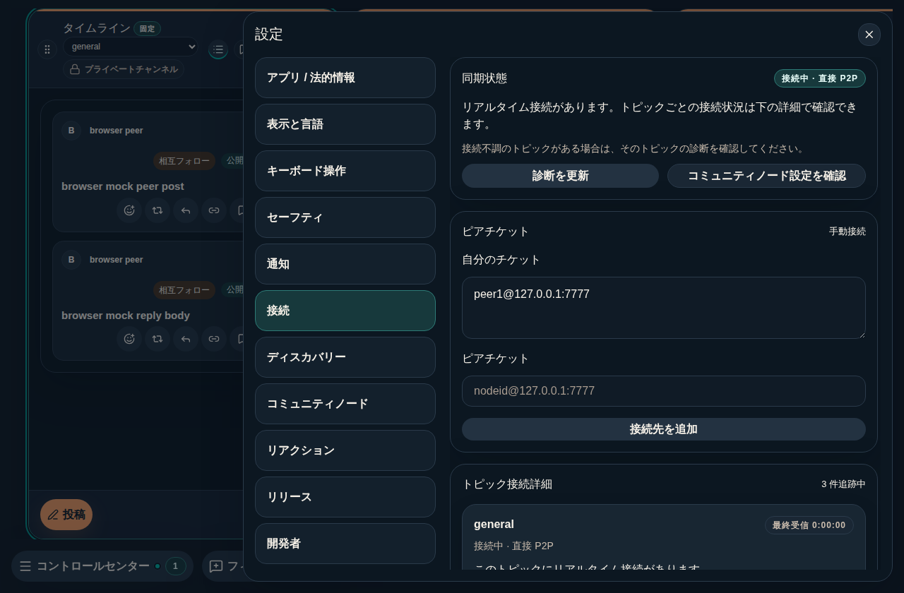
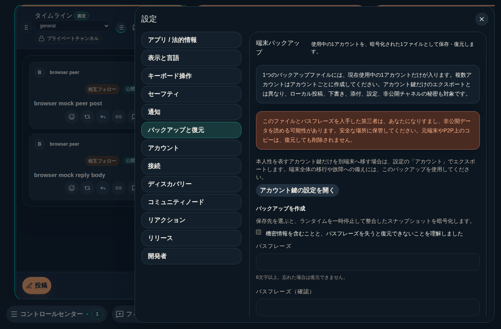
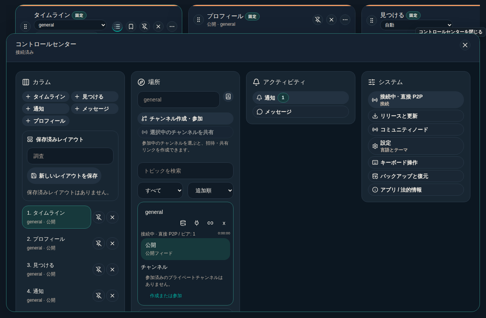

# #967 設定からバックアップ・復元の入口を見つけられるようにする

- Issue: [#967](https://github.com/KingYoSun/kukuri/issues/967)
- 判定: In progress（実装・browser 検証完了。CI、独立監査、merge の結果は Issue の Current status と PR を参照する）
- Scope revision: `2026-09-10-first-look-backup-discoverability-v1`（Issue 本文で固定。実装計画は 2026-09-11 に推奨案で承認。AC-1 の実機画像は browser 同条件の画像で代替することを承認済み）
- 基準 commit: `f2cdb5cacf02218b34291a35754b55a15c2f564e`（v0.2.1-preview.1）。実装は main 先端 `a17de1f` に対して行う。基準 commit と main 先端の間で `account` section の構造（最終 section、ラベル、DeviceBackupPanel と AccountKeyPanel の同居）は変わっていない
- リスク区分: C（バックアップ／復元・秘密値・永続化の既存 UI に関わる。変更は入口の発見性のみで、形式・暗号・復元処理・同意契約は変更しない）
- UI 変更分類: 既存画面の改善 + 設定 section の追加（既存 panel の移設。新規画面ではない）。利用者は端末故障への備えまたは端末移行を始めたい desktop 利用者。単一目的は「通常設定からバックアップ作成と復元の既存 UI へ、鍵だけの移行と混同せずに到達できる」こと
- 対象外: backup 形式、保存対象、暗号、置換確認、復元 transaction、再同意、cloud backup、複数 account 一括 backup（#855 の完了済み契約を再実装しない）

工程: [Issue lifecycle](../runbooks/issue-lifecycle.md)、[PLANS.md](../../PLANS.md)、[ADR 0014](../adr/0014-uiux-dev-flow.md)、[ADR 0048](../adr/0048-device-backup-restore.md)、[DESIGN.md](../../DESIGN.md)、[UI 実装配置](../architecture/desktop-ui-implementation.md)。

## 調査で固定した事実

- バックアップ／復元 UI は存在し、開発者モードに依存しない。設定ドロワーの最終 section `account` に DeviceBackupPanel と AccountKeyPanel が縦に並んでいた。
- 入口の手掛かりは nav ラベル「アカウント」だけだった。section の description は nav に描画されず、文言も「アカウント鍵のエクスポート・インポートと切り替えです。」でバックアップに触れていなかった。「バックアップ」「復元」の語は panel を開いた後にしか現れない。
- 設定 nav は縦 grid（`overflow: auto`）で、Tauri 既定 window `1280×840`（`apps/desktop/src-tauri/tauri.conf.json`）では nav 可視域が 726px、12 section の nav 全高が 784px となり、末尾の「アカウント」は nav の可視域外だった（下表）。GTK の overlay scrollbar では手掛かりが出ない。
- Control Center「システム」節には接続、リリース、コミュニティノード、設定「言語とテーマ」、キーボード、アプリ／法的情報、開発者の入口しかなく、バックアップ／アカウントへの導線はなかった。
- deep link `?settings=account` は `routes.ts` の `isSettingsSection` には含まれていたが、`slices/chrome.ts` の重複列挙に含まれず既定 section へ落ちていた（#962 の追加発見）。
- 鍵移行との区別文言は両 panel 内に既にあったが、AccountKeyPanel の scopeNotice は「上の端末バックアップ」と同一 section 内の配置を前提にしていた。利用者向け quickstart も「設定 → アカウント → 端末バックアップ」と案内していた。
- CodeGraph はこの環境に無く、`rg` とファイル読みで探索した。

## 変更前の切り分け（AC-1、browser 同条件）

2026-09-11、main 先端 `a17de1f` の browser mock（Linux Chromium、ja、dark、開発者モード OFF）で計測した。Linux .deb 実機の再観測は承認により browser 同条件の画像で代替し、実機は未確認として残す。

| viewport | nav 項目数 | nav 可視高さ | nav 全高 | 末尾「アカウント」の上端（nav 上端基準） | 判定 |
| --- | --- | --- | --- | --- | --- |
| 1280×840（Tauri 既定） | 12 | 726px | 784px | 726px | 可視域外。nav 内 scroll でしか現れない |
| 1280×768 | 12 | 654px | 784px | 726px | 可視域外 |
| 1400×980（既存視覚 baseline） | 12 | 866px | 866px | 726px | 可視 |
| 390×844（2 列 nav） | 12 | 328px | 328px | 280px | 可視 |

未発見条件: 既定 window 高さ以下では設定を開いても nav の末尾「アカウント」が表示されず、nav 自体を scroll する必要がある。さらに表示されても「アカウント」からはバックアップを連想できない。Control Center とプロフィールからの導線はない。

変更前画像: [設定 nav 1280×840（「開発者」で途切れる）](assets/967/before-settings-nav-ja-dark-1280x840.png)、[設定 nav 1280×768](assets/967/before-settings-nav-ja-dark-1280x768.png)。

## 変更

- 設定に「バックアップと復元」section（`backup`）を追加し、DeviceBackupPanel を移設した。「アカウント」section（`account`）は AccountKeyPanel だけを持つ。nav 順は「通知」の直後に「バックアップと復元」「アカウント」を隣接配置し、以降の順序は変えない。登録点は `components/shell/types.ts`、`shell/routes.ts`（`SETTINGS_SECTION_COPY`／`isSettingsSection`）、`DesktopShellSettingsDrawer.tsx`、3 locale の `shell.settingsSections`。
- `slices/chrome.ts` の deep link 正規化を `isSettingsSection` へ一本化し、`?settings=account`／`?settings=backup` が該当 section を開くようにした。既存 id と既定 section は変えない。
- 両 section の冒頭に対象の違いを説明する文言と相手 section へ移動する button を置いた（`deviceBackup.keyOnlyHint`／`openAccount`、`accountKey.scopeNotice`／`openBackup`）。移動は既存の `openDiagnosticSettings` と同じく section と URL を変えて移動先の nav item へ focus するだけで、backup 作成、復元、鍵 export／import、file 選択を呼ばない。panel header の summary は title が折り返さない長さに短縮し、詳細は本文の Notice に残した。
- Control Center「システム」節に「バックアップと復元」entry を追加した（`openSettings('backup')`）。
- 設定 nav の密度を変え、wide layout の nav item padding を `--space-md` から `--space-xs`、nav list の gap を `--space-xs` から `--space-2xs` にした（`shell-phase1-part3.css`）。13 section の nav 全高は 1280×840 で 726px 以下に収まる。狭幅（759px 以下）の 2 列 grid と `20dvh` 制約は変えない。ドロワーを開いたときと section 変更時に選択中の nav item を `scrollIntoView({ block: 'nearest' })` で可視域へ入れる（focus は動かさない）。
- i18n ja／en／zh-CN（`shell.json`、`settings.json`）、`mvp-user-quickstart.md` の経路名、ADR 0048 §6 の設定配置を更新した。
- DeviceBackupPanel の Storybook に案内 button を含めた。

### 追加発見と扱い

- `developer-mode.spec.ts` の keyboard test は「開発者」の次に「アカウント」が並ぶ旧 nav 順を Tab 回数として固定していた。nav 順の変更に合わせて Tab 回数を更新した（assertion は弱めていない）。
- `deviceBackup.summary`／`accountKey.summary` が長く、panel header の title「端末バックアップ」「アカウント」が縦に折り返していた（変更前から同じ）。今回の入口・説明の範囲として summary を短縮した。

## 修正前の再現

- main 先端 `a17de1f` に新規 test だけを追加して実行。`DesktopShellPage.backupDiscoverability.test.tsx` 5 件（backup section 不在、`?settings=backup`／`?settings=account` deep link の既定 fallback、Control Center 導線不在、相互案内不在、backup section 内の既存確認）が失敗し、`backup-discoverability.spec.ts` の nav 可視性 test は backup section 不在で失敗した。nav 末尾の非表示は上記の計測表で固定した。
- 実装後、上記 test を含む対象ファイルが成功した（下記「検証条件と結果」）。

## 変更後（AC-1／AC-4、browser 同条件）

| viewport | nav 項目数 | nav 可視高さ | nav 全高 | 末尾「開発者」 | 判定 |
| --- | --- | --- | --- | --- | --- |
| 1280×840 | 13 | 726px | 726px | 可視 | 全 section が可視域 |
| 1280×768 | 13 | 654px | 654px | 可視 | 全 section が可視域 |
| 1400×980 | 13 | 866px | 866px | 可視 | 全 section が可視域 |
| 390×844 | 13 | 360px | 360px | 可視 | 2 列で全 section が可視域 |

| 変更前 | 変更後 |
| --- | --- |
|  |  |
| （Control Center に入口なし） |  |

その他: [設定 > アカウント 1280×840](assets/967/settings-account-ja-dark-1280x840.png)、[バックアップと復元 390×844](assets/967/settings-backup-ja-dark-390x844.png)、[アカウント 390×844](assets/967/settings-account-ja-dark-390x844.png)、[Control Center en light 390×844](assets/967/control-center-system-en-light-390x844.png)。

## AC / INVAR の証跡

| 条件 | 実装・test / evidence |
| --- | --- |
| AC-1 | 上記の変更前計測表と画像（browser 同条件で固定。Linux .deb 実機は未確認） |
| AC-2 | `sectionCopy('backup')`／`sectionCopy('account')`、Control Center の `openSettings('backup')`。`settings expose a backup section with the create and restore actions without developer mode`、`the Control Center system section opens backup & restore directly`、`backup and account deep links open their sections instead of the default section`、browser spec `Control Center opens backup & restore and the sections cross-link`（ja dark 1280×840、en light 390×844） |
| AC-3 | `deviceBackup.keyOnlyHint`／`accountKey.scopeNotice` と相互 button。`backup and account sections explain the scope difference and link to each other`、browser spec の相互移動と focus |
| AC-4 | `backup-discoverability.spec.ts`（nav 全項目の可視域判定 1280×840／1280×768、Enter／Escape、1280／700／390 での横 overflow なし、移動先 nav item への focus）、`localization-layout.spec.ts` の 3 locale 狭幅 nav に `backup`／`account` を追加、`developer-mode.spec.ts` の keyboard 経路、視覚 `settings-backup-wide-dark`。既存の `DeviceBackupPanel.test.tsx` 3 件と `AccountKeyPanel.test.tsx` 4 件は無変更で成功 |
| AC-5 | 本記録、PR 本文、独立監査記録（PR head 固定後に別コンテキストで実施） |
| INVAR-1 | 新規入口は `changeSettingsSection`／`openDiagnosticSettings`／`openSettings` だけを呼ぶ。`DesktopShellPage.backupDiscoverability.test.tsx` の全 test で deviceBackup（choose／create／preview／restore／cancel）と identity（export／import／preview／switch）の spy 呼出が 0 回 |
| INVAR-2 | 追加した文言はパスフレーズ・鍵・復号内容を含まない。log 追加なし |
| INVAR-3 | DeviceBackupPanel／AccountKeyPanel の handler、`lib/api/deviceBackup.ts`、`lib/api/identity.ts`、`src-tauri` は無変更。既存 panel test 7 件と `cargo xtask scenario desktop_device_backup_restore` の対象コードに差分なし |

## Surface inventory と状態遷移

| ID | 入口・trigger | helper／owner | 読み書き・副作用 | 条件／transition | 証跡 |
| --- | --- | --- | --- | --- | --- |
| INV-1 | 設定 nav「バックアップと復元」「アカウント」、deep link `?settings=backup`／`?settings=account` | `SETTINGS_SECTION_COPY`／`isSettingsSection`／`parseInitialSettingsSection`／`changeSettingsSection` | section／URL のみ | INVAR-1、TR-1／TR-4 | routes unit、shell test、localization-layout、hash-routing |
| INV-2 | Control Center「システム」の「バックアップと復元」 | `openSettings('backup')`（Control Center を閉じて drawer を開く既存経路） | section／URL／drawer open | INVAR-1、TR-3 | shell test、browser spec |
| INV-3 | 両 section の相互案内 button | `openDiagnosticSettings(section)`（section 変更 + nav item focus） | section／URL／focus | INVAR-1、TR-2 | shell test、browser spec |
| INV-4 | DeviceBackupPanel の作成／復元／cancel（既存） | `lib/api/deviceBackup.ts` の choose／create／preview／restore／cancel → Tauri command、native dialog | 既存 sink。表示時は `listenDeviceBackupProgress` の購読のみ | INVAR-3、TR-5 | `DeviceBackupPanel.test.tsx`、`the backup section keeps the existing risk acknowledgement before any backup action`、scenario |
| INV-5 | AccountKeyPanel の export／import／switch（既存） | `lib/api/identity.ts` → Tauri command | 既存 sink。表示時は `listAccounts` の読み取りのみ | INVAR-3、TR-5 | `AccountKeyPanel.test.tsx` |
| INV-6 | 設定 nav の scroll 位置 | `SettingsDrawer` の `scrollIntoView` effect | DOM scroll のみ | TR-1、TR-4 | browser spec（nav 可視域判定） |

inventory 差分は INV-1 の id 追加、INV-2／INV-3 の入口追加、INV-6 の表示制御追加。INV-4／INV-5 の sink と guard は不変で、caller は各 panel の handler だけ（`rg` で `createDeviceBackup|restoreDeviceBackup|previewDeviceBackup|chooseDeviceBackup|cancelDeviceBackup|exportAccountKey|importAccountKey|previewAccountKeyImport|switchAccount` の caller を逆引き: 各 panel と `lib/api` の test のみ）。6 group を分類し、未分類 0。`openDiagnosticSettings` の caller は ConnectivityPanel／DiscoveryPanel の「コミュニティノード設定を確認」と今回の 2 button。`openSettings` の caller は Control Center 内のみ。

| ID | 事前状態／sequence | 期待状態・許可 I/O | 禁止する副作用 | 検証 |
| --- | --- | --- | --- | --- |
| TR-1 | fresh、開発者 OFF、1280×840 → 設定を開く | 13 section が nav 可視域。「バックアップと復元」を選ぶと作成／復元 UI、URL `settings=backup` | backup／export／file dialog の発火 | shell test、browser spec |
| TR-2 | backup section → 「アカウント鍵の設定を開く」→ 「バックアップと復元を開く」 | 相手 section へ移動し、移動先 nav item に focus。URL 同期 | sink の発火、drawer の close | shell test、browser spec |
| TR-3 | Control Center → 「バックアップと復元」 | drawer が backup section で開く。Control Center は閉じる | sink の発火 | shell test、browser spec |
| TR-4 | deep link `?settings=backup`／`?settings=account`／旧 id で起動 | 該当 section を開く。不正値は従来通り既定 section・閉じた状態 | 既定 section への誤 fallback | routes unit、shell test、hash-routing |
| TR-5 | backup section 表示中に既存操作 | 確認 checkbox 前は passphrase 入力不可、作成 button disabled。既存の成功／失敗／cancel 表示は panel test の通り | 既存 guard の迂回 | panel test、shell test |
| TR-6 | 狭幅 390×844、1280／700 | 2 列 nav に全 section、本文の横 overflow なし、復元見出しへ scroll 到達 | 横 overflow | browser spec、localization-layout |

新しい非同期処理、401 再認証、権限変更、複数対象 mutation は導入していない。

## 検証条件と結果

| 検証 | 条件／結果 |
| --- | --- |
| targeted Vitest | backupDiscoverability、routes unit、shellChrome、developerMode、notificationSettings、i18n（parity 含む）、AccountKeyPanel、DeviceBackupPanel、SettingsPanels、routes: 12 ファイル 233 件成功 |
| `npx vitest run`（全体） | 下記「全体 test」参照 |
| `tsc --noEmit`／`eslint . --max-warnings 0` | 成功 |
| Playwright browser（targeted） | backup-discoverability 5 件、developer-mode、hash-routing、localization-layout、notification-settings、settings-localization、shell.smoke: 成功。環境の Chromium build が pin と異なるため `PLAYWRIGHT_BROWSERS_PATH` に同 build への symlink を置いて実行 |
| Playwright browser（全体、`--project=chromium`） | 下記「全体 test」参照 |
| 視覚回帰 | nav 密度と section 追加で設定系 baseline（appearance dark／light、notifications、connectivity）と新規 `settings-backup-wide-dark` が変わる。baseline は「Kukuri Visual Baseline」workflow（Linux／Chromium、`fonts-noto-cjk`）で再生成する |
| runbook／ADR | `mvp-user-quickstart.md` の経路名、ADR 0048 §6 を実装と一致させた。`mvp-troubleshooting.md` は経路名を含まないため変更なし |
| `git diff --check` | 成功 |

### 全体 test

- 記入予定（background 実行の完了後に更新）

## UI 証跡と確認の限界

- 対象 platform／state: browser（Linux Chromium、mock）、1280×840／1280×768／1400×980／700／390px、dark／light、ja／en／zh-CN（nav と layout）、開発者 OFF。
- Accessibility: 入口は `button`、nav は既存の `aria-current`、移動先 nav item への focus を browser spec で確認。screen reader の音声聴取は未実施。
- 未確認: Linux .deb（WebKitGTK）と Windows WebView の実機での nav 高さ・日本語表示・native file dialog。browser 同条件の画像で代替した（承認済み）。browser の成功は実機の証明ではない。
- 新規 motion、重い描画、データ取得はなく、性能 benchmark は非該当。UI review record は [2026-09-11-967-backup-discoverability](../ui-reviews/2026-09-11-967-backup-discoverability.md)。
