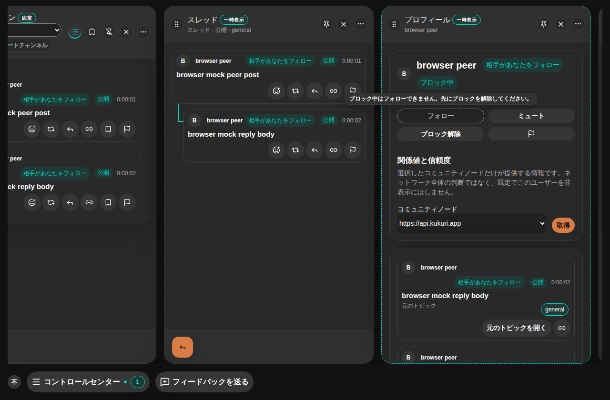
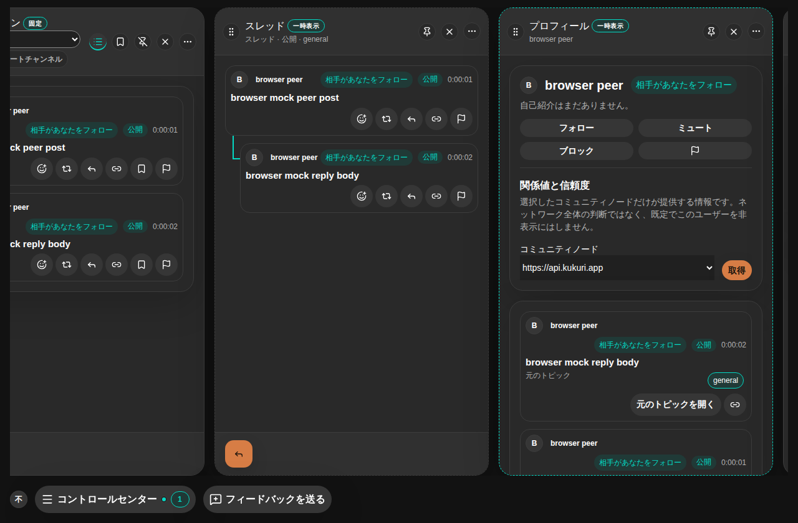

# #992 ブロック中のプロフィールのフォロー／メッセージ操作

## 現在判定

- Scope revision: `2026-09-13-992-v2`（v1 の「無効＋常時表示の理由文」を、ユーザー判断で「無効＋tooltip の理由」に変更。DM の「メッセージ」もブロックで無効化する入口として同じ Issue で扱い、ブロック中の「フォロー解除」は残す）。
- 基準 commit: `b6e249f`。
- リスク区分: B。UI の表示・操作条件だけを変え、`follow_author` / `block_author` / DM 送信の IPC・Rust・mock と guard は無変更。独立監査は不要（親 Issue・再 Open・shared guard に該当しない）。
- 状態: 実装・targeted validation 完了。PR の CI を確認後に merge する。
- [Issue #992](https://github.com/KingYoSun/kukuri/issues/992) の先頭に AC-1〜5 / INVAR-1〜4、INV-1〜4、TR-1〜5 を固定し、元の報告は末尾に当時の観測として保持した。

## 原因と変更

`AuthorDetailCard` のフォロー表示条件は「自分自身でないこと」だけで、`blocking` は Block / Unblock のラベル切替にしか使われていなかった。メッセージも `mutual` だけで表示され、バックエンドはブロック中でも follow を受け付けるため、「ブロック解除」と「フォロー」が同格に並んでいた。関係一覧の行メニューとフォロワータブの主操作にも同じ「フォロー」入口があった。

- `components/core/BlockedActionTooltip.tsx` を追加。子ボタンを `aria-disabled` と `aria-describedby` 付きで複製し、click を no-op にして、理由を hover / focus の tooltip（Radix Tooltip）と `sr-only` の accessible description で示す。native `disabled` にせず focus 可能なままにし、keyboard でも理由へ届く。
- `AuthorDetailCard`: `blocking && !following` でフォローを、`blocking` でメッセージを上記で包む。見出しに「ブロック中」バッジ（`common:relationships.blocking`）を追加。フォロー解除・ミュート・ブロック解除・通報は従来どおり。
- `ProfileConnectionsPanel`: `blocking && !following` の行は主操作の「フォロー」を同じ tooltip 付きで無効にし、行メニューの「フォロー」項目を `disabled` にする。Unblock / Mute は残す。
- `styles/base.css` に `.button.button-blocked-action[aria-disabled='true']`（中立背景・破線境界・`not-allowed`）を追加。年齢申告 gate の無効ボタンと同じ見た目の規則。`ProfileRefreshButton` の pending 用 `aria-disabled` と混ざらないよう専用 class に限定する。
- `common.json`（ja / en / zh-CN）に `relationships.blocking` / `blockedFollowReason` / `blockedMessageReason` を追加。
- Storybook: `AuthorDetailCard` の `Blocked` / `BlockedWhileFollowing`、`ProfileConnectionsPanel` の `BlockedFollower`。
- ADR 0022 に決定を追記。

## 修正前の再現

- `AuthorDetailCard.test.tsx` 2 件、`ProfileConnectionsPanel.test.tsx` 1 件、`DesktopShellPage.socialGraph.test.tsx` 2 件を先に追加し、5 件が red（フォロー／メッセージが `aria-disabled` でなく、バッジも tooltip も無い）であることを確認した。修正後は同じ 5 件と既存 test が green。
- 変更前後の画像（ja、dark、1280×840、browser mock、`browser peer` をブロックしてフォロー解除した状態で作者詳細を開く）:

## AC / INVAR の証跡

| 条件 | 実装・test / evidence |
| --- | --- |
| AC-1 | `AuthorDetailCard` の `withBlockedReason(followBlocked, …)`。`blocked author keeps follow and message disabled with a tooltip reason`（`aria-disabled`、accessible description、click no-op、hover / focus で tooltip）、`blocked-profile.spec.ts`（実 pointer / keyboard、1280 / 390px、tooltip が viewport 内） |
| AC-2 | 見出しの `relationships.blocking` バッジ。同上の test と `author detail keeps follow disabled while blocked and restores it right after unblock` |
| AC-3 | `withBlockedReason(blocking, …)` のメッセージ。`author detail keeps message disabled while a mutual follow is blocked`（hash が `#/messages` にならない）、`blocked mutual peer keeps message disabled while unfollow stays enabled` |
| AC-4 | `handleBlockAction` が `selectedAuthor` を差し替える既存経路。上記 shell test 2 件で Unblock 直後に有効化し、`followAuthor` が 1 回呼ばれる／DM が開く |
| AC-5 | `ProfileConnectionsPanel` の `followBlocked`。`blocked rows disable follow beside the user information and in the row menu` |
| INVAR-1 | `blocked author who is still followed keeps unfollow enabled without a reason`、shell test の Unfollow / Unblock、既存の通報ダイアログ test |
| INVAR-2 | 既存 `AuthorDetailCard` / `ProfileConnectionsPanel` / socialGraph / profile / messages test を無変更で維持、`profile-density.spec.ts` 成功 |
| INVAR-3 | `git diff` に Rust / mock / API 差分なし。`followAuthor` spy と hash の不変を test で確認 |
| INVAR-4 | 既存 `the local author row never offers block` と `showFollowAction` の自分自身判定を維持 |

## inventory / transition 確認

| 対象 | 入口・caller 確認 |
| --- | --- |
| INV-1 / INV-2 | `AuthorDetailCard` の本番 caller は `DesktopShellAuxiliaryPanels` のみ。`onToggleRelationship` / `onOpenDirectMessage` は `handleRelationshipAction` / `openDirectMessagePane` に直結し、sink は `followAuthor` / DM pane 起動 |
| INV-3 | `ProfileConnectionsPanel` の本番 caller は `DesktopShellPrimaryWorkspace` のみ。`rg onToggleRelationship` の全 caller は上記 2 component |
| INV-4 | `handleBlockAction` と `socialBlockApi` は無変更（`git diff`） |

TR-1〜4 は上記 Vitest と `blocked-profile.spec.ts`、TR-5（Unblock 失敗）は既存の `authorError` 経路で、無効化条件は `selectedAuthor` が変わらない限り維持される。

## 検証結果

| 検証 | 結果 |
| --- | --- |
| `pnpm lint` / `pnpm typecheck` | 成功 |
| Vitest targeted（7 ファイル + i18n + styles） | 252 passed |
| `pnpm test`（全体 Vitest） | 187 files / 1635 tests passed |
| `pnpm storybook:build` | 成功 |
| Playwright browser（`blocked-profile.spec.ts` 3 件、`profile-density.spec.ts` 3 件） | 6 passed。環境の Chromium build が pin と異なるため、`PLAYWRIGHT_BROWSERS_PATH` に既存 build への symlink を置いて実行 |
| Playwright browser（chromium project 全体） | 279 passed |
| 視覚回帰（`CI=1` で baseline 比較） | 36 件中 24 passed / 12 failed。失敗はすべて日本語・中国語を含む画像で、`fonts-noto-cjk` が無い環境の glyph 差（diff 画像に layout 差なし）。`author pane wide dark` と `compact profile connections en light` を含む英語画像は baseline 内。baseline は更新せず CI の `linux-desktop-browser` で確認する |
| `git diff --check` / `cargo xtask oversized-files` | 成功 |

## UI 証跡と確認の限界

- 変更分類: 既存画面の改善。対象利用者は迷惑ユーザーをブロックした利用者。単一目的は「ブロック中の関係操作の状態理解」。主要操作はブロック解除 → フォロー／メッセージ。非目標はブロック時の自動フォロー解除、`blocked_by` の表示、Messages Column の既存会話、API・guard の変更。
- 維持する挙動: Unfollow / Mute / Unblock / Report、通報ダイアログのローカル操作、hash route、focus（tooltip は focus を奪わない）。
- 対象 platform / state: browser（Linux Chromium）、1280 / 390px、dark、ja（Vitest は en）、blocking × following × mutual の組合せ、自分自身。
- Accessibility: `aria-disabled` + `aria-describedby`（sr-only）で状態と理由を公開。keyboard の focus だけで tooltip が開くことを実操作で確認。Escape は shell の detail pane 閉鎖と競合するため、tooltip は blur / pointer 離脱で閉じる。
- 未確認: Tauri / WebView 実機（Linux / Windows）での tooltip 表示と screen reader の読み上げ、CJK フォントのある環境での視覚 baseline（CI で確認）。
- CodeGraph の CLI / MCP はこの環境で利用できず、探索は `rg` とファイル読みで行った。
