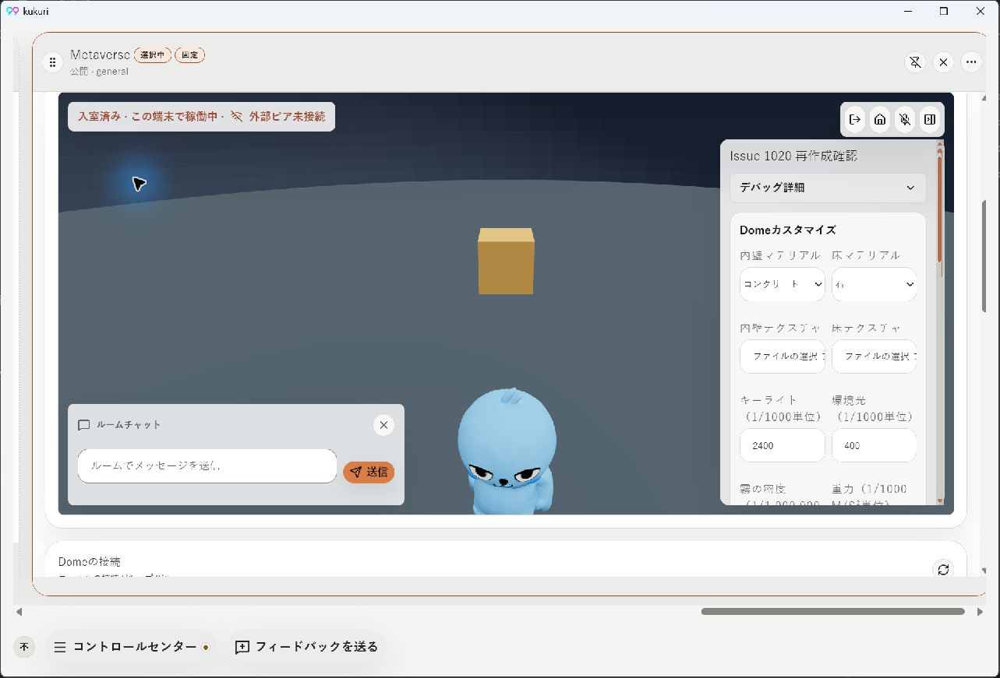
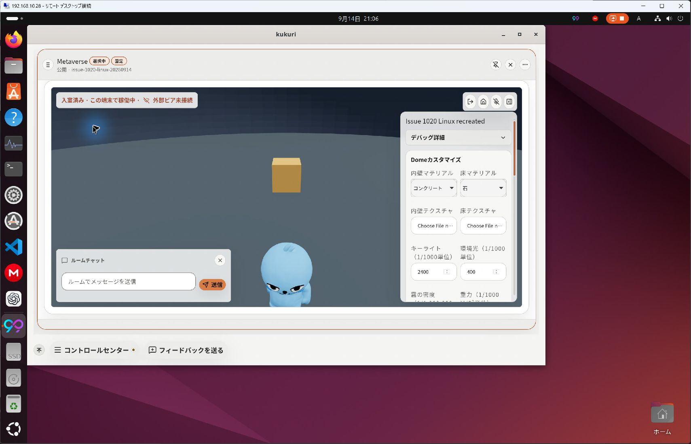
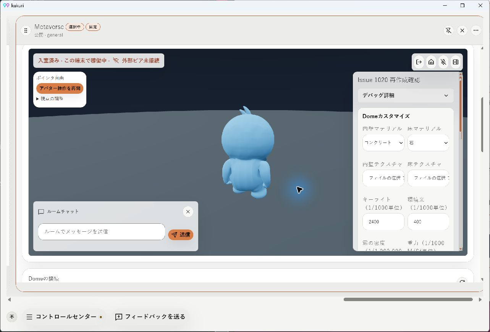
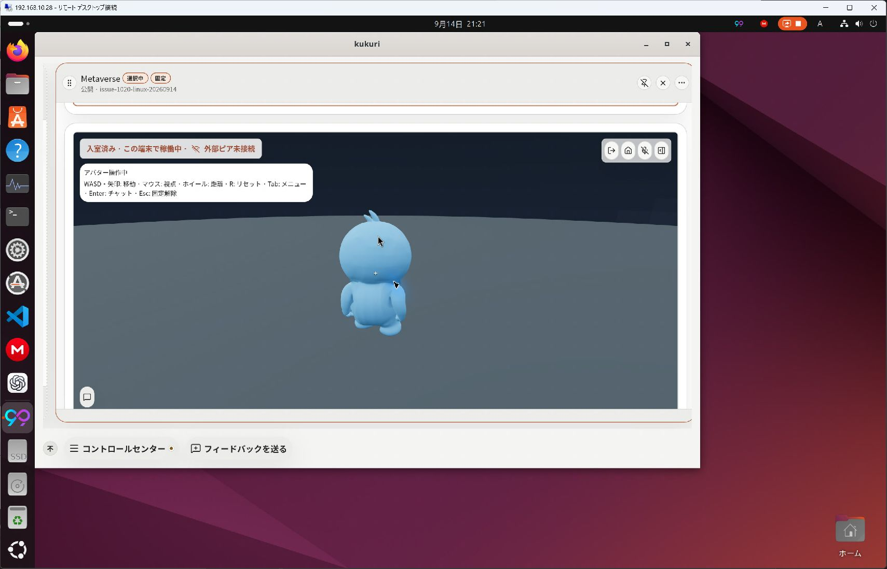
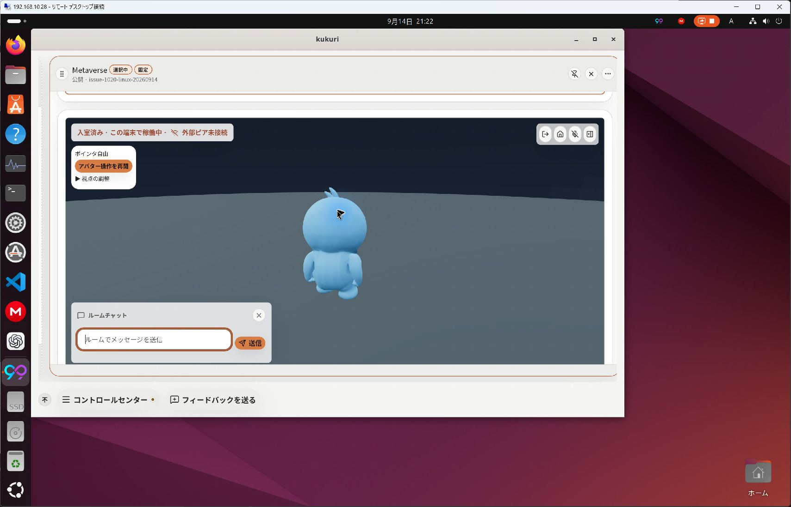

# #1021 アバター追従カメラと入力所有

## 状態と範囲

- 実装・対象検証の記録。最終headのCIとマージ判定は[PR #1027](https://github.com/KingYoSun/kukuri/pull/1027)を参照。
- Scope revision: `2026-09-14-r2`。基準commit: `77d4aec1eaf98139e219e70e7d7737ca4383b38a`。
- リスクB。cameraとMetaverse専用input ownerに閉じ、Column共通guard、IPC、host physics、admission、shared transformは変更しない。独立監査の必須条件には該当しない。
- 承認済み要求: アバター追従、drag不要の回転、Tab／EnterでUIと固定を切替、3D表示中央のclickで開始。「アバター操作」と「視点の調整」を区別する。
- 所属先はトピック／チャンネル。日本語のDome管理文言も、対象のDome・一覧・描画データを具体的に表すよう修正した。
- #1024はサークルメニュー・カテゴリ構成、#1023はfullscreen黒画面、#1022はColumn幅／scrollを所有する。今回それらの全完了をClose条件に追加しない。

## 修正前の再現

Windowsの現行Tauriをローカルで起動し、所有Domeを管理から稼働・入室。日本語light、1283×871、標準3列。初期cameraでは下半身が見切れ、canvas左dragで視点が変わらず、wheelはColumn本文をscrollした。Ubuntu24でもRemote Desktopから所有Domeへ入室し、同じ固定cameraと見切れを確認した。

修正前の`MetaverseRoomView.test.tsx`へ開始／reset導線の失敗testを追加し、1 failed / 6 passedを確認した。従来のScene mockだけでカメラ描画を保証しないよう、実Three cameraを使う投影・frame追従testと実Canvasのbrowser flowを追加した。

## 実装と固定inventory

| ID | 入口→helper→sink | guard／禁止副作用 | 条件・証拠 |
| --- | --- | --- | --- |
| INV-1 | mousemove／wheel／調整button／R→CameraModel、FollowCamera→Three camera | 自canvasの実固定＋enabled。camera-only、Ctrl／Meta wheelを奪わない | AC-1/2、CameraModel.test、FollowCamera.test |
| INV-2 | 中央click／再開／Tab／Enter／Escape／HUD callback→RoomView、useMetaverseSceneInput→Pointer LockとDOM focus | active／visible／suspend、IME・editable、UI markerで分離 | AC-1/3、RoomView.test、metaverse-camera.spec |
| INV-3 | blur／visibility／runtime／room切替／unmount／遅着→input hook→自canvas解除・request世代無効化 | 他Columnのlockを操作しない、自動再取得しない | INVAR-2、input hook.test |
| INV-4 | frame／spawn／handoff／VRMロード／resize→LocalAvatar group refとbounds→追従camera | 描画位置を読み取るだけ。assetロード時のprecise skinned boundsを利用 | AC-2、投影・frame test、実機画像 |
| INV-5 | 既存移動キー→LocalAvatar→session.handleLocalTransform→submitAuthoritativeInput→MetaverseRoomActions→DesktopApi | cameraからmove callbackへ接続しない。キー停止のみ補強し、physics／送信間隔を維持 | INVAR-1/2、Scene／session回帰、UI操作時のcallback spy |

caller確認はCodeGraphを先行し、未検出testをrgで補完した。変更対象sinkはcamera／Pointer Lock／focusだけ。Sceneの製品callerはRoomView、RoomViewはRoomPanelと直接story、RoomControlsはRoomViewのcallbackを使用する。ColumnSurfaceも読むColumnRuntimeContextは変更しない。sessionのprop interaction／transitionも使うhandleLocalTransformは変更しない。backend全sinkを監査済みとは扱わず、今回のcamera入力がDesktopApiへ達しない境界を検証した。inventory 5群、未分類0。

| 遷移 | 期待・検証 |
| --- | --- |
| TR-1 開始→回転→zoom→移動→reset | actual lock待ち、avatar追従と初期framing。model／frame／browser／実機 |
| TR-2 Tab／Enter→UI→閉じる | 自由pointer、UI focus、draft保持、IME無干渉。view／browser／両OS |
| TR-3 blur／非active／suspend→復帰 | 自owner解除、意図した再開だけ取得。hook／既存Column browser |
| TR-4 取得拒否／遅着 | unavailableと再試行、旧requestを解除。hook test |
| TR-5 resize／spawn／asset／handoff | bounds・aspect対応、現在の描画位置を追従。model／frame test |
| TR-6 キー押下→UI／別window | keys・jump要求を破棄し復帰時の固着を防ぐ。LocalAvatar cleanup、input lifecycle test |

## 実機証拠

Computer Useの`@oai/sky`でWindowsローカルとUbuntu24 Remote Desktopを操作した。Ubuntu24へのファイル反映・起動は`ssh local2`で行い、別ディレクトリ`/tmp/kukuri-1021`にfrontendを配置。既存backend executableを使用し、この変更ではbackend sourceを変更していない。

Windowsでは全身・足元、Pointer Lock取得、マウス移動による回転、wheel zoom、R reset、W移動、Tab解除／HUD、Escape復帰、Enterのchat focusを確認。Ubuntu24では変更前の見切れ、変更後の全身、中央clickで取得、Tab解除、Escapeのfocus復帰、Enterのchat focusを確認した。

## Validation

- camera／frame／input／viewの個別test: 初回の導線不足、room未表示での不要なdocument listenerを失敗testで確認して修正。投影・frame追従・lock lifecycle・UI往復を検証した。
- `metaverse-camera.spec.ts`: Chromiumの実Canvasで成功。idle時に安定するmodel-view uniformが、実マウス移動とwheelで変化することを観測した。camera操作によるmove API追加0件、W移動によるmove発生、Tab後の押下状態解消、中央click、draft保持も確認。テスト側だけでWebGL／mock APIを観測し、製品にdebug APIを追加していない。
- `cargo xtask check`: Rust／Tauri check、lint、typecheckを含め成功。後続testの型修正後もtypecheckを再確認。
- `cargo xtask test`: 初回は既存のSQLite削除でWindows共有違反が発生。該当test単独の再実行は成功し、全体の再実行では通常Rust 940件成功・4件skip、harness 23件成功、doctest成功。frontendは1679件成功・9件timeout（7ファイル）。その7ファイルを1 workerで再実行しても6件timeoutが残った。条件とassertionを緩和せず、今回と無関係なshell testのローカル時間超過として記録する。通常のCIではこれらを含むfrontend suiteが成功している。
- `cargo xtask desktop-ui-check`: ローカル一括実行は既存AccountKeyPanel／shell testのtimeoutで中断した。内訳のlint／typecheck、Storybook build、browser全318件、visual到達smoke全38件を確認。Windowsのvisual比較は既定でskipされるため、pixel比較成功とは扱わない。Linux CIのdesktop-ui／desktop-browserが正式な全体gate。
- `oversized-files`: 初回のCSS増加を専用`metaverse-camera.css`へ分け、baseline上限を増やさず成功。Windowsで実行中のxtask.exeをCargoが置換できない再実行は、同一sourceの既存xtask binaryから実行した。
- Storybookの5 input状態＋日本語／中国語×light／darkの9条件でaxe違反0。拡大・強制配色・reduced motionのbrowser表示も確認した。これはscreen reader実機操作の代替ではない。
- PRの初回headでは全11 checksが成功。最終差分のCI結果と追加の実機確認はPRへ集約し、過去headの成功だけでmergeしない。

## 実機確認の範囲と残る制約

Windowsの1列でも全身を確認できた。3列への復元でColumnが右へ残る既存の#1022は、横scrollで戻して確認を続けた。Windowsの2560×1440 fullscreenでは#1023の黒画面と操作停止を再現。Ubuntu24のfullscreenでは描画は残ったが、既存runtimeの非active／suspendに従って操作停止となる場合があった。通常表示への復帰を確認した。これらのfullscreen／Column位置の修正は本PRへ混ぜていない。

Ubuntu24 RDPではlock取得・解除、wheel zoom、Tab／Enter／Escapeを確認した。一方、Computer Useによる絶対座標の移動は、固定中に相対mousemoveとして届かず、同じ入力は解除後には届いた。利用者の追加確認では、RDP経由では回転せず、Ubuntu24実機を直接操作した場合は回転した。直接操作の成功とRDP経由の制約を区別する。

cameraは既存frame loop内の固定量の計算で、frameごとのReact／store更新やnetworkを追加しない。boundsの頂点計算はVRMロード時だけ行う。通常の追従・resetへ遅延補間を追加していないため、reduced motionでも直接応答する。定量的なGPU frame time比較、物理touch端末、実screen readerは未確認。

データ分類は[ADR 0050](../adr/0050-metaverse-camera-local-state.md)、UIの契約は[DESIGN](../../DESIGN.md)。カメラstateの保存・送信、カメラ衝突、新しい3D pickingは追加していない。

## CIで検出したテストの待機条件

最終差分のCIでは次の2件の待機条件不足を修正した。基準画像・許容差・製品挙動は変更していない。

- camera試験: DOM表示から250ms待つだけでは、負荷の高いCIで初回のidle座標通知が後から到着し、camera操作の副作用と誤判定した。入室前にAPIを観測し、初回idle通知を確認してから集計をクリアする。W移動後のUI切替も、停止を示すidle通知を待ってからkeyup後の禁止I/Oを確認する。
- 既存profile視覚試験: 一覧行の表示だけでは最低表示時間付きのloading Noticeが残る。翻訳resourceのloading文言が消えることを待って、従来と同じbaselineへ比較する。Ubuntu24／Chromium、CIモードで3条件のpixel比較が成功した。

camera試験は同じ条件で3回連続実行し、初回通知・実描画の回転／zoom・移動API分離を確認した。最終CIの結果はPR checksへ集約する。
