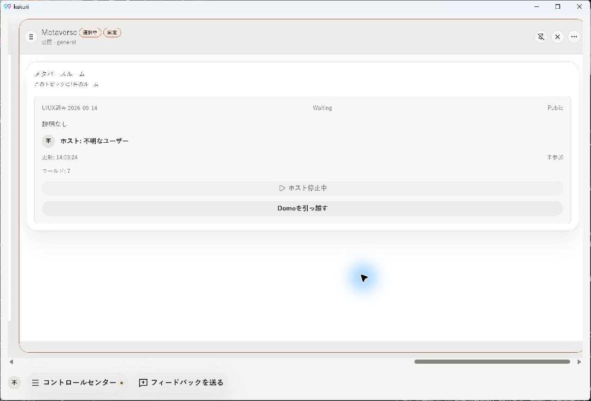
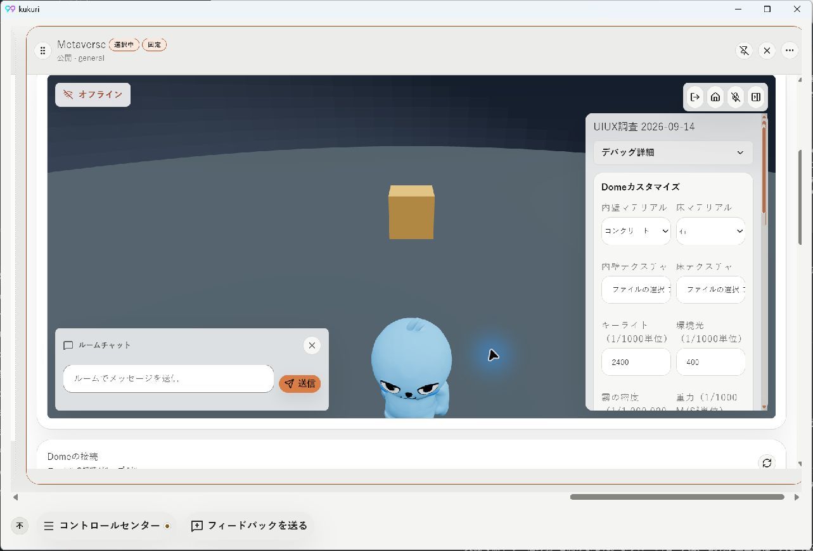

# Metaverse UI/UX 実機調査（2026-09-14）

## 対象と方法

- 依頼範囲: Computer Use による課題の洗い出し。実装修正・Issue起票・コミットは行っていない。
- 対象: root workspace、HEAD `64a1b472`、kukuri `0.2.3`、Dome world version `7`。
- Windows の Tauri/WebView 実機を `npx pnpm@10.16.1 tauri:dev` で起動し、Computer Use (`@oai/sky`) のクリック・ドラッグ・スクロール・キー入力で確認した。
- 条件: 日本語、既存のライトテーマ、通常ウィンドウ画像 1283×871、標準 Metaverse 幅3列。比較として1列幅、3列への復元、2560×1440の全画面を確認。
- `general` に確認用 Dome「UIUX調査 2026-09-14」を1件作成。この端末でホストを開始し、ローカルの入室と描画を確認。外部参加者なし、コミュニティノードへの移管・チャット送信・素材アップロードは未実施。
- 再起動は、開発サーバーの実行セッションを Ctrl+C で終了し、Kukuri プロセスが消えたことを確認してから同じコマンドで起動した。PID は `54720` → `19928`。トレイの Quit による終了は未確認であり、この試行の終了処理の完走までは保証しない。
- Alt+F4 はウィンドウを隠すだけで、同じプロセスが残った。これは再起動の再現試行には数えていない。
- 調査の補助として CodeGraph で実装を確認した。実機での観測とコード上の根拠を以下で区別する。

## 結果一覧

P1 は基本操作の行き止まり・操作不能、P2 は導線・理解・視認性の問題。番号は本調査内の識別子であり GitHub Issue 番号ではない。

| ID | 優先度 | 課題 | 確認結果・利用者への影響 |
| --- | --- | --- | --- |
| U01 | P1 | プロセス再起動後、所有 Dome を管理できない | 「ホスト停止中」で入室無効。ホスト設定・接続設定・作成ボタンが消失。カードクリックでも管理できず、右クリックは識別子コピーのみ。再開・削除・作り直しへ進めない。 |
| U02 | P1 | カメラを操作できない | 3Dキャンバスのドラッグで視点が変わらず、ホイールは外側の縦スクロールになる。視点を回転・ズーム・リセットする操作も確認したUIにない。 |
| U03 | P1 | 全画面へ切り替えると3D描画が黒くなる | カラムメニューの全画面表示後、HUDは残るがDome・アバター・物体が見えない。再観測とキャンバスクリックでも回復せず、Escapeで通常表示へ戻ると復帰した。 |
| U04 | P1 | 1列幅で操作部がカラムからはみ出す | HUDとチャットが右側で切れ、送信・閉じる・上部アイコンを一覧できない。カラム内の横スクロールも発生する。 |
| U05 | P2 | 標準3列幅でもフォームが横に伸びすぎる | ルームカード、入室、引っ越し、接続先、接続提案、ホスト操作が約1100px超の幅へ展開。少量の情報が左右に散り、関連する表示が離れる。 |
| U06 | P2 | 作成→ホスト開始→入室の順序と画面位置が一致しない | 作成直後は停止中。ホスト開始は四方向の縦長フォームより下。開始すると上側へ3D画面が挿入されるが、表示位置はホスト設定付近に残る。 |
| U07 | P2 | 接続方向と接続構造が空間として読めない | 北・東・南・西のフォームが同型で縦に並ぶ。3D画面内に接続編集がなく、接続図もない。グループ数と構成ハッシュ・接続件数では方角や経路がわからない。 |
| U08 | P2 | 初期HUDが空間を覆い、設定カテゴリへ直接移動できない | チャットと操作パネルが入室直後から開く。右パネルはDome設定・アバター・共有オブジェクトの縦スクロールで、アバター操作に至るまで設定の下へ進む必要がある。 |
| U09 | P2 | キーボードで会話・メニュー・空間操作を往復できない | Enterによるチャット表示と入力フォーカスは動作。Tabはサークルメニューを開かず、最初に退出ボタンへ移る。チャット入力中のEscapeは閉じる／空間への復帰にならない。 |
| U10 | P2 | 3列へ幅を戻すと右側が画面外に残る | 1列から3列に戻すと、選択カラムの左端が画面右側に残り、ヘッダーの操作部が見えなくなる。ワークスペースの横スクロールで復帰が必要。 |
| U11 | P2 | 接続状態と稼働状態の意味が不明瞭 | ローカルでホスト稼働・参加者1・3D表示が成立していても、HUDは「オフライン」。一覧には「Waiting」「Public」「参加済み」と「ルームに参加」が同居する。何が利用可能か読み分けにくい。 |
| U12 | P2 | 診断情報・内部単位・操作の重さが通常設定へ混在する | リース世代、長いセッションID、ノード識別子、物理上限等がホスト設定に並ぶ。照明・重力は1/1000等の内部単位。ホスト開始・移管・保存・オブジェクト削除が同じ幅のボタンで連続する。 |
| U13 | P2 | 初期視点でアバターの下半身が切れる | 標準幅で、前向きのアバターが画面下端に大きく寄り、全身を見られない。カメラ操作がないため利用者が調整できない。 |

## 重要な再現手順と証拠

### U01: 再起動後の復帰不能

1. 標準3列のMetaverseを開き、確認用Domeを作る。
2. 下部の「Domeホスティング」で「この端末で稼働を開始」を押す。
3. 参加者1と3D表示を確認する。
4. 開発実行セッションを停止し、プロセスの消失を確認する。
5. 同じ開発コマンド・データで再起動し、初回案内を「あとで」で閉じる。
6. 一覧の「ホスト停止中」が無効で、ホスト設定・新規作成が表示されない。
7. Domeカードをクリックしても管理画面は開かない。右クリックにはユーザーID／ハッシュのコピーだけがある。

期待する操作結果は、停止している所有Domeを選択して管理を開き、再開または明示的な削除を実行できること。所有者あたりの作成数制限がある場合も、その説明と既存Domeへの管理導線が必要。

[右クリックにも復帰・削除がない](assets/2026-09-14-metaverse-uiux/14-stopped-context-menu.png)

コード上の根拠:

- `apps/desktop/src/components/extended/metaverse/MetaverseRoomDiscovery.tsx:215`: 所有Domeが存在すると作成フォームを非表示にする。
- 同ファイル `:292`: active hostがなければ入室ボタンを無効にする。カード自体には管理対象を選ぶクリック処理がない。
- `apps/desktop/src/components/extended/MetaverseRoomPanel.tsx:304` / `:311`: 接続・ホスト設定は `session.selectedRoom` に依存する。
- `apps/desktop/src/components/extended/metaverse/DomeHostingPanel.tsx:89`: 対象roomがなければ表示しない。

観測と実装を合わせると、「所有Domeを管理対象として選ぶ」操作が「参加する」操作と分離されていないことが、UIの行き止まりを説明する。ホストが再起動後に停止状態となるバックエンド側の理由は、本調査では切り分けていない。

### U05・U06・U07・U12: フォームと開始導線

作成直後の上部には停止中のカードがあり、その下に四方向の接続フォームが続く。候補が0件でも同型の無効フォームが4つ並び、その先に初回参加に必要なホスト開始がある。未入室の利用者へ、次に必要な操作を案内する表示は確認できない。

[作成直後・標準3列](assets/2026-09-14-metaverse-uiux/01-created-three-columns.png) / [縦に並ぶ接続フォーム](assets/2026-09-14-metaverse-uiux/02-direction-forms.png) / [ホスト開始前](assets/2026-09-14-metaverse-uiux/03-hosting-before-start.png) / [開始後も下部が表示されたまま](assets/2026-09-14-metaverse-uiux/04-host-started-scene-out-of-view.png)

コード上も `MetaverseRoomPanel.tsx:258` から、3D画面→接続設定→ホスト設定の順に配置される。`DomeConnectionPanel.tsx:132` は四方向のフォームを順に描画し、`:253` の構成表示はハッシュと件数である。

期待する構成は、入室・ホスト開始の主操作が迷わず見つかり、ホスト開始の結果として利用可能になった空間へ自然に移れること。ユーザー指定の接続UIは、3D画面から開く方位選択と、確認できた範囲の接続マップを同じ操作文脈に置く。

### U02・U08・U09・U13: 3Dと入力

初期表示は、3D領域がおよそ1150×540px、右設定パネルがおよそ285px幅、左下チャットがおよそ430×130px。画面内のHUDは閉じられるが、入室直後は両方開く。パネル内にさらにスクロールがあり、Domeカスタマイズの下にアバターと共有オブジェクト操作が埋まる。

[設定パネル下部](assets/2026-09-14-metaverse-uiux/08-nested-settings-bottom.png) / [Tabで退出ボタンにフォーカス](assets/2026-09-14-metaverse-uiux/06-tab-focuses-leave.png) / [Enterによるチャット表示は動作](assets/2026-09-14-metaverse-uiux/07-enter-opens-chat.png)

入力試行:

- キャンバスの左ドラッグ: 床・物体に対する視点変化なし。
- キャンバス上のホイール: カラム本文の縦スクロール。
- キャンバスフォーカス後のTab: 「ルームから退出」にフォーカス。サークルメニューは出ない。
- チャットを閉じ、キャンバスをクリックしてEnter: チャットが開き、入力欄がフォーカスされる。
- その入力欄でEscape: チャットが開いたまま。送信試行は行っていない。

コード上の根拠:

- `MetaverseRoomView.tsx:119` / `:121`: HUDとチャットの初期値はともにtrue。
- 同ファイル `:151`: Enterでチャットを開く処理は存在する。
- `MetaverseScene.tsx:790` / `:934`: カメラは固定位置と初期lookAtで設定される。確認したsceneコードに視点回転・ズームの入力処理はない。

ユーザー指定の操作設計は、通常時に空間を主役とし、Enterでチャットと入力欄、Tabでサークル状のカテゴリ選択、各詳細からタブで別カテゴリへ移る構成。実装時はEscapeの戻り先と、設定・会話中の移動入力停止／閉じた後のフォーカス復帰まで定義する必要がある。

### U03: 全画面の描画と高さ

入室中にヘッダーのメニューから「Metaverseを全画面表示」を選ぶ。2560×1440では3D領域が横長の約540px高のままで、下側を接続フォームが占める。3D領域は黒くなり、設定とチャットだけが残る。別の時点で再観測し、キャンバスをクリックしても同じ。Escapeで通常ウィンドウへ戻るとDome・アバター・物体が再描画された。

[全画面時の黒い3D領域](assets/2026-09-14-metaverse-uiux/11-fullscreen-black-scene.png) / [Escape後の描画復帰](assets/2026-09-14-metaverse-uiux/12-fullscreen-exit-restores-scene.png)

期待する結果は、全画面で空間を広く操作でき、描画と入室状態が維持されること。黒画面の原因がWebViewの描画・visibility/suspension・fullscreen処理のどこにあるかは未確定。

### U04・U10: カラム幅変更

ヘッダーメニューで1列分へ変更すると、カラム内に横スクロールが現れ、チャットとHUDが右端で切れる。同メニューで3列分へ戻した後は、カラムの左端が画面右側に残った。外側の横スクロールで全体を戻せた。

[1列幅での切れ・重なり](assets/2026-09-14-metaverse-uiux/09-one-column-overflow.png) / [3列へ復元後の画面外へのはみ出し](assets/2026-09-14-metaverse-uiux/10-width-restored-offscreen.png)

## ユーザー指摘7項目との対応

| 指摘 | 調査結果 |
| --- | --- |
| デフォルト3列幅に合わないコンポーネント | 確認。U05。追加で1列幅では実際のclippingも確認（U04）。 |
| 再起動後に再参加・削除・新規作成できない | プロセス停止→再起動で確認。U01。トレイQuitによる終了は未確認。 |
| 3D内で四方向の接続操作・接続マップが必要 | 現状が縦フォーム、3D外、図なしであることを確認。U07。複数Domeの実際の提案・承諾・通行は未確認。 |
| ホスト設定が下にあり、開始後の3Dが上に開く | 確認。U06。開始後もホスト設定付近が表示されたまま。 |
| カメラ操作不能 | ドラッグとホイールで確認。U02。固定カメラの実装も確認。 |
| 常設UI、Enterチャット、Tabサークル＋詳細タブ | 常設UIとカテゴリ導線不足を確認。U08・U09。Enterで開いて入力する部分は既に動作する。 |
| デフォルトアバターのマテリアルが無効 | 未確定。今回の画面では青い本体、白黒の目、陰影が描画され、モデルもアニメーションしていた。元モデルの期待する見た目との比較やshader/textureの適用状態は未確認で、「正しく描画できている」とも断定しない。初期視点で全身が切れる問題は別途確認（U13）。 |

## 優先して解消する順序

1. U01: 入室の成否に依存しない所有Domeの管理・再開・削除導線。停止中の理由と次の操作を示す。
2. U02・U03・U04: カメラ、全画面描画、狭幅での基本操作を成立させる。
3. U06・U08・U09: 作成／ホスト開始／入室の導線、空間中心のHUD、会話と設定からの復帰を一体で設計する。
4. U07: 同じ空間内のメニューに方位選択と接続マップを組み込み、未取得範囲と確認済み範囲を区別する。
5. U05・U10・U11・U12・U13: 幅とフォーカス、状態文言、診断情報の配置、初期視点を整える。アバター材質は期待画像・モデルの元設定との比較で別途確定する。

仕様照合は `DESIGN.md` の情報階層、状態継続、カラム実幅への応答、入力・fullscreen契約と、`docs/adr/0014-uiux-dev-flow.md` を使用した。上記の設計案は今回の変更要求に対する方向性であり、実装済みの仕様としてDESIGNへ追記していない。

## 未確認範囲・調査後の状態

- ダークテーマ、200% zoom、スクリーンリーダー、タッチ、別OS、別GPU、配布版での再現は未確認。
- 複数参加者、遠隔ホスト、接続提案・承諾、実際のDome間移動、音声、素材アップロード、削除実行は未確認。
- マイクの許可、コミュニティノードの同意・移管等を変更していない。
- 自動回帰テストは実行していない。今回は修正前の実機調査であり、ビルド成功と操作観測を証拠とする。
- 確認用Domeは再起動後の停止状態で保持。アプリは標準3列幅の一覧を表示した状態で残した。
- 保存物はこの報告と14枚のComputer Use画面画像。実装コードの変更はない。

## 後続のIssue起票（2026-09-14）

調査後のユーザー依頼により、アバターマテリアル無効を除き、判明した13件を6件のIssueへ統合した。上記は調査時点の記録として維持する。

| Issue | 所有する課題 | 範囲 |
| --- | --- | --- |
| [#1020](https://github.com/KingYoSun/kukuri/issues/1020) | U01・U06・U11 | Domeの作成・稼働・再起動後の管理と状態表示 |
| [#1021](https://github.com/KingYoSun/kukuri/issues/1021) | U02・U13 | カメラ操作・初期視点 |
| [#1022](https://github.com/KingYoSun/kukuri/issues/1022) | U04・U05・U10 | カラム幅・フォーム幅・幅変更後の表示位置 |
| [#1023](https://github.com/KingYoSun/kukuri/issues/1023) | U03 | 全画面の黒画面と3D領域の高さ |
| [#1024](https://github.com/KingYoSun/kukuri/issues/1024) | U08・U09・U12 | HUD・Enter/Tab/Escape・カテゴリ別設定・診断配置 |
| [#1025](https://github.com/KingYoSun/kukuri/issues/1025) | U07 | 3D内の方位接続操作と確認済み接続マップ |

起票時のOpen Issueは0件で、重複するOpen Issueはなかった。過去の関連Issueを参照として記載し、今回は新しいUI要件と実機観測を上記で追跡する。各IssueはPlannedで、リスク区分、固定AC/INVAR、inventory、状態遷移、検証と責務境界を記載した。実装は開始していない。

報告・画像は未コミットであり、GitHub本文には再現手順・観測結果・証拠ファイル名を記載した。画像自体のGitHub添付は行っていない。
