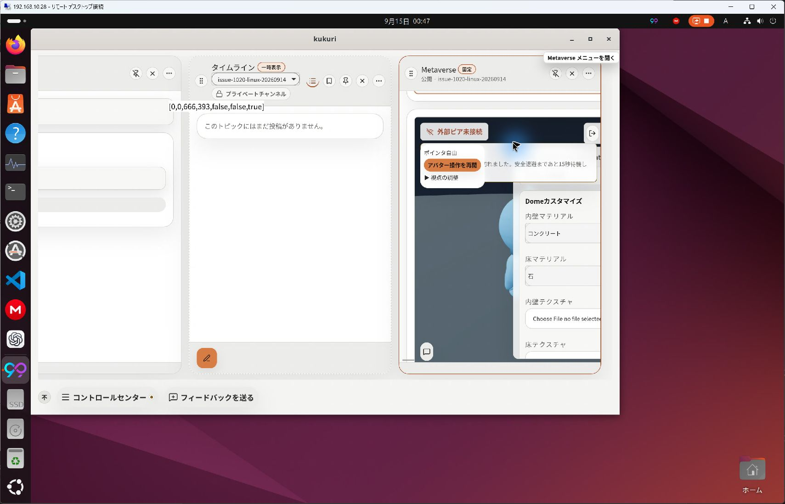
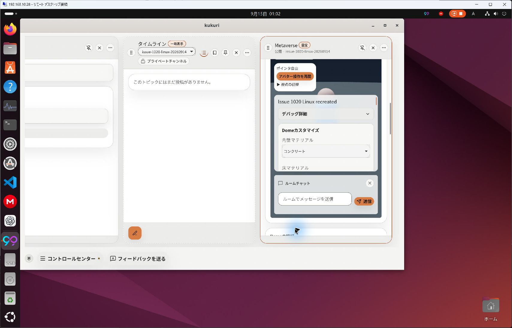
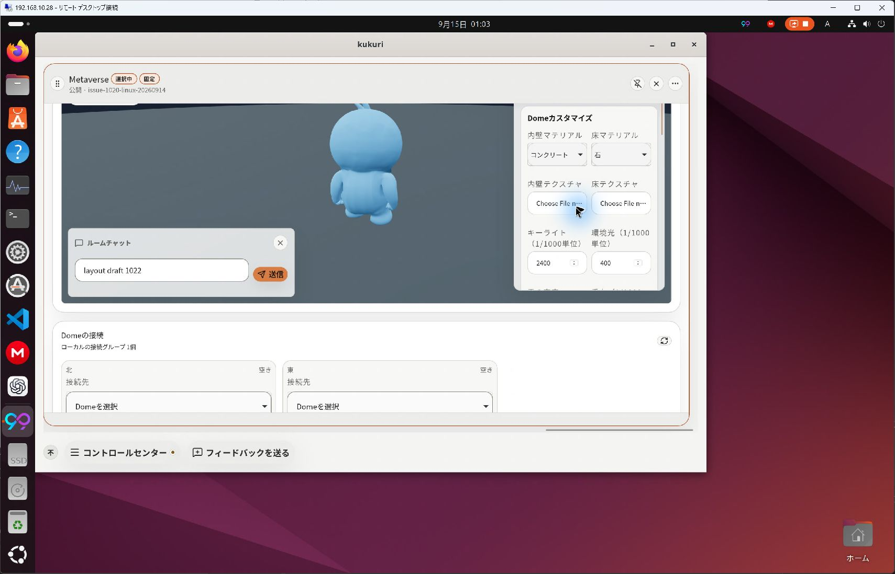
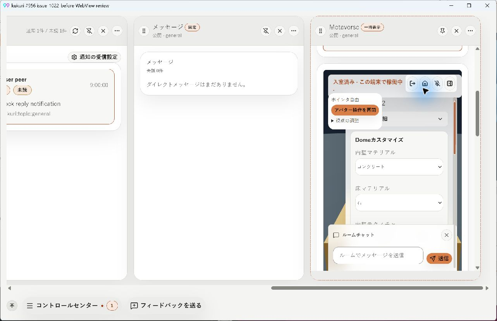
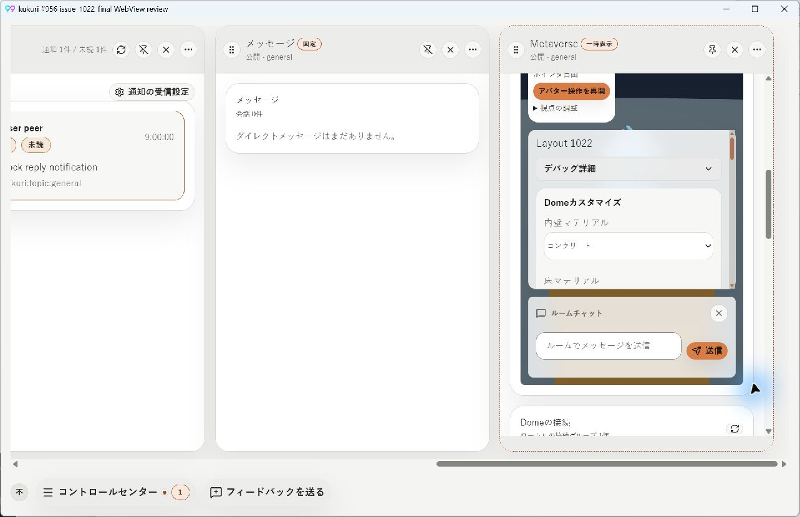
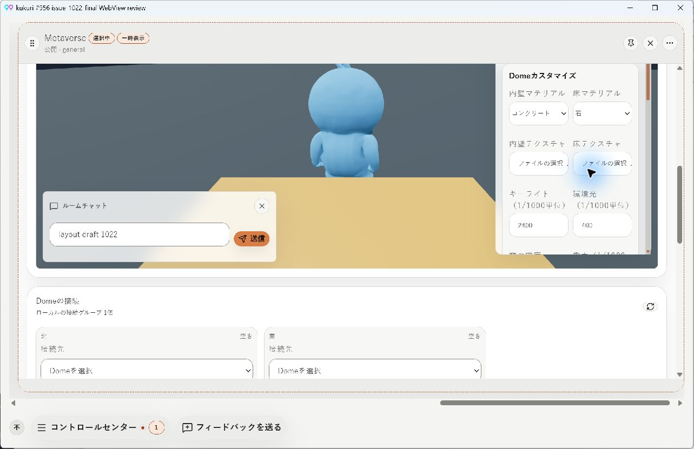

# #1022 Metaverseの実幅と表示位置

## 範囲

- Issue: #1022、Scope revision `2026-09-14-r1`、リスクB。
- 基準commit: `24e93670ee1350d4fdc7234a423e2cad5a1dcc0b`。#1020の所有Dome管理と#1021のcamera／入力契約を保持する。
- 承認された案B: 同じDOMを実カラム幅で再配置し、表示中のactive Columnのspan変更だけを追従する。
- カメラ、fullscreen黒画面、HUDカテゴリ、接続protocol、admission、永続Dome設定は変更しない。
- [UI採用記録](../ui-reviews/2026-09-15-1022-metaverse-layout.md)、[Issue](https://github.com/KingYoSun/kukuri/issues/1022)を正本への入口とする。

## 修正前と変更内容

修正前のPlaywrightで、1列の本文横overflowが319px、`.metaverse-panel`が741pxまで拡大することを確認した。1→3列では次のclick前にheader操作部がCanvas外へ残った。両方を失敗testとして確認し、同じ検査が修正後に成功した。

`metaverse-layout.css`でgridの最小幅を0へ制約し、フォーム／管理40rem、カード24rem、作成人数8remの上限を定義した。接続slotは実幅で1/2列、HUD/chatは狭幅で縦配置とする。上部操作、回復案内、camera、resource縮退表示も独立した領域へ置く。DOM key、開閉状態、draft、action callbackは変更しない。

`ColumnCanvas`はCanvas自身に加えてactive Columnの幅を監視する。変更前の可視性を保持し、spanだけの変更では最小の水平補正を行う。高さだけの通知、手動離脱、drag中では補正しない。寸法変更とobserver通知の間に手動入力が入った場合も古い補正を無効化する。focusや本文の縦scrollを補正のために変更しない。

狭幅HUDの内部scroll面ではtouch-actionをpan-yにし、縦scrollを保ったままCanvasへの横pagingを防ぐ。既存のmobile試験は、stage全高の中心ではなく表示中の交差領域を触るようにし、touch開始点がMetaverse配下であることも検査する。

## 条件・inventory・状態遷移

| 条件 | 対象入口→処理 | 保持する境界 | 検証 |
| --- | --- | --- | --- |
| AC-1/2、INV-1a | Discovery／Connection／Hosting／Customization→CSS grid | 既存の作成・移動・設定actionとdraft | `wide forms use the adopted bounds...`、1/2/3/4列、320〜1283px、実機before/after |
| AC-1/4、INV-1b | RoomView／RoomControls／CameraControls→HUD/chat grid | 同じscene DOM、入力所有、chat／設定draft | `layout and operation continuity`、ja/en/zh-CN×light/dark、hit test、camera／immersive回帰 |
| AC-1/2/4、INV-1c | RoomPanel／DomeManagementPanel／PendingDomeDeletions→管理group sizing | 管理・削除確認・cleanupの意味とguard | 管理component既存tests、Windows管理面before、browser所有Dome操作回帰 |
| AC-3/4、INV-2a | ColumnMenu→ColumnSurface→Workspace→setColumnSpan→Canvas resize | span保存以外のproduct stateを変更しない | `span expansion reveals...`、`ColumnCanvas.resize.test.tsx` |
| INVAR-1、INV-2b | 保存幅復元／viewport／scroll／mobile境界→Canvas | 手動位置・active／visible分離・既存layout schema | `manual departure...`、`column-resize-context.spec.ts`、mobile touch試験 |
| INVAR-2 | MetaverseRoomActions→shell/actions/metaverse→DesktopApi | resize起因のcreate/update/hosting/delete/chat/layout/connection mutationを0回に保つ | browser API spy。既存`presence_join` heartbeatは除外し、scene DOMの接続継続とdraft不変を別途検査 |

TR-1の3→1→2→3と同時HUD/chat、TR-2の表示中追従／手動離脱を上表で確認する。既存pollingを止めて成功扱いにせず、heartbeatと利用者mutationを区別する。reloadをまたいだ未保存Metaverse draftの永続化は追加要件にしない。

探索はCodeGraph先行で行い、実ファイルとtestsを照合した。Canvasの本番callerはDesktopShellColumnWorkspace、確認面はColumnCanvas stories／tests。全kind（timeline、notifications、thread、profile、explore、messages、conversation、stream、game、metaverse）に適用される共有補正の回帰をbrowser suiteで確認する。Metaverseの本番component callerはRoomPanel／RoomView、直接storyも同じCSSを使う。新しいdomain guardやbackend sinkは追加していない。backend全経路の独立監査済みとは主張しない。

## 実機確認

Computer Useの`@oai/sky`でWindowsローカルとUbuntu24 Remote Desktopを操作した。Ubuntu24へのsource反映と自動検証は`ssh local2`で実施した。

- Ubuntu24: 実際のowner-hosted Domeへ入室。1列でHUD/chat/送信/閉じるが収まり、1→3列でheader操作部が表示内へ戻り、`layout draft 1022`と入室状態が継続した。
- Windows: 元の開発profileで修正前の管理面と過伸長を確認したが、再起動後の既存roomでdocs-syncのclosed channelエラーがあり、安定した比較用sessionを作れなかった。表示と入力の比較は、既存Tauri review host＋本番frontend＋mock DesktopApiの隔離WebView2 fixtureで実施した。1280×800 client相当、日本語light、1列のHUD/chat分離、送信／閉じるへの到達、1→3列のheader位置補正と`layout draft 1022`保持を確認した。これは実WebView描画の検証であり、Windowsの実network／admissionの成功証明とは区別する。
- 隔離hostのタイトルにある#956は再利用したreview executableの固定名。今回のfixtureとsourceは#1022用である。実機画像の元資料として9月14日の未追跡報告は変更・同梱していない。

[Windowsフォーム before](assets/2026-09-15-1022-layout/windows-fixture-before-form.png) / [after](assets/2026-09-15-1022-layout/windows-after-form.png) / [管理と接続group after](assets/2026-09-15-1022-layout/windows-after-wide.png)

## 検証状況

- `cargo xtask check`: 成功。
- 対象component／Canvas: 21 files、160 tests成功。追加resize単体3件も成功。
- 新規browser: Ubuntu24で状態継続・副作用9件成功、フォーム上限／reflow1件成功。既存Explore／immersive／camera回帰は20件成功し、狭幅HUDのtouch修正後に残るmobile試験も成功。
- `cargo xtask test`: non-CN Rust 940件成功（4件skip）、harness23件とdoctests成功。frontendは1687件成功・無関係なshell統合5件失敗。CIを全体gateとして補完する。
- `cargo xtask desktop-ui-check`: Windowsでは実行中xtask.exeの置換に失敗したため、同一sourceから構築した`target/debug/xtask.exe desktop-ui-check`へ切替。lint／typecheck成功、Vitestは1687件成功・shell統合5件timeout。該当3ファイル再試験で20件成功・topics2件timeout（同じassertionの緩和はしない）。Storybook build成功。Ubuntu24で最終sourceをbuildし、browser全328件成功。
- Storybook: 通常／狭幅／offline／closed×light/darkの8条件でaxe違反0。これは実screen reader検証の代替とはしない。
- Linux visual: 38件中37件成功。開発者設定ja/darkのログ行・focus outline差分1件は基準commitでも再現し、今回のCSS対象外。既存baselineを無条件更新せず、CIの判定と分けて記録する。
- 独立監査: 通常B、共有domain guard変更なし、Reopenでもないため必須条件には該当しない。
- 未確認: 実screen reader、物理touch端末、定量GPU計測、Windows実runtimeの長時間通信。fullscreen黒画面は#1023の範囲。

[PR #1028](https://github.com/KingYoSun/kukuri/pull/1028)の最終headのCI成功とマージ後の対象一致を確認してからCompleteにする。ローカルの全体suite失敗を成功とは扱わない。

## CIで確認した試験粒度の調整

`f9e059ff`のCIではUI suiteは成功した。browserは327件成功し、中国語lightの3幅連続試験1件が最後の副作用確認時に60秒上限へ到達した。他の5言語/theme条件も56〜59秒であり、個別assertionの失敗ではなく1ケースに3幅分の操作到達確認をまとめた実行時間の問題だった。

言語/theme別の試験を幅ごとに分け、3→1、3→2、1→3の各変更でchat／設定draft、scene DOM、全操作のhit test、禁止mutationを検査する。別の3→1→2→3連続試験は残し、assertionとtimeoutは緩和していない。Ubuntu24で分割後の対象22件が成功し、個別の状態継続試験は約9〜12秒になった。lint／typecheckも成功。製品コード・採用寸法・実機確認対象への変更はない。最終CIはPR checksへ集約する。
