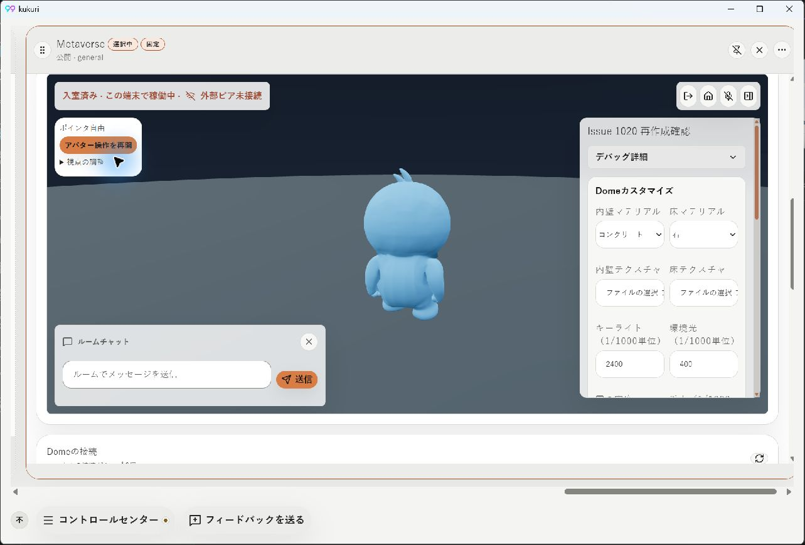
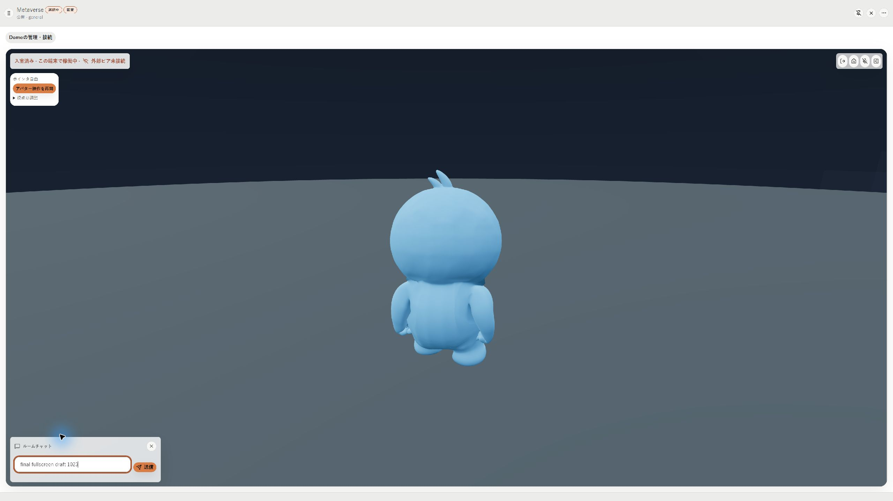
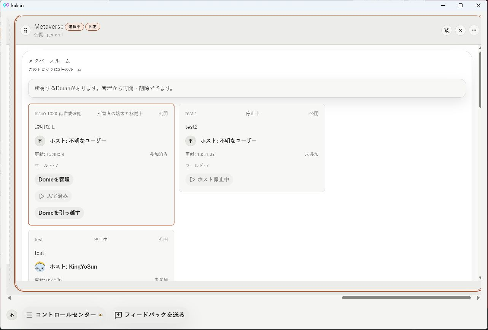
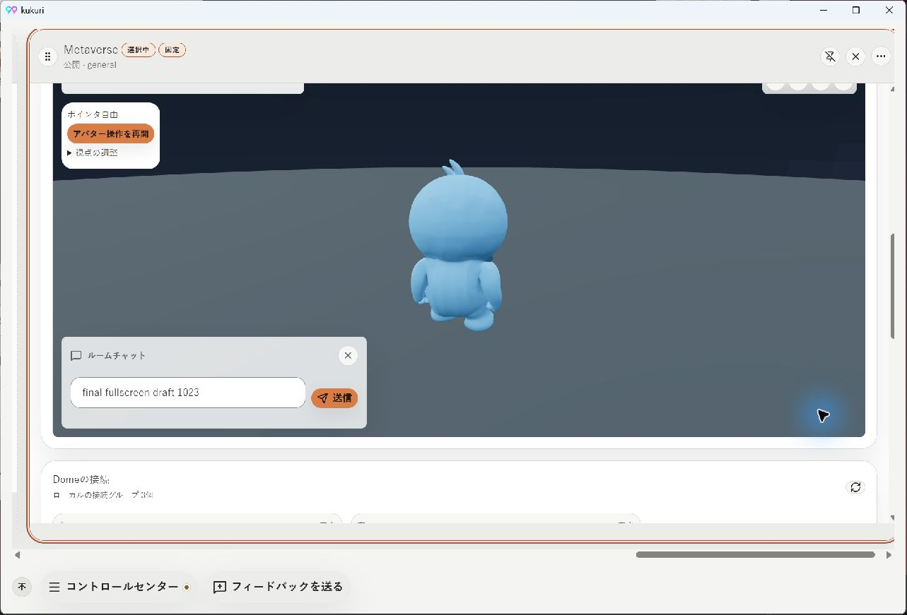
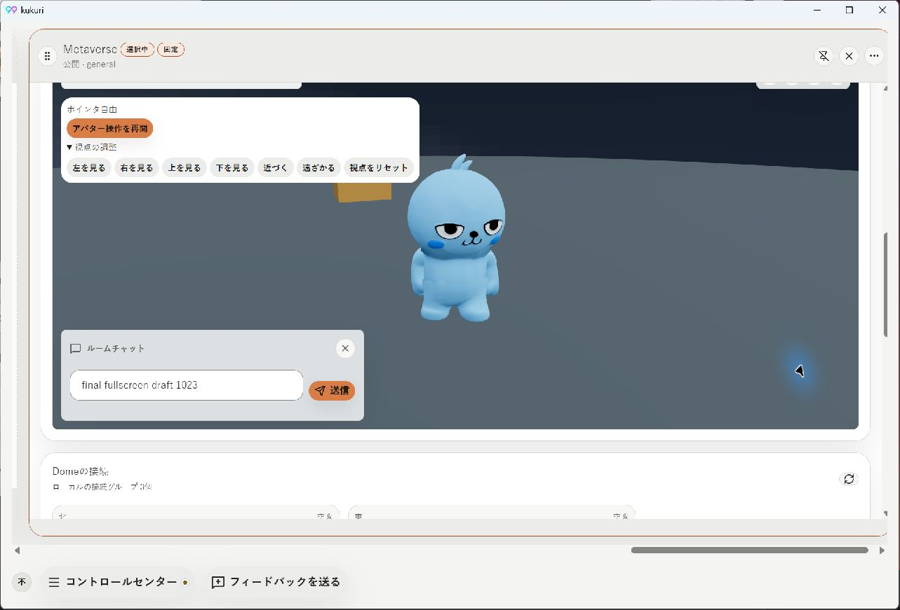
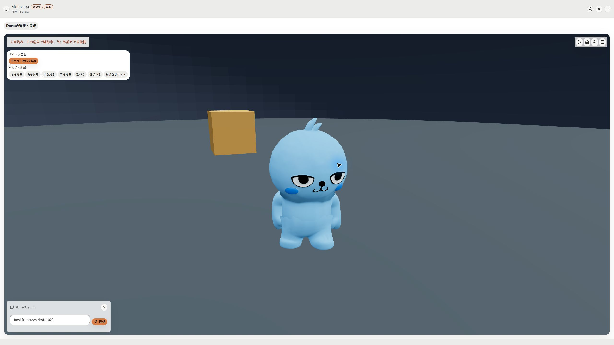
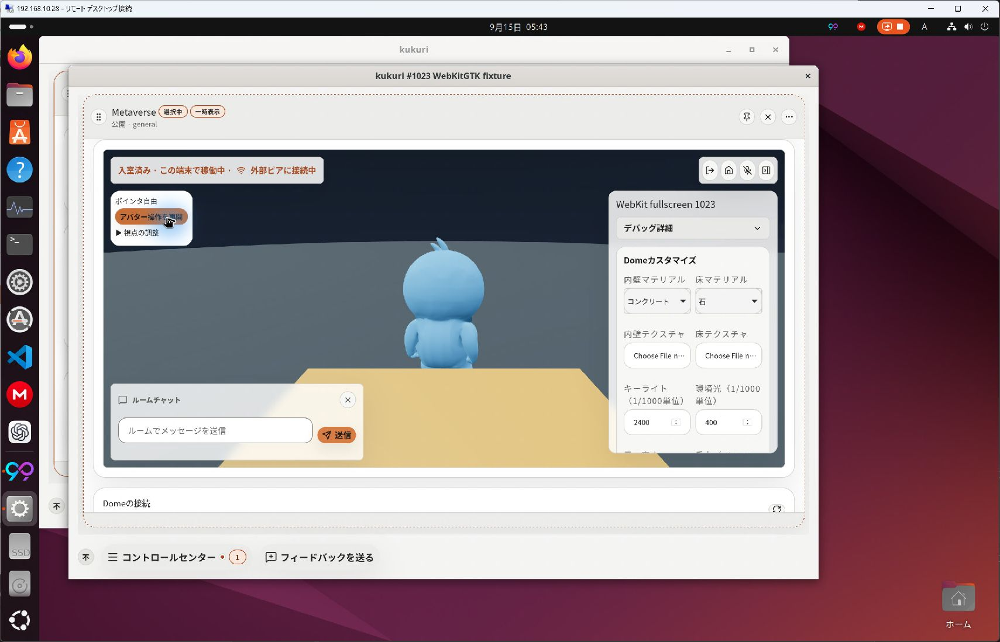
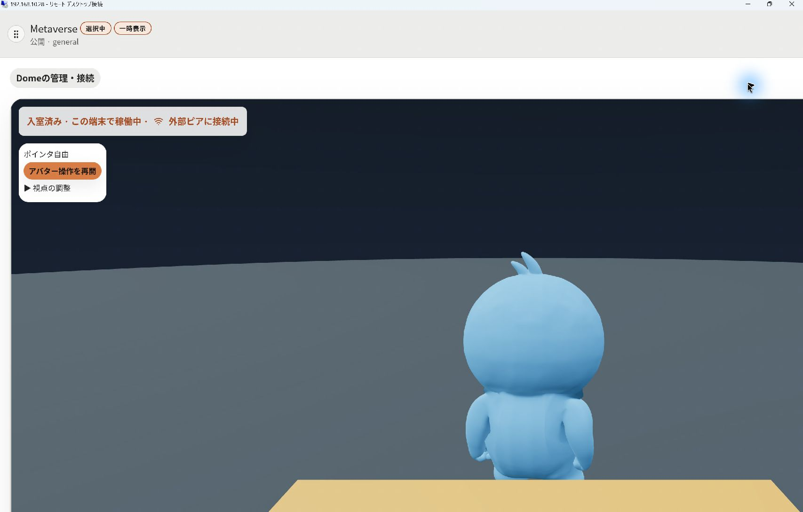

# #1023 Metaverse全画面の描画・高さ・文脈保持

- Issue: [#1023](https://github.com/KingYoSun/kukuri/issues/1023)
- PR: [#1029](https://github.com/KingYoSun/kukuri/pull/1029)
- Scope revision: `2026-09-14-r1`
- 基準: `cbe24475c232b2e4793e5e6dd6158b7f6613b0a9`
- 区分B。共有render可視判定を変更するため独立監査を行う。
- 本書は実装時の検証記録。最終CI・監査・merge判定は[PR #1029](https://github.com/KingYoSun/kukuri/pull/1029)とIssueのCurrent statusで追跡する。

## 再現と修正

`ColumnCanvas`は自身をIntersectionObserverのrootとし、全画面へ移ったColumnも通常の交差判定だけでvisible集合へ入れていた。`projectColumnRuntime`で非表示Metaverseがsuspendされ、`MetaverseScene`のframeloopが`never`になる。HUDはCanvas外のDOMなので描画停止中も残る。

修正前の追加unit testは、fullscreen ownerだけがvisibleになる条件で失敗した。既存のbrowser fullscreen testに可視属性・scene寸法を追加すると、全画面中に`data-runtime-visible=false`、`data-runtime-suspended=true`で失敗した。

Windowsの実Tauriでも通常描画→メニューから全画面のsequenceで、全画面Metaverseのvisible=false、suspended=true、scene高さ544pxを確認した。今回の試行では黒一色の代わりに直前の静止フレームが残った。起票時の黒画面と今回の静止フレームを同じ画像観測として扱わず、同じ描画停止経路として記録する。通常表示から本文scrollが持ち越され、3Dの上が切れ、接続・hostingが画面を占めた。

修正は次の範囲に限定した。

- 可視集合の公開時に`document.fullscreenElement`を合成。所有Columnをvisible、覆われた他Columnを非表示とする。内側のmedia fullscreenも所有Columnへ対応する。遅延observerが来てもこの判定が優先され、退出時は通常交差判定へ戻る。audio focusは変更しない。
- DOM fullscreenから派生する表示contextだけを追加。workspace永続化やURL、sessionへfullscreen状態を保存しない。
- 全画面中のresizeを通常span変更と誤認しない。入場前の本文／Canvas scrollを保持し、退出後のlayout確定後に復元、元Columnへfocusを戻す。
- 同一DOMにdiscovery/管理→scene→接続/hostingを保持。全画面入室中は補助内容をhiddenにし、明示操作で右側の上下2つのscroll領域を開く。sceneは同じgrid領域・同じCanvasのまま。通常時のTab/読み上げ順を維持する。
- 補助wrapper追加で通常hostingカードの直下selectorが外れるRegressionも、40rem上限のbrowser assertion（変更前82.375remで失敗）で固定し、同じ上限をwrapper直下へ適用するselectorを補った。
- surfaceからstageへ有限の高さを伝え、headerと開閉操作以外を3Dに割り当てる。HUDの内容高が親gridを拡張しないよう制約し、chatの送信欄を画面内へ残す。

camera方式、Dome管理・hosting・接続のdomain action、network/権限/保存形式、通常カラムの幅契約は変更しない。

## 固定inventoryと検証対応

| ID | 入口→helper→sink、逆引き | 遷移・維持条件 | 証拠 |
| --- | --- | --- | --- |
| INV-1 | Stream/MetaverseのColumnMenu→ColumnSurface→Fullscreen API／focus／scroll。ColumnSurface全callerはWorkspaceと確認面 | TR-1、TR-2c、AC-3、INVAR-2 | `ColumnSurface.fullscreen.test.tsx` 正常往復・未対応・request/exit拒否後retry・本文/Canvas scroll復元 |
| INV-2 | observer/fullscreenchange/resize→ColumnCanvas→Workspace visible集合→projectColumnRuntime→Provider→RoomView/Scene。visible通知は背景refresh対象にも到達、ColumnSurfaceはmedia pauseに使用 | TR-1/2a/4、AC-1、INVAR-1/2 | `ColumnCanvas.fullscreen.test.tsx` 遅延通知、nested media、退出後画面外、cleanup。既存Canvas/resize/runtime回帰。browserの非suspend・Canvas identity |
| INV-3 | 全画面表示context→MetaverseRoomLayout→hidden/grid/focus。RoomPanelの同じsession/フォームを保持し、開閉からdomain actionを呼ばない | TR-1/3/5、AC-2/3、INVAR-2 | `MetaverseRoomLayout.test.tsx` DOM順・Tab・mount・input保持・未入室。`MetaverseRoomPanel.test.tsx` 実session hookのadmission/presence/host action spy |
| INV-4 | RoomView→既存useMetaverseSceneInputとcamera ref。scene inputのactive/visible/suspend条件、Escape、blurを維持 | TR-2b/3、AC-3、INVAR-1/2 | 既存camera browser test、Windows実操作、同じCanvasとdraftを保持するbrowser test |

全caller確認はCodeGraphを先行し、ColumnCanvas、ColumnSurface、projectColumnRuntime、useColumnRuntime、RoomView、RoomPanel、MetaverseRoomActionsから辿った。共有sinkのconsumerは全kindの可視通知、Stream/Metaverseのresource、背景refresh、Metaverse入力であり、Storybook/test callerは確認面として分類する。新しいAPI/IPCは0。backend全経路の独立監査済みとは主張しない。

### 状態遷移

| ID | sequence | 期待結果・許可する動作 | 禁止する副作用 |
| --- | --- | --- | --- |
| TR-1 | 入室・draft→全画面→退出 | 描画継続、寸法追従、同じCanvas/room/draft、元focus/scroll | 再Join/Leave、session重複 |
| TR-2a | 画面外→表示→全画面→遅延非交差通知→退出→画面外 | owner可視、通常時は画面外縮退 | 全Column常時render |
| TR-2b | blur/非表示→復帰 | 既存入力解除、session継続 | 自動pointer lock取得、押下キー残留 |
| TR-2c | request拒否／exit拒否→retry | 実fullscreenElementを正本に回復 | 偽の成功state、draft消去 |
| TR-3 | HUD/chat/補助面からEscapeまたは退出 | 元Columnへ戻る、未送信draft保持 | focus trap、再lock |
| TR-4 | 複数Column→全画面往復 | 他Columnをmount保持、audio focus契約維持 | 他Column破棄、音声権取得 |
| TR-5 | 未入室／フォーム入力→補助面開閉 | 入室導線維持、フォームstate保持、閉じた内容はTab対象外 | hosting開始/終了、接続承認の自動実行 |

## 実機確認

Windowsはローカル、Ubuntu24は`ssh local2`で準備しRemote DesktopをComputer Use（`@oai/sky`）で操作した。

### Windows

- 現行frontendと実Tauri backend、既存テストDome「Issue 1020 再作成確認」、world version 7、owner-hosted、外部参加者なし。
- WebView2 user agent: Edge/Chromium 152、通常1280×840 client／画像1283×871、全画面2560×1440、日本語/light。
- 修正前: 通常では3D描画、全画面ではsuspend=true・544px。修正後は全画面でも描画を維持、chat draft `fullscreen draft 1023`を保持し、接続/hostingを主空間の下へ常時積まない。
- 最終実機往復: 全画面中はvisible=true、非suspend、scene高さ1258px。pointer lockからEnterでchatへ移動し、`final fullscreen draft 1023`を未送信入力。実Escape後にfullscreen=false、focusは同じMetaverse Column、Canvas scrollLeft=3192、本文scrollTop=0へ復元。入室状態とdraftを保持し、stageは通常544pxへ戻った。通常の本文scrollで3Dとdraftを再表示できた。
- 物体／非既定cameraの補足: 視点調整の「左を見る」を操作し、正面向きのavatarと黄色いcubeが同時に見える方向で全画面往復した。read-onlyのReact Three Fiber renderer stateをCDPから読み、[通常](assets/2026-09-15-1023-fullscreen/windows-camera-before.json)・[全画面](assets/2026-09-15-1023-fullscreen/windows-camera-fullscreen.json)・[退出後](assets/2026-09-15-1023-fullscreen/windows-camera-after.json)でcamera position、quaternion、prop position/scale、draftの完全一致を確認。操作はComputer Use、CDPは読み取りだけ。これは`4fc6af92`以後のcamera/Sceneを変更しない最終scroll調整前の描画証拠である。
- 非0本文scrollの追加確認で、WebView2が退出時に幅2560→2546→1280と中間resizeを通知し、最初のresizeだけで復元するとフォームの折返し分244pxだけずれることを観測。復元をresize列に追従させ、次の利用者入力／次の全画面／unmountでlistenerとscroll anchoring抑止を解除する修正を追加した。最終比較は[開始](assets/2026-09-15-1023-fullscreen/windows-camera-scroll-before.json)と[退出後](assets/2026-09-15-1023-fullscreen/windows-camera-scroll-after.json)の本文scroll=622.6666870117188、Canvas scroll=3192が一致し、元Columnのfocus=true。新しいinput後のresizeでは古い位置へ戻さないunit testも追加した。

### Ubuntu24

既存Tauriプロファイルは`iroh_docs`のclosed-channelエラーで入室できず、これを成功扱いしない。Tauri＋mock DesktopApiの試行も既存プロファイルの条件では入室せず、独立したWebKitGTK確認面で本番frontend＋mock DesktopApiを使用して描画とfullscreenを切り分けた。日本語/light、通常1280×840のGTK window。Computer Useでルーム作成、入室、Columnメニューのfullscreen、実Escape復帰を操作し、Dome・avatar・黄色い物体が継続描画された。Fullscreenの3D領域が拡大し、接続/hostingの常時下置きがなくなった。Remote Desktopのキャプチャは全画面時の右端/下端を含み切らないため、Linuxの厳密な寸法・全操作領域の合格証拠には使わない。Linuxの実network session成功の証拠ではない。

## 検証記録

| 検証 | 現在の結果 |
| --- | --- |
| `cargo xtask check` | 成功（Rust clippy、Tauri compile、frontend lint/typecheck） |
| 対象component/runtime/Canvas | 62件成功 |
| camera/layout/immersive browser | 30件成功 |
| 最終fullscreen browser | 成功。owner visible、非suspend、sceneの高さ下限/画面内上限、tools開閉、実Canvas identity、draft、focus |
| 追加contract | fullscreen拒否/retry・session action spyを含む4件成功、通常DOM/Tab保持1件成功 |
| `cargo xtask test` | Rust 940件成功、4 skip、harness23件とdoctest成功。frontend1688件成功、8件失敗（profile/shellChrome/messagesのtimeout）。該当3ファイル再試験は32件成功・2件timeout。Linux CIのdesktop-uiは成功。ローカル全体成功とは扱わない |
| `target/debug/xtask.exe desktop-ui-check` | lint/typecheck成功。Vitest1693件成功・thread focus test1件timeout、単独再試験5件成功。残りのStorybook/browser/visualは個別に継続 |
| Storybook build | 成功 |
| 全browser | 340件成功。追加の800×600 fullscreen試験1件も成功（chat入力とtools閉じるが画面内、stage下辺が画面高以下） |
| Windows visual | 38件成功。ただしbaseline比較skipのsmoke |
| CI | 初回は追加testのTesting Library query型指定ミスで停止、`4fc6af92`で修正しtypecheck成功。次のCIはdesktop-ui成功、browser339件成功・fullscreen往復1件が総時間30秒超過。2往復と3D初回起動を含む当該testに`test.slow()`を適用し、assertion/actionabilityは維持。最終headを再検証する |

ローカルのsuite失敗を成功に読み替えない。Windows visualはbaseline比較skipのため、CI Linuxの視覚回帰と区別する。ローカル作業ログは`.codex/plans/issue-1023-*.log`、永続的な結果は本書とCIへ集約する。

## 独立監査

初回対象`79f8df3e`はFAIL、P2 Regression 1件: 補助面をまとめたDOMが通常時にsceneより先に接続/hostingへTab移動させていた。`cc8547f6`でDOM順を戻し、Tab順testとAPI拒否/session副作用testを追加。`47411e51`の独立監査はPASS（inventory4件適合、不適合0、未分類0、blocker0）。物体/非既定cameraとresize復元の証拠も照合済み。続くhosting幅selectorの差分監査はPRへ固定headとともに記録する。backend/domainの新しいsinkはなし。

未確認: 実screen reader、物理touch、GPUメモリ定量測定、Linuxの実network session。対象外のnetwork修正や全体UI再設計へ拡張しない。
