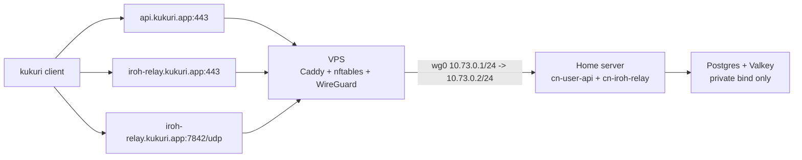

# Community Node Self-Host With VPS Edge

最終更新日: 2026-06-05

## 目的

- community-node の公開経路を `WireGuard + Caddy` の VPS edge に一本化する。
- `cn-user-api`, `cn-iroh-relay`, Postgres, Valkey は Home 側に置く。
- VPS は public IP, DNS, TLS termination, UDP forward だけを担当する。
- Public contract は `https://api.kukuri.app` と `https://iroh-relay.kukuri.app`

## 構成



既定値:

- WireGuard subnet: `10.73.0.0/24`
- VPS tunnel IP: `10.73.0.1`
- Home tunnel IP: `10.73.0.2`
- Public API domain: `api.kukuri.app`
- Public iroh relay domain: `iroh-relay.kukuri.app`
- Public WireGuard port: `51820/udp`
- Public iroh relay QUIC port: `7842/udp`

## VPS 側

DNS と firewall:

- `api.kukuri.app` と `iroh-relay.kukuri.app` を VPS の public IP に向ける。
- Cloudflare を使う場合は DNS only にする。
- VPS / cloud firewall で `22/tcp`, `80/tcp`, `443/tcp`, `51820/udp`, `7842/udp` を許可する。

セットアップ:

```bash
git clone https://github.com/<your-org>/kukuri.git
cd kukuri
cp scripts/vps/community-node-edge.env.example scripts/vps/community-node-edge.env
```

`scripts/vps/community-node-edge.env` の必須値:

```dotenv
PUBLIC_IFACE=eth0
WG_ENDPOINT_HOST=api.kukuri.app
WG_VPS_ADDRESS=10.73.0.1/24
WG_HOME_CLIENT_ADDRESS=10.73.0.2/24
WG_HOME_ALLOWED_IPS=10.73.0.2/32
HOME_WG_IP=10.73.0.2
WG_SERVER_PRIVATE_KEY=<vps-private-key>
WG_HOME_PUBLIC_KEY=<home-public-key>
WG_HOME_PRESHARED_KEY=<shared-psk>
API_DOMAIN=api.kukuri.app
IROH_RELAY_DOMAIN=iroh-relay.kukuri.app
HOME_CN_USER_API_PORT=18080
HOME_IROH_RELAY_HTTP_PORT=13340
HOME_IROH_RELAY_QUIC_PORT=7842
```

実行:

```bash
sudo ./scripts/vps/setup-community-node-edge.sh scripts/vps/community-node-edge.env
```

生成物:

- `/etc/wireguard/wg0.conf`
- `/etc/caddy/sites-enabled/kukuri-community-node-edge.caddy`
- `/etc/nftables.conf`
- `/root/wg0-home-client.conf`

Caddy は `api.kukuri.app -> http://10.73.0.2:18080` と `iroh-relay.kukuri.app -> http://10.73.0.2:13340` を reverse proxy する。`7842/udp` は Caddy を通さず nftables で Home 側へ DNAT する。

## Home 側

WireGuard:

VPS 側が生成した `/root/wg0-home-client.conf` を Home 側へコピーし、`PrivateKey` を埋めて `/etc/wireguard/wg0.conf` として配置する。

```ini
[Interface]
Address = 10.73.0.2/24
PrivateKey = <home-private-key>

[Peer]
PublicKey = <server-public-key>
PresharedKey = <same-as-WG_HOME_PRESHARED_KEY>
Endpoint = api.kukuri.app:51820
AllowedIPs = 10.73.0.1/32
PersistentKeepalive = 25
```

起動:

```bash
sudo systemctl enable --now wg-quick@wg0
```

`.env.community-node`:

```dotenv
CN_BASE_URL=https://api.kukuri.app
CN_PUBLIC_BASE_URL=https://api.kukuri.app
COMMUNITY_NODE_CONNECTIVITY_URLS=https://iroh-relay.kukuri.app

CN_POSTGRES_HOST_BIND_IP=127.0.0.1
CN_VALKEY_HOST_BIND_IP=127.0.0.1
CN_USER_API_HOST_BIND_IP=10.73.0.2
CN_USER_API_PORT=18080
CN_IROH_RELAY_HTTP_HOST_BIND_IP=10.73.0.2
CN_IROH_RELAY_PORT=13340
CN_IROH_RELAY_QUIC_BIND_ADDR=0.0.0.0:7842
CN_IROH_RELAY_QUIC_HOST_BIND_IP=10.73.0.2
CN_IROH_RELAY_QUIC_PORT=7842
CN_IROH_RELAY_TLS_CERT_PATH=/certs/default.crt
CN_IROH_RELAY_TLS_KEY_PATH=/certs/default.key
CN_IROH_RELAY_CERTS_HOST_PATH=./docker/cn/certs
```

`CN_POSTGRES_PASSWORD` と `COMMUNITY_NODE_JWT_SECRET` は必ず本番用の値に変える。Postgres と Valkey は public に bind しない。

## iroh relay 証明書

`cn-iroh-relay` の `7842/udp` は Home 側コンテナが直接応答するため、`iroh-relay.kukuri.app` 用の証明書と秘密鍵を Home 側へ置く。

VPS 上で Caddy の証明書を探す:

```bash
sudo find /var/lib/caddy/.local/share/caddy/certificates -path '*iroh-relay.kukuri.app*'
```

Home 側へ配置:

```bash
mkdir -p docker/cn/certs
cp /path/to/iroh-relay.kukuri.app.crt docker/cn/certs/default.crt
cp /path/to/iroh-relay.kukuri.app.key docker/cn/certs/default.key
```

## 起動

```bash
docker compose --env-file .env.community-node -f docker-compose.community-node.yml run --rm cn-migrate
docker compose --env-file .env.community-node -f docker-compose.community-node.yml up -d --build cn-user-api cn-iroh-relay
```

## 確認

VPS:

```bash
sudo wg show
sudo systemctl status wg-quick@wg0
sudo systemctl status caddy
sudo nft list ruleset
curl -fsS https://api.kukuri.app/healthz
curl -fsS https://iroh-relay.kukuri.app/ping
```

Home:

```bash
ip addr show wg0
ss -ltnup | grep -E '(:18080|:13340|:7842)'
docker compose --env-file .env.community-node -f docker-compose.community-node.yml ps
```

期待値:

- `https://api.kukuri.app/healthz` が成功する。
- `https://iroh-relay.kukuri.app/ping` が成功する。
- Home 側の `18080/tcp`, `13340/tcp`, `7842/udp` は `10.73.0.2` に bind される。
- desktop client は `Save Nodes -> Authenticate -> Accept` 後、`connectivity_urls` として `https://iroh-relay.kukuri.app` を受け取る。
