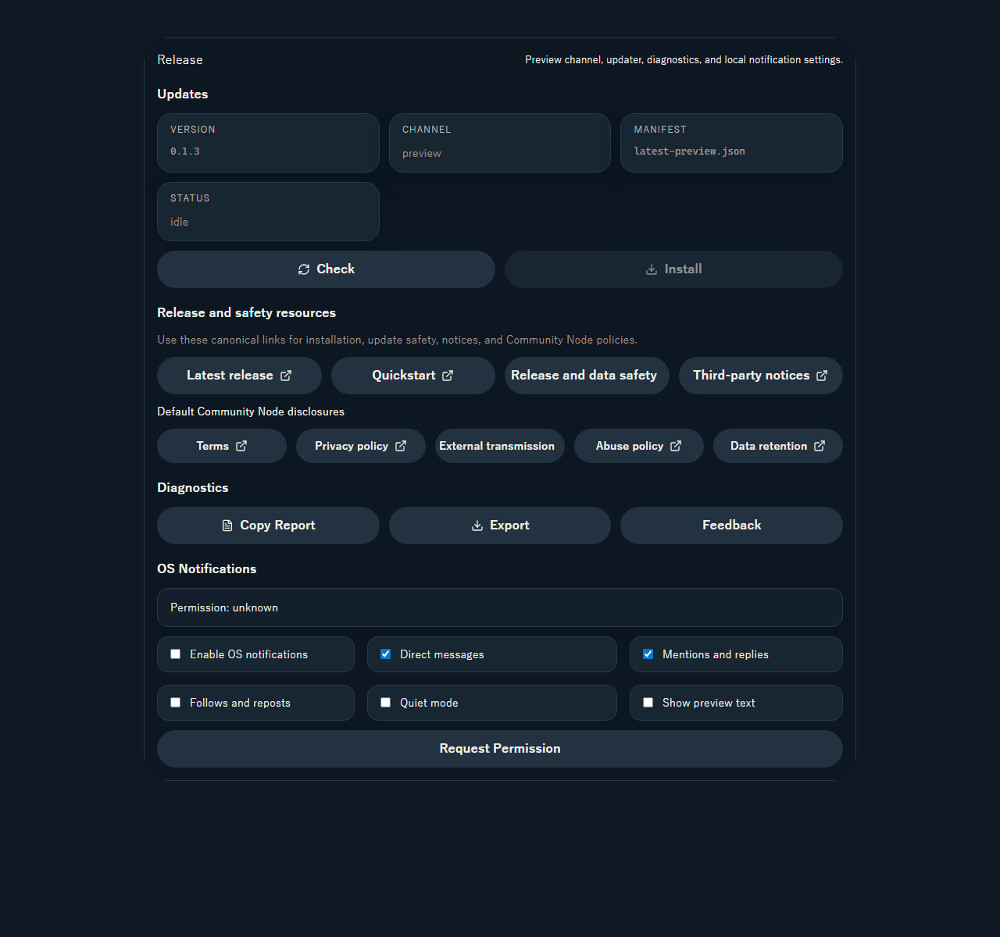

# Release resources UI review (2026-08-08)

## Scope

- `Settings -> Release` に latest release、quickstart、release/data-safety runbook、third-party notices を追加。
- default Community Node の terms / privacy / external transmission / abuse / retention を同じ画面から開けるようにした。
- すべて canonical HTTPS URL を新しい tab で開き、updater state や local settings は変更しない。

## User flow

1. user が Settings を開き Release を選ぶ。
2. `Release and safety resources` で目的の資料を選ぶ。
3. browser で canonical page を確認し、kukuri へ戻る。

## Review evidence

Storybook: `Settings/ReleasePanel -> Resources` (1280 x 1200, dark theme).

## Shneiderman checklist

- Consistency: 既存 `Button` / `SettingsActionRow` / typography token を使用。
- Shortcuts: 頻出の latest release と quickstart を先頭に配置。
- Informative feedback: external-link icon と説明文で app 外へ開くことを示す。
- Closure: resource link は独立した browser navigation で完結し、app state を変更しない。
- Error prevention: signed updater操作と資料閲覧を別 section に分け、誤操作を避ける。
- Reversal: link click は local state を変更せず、tab を閉じて戻れる。
- User control: updater、diagnostics、OS notifications の既存操作順を維持。
- Memory load: README に散在していた canonical resources を一画面へ集約。

## Result

- wide viewport で label の欠け、横 overflow、重なりなし。
- disabled updater action と resource links の視覚的な区別を維持。
- English / Japanese / Simplified Chinese の i18n key parity を維持。
