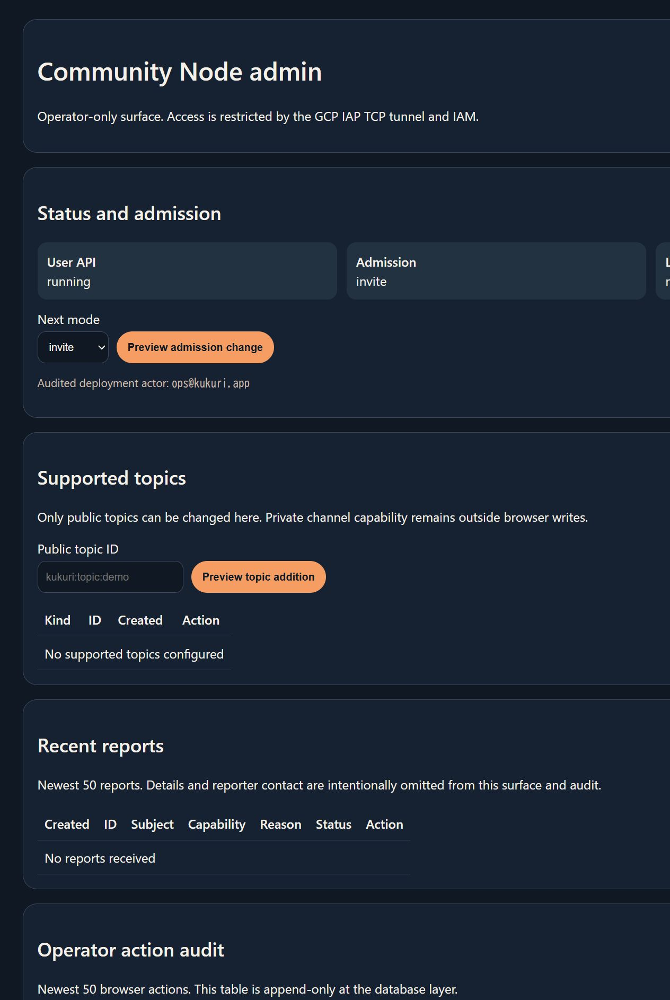

# Community Node admin actions UI review

## Scope

Issue #382 の IAP 内部 admin surface に、runtime DB 操作の
`preview -> confirm -> apply -> audit` flow を追加する。

## User flow

1. operator は IAP TCP tunnel 経由で dashboard を開く。
2. admission、public supported topic、report status のいずれかを選び `Preview` を押す。
3. validation preview で deployment actor、target、impact、transaction boundary を確認する。
4. `Confirm and apply` で state と append-only audit を同一 transaction へ commit する。
5. 成功画面の audit ID を確認し、dashboard の audit table で before / after を再確認する。

actor 未設定時は dashboard を read-only に保ち、write endpoint は fail-closed にする。
provider/LLM credential、capability、image revision、private channel secret、invite/allowlist/ban は
browser write の対象にしない。

## Review result

- dark / light system color scheme で solid panel、focus color、primary action を区別した。
- form control と button は keyboard focus可能なnative elementを使用した。
- empty state、preview、success、validation/CSRF error、write-disabled stateを定義した。
- 1280px viewportでdocumentのhorizontal overflowなし（`scrollWidth=1265 <= innerWidth=1280`）。
- database / environment / form / audit値はHTML escapeし、unit testで固定した。
- reusable desktop componentではなく独立server-rendered operator surfaceのため、Storybookは対象外。

## Shneiderman checklist

- Consistency: 全writeを同じPreview / Confirm / Result flowへ統一。
- Shortcuts: dashboardから各runtime stateを直接previewでき、CLI command組立を不要化。
- Informative feedback: actor、target、impact、before/after、audit IDを表示。
- Dialog closure: success/errorの双方にdashboardへ戻る導線を用意。
- Error prevention: actor未設定、CSRF不一致、未知action、無効topic/report IDをcommit前に拒否。
- Easy reversal: admission/report statusは後続のaudited actionで戻せる。topic removalは非同期de-index影響をpreviewへ明記。
- Internal locus of control: previewと明示confirmなしにapplyしない。
- Reduce short-term memory load: current valueをselectへ反映し、impactとresponsibility boundaryを同じ画面に表示。

## Validation

- `cargo xtask cn-test`
- `terraform -chdir=infra/terraform/envs/low-cost validate`
- `docker compose -f docker-compose.community-node.yml config --quiet`
- in-app Browserでlocal Postgres / user-apiに対し `open -> invite` のpreview、apply、audit再表示を確認
