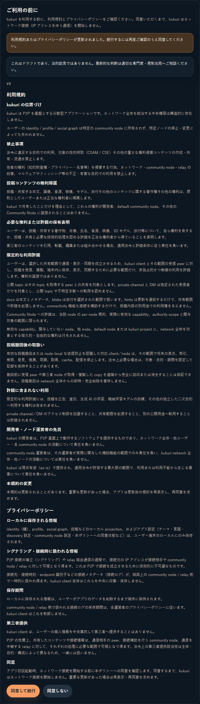
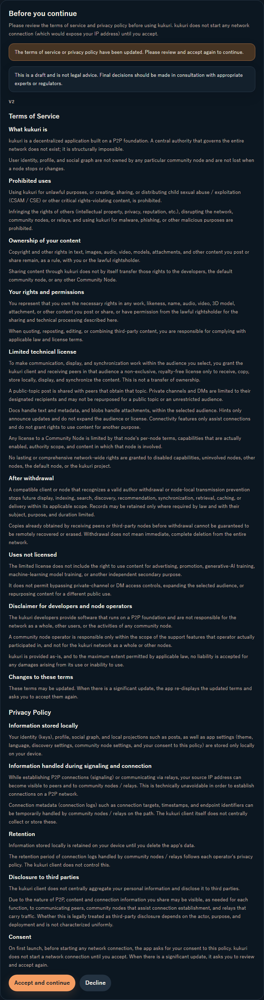
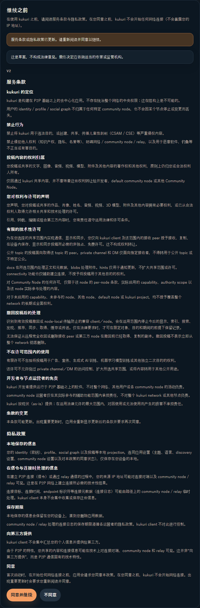

# Issue #762 Legal consent review

## 対象フロー

1. legal bundle version 1 に同意済みの利用者が version 2 で起動する。
2. 更新案内、version 2 の利用規約・プライバシーポリシー、同意／不同意の選択肢を表示する。
3. 同意完了までは application shell と network runtime を開始しない。
4. 同意後は既存の起動処理へ進む。

## Preview

### 日本語

### English

### 简体中文

## UI review

- 一貫性: 既存の同意 gate、Notice、LegalDocumentView、主要／副次 Button をそのまま使用し、layout と操作順を変えていない。
- 情報提示: version 2 と更新理由を冒頭に表示し、権利帰属、必要な権利、限定許諾、撤回後の限界、二次利用禁止を各言語で同じ順序にした。
- エラー予防: 同意するまで shell と network runtime を開始せず、不同意を明示的に選択できる。
- 操作の可逆性: 不同意はデータ変更を行わず、後から同意を選び直せる既存挙動を維持した。
- アクセシビリティ: 既存の heading 構造、`aria-live`、button semantics、scrollable panel を維持した。
