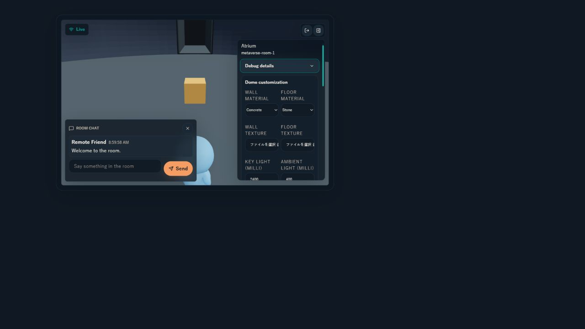

# Issue #791 fixed Dome customization UI review

## Scope

固定規格Domeのsceneと、ownerだけがDurable customizationを編集できるHUDを追加する。

## User flow

1. participantはtopic内のDomeを選択してjoinする。
2. sceneには固定半球、4 opening / connection zone、persistent prop、avatar、chatが表示される。
3. ownerはHUDでwall / floor materialとtexture、lighting、ambient、fog、gravity強度、persistent prop interaction capabilityをdraft編集する。
4. `Save Dome`で明示保存し、pending、success、validation/backend errorを同じ領域で確認する。
5. `Cancel`で未保存draftを現行manifest値へ戻す。
6. non-ownerは設定summaryとinteraction affordanceを利用できるが、Durable保存actionは表示されない。

## Review result

- 1280px Storybook viewportでhorizontal overflowなし（`scrollWidth=1268 <= innerWidth=1280`）。
- 480pxの狭いColumn相当でもhorizontal overflowなし（`scrollWidth=468 <= innerWidth=480`）。
- `Save Dome` / `Cancel`は48px、編集controlは44px以上の操作高を確保した。
- material select、数値input、checkbox、save/cancelはnative keyboard controlを使い、既存focus tokenを継承する。
- owner / read-only guest / pendingのStorybook storyと、save / cancel / invalid / backend error / pendingのcomponent testを追加した。
- Storybook表示時のconsole errorは0件。既存Three.js / three-vrm deprecation warningは本Issueの機能エラーではない。
- dark themeで固定Dome、HUD、chat、primary / secondary actionの階層を確認した。色は既存semantic tokenを再利用している。

## Shneiderman checklist

- Consistency: 既存HUD、Button、Input、Label、Notice系feedbackと同じ操作・tokenを使用。
- Shortcuts: material presetと4 interactionを直接選択でき、geometry parameter入力を不要化。
- Informative feedback: saving / saved / invalid / backend errorを編集領域内へ表示。
- Dialog closure: 明示Saveで完了し、成功表示またはerror表示で結果を閉じる。
- Error prevention: client validatorとbackend validatorで範囲外gravity、非texture参照、重複prop、Dome外positionを拒否。
- Easy reversal: 保存前はCancelで現行manifestへ復元。保存後の変更は次のowner updateとして上書き可能。
- Internal locus of control: texture importだけではmanifestを変更せず、ownerの明示SaveでDurable更新する。
- Reduce short-term memory load: current manifest値をdraft初期値として表示し、-Y固定gravityなど変更不能条件はUIから除外。

## Validation

- Storybook owner / read-only / pending storyをin-app Browserで表示。
- owner draftのmaterial / gravity変更後にCancelし、manifest値への復元を確認。
- 1280px / 480pxでoverflowと操作高を確認。
- `DomeCustomizationControls.test.tsx`でsave / cancel / invalid / read-only / pending / backend errorを確認。
