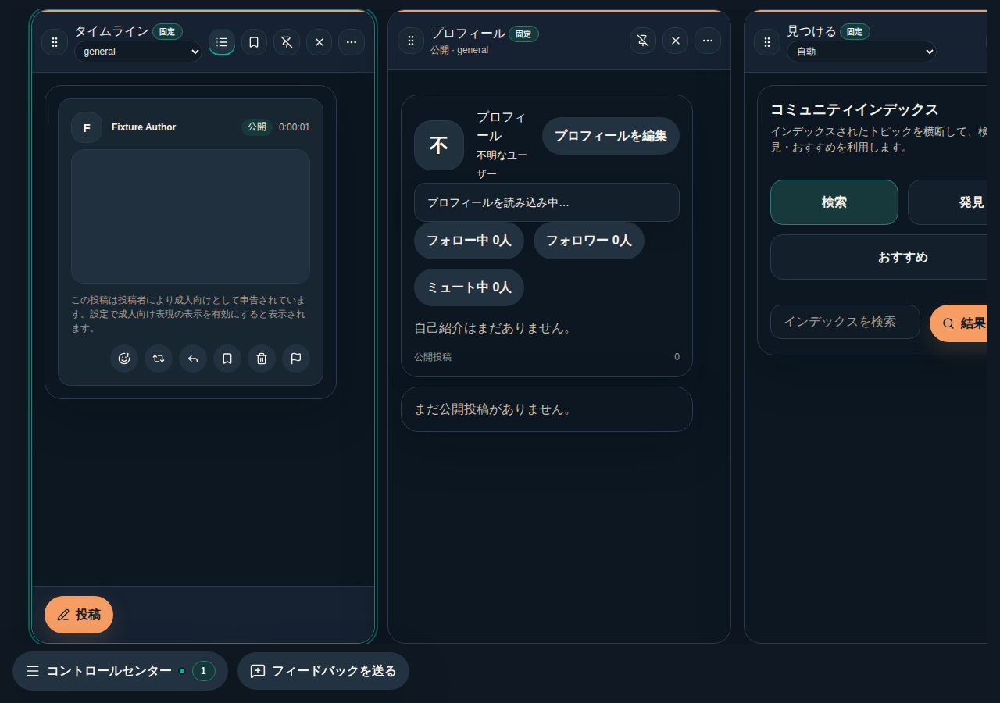
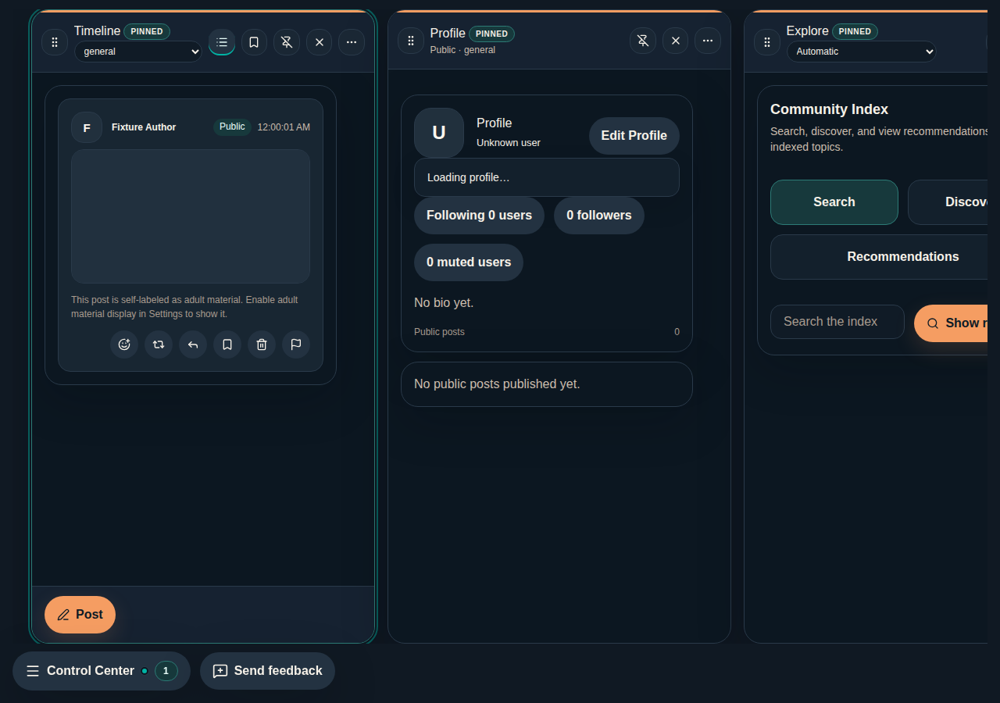
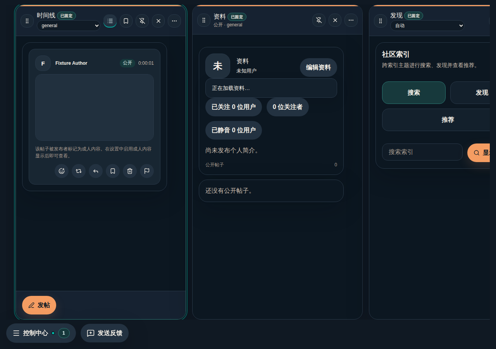
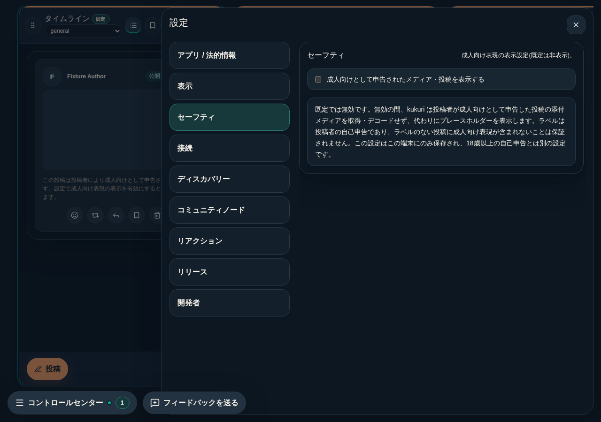
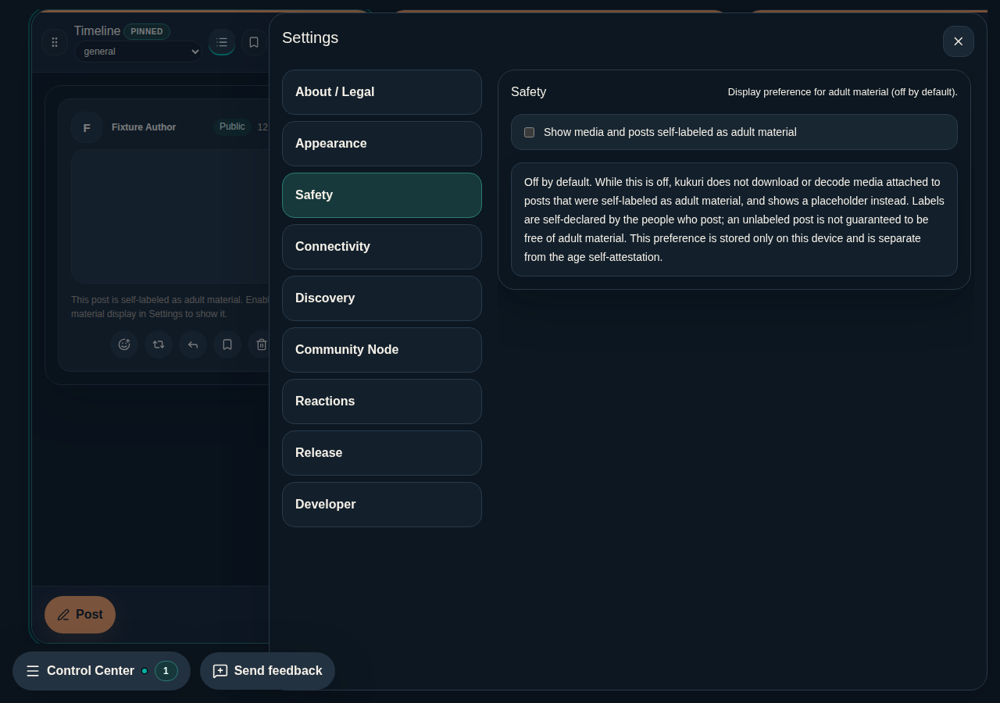
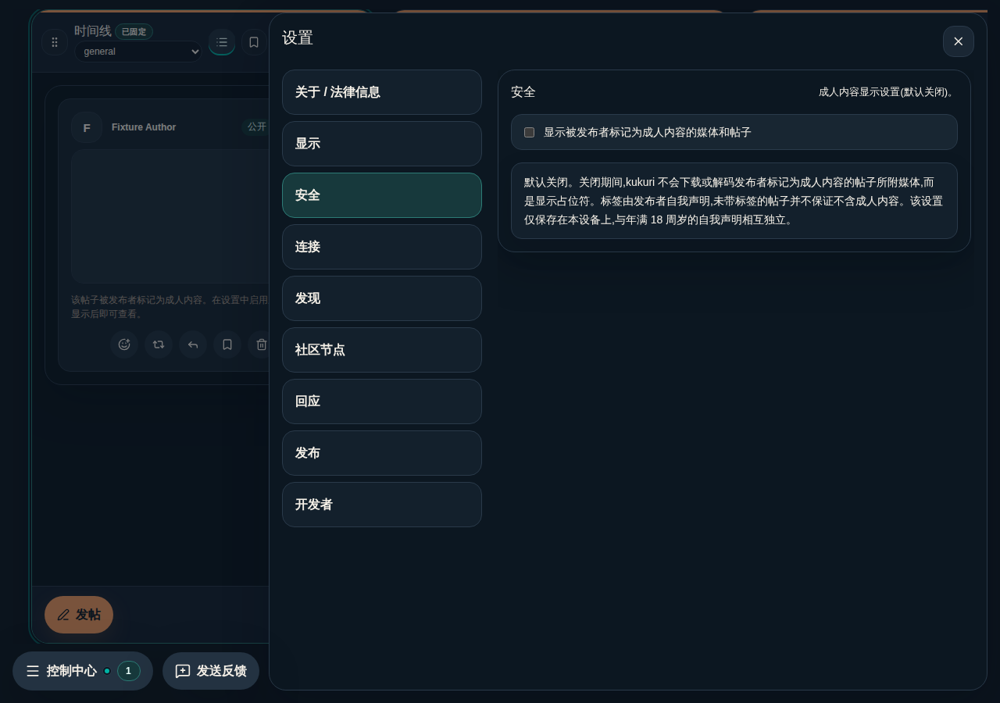

# Issue #858 Age attestation and adult content gating review

## 対象フロー

1. 初回起動時、規約・ポリシーへの同意に加えて「18歳以上である」旨のチェックを必須にする(チェックまで同意ボタンは無効。申告完了まで application shell と network runtime を開始しない)。
2. 成人向けとして申告された投稿は、既定では本文が代替表示になり、添付メディアは取得・デコードされずプレースホルダーを表示する(タイムライン・スレッド・引用・検索結果で一貫)。
3. 設定画面の新設「セーフティ」セクションから成人向け表現の表示を明示的に有効化でき、OFF へ戻すと以後の取得が止まり表示済みメディアも破棄される。
4. composer に「成人向けとして申告する」トグルを追加し、投稿の self-label(`content_labels: ["adult"]`)を付与できる。

## Preview

### 既定 OFF のタイムライン(成人向けラベル付き投稿)

### 設定「セーフティ」セクション

年齢自己申告ゲートは Tauri runtime の起動 gate 内(`ConsentGate`)でのみ表示されるため browser preview では撮影できない。構成は #762 の同意画面(`docs/ui-reviews/2026-08-25-762-legal-consent.md` の Preview)に、チェックボックス 1 つと注記 1 行を追加した差分で、検証は `App.test.tsx` が担保する。

## UI review

- 一貫性: 同意 gate は既存の `ConsentGate` レイアウトへのチェックボックス追加のみ。メディアのプレースホルダーは既存の `media-frame` / `media-skeleton`、テキストの代替表示は撤回済み投稿と同じ `topic-diagnostic` 系を使い、表示経路間で文言・構造を揃えた。設定トグルは `DeveloperPanel` と同型。
- 情報提示: 自己申告が公的な年齢確認ではないこと、ラベルが投稿者の自己申告でありラベルなしが安全を保証しないこと、設定が端末ローカルであることを gate・設定画面の双方に明記した(ja / en / zh-CN)。
- エラー予防: 既定 OFF(fail-closed)。チェック無しでは同意ボタンが無効になり、誤操作で先へ進めない。表示設定の変更はコマンド成功後の値だけを反映する。
- 操作の可逆性: 表示設定はいつでも OFF へ戻せ、以後の取得停止と表示済みメディアの破棄が即時に行われる(ON へ戻せば再取得)。自己申告は端末ローカルで、アプリデータ削除で消える。
- アクセシビリティ: プレースホルダー・代替表示は `role='status'`、チェックボックスは label 内でテキストと関連付け。既存の heading 構造・focus 順を変えていない。

関連: #858、ADR 0046、`docs/progress/2026-09-01-issue-858-age-attestation-adult-content-gating.md`

## 2026-09-03 再監査差分

- 通知: object-backed notification preview は成人向けラベル付きなら共通の注意文言へ置換し、OS 通知では本文を送らない。migration 前などラベル未解決の object notification も既定 OFF では preview を出さない。actor identity と follow / DM 通知の扱いは変更しない。
- Community Index: node 由来本文を canonical 解決前に描画しない。解決中は進行状況、欠落・失敗時は安全性ラベルを確認できない旨を表示し、報告以外の投稿操作を無効化する。canonical 解決後は通常の `PostCard` と同じ成人向けゲートを使う。
- ネスト表示: ホストカードがゲート対象の場合は返信プレビューも含めて本文領域全体を置換する。引用元・返信元だけが成人向けの場合も共通 label 判定でカードをゲートする。
- 既存のスクリーンショットで示したプレースホルダーの視覚仕様は維持している。今回の差分は raw text の描画可否と通知本文の抑止であり、追加の visual token / layout 変更はない。ja / en / zh-CN の Community Index 状態文言を locale parity 下で追加した。
