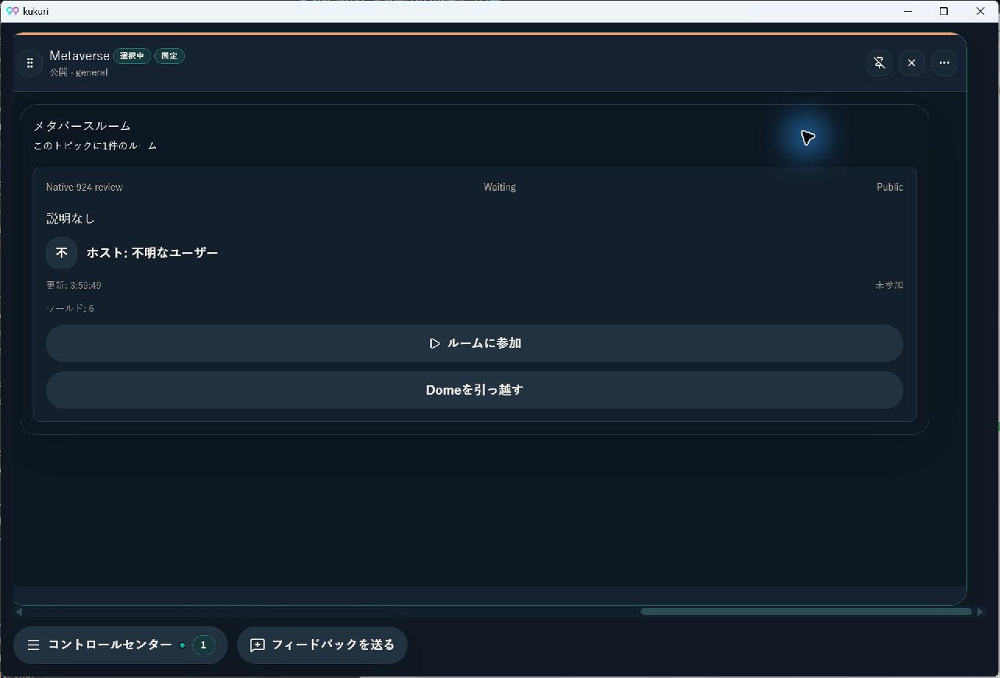
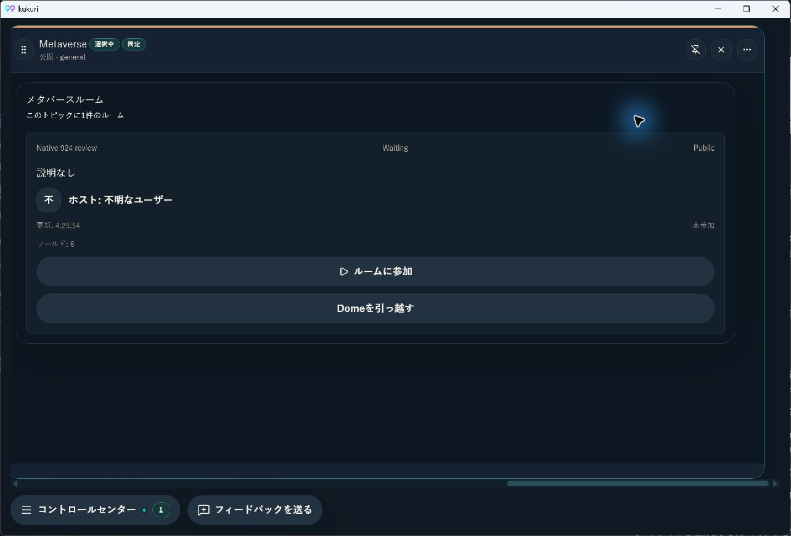
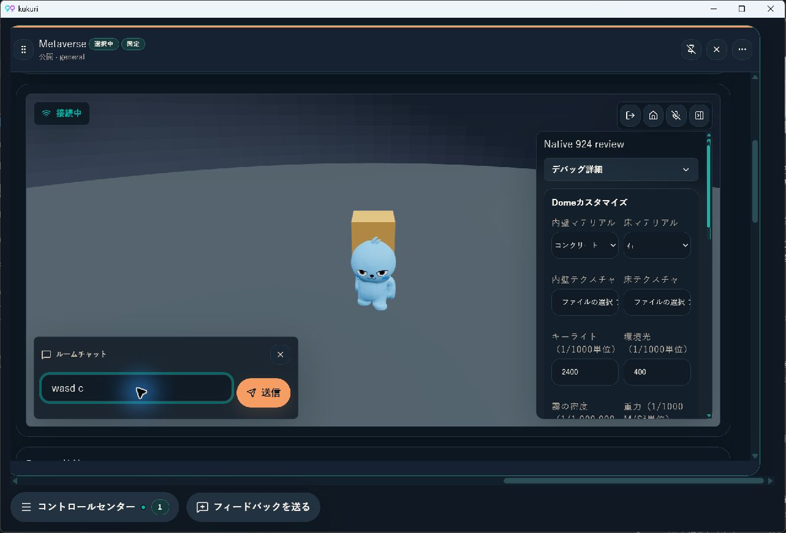

# Issue #924: transition owner抽出のWindows/WebView比較

- Status: current
- Supersedes: None
- Superseded by: None
- PR: [#937](https://github.com/KingYoSun/kukuri/pull/937)、head `e647f318fab49b5f3fed079055a4cc1823e572d6`
- 対象: Metaverse参加者の移動・取消を扱うsession hookの構造整理。操作・描画・admission・audio・入力sequenceの仕様は変えない。
- 変更の意図: attemptの9代入とprepare/abort/commit/source cleanupを一つのownerへ移す。UI designの変更・新しいUI例外の採用ではない。

## 条件と比較方法

Windows 11（OS build 26200）、Tauri 2.11.5の実バイナリ、WebView2 `152.0.4191.66`。通常window 1283×871、全画面2560×1440、dark、日本語、3列幅のMetaverse Column。app dataとWebView user-dataを専用保存先へ分離した。

`VITE_KUKURI_DESKTOP_MOCK=1`の既存seedを実Tauri/WebViewで描画し、同じ`Native 924 review`ルームをUIで作成・ホスト開始した。APIデータはmockであり、実CN/他peer/署名/永続化の成功をこの確認から主張しない。renderer/input/退出の実機観測と、Rust/CN/hook contractの境界検証を分ける。

beforeは#923 head `6dfb95a1`の製品source。session/view/scene/Column runtimeは実装before `4e833af8`とblob一致。afterは`e647f318`。全画面の状態を切り分ける追加確認ではsessionだけを`4e833af8`の元sourceへ戻し、cold restartした。

計測中だけviewにread-onlyの`output`とキー観測stateを置き、`runtime.active/visible/suspended`、scene focus、controls、既存lastSentSeq、到達key/target tagを表示した。元のinput handler、guard、actions、sequence計算は変更しない。同じprobeをbefore/afterに使用し、最終sourceから除去してheadのblob一致を確認した。hook配列をHMRで差し替えた際のorder mismatchはcold restartして比較し、通常起動の結果とは区別した。

## 実操作と結果

| 操作 | before | after |
| --- | --- | --- |
| 作成→ホスト開始→入場 | 参加済み、3D avatar/prop表示、seq1 | 同じ |
| 通常表示の3D床へpointer focus | active/visible/focused/controls=true、suspended=false | 同じ |
| `c`キーで姿勢変更・復帰 | `c`がDIVへ到達、seq1→2→3 | 同じ |
| `Shift+d`の方向入力 | `D`がDIVへ到達。短いpulseではseq3のまま | 同じ |
| チャット欄へpointer focus、`wasd c`入力 | focused/controls=false、文字列がdraftに入りseq3不変 | 同じ |
| Columnを横scrollで画面外へ | visible=false、suspended=true、controls=false | 同じ |
| Columnを表示範囲へ戻す | visible=true、suspended=false、draft/seq3保持 | 同じ |
| ルームから退出 | 未参加、3D/controls表示を終了 | 同じ |
| Column menuから全画面、Escape復帰 | 全画面開始と通常windowへの復帰を観測 | 同じ |

姿勢変更のsequenceは実キーイベントがsessionのtransform入力へ到達した証拠とする。方向キーの**長押しによる移動量は未測定**。自動操作は短いkey pulseであり、到達を移動距離の成功に読み替えない。キー送信直後のsnapshotは反映前の場合があり、後続snapshotで更新を確認した。UIAの編集欄set_valueは利用不能だったため、pointer focusと文字入力を使った。

## 全画面で観測した既存の制約

ホストpanelまで縦scrollした状態から全画面へ入ると、`active=true / visible=false / suspended=true / controls=false`になった。afterで観測し、`4e833af8`の元sessionをcold restartした同条件でも再現した。Column runtime・frame・scene・viewは対象差分0。今回のattempt抽出が導入したRegressionではないため、抽出PRへfullscreen lifecycleの修正を混ぜない。

この状態での全画面中の移動をPASSとはしていない。全画面の開始/解除確認、通常windowの入力確認、既存の停止状態を分けて保持する。親Phase 4で扱う既存挙動の記録としても参照できるが、本recordで新しい製品要件や修正済みの判定を作らない。

## 画像

| 変更前の退出後 | 変更後の退出後 |
| --- | --- |
|  |  |

[変更前sourceで再現した全画面フラグ](assets/issue-924/before-fullscreen-flags.jpg)。白い表示は一時probeで、製品UIには含めない。

## Validationと判断

- before/after同5 files57 tests PASS。先行#923のprepare取消/遅着ticket/ack不明/確定rollback/source cleanup/join-leave caller contractと既存recovery/entry/model/panelを維持。
- 最終headの`cargo xtask desktop-ui-check`: 152 files1209 tests、Storybook、browser64、Windows visual smoke14 PASS。最終PRのFast全9・Linux AppImage・GitGuardianもSUCCESS、Linux pixel比較を含む。
- 独立source監査: PASS、固定INV1〜4/TR1〜4、blocker0。mutable attempt非公開、元callbackとの差分を照合済み。
- 実機は上表の観測範囲でbefore/after一致。screen reader適合、touch、長押し移動量、全画面中の移動、実audio/他peer通信、CPU/GPU定量値は未確認。network/authorityまでmock確認で代替していない。
- resourceについては画面外のsuspended/controlsと復帰を確認し、性能改善量は主張しない。例外を新規承認・規範変更した記録ではない。
