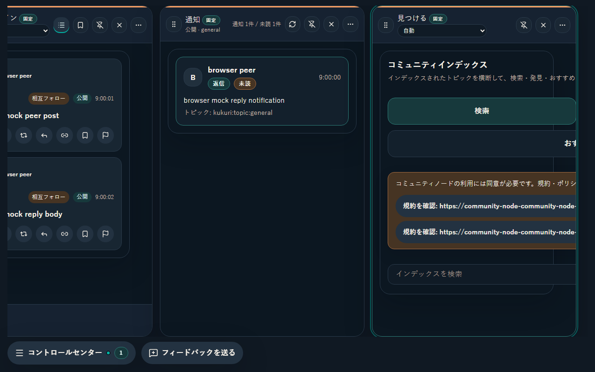
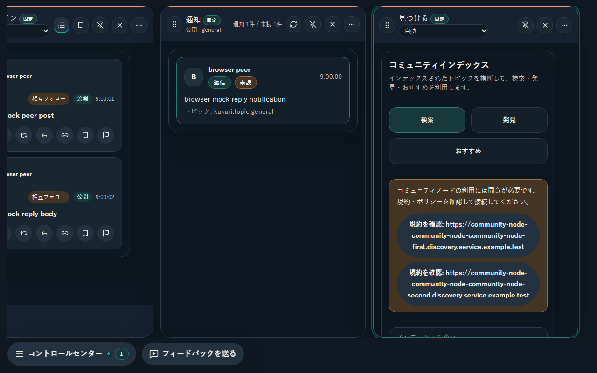
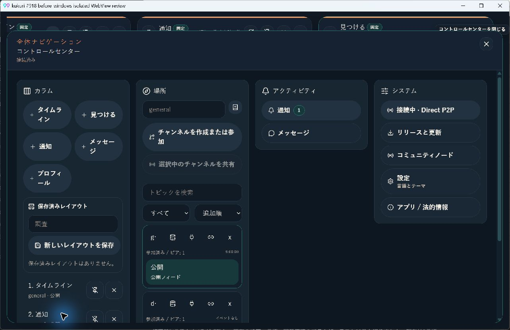
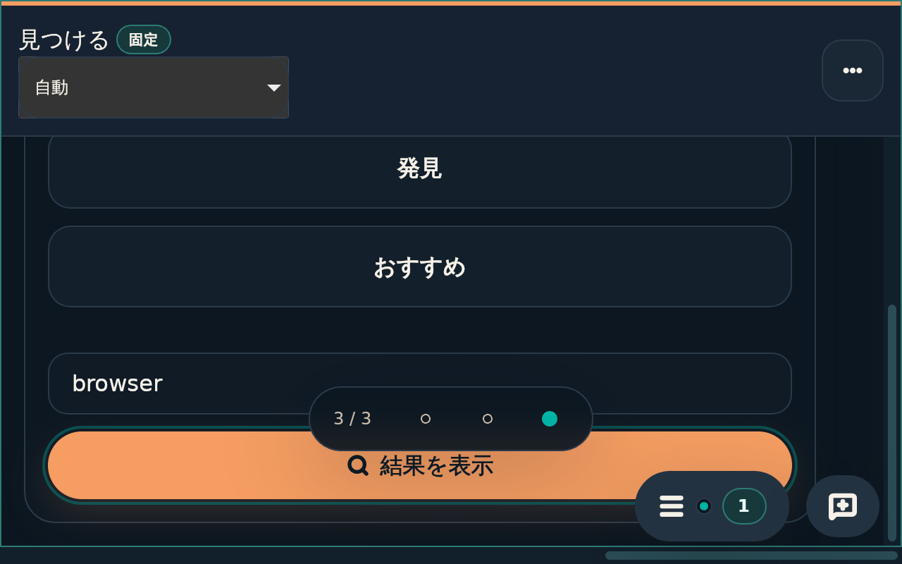
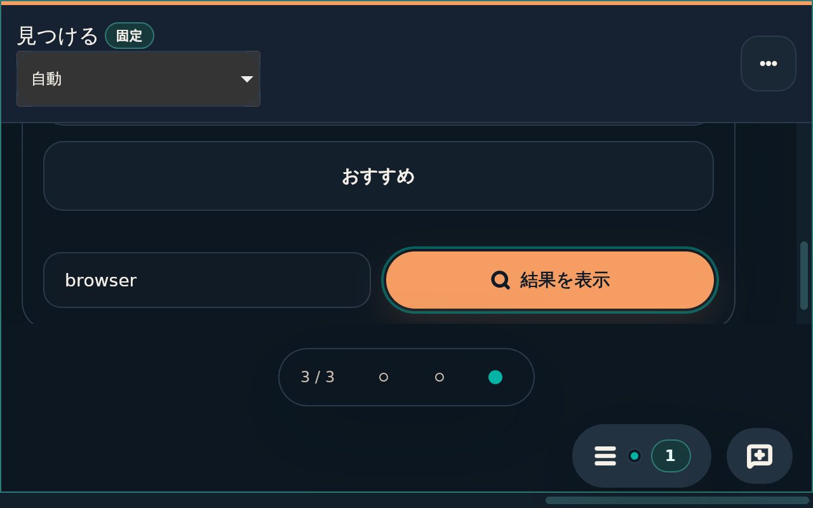
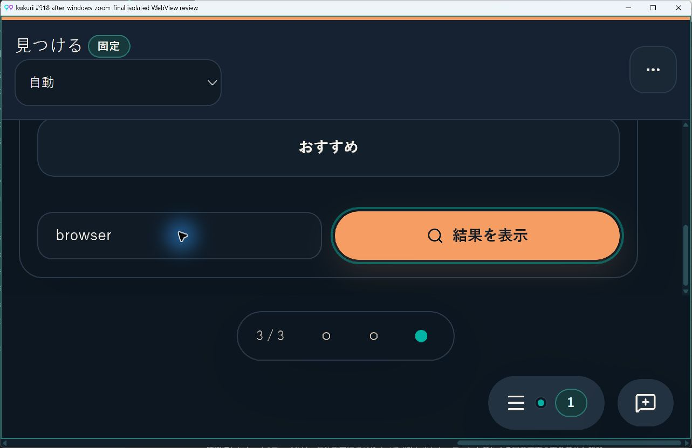

# 2026-09-09 見つけるの幅制約と本文の文字密度

- Status: current
- Supersedes: None
- Superseded by: None
- PR識別子: `codex/issue-918-explore-overflow-density`（[Issue #918](https://github.com/KingYoSun/kukuri/issues/918)、Scope `918-r1`）
- 対象・利用者・目的: 既定幅の見つけるとControl Centerを使う閲覧者が、検索操作とNode案内を全文理解して操作する。
- 採用: カラム内部の実幅に応答するフォーム、長いURL入りactionの折り返し、本文14px相当・投稿15px相当・補助12px相当。ヘッダー、root font、カラム幅・構成、同意Dialogは維持する。
- 条件: Windows Chromium / WebView2、Linux Chromium / WebKitGTK。日本語／英語／中国語、dark / light、1280×800、900×760相当、760幅、390幅、native 200% zoom。
- 確認state: ready、query pending / empty / error、Node状態未取得・未同意・再同意・接続準備・retry・利用不可、長いURL2件。

## 同条件の比較

### 長いNode URLの案内（1280×800、日本語、dark、3カラム）

| 変更前 | 変更後 |
| --- | --- |
|  |  |

WorkspaceのclientWidth372pxに対しscrollWidth839pxだった状態を372pxへ収めた。フォーム・タブ・Nodeの送信先を変えず、表示だけで追加queryや同意保存を行わない。

### Control Center（Windows WebView2、1280×800、日本語、dark）

| 変更前 | 変更後 |
| --- | --- |
|  |  |

カラムheaderは16pxのまま、Control Center本文は16→14px、補助文は12.8→12px。投稿本文は通常説明と分けて15pxを使う。色・hit area・keyboard順・既存actionを維持する。

### 200% zoomでのfocusと固定操作（Linux WebKitGTK）

| 変更前 | 変更後 |
| --- | --- |
|  |  |

見つける本文だけ下部領域を確保し、固定page indicatorとdockが操作を覆わない。Windows WebView2でも同じ実効640×400で確認した。

## 検証・制限

- keyboard / pointer / scroll、検索3操作、pending時の制限、query保持、設定からのfocus復帰、長い規約labelの正しいNodeへの遷移を確認。
- 追加browser19件、全frontend Vitest1302件・browser137件、Linux visual20件が成功。Workspace / Availabilityの114 Story条件でaddon-a11y違反0・横overflow0。
- root font-sizeとtoken値を変更せず、設計契約・実行値の既存検査が成功。色は不変でありcontrastを新しい色組合せへ変更していない。
- Native確認は製品frontend＋mock APIの隔離Tauri host。実engineと入力の確認であり、実Nodeの同意・通信境界を再実装した試験ではない。
- 性能: 製品への新しいfetch / timer / listenerは0。本文layoutの変更でありGPU・巨大一覧の性能計測は非該当。
- 専用screen reader / High Contrast操作は未実施。role・label・順序・色を維持し、addon-a11yと実keyboard・pointerで確認した。
- Review result: 固定AC / INVARへの適合を確認。Bの表示変更として独立監査は非該当。CIとmergeの最終状態は対象PR／Issue参照。
- Exceptions: 必須品質条件の免除なし。詳細な再現、inventory、検証の初回失敗とrerunは[作業記録](../progress/2026-09-09-918-explore-overflow-and-content-density.md)を参照。
