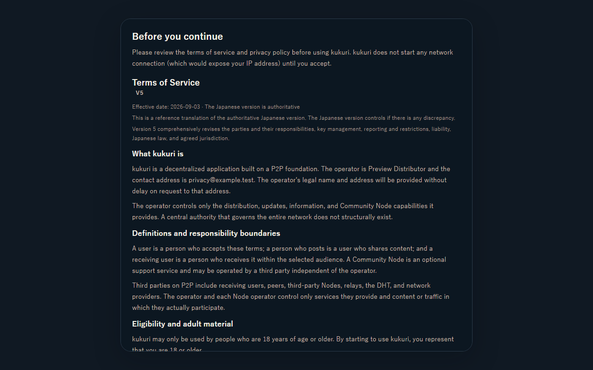
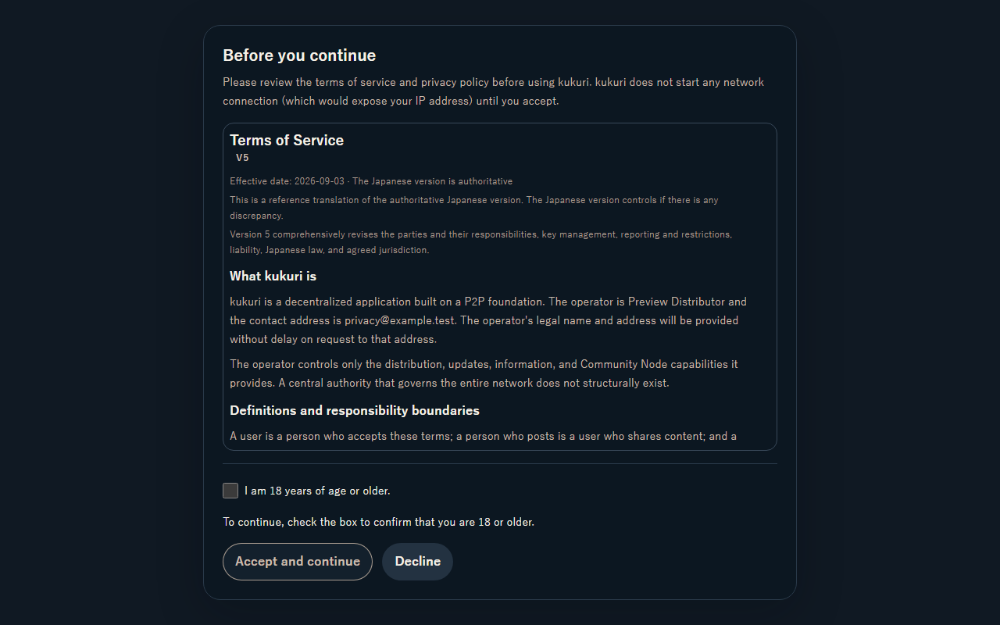

# 2026-09-09 同意画面の操作領域

- Status: current
- Supersedes: None
- Superseded by: None
- PR: Issue #916（PR作成後にリンクを追記）
- Surface / user / purpose: 初回・再同意gate。年齢自己申告の必要性を理解し、規約確認から同意へ到達する。
- Summary: 本文scrollと通常flow上の操作footerを分離。未選択理由を常時表示し、native disabledと専用styleを併用する。低い高さではpage scrollを許容する。
- Conditions: Chromium / Windows、1280×800・390×844・760×480、ja/en/zh-CN、dark/light、未選択・選択・pending・error・再同意。
- Accessibility / interaction: browserのkeyboard / pointer、理由とcheckbox・buttonのdescription、Tab順、低い高さのfocus、forced-colors / reduced-motionを確認。最終addon-a11y・native・touchは検証中。
- Performance: 新規network、polling、animation、DOMサイズ計測なし。有限の同梱文書を表示し、計測を要する重いsurfaceは追加しない。
- Validation: [作業記録](../progress/2026-09-09-916-consent-gate-affordance.md)に結果と未確認を集約。
- Not verified: 最終CI、Linux visual比較、native WebView、screen readerの実読み上げは現時点で未確認。
- Review result: 対象browserとcomponent試験は成功。最終validationを進行中。
- Exceptions: None。未確認を確認済みとは扱わない。

## 変更前後（1280×800、en、dark）

初期表示では規約全文が操作を画面外へ押し出していた。改善後は初期画面で年齢チェックと理由・同意・拒否が見え、本文を独立して末尾まで読める。

