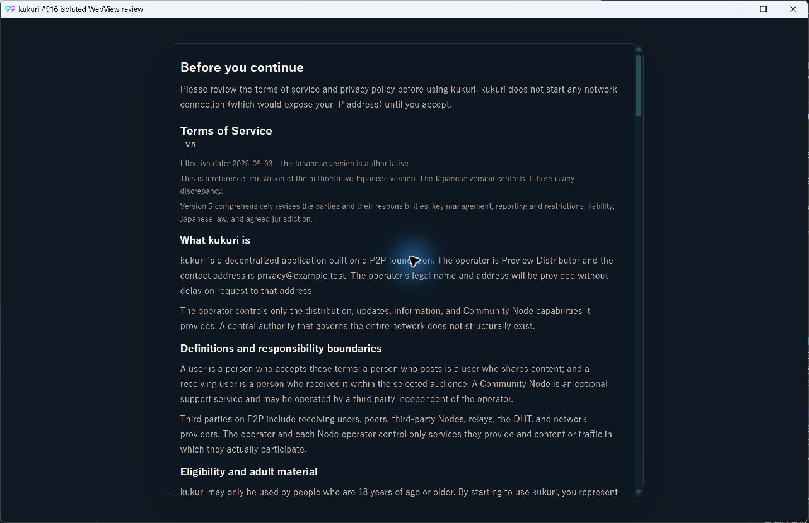
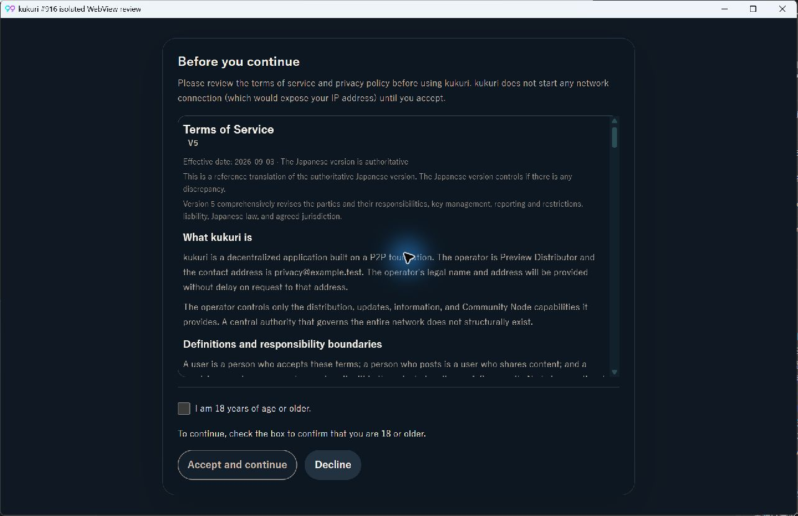
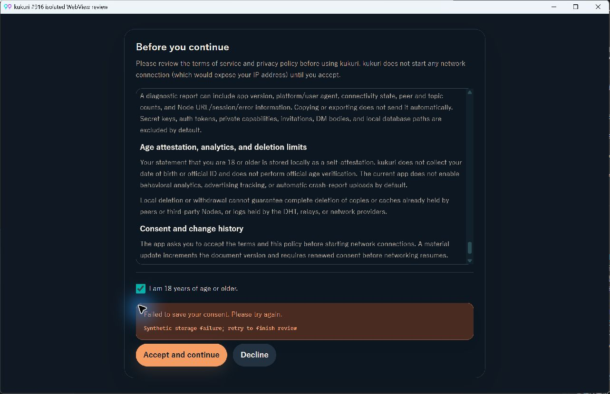
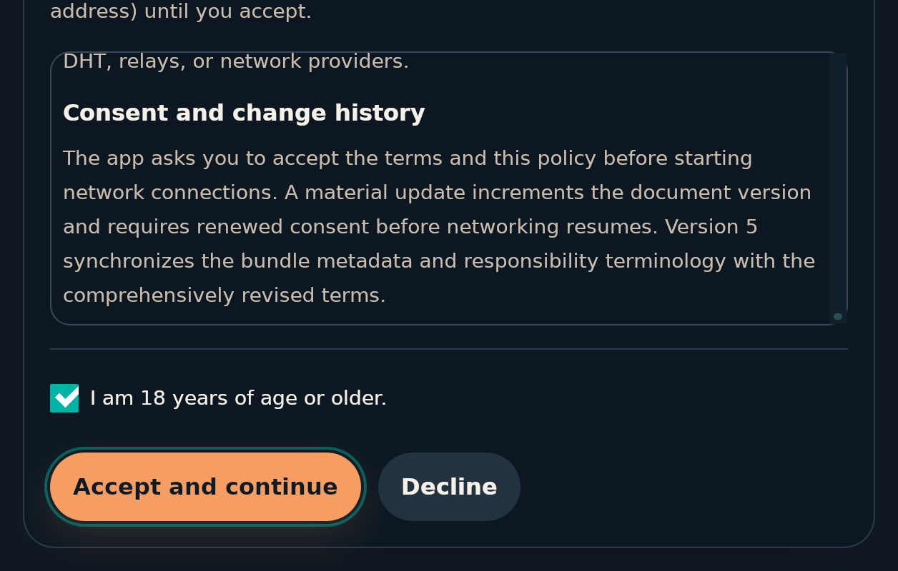

# 2026-09-09 同意画面の操作領域

- Status: superseded
- Supersedes: None
- Superseded by: [2026-09-10 年齢未確認の同意ボタン](2026-09-10-consent-gate-blocked-action.md)（無効状態の採用判断。文書scroll・footer分離・同意境界は継承）
- PR: [#948](https://github.com/KingYoSun/kukuri/pull/948)、Issue #916、Scope revision `916-r1`
- Surface / user / purpose: 初回・再同意gate。年齢自己申告の必要性を理解し、規約確認から同意へ到達する。
- Summary: 本文scrollと通常flow上の操作footerを分離。未選択理由を常時表示し、native disabledと専用styleを併用する。本文の可読な最小高さを保ち、低い高さやnotice増加時はpage scrollへ退避する。
- Platform / conditions: Windows Chromium / WebView2 151.0.4129.107、Ubuntu22.04 / WebKitGTK2.50.4（WSL/Xvfb）。browserは1280×800・390×844・760×480、低高さの追加確認390×541・640×400、ja/en/zh-CN、dark/light。nativeは1280×800/en/darkを同条件比較。WebKitは実zoom2.0も確認。
- States: 未選択、選択、pending、保存error、拒否、文書更新（現行/旧版申告）。
- Accessibility / interaction: keyboard・pointer・touch emulation、description、Tab/Shift+Tab、disabled操作IPC0、本文末尾、focus、forced-colors/reduced-motionを確認。Storybook addon-a11yは7state×3locale×2theme=42条件で違反0。実色のcontrast最小はボタン文字4.79:1、理由13.54:1、disabled境界4.69:1。
- Performance: 新規network、polling、animation、DOMサイズ計測なし。有限の同梱文書の表示で、重いsurfaceの追加はない。
- Validation: [作業記録](../progress/2026-09-09-916-consent-gate-affordance.md)。Vitest1275、browser114、visual smoke18、Rust887+22、Tauri境界filter、Linux CIのUI/visual比較成功。
- Not verified: 音声screen readerの実発話、OS設定としてのWindows High Contrast、報告された配布版/OSそのもの。自動a11yやforced-colorsとの区別を保つ。
- Review result: 固定条件の描画・実入力・境界証跡を確認、独立監査PASS。CIとmergeの現在判定はPR参照。
- Exceptions: 製品契約の例外なし。Tauri/WebKitの確認はisolated host＋synthetic同意応答を使い、実利用者の年齢申告・同意保存・network接続は行わない。backend副作用の境界はRust testsとcall pathで確認する。

## Chromiumの変更前後（1280×800、en、dark）

変更前は同意ボタン下端が4961pxで初期viewport外。変更後は年齢チェック・理由・同意・拒否が初期画面にあり、本文を独立して末尾まで読める。

## Windows WebView2の変更前後

同じ隔離Tauriホスト・viewport・localeで確認。変更後は文書をCtrl+Endで末尾まで読み、checkboxを操作して有効化、Tab/Enterでsynthetic保存失敗、チェック保持とpointer再試行を確認した。確認用ホストのCommon Controls manifestとlocal dev URLの設定を補正し、製品のRust実装は変更していない。

## Linux WebKitGTKと実200%zoom

WebKitGTK2.50.4の実エンジンで、XTestのEnd/PageDown・Tab/Shift+Tab・Space/Enter・座標clickを実行。未チェックの同意IPC0、文書末尾到達、pendingの再送抑止、error時のチェック保持、pointer retry後のshell到達を確認した。

`set_zoom_level(2.0)`で1280×800のwindowに対してDOM viewport640×400となる実zoomも確認した。CSS transformやviewport変更だけの試験ではない。本文190pxを維持して5826+190=6016の末尾に到達し、focus中buttonはy317+48=365pxで400px内、横overflowなし。page scrollに退避して文書と操作に到達できる。

計測値と入力sequenceの最終結果は [WebKit検証記録](assets/issue-916-webkit-checks.json) を参照。標準表示・zoom2.0ともfailuresは0。
