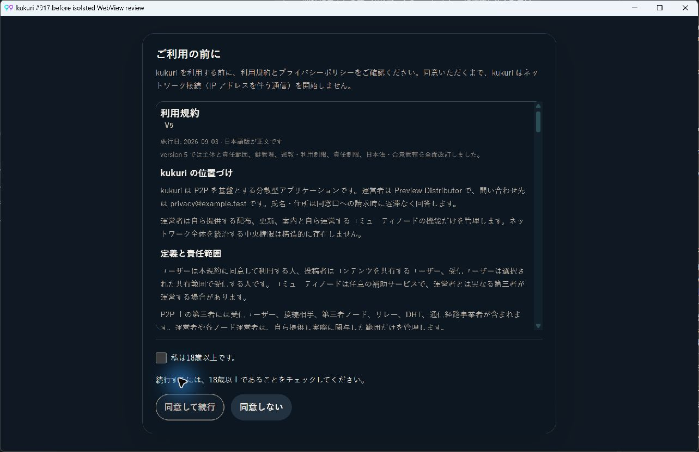
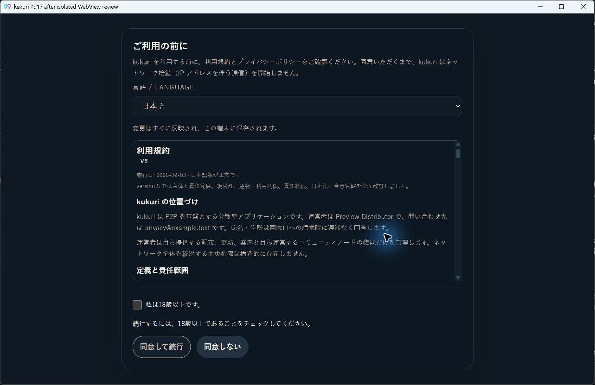
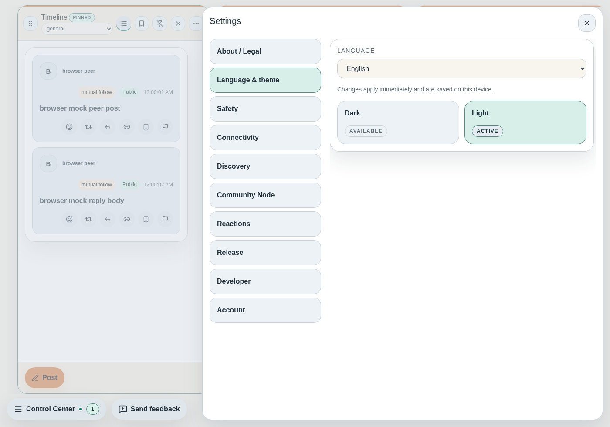
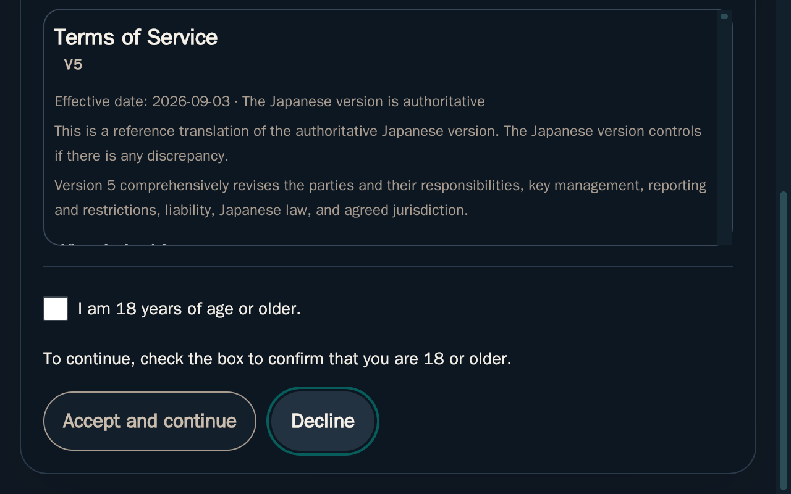

# 2026-09-09 初回言語と言語設定の発見性

- Status: current
- Supersedes: None（#916の同意条件・footer契約を維持する追加）
- Superseded by: None
- PR: [#949](https://github.com/KingYoSun/kukuri/pull/949)（Issue #917）
- Surface / user / purpose: 初回・再同意画面と表示設定。UI言語が希望と異なる利用者が、同意前にも通常利用中にも言語を選べるようにする。
- Summary: 未設定時はOS言語を優先して描画前に確定。同意headerに自称表記の言語Select、保存失敗の再試行を追加。設定入口に言語・themeの説明を付け、表示設定の先頭に言語を配置する。
- Conditions: Windows WebView2、Linux WebKitGTK2.50.4／Chromium。1280×800、390×844、760×480、640×400相当。ja／en／zh-CN、dark／light。未申告・申告済み・pending・error・拒否・更新・言語保存失敗。Linux nativeでは実engine zoom2.0も確認。
- Accessibility / interaction: 言語のlabel／description、自称表記、focus保持、native keyboard切替、本文とfooterへの到達を確認。Storybook addon-a11yは60条件で違反0。[結果](assets/issue-917-story-a11y.json)
- Performance: native local readは最大1500ms・1回、保存値があれば省略する。network取得、新しいpolling／animation、全workspace再作成なし。
- Validation: [作業記録](../progress/2026-09-09-917-initial-locale-and-language-discovery.md)。同意・設定の対象tests、localization、Linux visual、Storybook、native。全体検証と独立監査・CIの最終結果は作業記録とPRへ集約する。
- Not verified: 実発話のscreen reader、報告時の配布版・保存状態そのもの。
- Review result: 対象条件の描画・実入力を確認し、[独立監査](../progress/2026-09-09-917-independent-audit.md)はPASS。以後の差分監査と最終CIは実装PRを参照する。
- Exceptions: 製品契約の例外なし。native確認は隔離Tauri hostとsynthetic未同意状態を使用し、禁止副作用はRust／Appの境界testで別に確認する。

## Windowsでの同条件比較

このfreshな日本語環境では変更前も日本語だった。差分は、同意前に言語を選べることと、本文・操作へ到達できる配置を保つことである。

## 設定と実200%zoom

