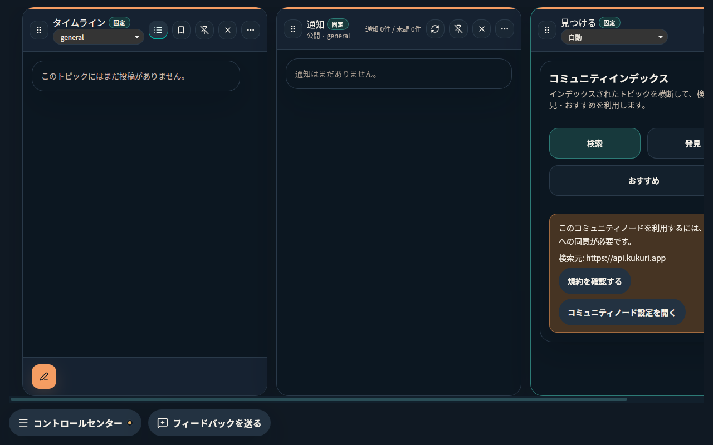
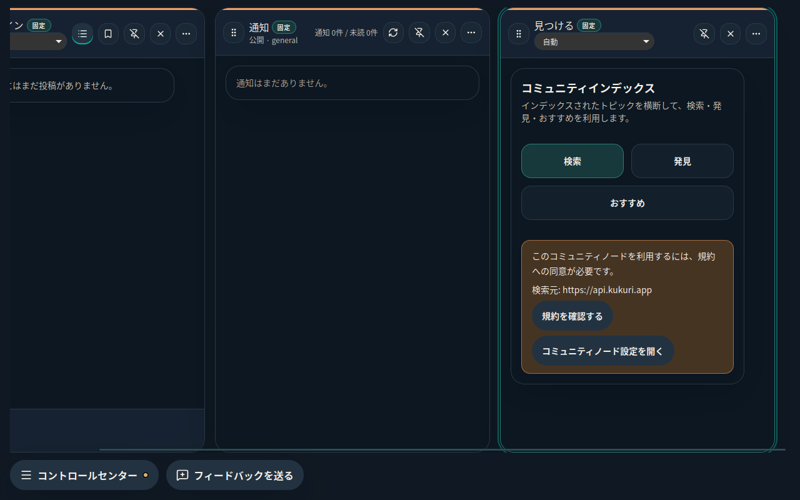
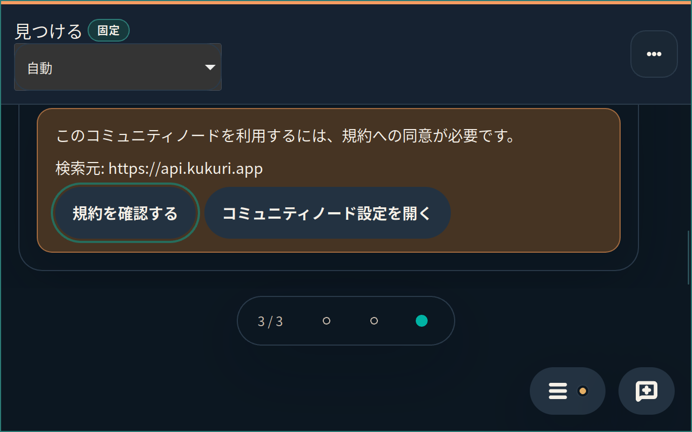
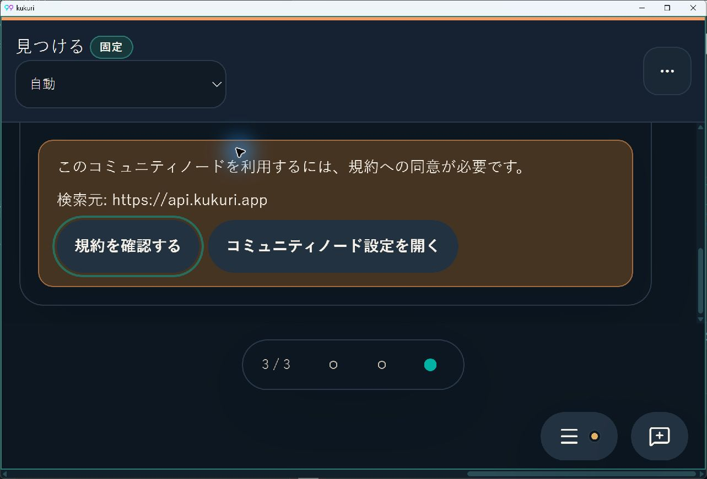

# 2026-09-10 幅変更後も表示中のColumnを維持する

- Status: current
- Supersedes: None（[前回の文字密度・内部折返し](2026-09-09-918-content-density.md)は引き続き有効。今回は外側Canvasの幅変更への補足）
- Superseded by: None
- PR識別子: `codex/issue-918-reopen-conditional-clipping`、[Issue #918](https://github.com/KingYoSun/kukuri/issues/918)、Scope `918-r2`。
- 対象・利用者・目的: Exploreの閲覧者が、windowを縮めたりWebViewを拡大した後も、選択していた検索・発見・おすすめとNode回復操作へ到達できること。
- 採用: 直前まで全幅を表示していたactive Columnだけを幅変更に追従させる。手動で離れた閲覧位置を引き戻さず、CSS、文字密度、既定構成、span、検索・同意条件は保持する。

## 同条件の比較

Ubuntu 24.04.5 / GNOMEのXWayland、日本語、dark、3カラム、アプリ内容領域1600×800→1280×800。左はv0.2.1-preview.1の配布AppImage、右は同repositoryの修正候補の製品Tauri build。Node未同意の同じ試験profileを使う。

| 変更前 | 変更後 |
| --- | --- |
|  |  |

修正前のExploreはright1392pxでCanvasの右端1264pxを超える。修正後はright1240pxとなる。Workspace内部のscrollWidthは372pxのまま。別カラムの部分表示は既存のCanvas横scrollであり、全カラムを縮めて同時に収める変更ではない。

## native 200%と操作の確認

### Ubuntu / WebKitGTK

1280×800のWebViewにnative zoom 2を適用し、実効640×400・devicePixelRatio 2を確認。Explore activeと3カラムを保持し、最後のtabから実キーボードのTabで規約確認へ移動できる。focus対象の矩形は `x=51, y=173, width≈130, height=48`、中央のhit testは対象buttonに一致する。

### Windows / WebView2

1280×840のWebViewでnative zoom 2、実効640×420を確認。OS表示scale 150%と合成したdevicePixelRatioは3。実pointerの縦scrollでNode案内と回復buttonへ到達し、Node設定を開きEscapeで戻る操作を確認する。拡大／100%への復帰でactiveと保存Column構成は維持する。

通常のresizeは配布設定のまま確認した。zoom試験だけは、製品Tauriを同じsourceからbuildし、非追跡の検証用capabilityで `core:webview:allow-set-webview-zoom` を許可した。native zoom APIは既定capabilityでは拒否されることも確認済み。配布設定・CSP・製品capabilityの変更は0で、この試験設定はPRへ含めない。CSS zoomや別mock hostの成功をnative zoomの証拠に置き換えていない。

## 検証・未確認

検証コマンド、AC／INVAR・状態遷移との対応、artifact識別子、再現と未確認事項は[作業記録](../progress/2026-09-10-918-reopen-conditional-clipping.md)へ集約する。新規browserは3言語×2themeのresize／保存復元と、手動scrollの負の条件を検証する。既存layout・localization・computed typographyも維持する。

変更はCanvas幅の変化時の表示補正と、scroll時の可視状態記録だけで、network／store購読／pollingを増やさない。新observerとlistenerはcleanupで解除する。CSS／色／semantic label／targetの変更がないため、screen reader・High Contrast全体の再監査やGPU／大量一覧の性能評価は対象外。視覚baseline・独立監査・最終CIの結果は作業記録を参照する。
