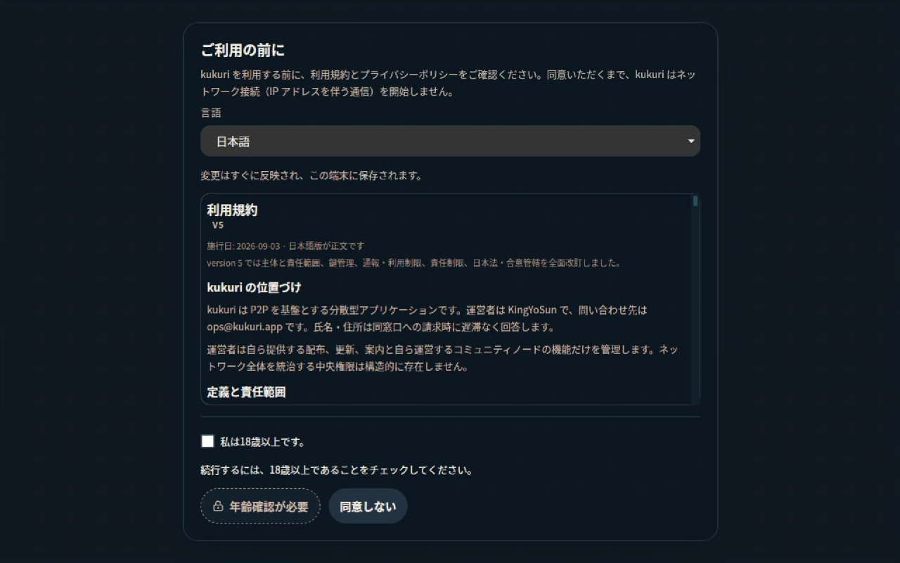
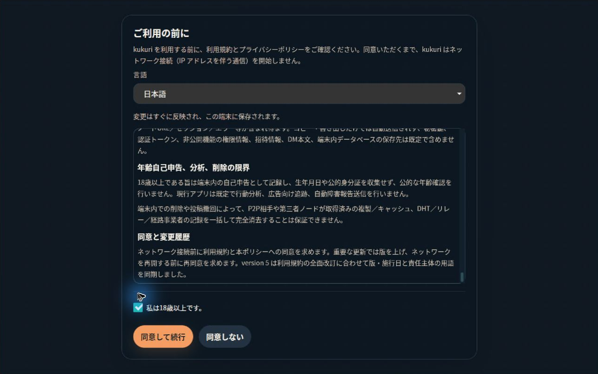
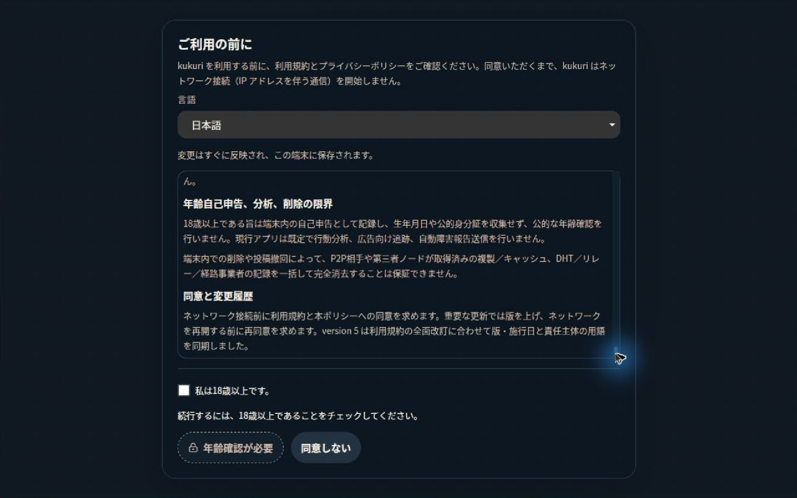
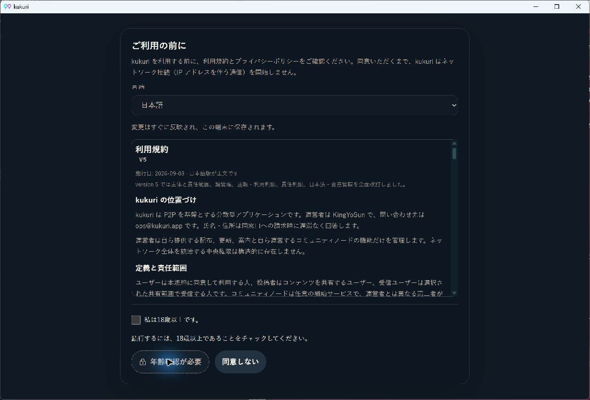
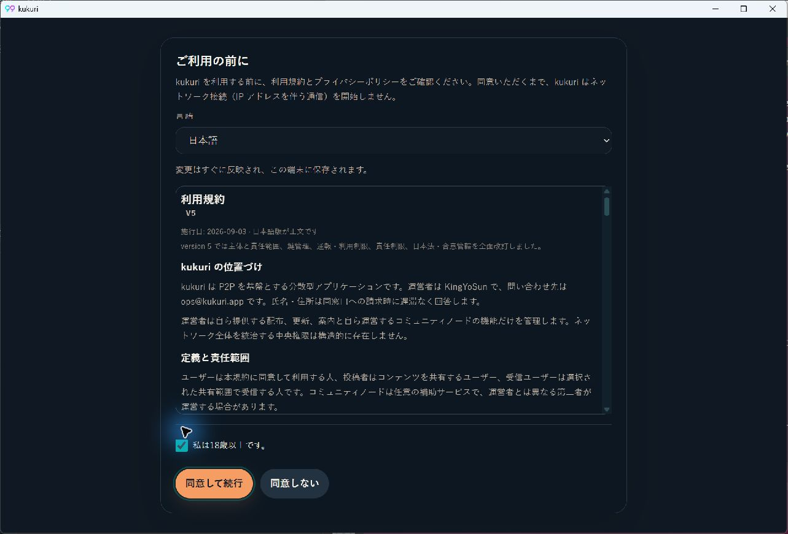
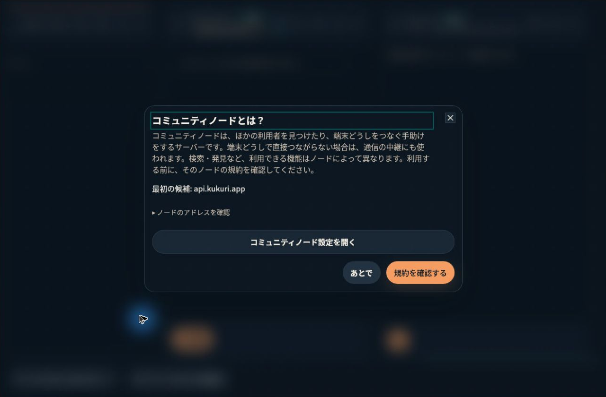

# 2026-09-10 年齢未確認の同意ボタン

- Status: current
- Supersedes: [2026-09-09 同意画面の操作領域](2026-09-09-consent-gate-affordance.md)の無効状態の採用判断。文書scroll・footer分離・同意境界は継承する。
- Superseded by: None
- PR: [#969](https://github.com/KingYoSun/kukuri/pull/969)、Issue #916、Scope `916-r1`
- Surface / user / purpose: 初回・再同意gate。年齢未確認のため操作できないことを、ボタン自体から理解できるようにする。
- Summary: native disabledと常時理由を維持し、鍵アイコン＋「年齢確認が必要」相当の状態名、中立色背景、破線、影なしを採用。選択後は従来のprimaryと同意action名、pendingは既存の処理中文字。
- Conditions: Ubuntu24 / AppImage内WebKit2.50.4 / XWayland / RDP、ja/dark/1280×800（再起動・受諾確認は既定1280×840）。Windows通常Tauri / WebView2 152.0.4191.66 / ja/dark/1280×840。browserは3locale×2theme、1280×800・390×844・760×480・390×541。実zoomはUbuntu24の隔離WebKit2.52.6ホストで2.0を確認。
- States: 未選択・選択・再解除・pending・保存失敗/retry・拒否・現行/旧版年齢申告・locale保存失敗。保存失敗等は既存App/Story/IPC fixture、通常配布物は未同意から明示同意後の初回案内までを確認。
- Accessibility / interaction: 48 Story条件でaddon-a11y違反0。文字contrast最小4.79:1、無効境界最小4.69:1。実pointer・Tab/Shift+Tab・Space/Enterと無効操作の保存なしを確認。Linux実zoomで本文末尾、focus、操作到達を確認。
- Performance: 新規network/observer/polling/animationなし。既存の有限なgate表示に状態名とアイコンを追加する局所変更で、重い一覧の追加はない。
- Validation: [作業記録](../progress/2026-09-10-916-reopen-disabled-affordance.md)、[独立監査PASS](../progress/2026-09-10-916-reopen-independent-audit.md)、[実機source/hash/保存確認](assets/issue-916-reopen-native-checks.json)、[contrast](assets/issue-916-reopen-contrast.json)、[実zoom](assets/issue-916-reopen-webkit-zoom.json)。Linux UI gateはVitest1314、browser152、visual20成功。全画面1%で見逃されたbutton差分を、対象0.1%とbutton単体画像比較で保護する。
- Not verified: 音声screen reader、OS設定としてのWindows High Contrast、Windows実engine200%zoom。Linuxの隔離ホスト/実zoomはAppImage自体のzoom確認とは区別する。Windows全Rustのtransport1失敗はLinux CIと境界testで補完し、Windows全体成功とは扱わない。
- Review result: 独立監査対象の製品/test head `df35d7f6`でPASS、blocker0。最終CI/mergeの現在判定はPRを参照。
- Exceptions: 製品契約の例外なし。無効clickにtoastを出すために同意のguardを変えない。旧記録の当時の本文は書き換えず、無効状態の判断の後継先を明記する。

## 同じUbuntu24環境での配布版比較

公開 `v0.2.1-preview.1` では専用disabled色は適用済みだったが、通常action名と実線輪郭が有効なoutline buttonに見えた。候補では色以外の手掛かりを加えた。headerの言語選択表示には本Issue前にmerge済み#915の差分があり、同意ボタンと本文/操作領域の比較とは分ける。

## Windows WebView2

同じ通常Tauri exeで、無効click後もgateを維持し、選択後はTabで有効buttonへ移動できる。再解除すると鍵アイコンと状態名が戻る。

## 明示同意後の通常経路

試験profileで年齢選択→Tab→Enterの後に同意記録が作られ、runtime初期化後の案内へ進むことを確認した。無効click・拒否では保存もaccount作成もないことを別の新規profileで独立確認した。

実200%zoomの本文末尾・有効focus・再解除画像は[作業記録のzoom節](../progress/2026-09-10-916-reopen-disabled-affordance.md#実200-zoom)にまとめる。
