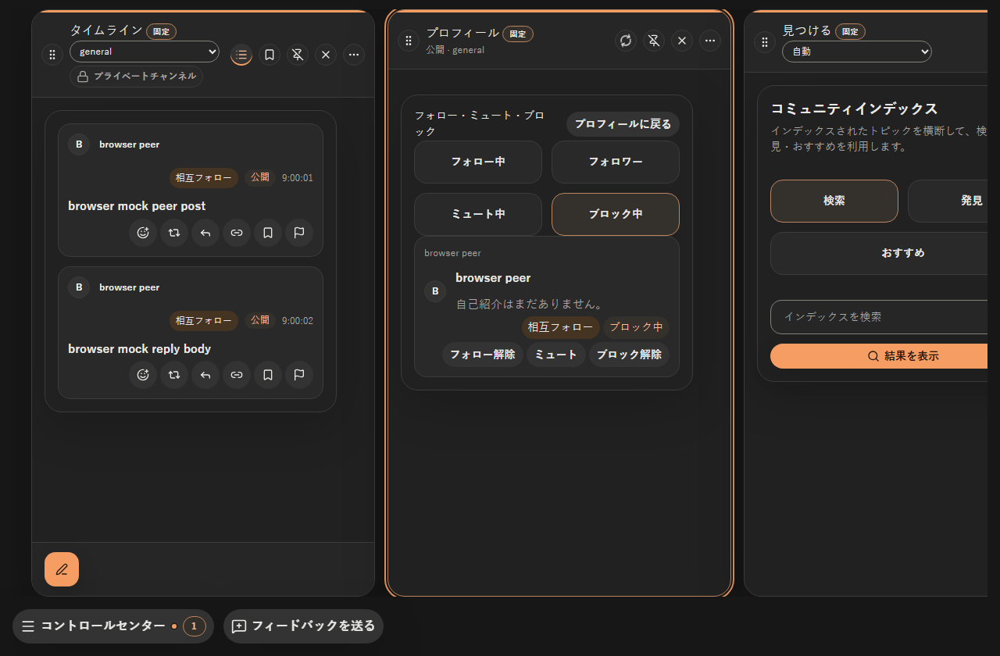
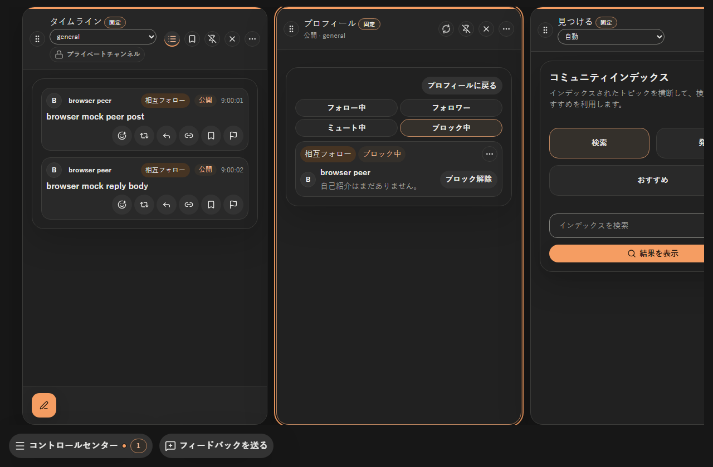
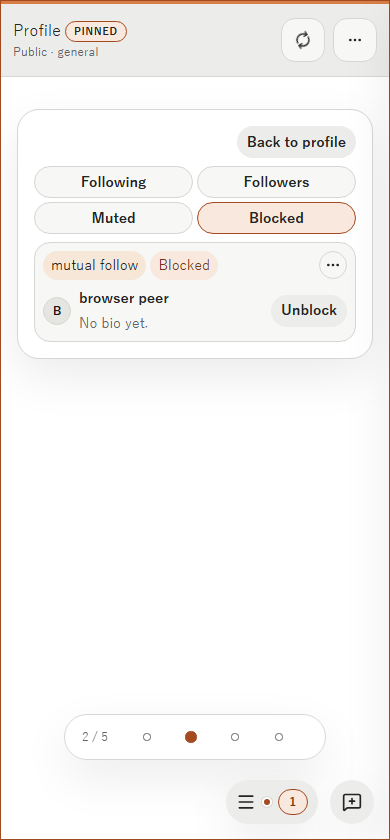

# プロフィール一覧と投稿の密度改善

- Status: current
- Supersedes: None
- Superseded by: None
- Issue: #999
- PR: [#1000](https://github.com/KingYoSun/kukuri/pull/1000)
- Surface / user / purpose: Profile関係一覧、PostCard、Column本文。利用者が関係操作と投稿内容を短い視線移動で把握できるようにする。
- Summary: 冗長見出しと重複名を除去。状態バッジを最上段へ移動し、副操作を右上menu、主操作を名前・bioの右へ配置。関係一覧と投稿の余白を縮め、Column左右の余白を均等化。
- Conditions: Windows Chromium、1280×840 ja/dark、1024×840 zh-CN/dark、390×840 en/light。blocking 1人、mutual、既定bio、通常投稿。storyは4一覧／empty／loading／error／self／長文を用意。
- Accessibility / interaction: 名前付きmenu、既存ContextActionMenuの矢印／Escape／focus復元、主操作と副操作のcallbackを確認。実browser操作と寸法testは3幅で成功。dark/light・通常/長文のaxe検査はpanel/menuとも違反0件。Windows WebView2とUbuntu24 WebKitGTKでも描画とmenuを確認。screen readerとRDP直接入力は未確認。
- Performance: 新しい取得・polling・subscriptionなし。行を走査する既存mapと、開いたmenu対象の検索のみ。大規模一覧の性能改善は対象外。
- Validation: 詳細と最終結果は[progress](../progress/2026-09-13-999-profile-post-density.md)を参照。
- Review result: 下の同条件before/afterで要求した配置と余白を確認。Windowsの変更前実測は左右16/48px、変更後16/16px。行高181.25→100.30px。
- Exceptions: なし。色・font・APIの意味は変更しない。

## Preview

変更前:

変更後:

