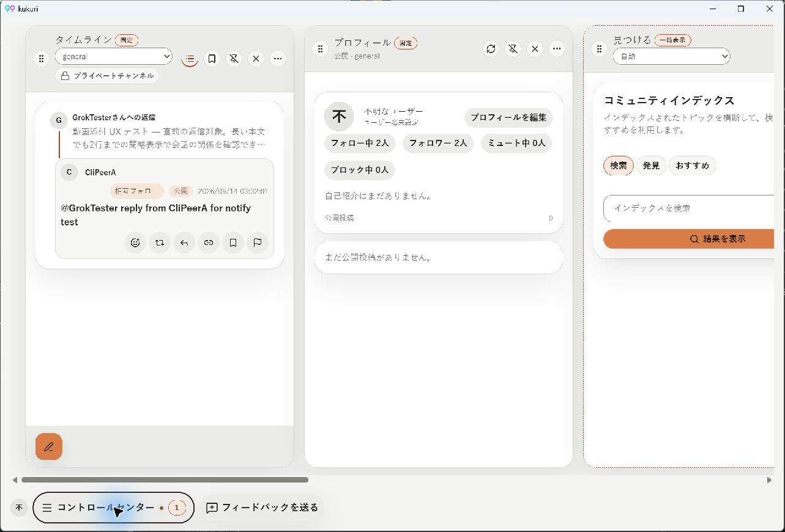
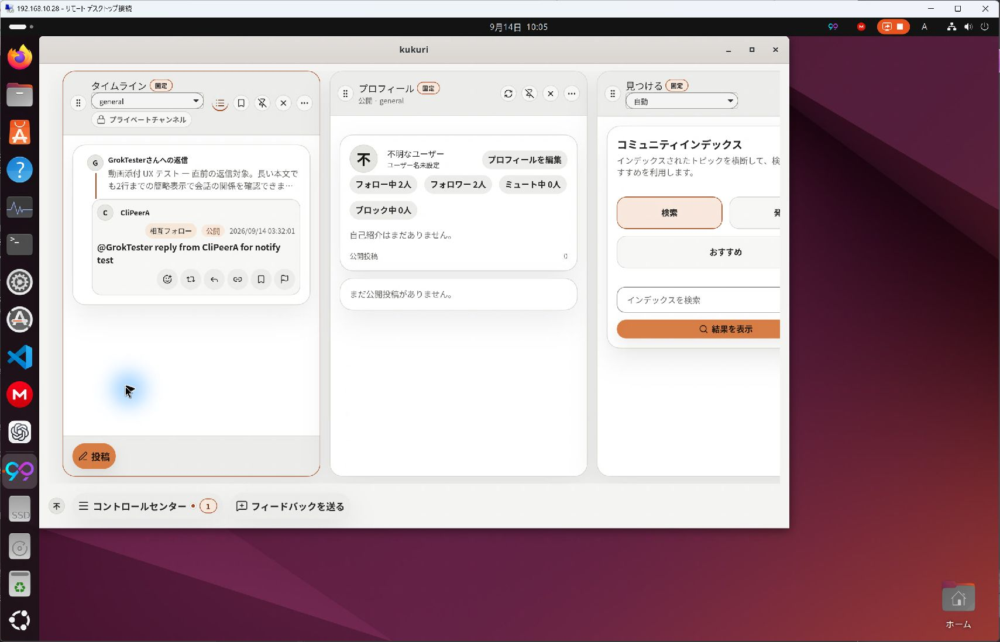
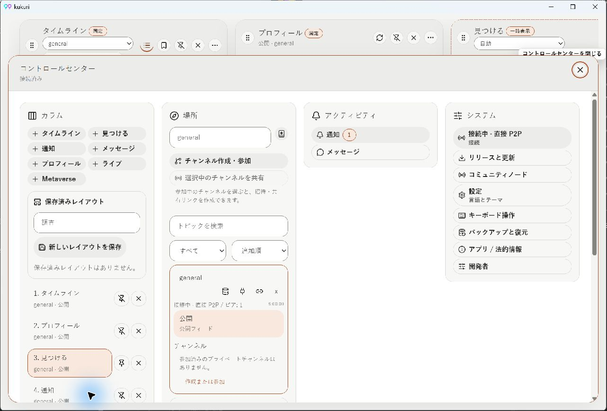
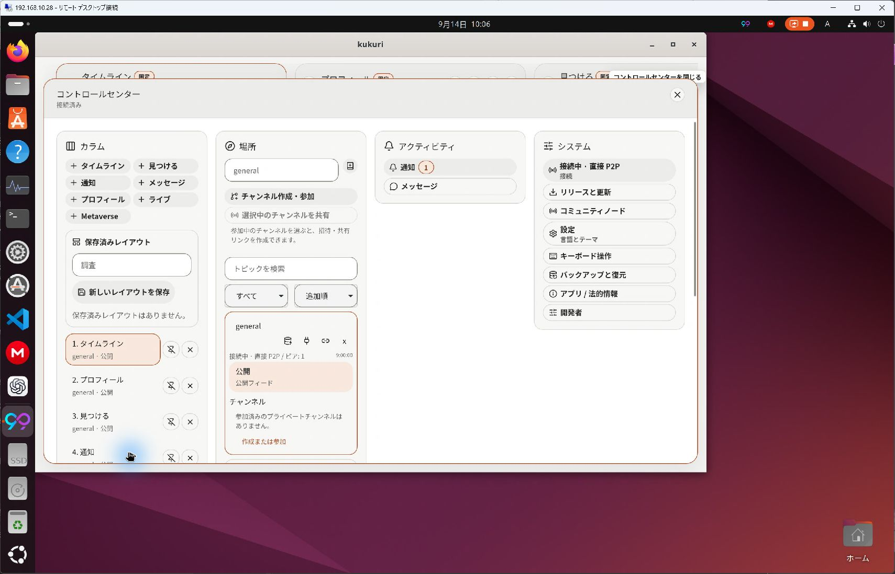

# 返信表示・カラム下端・Control Center・見つけるの密度

- Status: current
- Supersedes: None
- Superseded by: None
- PR: [#1017](https://github.com/KingYoSun/kukuri/pull/1017)
- Issue / Scope revision: [#1016](https://github.com/KingYoSun/kukuri/issues/1016)、2026-09-14-v2。
- 対象: タイムラインの閲覧者とカラム管理の利用者。直前の返信先から今回の投稿へのつながりを読み取り、操作の重なりをなくす。追加承認により「見つける」の検索・発見・おすすめも1行のコンパクトな表示にする。

## 採用した表示

返信先の簡略行を返信カードの前・外側に置き、接続線で続ける。引用リポストの内部カードと区別し、親の本文は最大2行、添付のみなら添付数の表示とする。Threadの親表示抑制、制限対象の非表示と各操作の対象は維持する。日時は年・月・日と秒までを端末timezone・選択localeで表示する。

Canvasの高さ内で下端に`--space-sm`の余白を設ける。狭幅の固定操作群も同じ分だけ上げ、投稿ボタンと下辺を揃える。Control Center表示中は背景の操作群を隠し、閉じた後の描画を待ってtriggerのfocusを復元する。

「見つける」の3種類の操作切替は高さ2rem・pillの既存密度へ合わせ、1行に並べる。本文文字サイズと選択状態・検索実行処理は維持する。

## 条件と証跡

- Browser: Chromium、返信はja/en/zh-CN × 390/759/760/1440px、余白1024×768、見つけるja/en/zh-CN × 390/1280px。既存のdark/light、resize、検索・設定遷移testも使用する。
- Visual: GitHub ActionsのLinux/Chromium生成。新規reply-parentのdark 1440px / light 390pxと既存surface。Windowsではsnapshot比較を行わない。
- Native: Windows WebView2とUbuntu24 WebKitGTK（`ssh local2`で別worktreeを用意し、Windows Remote DesktopからComputer Useで操作）。既存のdebug Tauri hostに変更後のfrontendと固定mock fixtureを読み込ませる。nativeの描画・入力検証であり、今回変更していないRust backendや実ネットワークの統合検証を代替しない。
- Native表示: 日本語・light、既定1280px前後。両OSで返信先→返信・年月日時分秒・横scrollと下端余白、センターのアバター非表示とその位置をクリックしてもmenuが開かないことを確認。Ubuntu24はEscape→Enterによるセンター再openも確認。
- Windowsも再確認でEscape→triggerの可視focus→Enterによる再openが成功。両OSで追加のExplore 3ボタンがコンパクトな1行となることを確認（[Ubuntu24の画像](assets/1016/linux-explore.jpg)）。

| Windows | Ubuntu24 |
| --- | --- |
|  |  |
|  |  |

## Accessibility・性能・未確認事項

親→返信のDOM順と投稿日時の`time`要素、投稿者・返信callbackの対象ID、表示抑制、pointer/keyboardでの選択・open/closeをtestする。文字を縮小して密度を作らず、日時の折り返しとfocus可視性を確認する。完全なscreen reader適合やtouch実機の検証結果は主張しない。

追加fetch、interval、media再生はなく、既存の1投稿あたりの描画量に小さなwrapperと日時formatを追加するのみ。大規模一覧の性能benchmarkは今回の表示変更では実施しない。

検証commandの最終結果、修正前の失敗、追加発見は[作業記録](../progress/2026-09-14-1016-timeline-ui-fixes.md)を参照する。新しい表示はユーザー承認済みの計画と追加要件に従う。必要な検証が完了するまではPRをdraftとして扱う。
