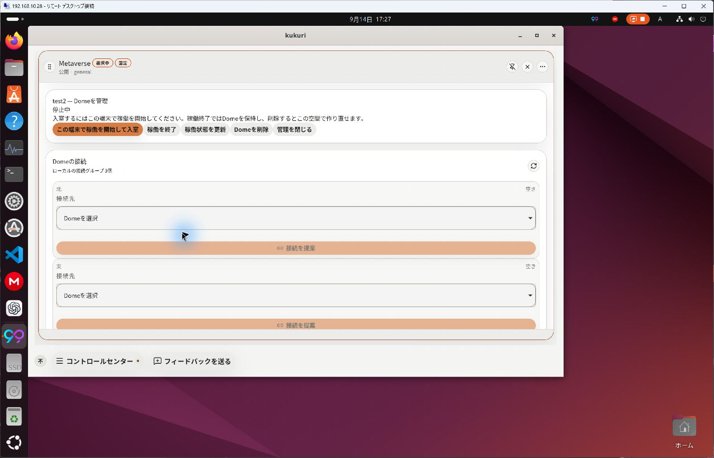
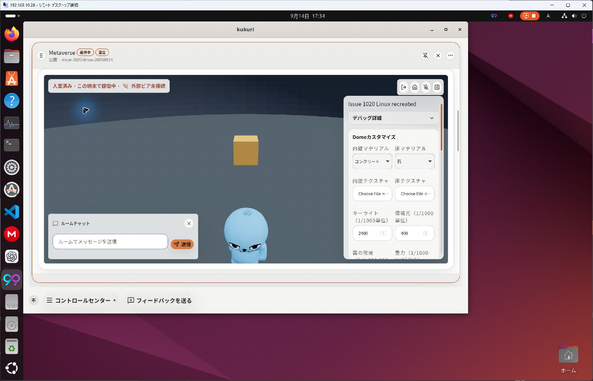
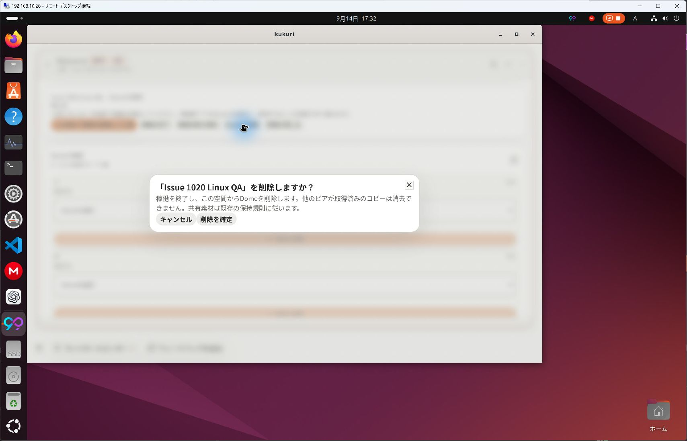

# 所有Domeの管理・再開・削除

- Status: current
- Supersedes: None
- Superseded by: None
- PR: [#1026](https://github.com/KingYoSun/kukuri/pull/1026)、Issue #1020、scope revision `2026-09-14-r1`。
- Surface / user / purpose: Metaverseを利用するownerが停止中・再起動後でも入室せずにDomeを管理できる。
- Summary: 一覧の管理導線、作成直後の開始・入室、停止と削除の分離、削除取消・再試行、所有枠の説明、hosting・入室・外部ピア状態の区別。成功したadmissionだけがsceneへfocus/scrollする。
- Conditions: Windows 11 Pro 10.0.26200 / WebView2 152.0.4191.66、Ubuntu24 / WebKitGTK 2.52.6（Remote Desktop越しの実pointer/keyboard）。light / ja。Windows window 1283×871、Ubuntu app約1282×841（RDP画面1707×1100）。3列相当のMetaverse Column、停止/作成/稼働/未接続/確認Dialog/削除後/再作成。
- Code: 最終native確認 `ade5a5ea`。Linuxは同commitの専用worktreeをbuildし、Windowsも同commitでTauriを再build。機能コードの追加変更なし。

## Previewと実操作

| 確認 | Windows | Ubuntu |
| --- | --- | --- |
| 停止中・再起動後の管理 | 保存済みDomeで確認。最終buildでも再開・入室成功 | 以前一覧から消えた所有Domeが表示され管理可能。確認用Domeもprocess終了→再起動後に停止カードから管理可能 |
| 作成→開始→入室とfocus/scroll | 成功 | 専用Context `issue-1020-linux-20260914` で成功 |
| 停止とDome保持 | 確認 | 再起動後の保存済みlease終了と保持を確認 |
| 削除取消 | Cancelで保持 | Escapeで保持し削除triggerへ戻る |
| 削除→作成枠復帰→再作成→入室 | `Issue 1020 再作成確認` で成功 | `Issue 1020 Linux QA`を削除し`Issue 1020 Linux recreated`で成功 |
| 他のDome | 同Contextの他ownerカード保持 | 既存general/test2には管理readだけ実施し削除していない |

Windowsの一連の削除flowは先行buildで実施し、最後の世代guard追加後は同じ再作成Domeのrestart→管理→入室を再確認した。Ubuntuの一連のflowは最終build。Beforeは[修正前の停止画面](../progress/assets/2026-09-14-1020/before-windows-stopped.png)。Windowsの[最終再起動管理](../progress/assets/2026-09-14-1020/windows-final-restart-management.jpg)、[最終入室](../progress/assets/2026-09-14-1020/windows-final-entered.jpg)、Ubuntuの[再起動](../progress/assets/2026-09-14-1020/linux-restart-stopped.jpg)、[削除完了](../progress/assets/2026-09-14-1020/linux-deleted.jpg)も保存した。

## 確認範囲

- Accessibility / interaction: semantic button、Dialogの対象名/説明、busy中の二重操作抑止、取消、focus復帰、sceneへの成功時focusをcomponent/Playwrightと実pointerで確認。UbuntuではEscape取消も確認。screen reader全体、High Contrast、200% zoomの網羅試験は未実施。この変更でその対応を保証したとは扱わない。
- Performance: 3D/physicsの新しい常時loopや描画方式は追加していない。管理readと失敗回復を既存refreshへ接続。benchmarkによる性能改善主張なし。
- Validation: 詳細は[作業記録](../progress/2026-09-14-1020-dome-management.md)とPR CI。Dome管理stories（停止/稼働/失敗）、Vitest、Playwright management flow、Rust Dome/delete/世代境界tests、実DBのCN競合tests、harness delete/restart/recreateが対象。
- 観測した例外: Ubuntu再起動後のConnection panelに一時的な `sending to iroh_docs actor failed: sending into a closed channel` 表示が出た。既存Connection欄のrefresh後に回復し、Dome削除・再作成・入室は成功した。発生を無かったことにせず、今回の管理操作の成功と区別する。
- Review result: 固定scopeの操作確認PASS。世代/owner/Context/外部送信の独立監査も`ade5a5ea`でPASS。必須CI成功とmerge後tree照合はIssue lifecycleの別gate。
- Exceptions: メニュー全体、camera、fullscreen、Column幅は #1021–#1025 の別scopeとして維持。未確認事項を確認済みへ読み替える例外承認は行っていない。
