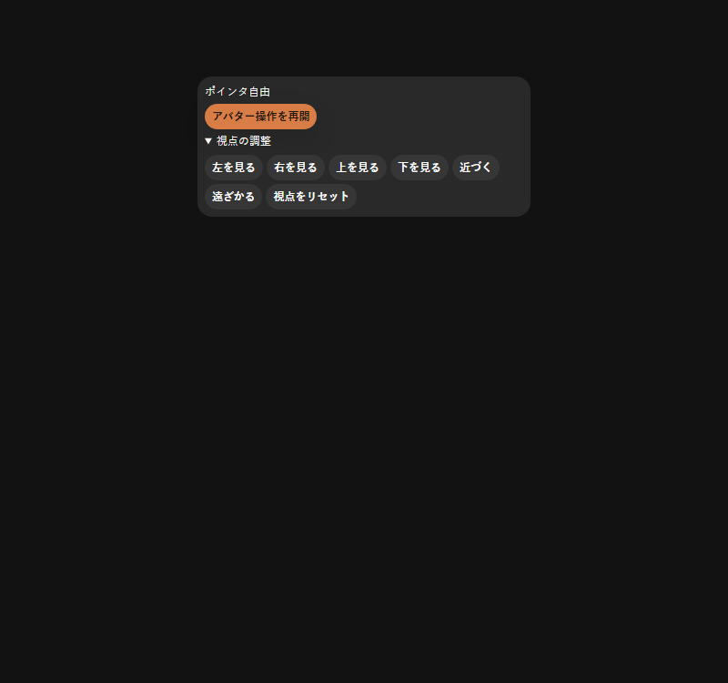
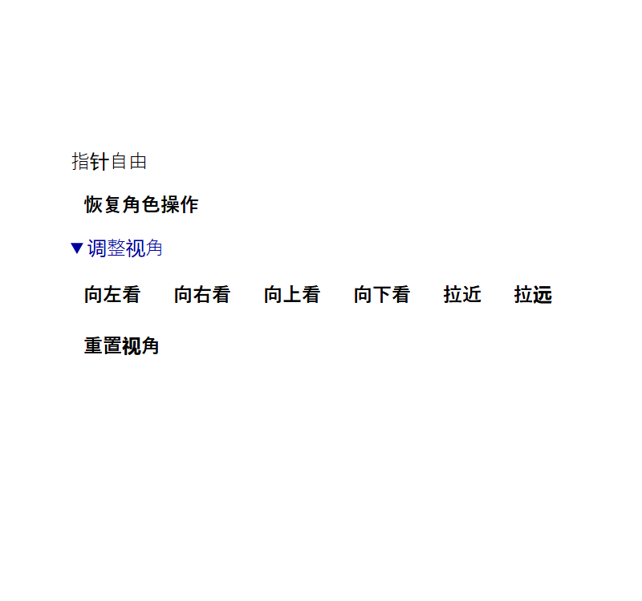

# #1021 アバター追従カメラ

- Status: current
- Supersedes: None（既存のDome管理・入室・transitionの採用判断は維持）
- Superseded by: None
- PR: [#1027](https://github.com/KingYoSun/kukuri/pull/1027)
- Preview: [Windows before](../progress/assets/2026-09-14-1021-camera/windows-before.png)、[after](../progress/assets/2026-09-14-1021-camera/windows-after.png)、[中央clickで開始](../progress/assets/2026-09-14-1021-camera/windows-center-click.png)、[Ubuntu24](../progress/assets/2026-09-14-1021-camera/linux-locked.png)
- Surface / user / purpose: 入室した利用者が、アバター全身と足元を見ながら移動・見回し、チャット／HUDと往復する。
- Summary: 三人称追従、固定中のマウス回転・wheel zoom・R reset、中央clickで開始。UI表示時は固定解除。「アバター操作」と「視点の調整」を区別する。ドラッグ回転案はclick入力と競合するため採用しない。#1024のサークルメニュー本体は含めない。
- Conditions:
  - Platform: Windows WebView2ローカル、Ubuntu24 WebKitGTKをRemote Desktopから操作。起動・frontend配置はSSHを併用。
  - Viewport: Windows 1283×871・標準3列／1列／3列への復元、2560×1440 fullscreen。Ubuntu24の既存1280px級window／fullscreen。
  - Theme / locale: 実機は日本語light。操作パネルはStorybookでen／ja／zh-CN、light／darkも確認。
  - State: idle、requesting、locked、unavailable、inactive、HUD／chat focus、blur／suspend、初期／zoom／reset。
- Accessibility / interaction: Storybook 9条件のaxe違反0。keyboard代替・通常Tab・IME除外・draft復元をtestで確認。browserで200%相当の拡大、forced colors、reduced motionを確認。実screen readerと物理touchは未確認。
- Performance: camera計算は既存frame loopで実行し、描画group refと再利用Vector3を使用。frameごとのReact／store／API更新なし。VRMのprecise bounds計算はロード時だけ。GPU定量比較は未実施。
- Validation: [作業記録のvalidation](../progress/2026-09-14-1021-metaverse-camera.md#validation)とPR checks。カメラの実描画変化とmove APIへ流れないことを同じbrowser testで確認する。
- Not verified: Ubuntu24 RDPの固定中に、Computer Useから相対mousemoveが届かないため、実マウスの回転は自動検証の対象外。追加結果はPRへ記録する。fullscreenでは既存#1023、幅復元では#1022の制約が残る。
- Review result: 承認済みの操作契約を採用。通常表示の全身framing、中央clickによる開始、UIへの入力移譲を確認。mergeは最終headの必須CIと記録した確認範囲に基づいて判定する。
- Exceptions: fullscreen／Column幅の既存課題をこのcamera変更へ混ぜない。RDPの相対入力を確認済みと扱わない。

