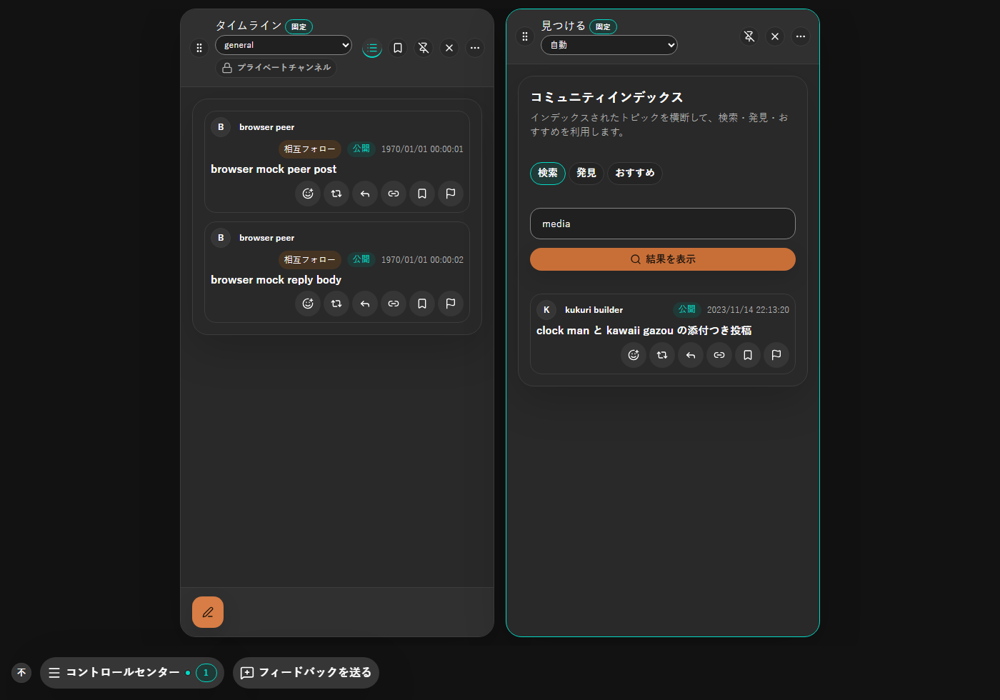
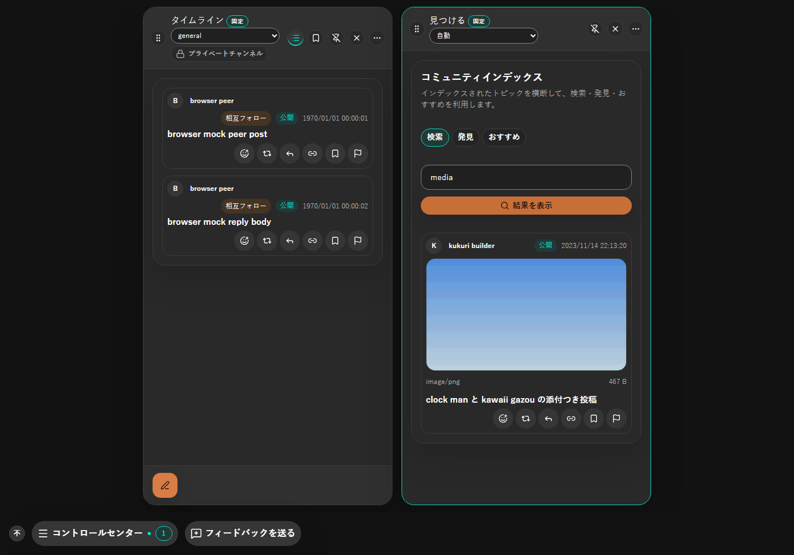
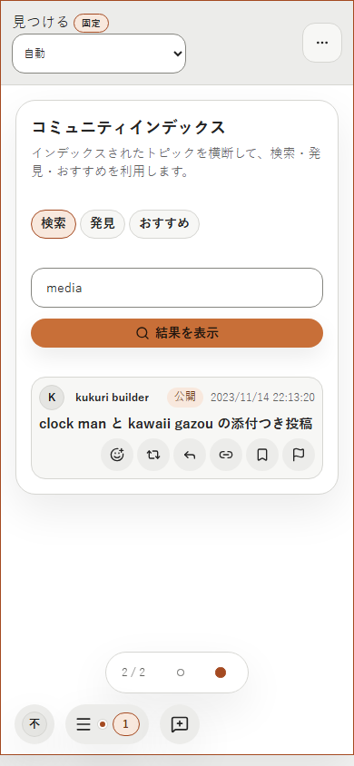
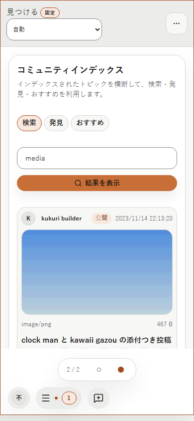
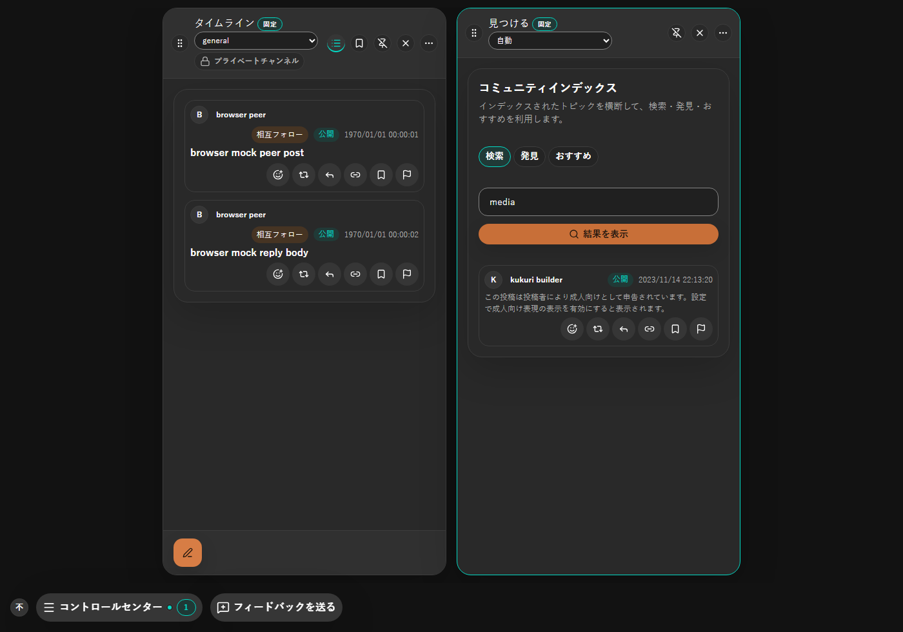
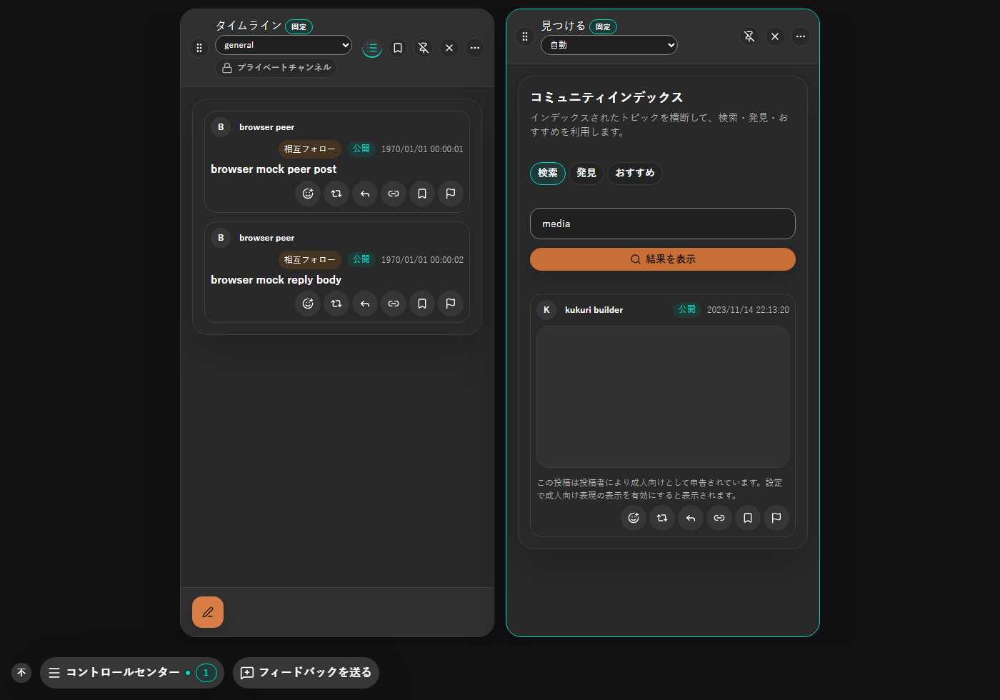

# 2026-09-16 「見つける」の解決済み投稿のメディア表示

- Status: current
- Supersedes: None
- Superseded by: None
- PR: [#1070](https://github.com/KingYoSun/kukuri/pull/1070)
- Issue / Scope revision: [#1052](https://github.com/KingYoSun/kukuri/issues/1052)、2026-09-15
- Preview: 下表の before / after 画像（`assets/1052/`）
- 対象 surface / 利用者 / 目的: 「見つける」Column（検索・発見・おすすめ）の閲覧者。ローカル解決済みの署名付き投稿が持つ添付画像を、タイムラインと同じ見た目・同じ成人向けゲートで確認できるようにする。
- 変更分類: 不具合修正（ADR 0014 §2）。

## 採用した表示

解決済み投稿のカードは、タイムラインと同じ `PostMedia` をそのまま使う。プレビュー画像、`image/png` と容量のメタ行、複数添付の枚数バッジ、画像 viewer への導線は共有 component の既存挙動をそのまま引き継ぐ。Explore 専用のメディア表示規則は作らない。

未解決・解決失敗の entry は添付を持たないため、これまでどおりメディアを描画しない。node が返す索引テキストや派生タグからの補完は行わない。

成人向けラベル付きの解決済み投稿は、表示設定 OFF の間はプレースホルダーのままで、バイト列の取得もデコードも行わない。設定を ON にすると取得して表示し、OFF へ戻すと表示済みの object URL を破棄して再びプレースホルダーへ戻る。

## 条件と証跡

- Platform: Chromium（Playwright、deterministic mock）。Windows WebView2 実機は未確認（下記）。
- Viewport: 1400×980 と 390×844。
- Theme: dark と light。
- Locale: ja（自動テストは en も通る）。
- State: 解決済み（添付あり）、成人向けラベル + 表示設定 OFF、未解決、解決失敗、取得待ち、取得失敗。

| 条件 | 変更前 | 変更後 |
| --- | --- | --- |
| ja / dark / 1400px |  |  |
| ja / light / 390px |  |  |
| 成人向け + 表示 OFF |  |  |

変更前は同じ投稿が本文とアクションだけで描画され、変更後はタイムラインと同じ画像・メタ行が出る。成人向けの代替表示は変更前後で同じ文言だが、変更前はメディア枠自体が無く、変更後はタイムラインと同じプレースホルダー枠になる。

## Accessibility・性能・未確認事項

画像は共有 `PostCard` の viewer trigger（`button`）として公開され、キーボード focus と Enter で viewer が開くことを Chromium の実操作で確認した。狭幅 390px でカラム内の横スクロールが発生しないことを同じ spec で確認した。

追加の polling や新しい API は無い。取得は既存のプリフェッチ経路に「表示中の解決済み投稿」を source として加えるだけで、対象は画面に出ている結果に限られ、結果の失効と Column の終了で対象から外れる。大規模一覧の性能計測は本変更では行わない。

未確認: Windows WebView2 と Ubuntu WebKitGTK の実機描画、物理タッチ・ペン入力、screen reader の読み上げ。視覚回帰 baseline（Linux/Chromium）には新しい surface を追加していない。

## Review result

- 一貫性: タイムラインと同じ builder・同じ component・同じゲートを使い、Explore 固有の分岐を増やさない。
- エラー防止: 未解決・解決失敗では引き続き推測補完を行わず、索引テキストを本文にしない。
- 主導権: 成人向け表示設定の ON / OFF が「見つける」でも即座に反映され、OFF では取得が起きない。
- 記憶負荷: 画像操作（開く・通報）がタイムラインと同じ位置・同じ導線になる。

## Exceptions

None。必要な確認の未実施は「未確認事項」に記載した。
