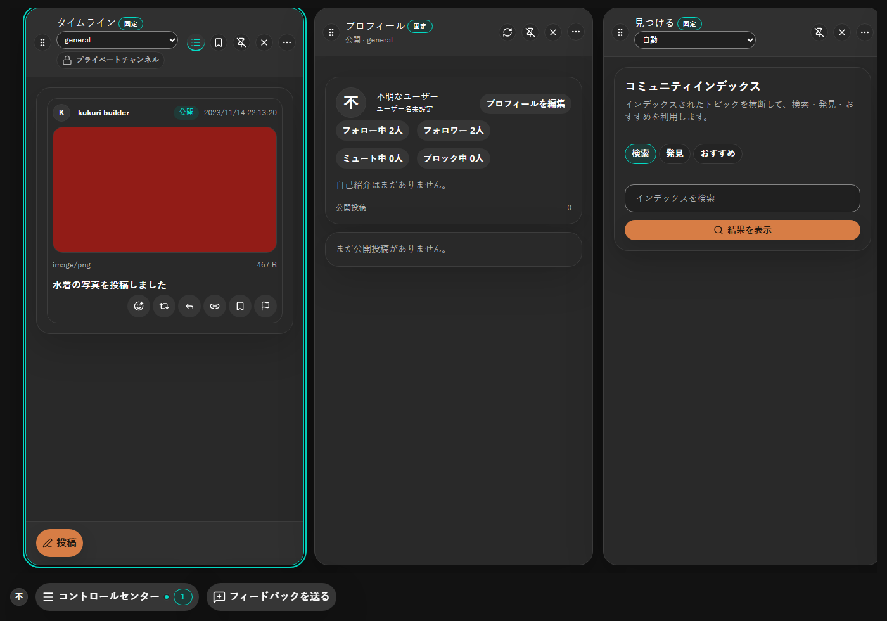
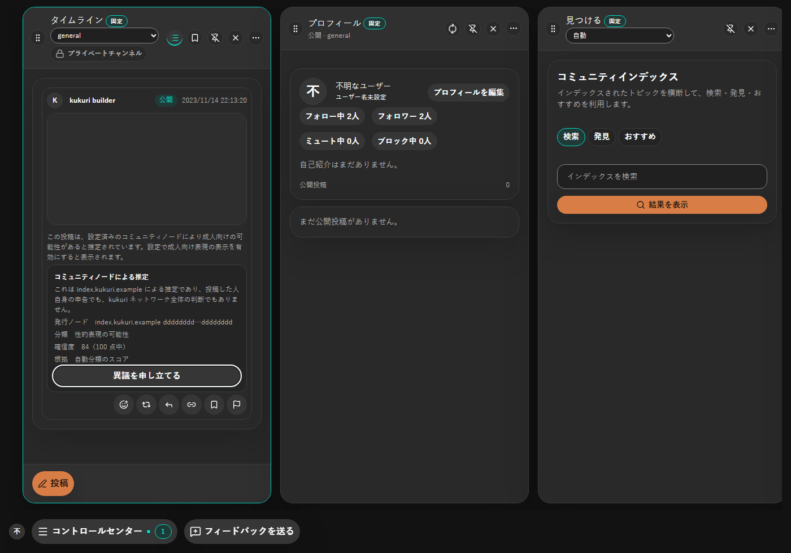
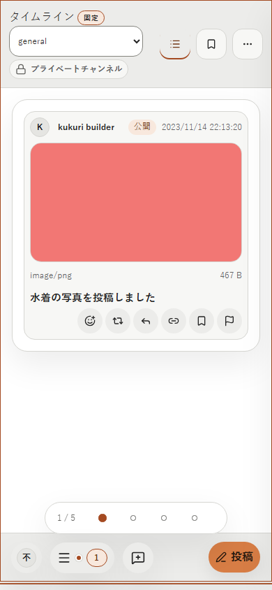
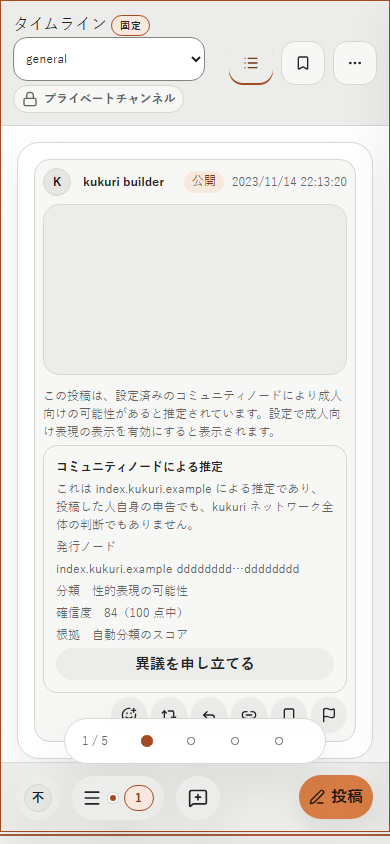
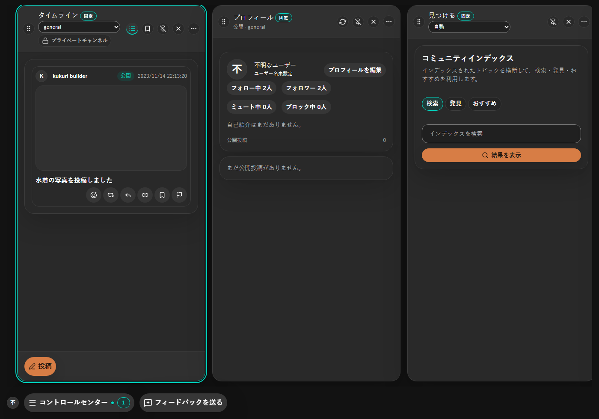
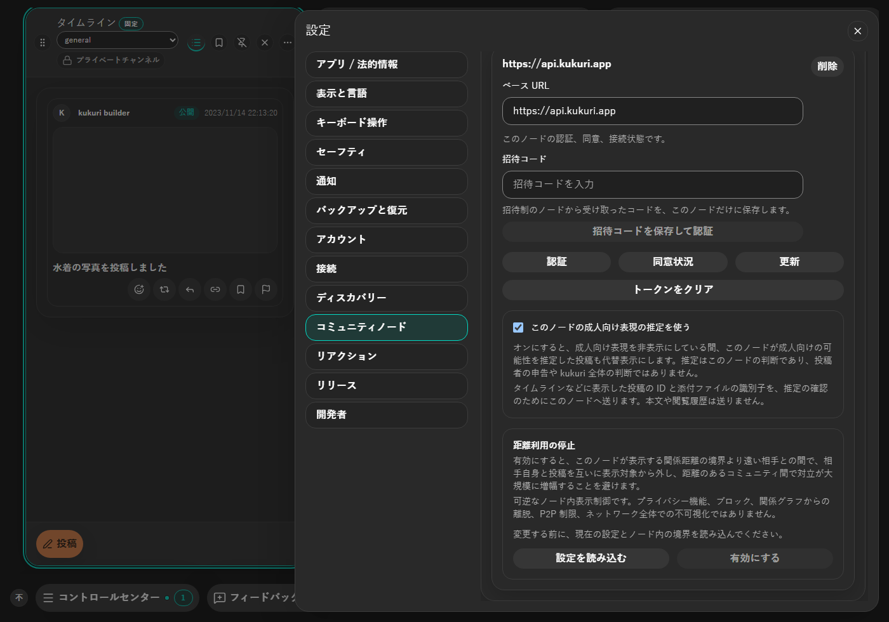

# 2026-09-16 タイムラインの content advisory 代替表示とノードごとの採用設定

- Status: current
- Supersedes: None
- Superseded by: None
- PR: 本 record を含む #1056 の PR（`Refs #1056`）
- Issue / Scope revision: [#1056](https://github.com/KingYoSun/kukuri/issues/1056)、2026-09-15（2026-09-16 追加要求: 採用ノードの設定と UI、照会中表示の分離）
- Preview: 下表の before / after 画像（`assets/1056/`）
- 対象 surface / 利用者 / 目的:
  - タイムライン・スレッド・ブックマーク・プロフィール・通知の閲覧者のうち、成人向け表現の表示設定が OFF の人。採用したコミュニティノードが成人向けの可能性を推定した投稿を、「見つける」（#1055）と同じ代替表示・説明・異議申し立て導線で見せる。
  - 設定利用者。コミュニティノードごとに「このノードの成人向け表現の推定を使う」を切り替え、送る情報と送らない情報を理解できるようにする。
- 変更分類: 既存画面の改善（ADR 0014 §2）。state 追加（照会中）、共有 component の拡張、設定項目の追加。

## 採用した表示

代替表示と説明ブロックは #1055 の部品（`PostGatedContent` / `PostAdvisoryNotice`）をそのまま使う。タイムライン専用の代替表示は作らない。引用元・返信先に推定がある場合も、カード全体を代替表示にする（自己申告ラベルと同じ規則）。通知はプレビュー文だけを「コミュニティノードによる推定」の文言へ差し替える。

照会中と確定後の表示を分ける（2026-09-16 ユーザー指示）。

| 状態 | メディア枠 | 本文 | 説明 |
| --- | --- | --- | --- |
| 照会中 | 脈動するスケルトンだけ。読み上げには「コミュニティノードの推定を確認しています」を通知し、`aria-busy` を付ける | 通常どおり表示（本文はメディア取得を伴わない） | なし |
| 推定あり（表示 OFF） | 静止した代替枠と「推定されたメディア」の文言 | 代替文言に置き換え | 発行元・分類・確信度・根拠と異議申し立て |
| 推定なし・照会失敗 | 通常表示へ戻る | 通常表示 | なし |

代替枠は従来の脈動スケルトンをやめ、静止した枠にした。照会中のスケルトンと確定後の代替表示が同じ見た目にならないようにするためである。見つけるの代替枠も同じ部品なので、同じく静止表示になる。

設定はコミュニティノードの各ノード欄に、チェックボックスと 2 行の説明を置く。1 行目で推定の意味（ノードの判断であり投稿者や kukuri 全体の判断ではない）を、2 行目で現在の状態に応じた送信内容（オン: 表示した投稿の ID と添付の識別子を送る、本文や閲覧履歴は送らない / オフ: このノードへは確認しない）を示す。説明は `aria-describedby` でチェックボックスに結び付ける。変更は既存の「ノードを保存」で確定する。

## 条件と証跡

- Platform: Chromium（Playwright、deterministic mock）。Windows WebView2 実機は未確認（下記）。
- Viewport: 1400×980 と 390×844。
- Theme: dark と light。
- Locale: ja（自動テストは en も通る。zh-CN は文言のみ追加し実画面は未撮影）。
- State: 推定あり（表示 OFF / ON）、照会中、照会失敗、採用 OFF、引用元・返信先の推定、通知。

| 条件 | 変更前 | 変更後 |
| --- | --- | --- |
| ja / dark / 1400px / 推定あり |  |  |
| ja / light / 390px / 推定あり |  |  |
| ja / dark / 1400px / 照会中 | 変更前は照会自体が無い |  |
| 設定 / ノードごとの採用 | 変更前は項目が無い |  |

変更前は、ノードが推定していてもタイムラインでは画像がそのまま表示されていた（基準 commit `04b403dc` で同じ spec を撮影）。変更後は照会が確定するまで取得せず、推定があれば代替表示になり、メディアのバイト列を要求しない。

## Accessibility・性能

- 異議申し立てボタンはキーボードでフォーカスできる（Playwright で確認）。照会中の枠は `aria-busy` と読み上げ用の状態文を持つ。
- 390px で横方向のはみ出しが無いことを確認した。画面下部の Column 切替インジケーターが操作行に重なるのは既存の narrow レイアウトの挙動で、本変更の差分ではない。
- 照会は 300ms でまとめ、subject ごとにセッション中 1 回だけ送る。照会中は該当投稿のメディア取得を待つため、画像の表示が照会 1 往復分遅れる（応答が無い場合も 10 秒で通常表示へ戻す）。これは表示設定 OFF 中の取得 0（INVAR-2）を優先した判断で、ユーザー承認済み。

## Validation

- Vitest: `DesktopShellPage.timelineAdvisory.test.tsx`（8）、`DesktopShellPage.communityNodeAdvisoryAdoption.test.tsx`（1）、`CommunityNodePanel.contentAdvisory.test.tsx`（3）、`useTimelineContentAdvisoryLookup.test.tsx`、`contentAdvisories.test.ts`、`postMediaView.test.ts`、`usePreviewableMediaAttachments.test.ts`。
- Playwright chromium: `timeline-advisory.spec.ts`（4）。
- Storybook: `Settings/CommunityNodePanel` に採用切替を配線。

## 未確認事項

- Windows WebView2 / Linux WebKitGTK の実機表示。本番ノードでの統合確認は C5（#1068）で行う。
- zh-CN の実画面。

## Review result

採用。例外なし。
