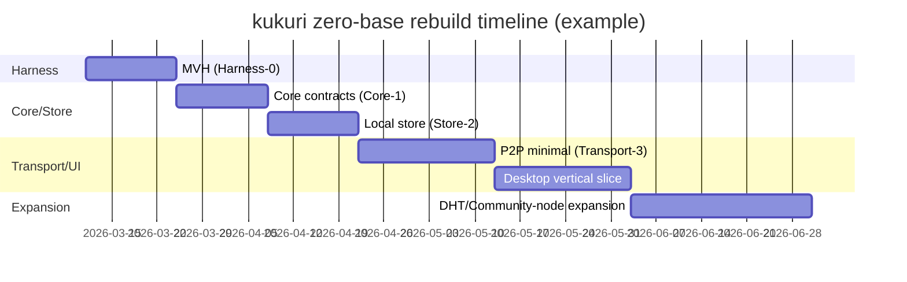

# kukuri ゼロベース再構築の開発計画とハーネス設計

## エグゼクティブサマリ

本レポートは、**最初に GitHub コネクタ（api_tool: github）が利用可能であることを確認し、指定リポジトリ KingYoSun/kukuri のみ**を対象に、コード／README／Issues／PR／コミット／CI・テスト導線／ドキュメント構造を読み、現状の複雑化要因を抽出したうえで、**「ゼロベースで腐敗度（コンテキスト汚染・テスト不安定・運用ドキュメント乖離）の低いリポジトリ」**として再設計するための、実務向けの再構築計画（MVPフェーズ、実装タスク、最小API仕様、移行手順、リソース配分）を提示します。  
その後、必要箇所に限り、**公式ドキュメント／原著論文／一次情報**（iroh/iroh-gossip、BitTorrent Mainline DHT/BEP-5、Nostr NIP、Tauri、Codex/OpenAI 公式、nyosegawa の Harness 記事）を参照して設計の前提を固めています。citeturn16search0turn16search8turn19search0turn17search1turn22search1turn15search6turn23search0

結論として、kukuri の「腐敗」を生む中心は **(A) UI/E2E を含む“重い統合”が品質ゲートの中心にあり、しかもフレークが連鎖しやすい**こと、**(B) ドキュメント・スクリプト・CI 導線が豊富だが“真実の所在”が分散し、エージェントにとって権威が同列化されやすい**こと、**(C) P2P（iroh-gossip + discovery + Mainline DHT）× Nostr（イベント/Threading/ID表現）× Tauri（デスクトップ特有E2E）× Community Node（Postgres/契約テスト/CLI）という複数ドメインの同時進行**にあります。  
ゼロベース再構築では、**(1) “最小実行可能ハーネス（MVH）”を先に確立し、(2) コアを小さな境界（core / store / transport / ui）へ切り出し、(3) E2E は“薄いスモーク + 重要シナリオのみ”へ再設計し、(4) DHT は最初から必須にせず（iroh でも DHT discovery はデフォルト無効である）、段階導入**するのが最もリスクが低いです。citeturn23search0turn16search0turn16search3turn22search1

---

## 現状短評

GitHub コネクタで取得できた Issues / PR / コミットから、現状の複雑点（「いま困りやすい箇所」）を短く列挙します。

第一に、**Desktop E2E（Tauri + WebDriverIO + tauri-driver）を軸にした heavy lane が、フレーク起点になりやすい**点です。実際に `invalid session id`、`Pending test forbidden`、UI描画待機の誤判定（selector が空のまま）などが、Issue として繰り返し扱われ、修正PRも継続投入されています（例：#181/#183/#185/#189/#194/#198/#200、PR #182/#184/#186/#188/#190/#195/#197/#199）。  
これは、Tauri の WebDriver 実行が**プラットフォーム依存（特に Windows は EdgeDriver のバージョン一致が要求され、欠けると“ハングしやすい”）**という構造リスクを内包していることと整合します。citeturn22search0turn22search1

第二に、**P2P の “発見（discovery）” と “配信（gossip）” と “UI反映” が一つの統合シナリオに編み込まれやすく、原因切り分けが難しい**点です。たとえば `cn-cli publish` → P2P受信カウント増 → しかし UI に出ない、のように「ネットワーク層の成功」と「UI層の可視化」が非同期でズレると、E2E 側は待機条件を増やしがちで、フレークの温床になります。

第三に、**ドキュメント群とハーネス／CIが“豊富であるほど腐敗が起きる”**（エージェントにとっては古いテキストも真実と同列になる）という問題が実際に顕在化しており、品質ゲートや Close Conditions を機械化する Issue/PR が複数あります（#168/#171/#174/#175、PR #169/#172/#176/#177/#178 など）。この方向性自体は正しいのですが、ゼロベースでは「ドキュメントを残す」より「テストと機械的ルールへ圧縮する」方を優先すべきです。citeturn23search0

第四に、設計・実装のロードマップ（例：トピック別タイムライン／スレッド再構築）も docs と Issue/PR とコミットに分散しており、**“現行の正”がどれかを判断するコスト**が上がっています（ドキュメントは 2026-02 頃の更新を含み、継続開発が続く）。ゼロベースでは ADR とテストに落として、ドキュメントを薄くする必要があります。citeturn23search0

---

## ゼロベース再構築の設計方針

ここでは「何を捨て、何を残すか」を明確にし、腐敗度を下げるための“リポジトリ憲法”を定義します。nyosegawa の提起する **「リポジトリ衛生」「決定論的ツール」「最小実行可能ハーネス（MVH）」「テストはドキュメントより腐敗に強い」**を、中核原則として採用します。citeturn23search0

### 目標像

- **真実の源泉**を「実行可能なアーティファクト」に寄せる  
  - 仕様：ADR（短い）＋ contract tests（厚い）  
  - 振る舞い：unit/integration/e2e（自動で赤くなるもの）  
  - 運用：runbook は “コマンドと期待出力” に限定（文章で語りすぎない）citeturn23search0
- **境界（Boundaries）を固定**する  
  - UI（Tauri/TS）↔ App API（Tauri commands / JSON schema）↔ Core（Rust）↔ Transport（iroh-gossip等）↔ Store（SQLite等）  
  - 依存は内向きのみ（UIが transport の詳細を知らない）  
- **DHT は段階導入**  
  - iroh の DHT discovery はデフォルト無効で、`discovery-pkarr-dht` を明示有効化する必要があるため、ゼロベースでは “必須” にせず最初は ticket/静的ピアで成立させるのが妥当です。citeturn16search0turn16search3turn16search2
- **Nostr は「最小 NIP セットを固定」してから拡張**  
  - まず NIP-01（イベント基本）と NIP-10（スレッド/返信）を contract 化し、表示用の NIP-19（npub/nsec/note 等）を UI/入力層に閉じ込める。citeturn17search1turn18search0turn17search0  
  - 暗号ペイロードは NIP-44 などを後段で導入（まずは平文投稿だけで MVP を成立させる）。citeturn18search3

### ゼロベースのリポジトリ構成案

現行の資産は参照として残しつつ、**新しい “next” を根に置く**のが、コンテキスト汚染を制御しやすいです（旧資産を `/legacy` に隔離）。

```text
/.
  next/
    apps/
      desktop/           # Tauri UI (TS)
      community-node/    # server/relay (必要になってから)
    crates/
      core/              # domain: id, event, topic, thread
      store/             # storage interface + sqlite impl
      transport/         # iroh-gossip adapter, discovery
      app-api/           # Tauri commands / JSON schema
      harness/           # scenario runner, fakes, fixtures
    harness/
      scenarios/         # YAML/JSONで定義（実行可能）
      fixtures/          # 小さく、生成可能
      golden/            # ゴールデンファイル（最小）
    docs/
      adr/
      runbooks/
    .github/workflows/
  legacy/                # 現行コードを凍結移動（読み取り専用）
```

---

## ゼロベースMVP戦略

前提の不明点（ユーザー数、運用ネットワーク、配布形態、コミュニティノードの本番要件、鍵管理のUXなど）は未提示なので、本計画は **「開発段階で breaking change 許容」「単一チームで継続改善」「まずは再現性（ハーネス）を最優先」**を仮定します（必要なら後で環境制約に合わせて圧縮します）。citeturn23search0

### MVPフェーズ表

工数は目安（1人日=8h）。リスクは「後戻りコスト × 不確実性 × 外部依存」で評価しています。

| フェーズ | 目的 | スコープ最小化 | 受け入れ基準（DoD） | 見積り（工数/リスク） |
|---|---|---|---|---|
| Harness-0 | **MVH確立**（AIコーディング前提の“真実の土台”） | 単一コマンドで lint/type/test/最小E2E が回る。fixture生成、ログ/成果物規約 | `harness doctor` がローカル/CIで安定成功。CIでガードレール（設定改変防止） | 6〜10人日 / 高 |
| Core-1 | **コアイベントモデル固定**（Nostr最小） | NIP-01 event、topic/thread最小、NIP-10 threading（契約テスト） | contract tests が赤/緑で仕様を表す。互換破壊OKだがスキーマは固定 | 8〜12人日 / 中 |
| Store-2 | **ローカル永続化**（オフライン成立） | SQLite（または最小KV）で event/topic/thread を保存・検索・ページング | unit+integrationで CRUD とクエリが担保。migration戦略が決まる | 8〜15人日 / 中 |
| Transport-3 | **P2P配送の最小導入** | iroh-gossip を「topic=swarm」にマップ。discovery は ticket/静的peerのみ | 2台（or multi-process）で publish→receive が安定。DHT未使用 | 10〜18人日 / 高 |
| Desktop-4 | **縦スライスUI**（読む/書く/同期状態） | Topic一覧、投稿、簡易スレッド表示。E2Eはスモークのみ | Tauri起動→投稿→表示→再起動復元。E2Eが“毎回通る” | 10〜20人日 / 高 |
| Expand-5 | **段階拡張**（DHT/Community-node/高度UI） | DHT discovery（任意）、community-node、DM/暗号、リアルタイム等 | 追加分はすべて harness scenario で回帰検出可能 | 以降継続 / 中〜高 |

補足として、iroh の discovery は「DNS/PKarr はデフォルト経路があり、DHT discovery は無効で明示設定が必要」です。よって Transport-3 で Mainline DHT を必須にすると、初期不確実性が跳ね上がります。citeturn16search3turn16search0turn16search2  
また iroh-gossip 自体は HyParView / PlumTree 系の設計に基づくと明記されており、ネットワーク挙動は「部分ビュー」「木＋フォールバック」などの性質を持つため、**E2E を “UIが見えるまで待つ” 方式に寄せるほどフレークを増やしやすい**（観測点を contract とメトリクスに寄せるべき）という判断になります。citeturn16search8turn20search1turn21search5

---

## 実装計画

ここでは各フェーズを、タスク分解・最小スタック・API/インターフェース最小仕様として具体化します。ゼロベースの目的は「速く作る」ではなく、**“壊れ方が早く見える”構造**を作ることです。citeturn23search0turn15search6

### Harness-0 の実装

最小スタックは **Docker + Rust toolchain + Node/pnpm + 1コマンドハーネス**。Codex はクラウド sandbox 上で「テストを回して合格に収束させる」タイプの作業が前提になるため、**“実行しやすいテストコマンド”が品質そのもの**です。citeturn15search6turn15search3turn23search0

最小タスクは以下です（ゼロベースなので “既存の便利スクリプト” は後で移植し、まずコアだけ）：

- `harness doctor`：依存（rust/node/docker）診断＋推奨修正  
- `harness check`：format/lint/type/unit を最短で回す（Fast lane）
- `harness test`：integration まで（必要時のみ）
- `harness e2e-smoke`：Tauri 起動 + 画面遷移 1〜2 シナリオのみ  
  - Tauri WebDriver はデスクトップで Windows/Linux 中心である前提を織り込む（macOS は標準では制約がある）。citeturn22search1turn22search0
- `harness scenario <name>`：YAML/JSON定義を読み、fixture生成→実行→検証→成果物保存

最小 API 仕様（ハーネス内部）：

- `ScenarioSpec`（JSON/YAML）  
  - `name`, `steps[]`, `fixtures`, `assertions`, `artifacts`
- `HarnessResult`（JSON）  
  - `status(pass|fail|flaky)`, `timings`, `artifacts[]`, `metrics_snapshot`

### Core-1 の実装

最小スタック：

- Rust（domain model + serialization）
- contract tests（Rust と TS 両方で回す）

最小 API/インターフェース：

- `Event`：NIP-01 互換（署名・pubkey・id の概念）citeturn17search1  
- `Threading`：NIP-10 の `e` タグ marker（root/reply/mention）を contract テスト化citeturn18search0  
- `HumanId`：表示は NIP-19（npub/note 等）だが、内部は hex/binary を正とする（入力層で変換）citeturn17search0

この段階でやるべき contract test は「仕様を文章で語らない」ための最小セットです。citeturn23search0  
例：  
- `nip01_event_roundtrip_json`  
- `nip10_markers_root_reply_rules`  
- `nip19_display_only_not_in_wire_format`

### Store-2 の実装

最小スタック：

- SQLite（Tauri 同梱しやすく、ゼロベースでは最小）  
- migration は “最小・破壊許容” で開始し、後で forward-only に寄せる

最小 API：

- `Store::put_event(event)` / `Store::get_event(id)`  
- `Store::list_topic_timeline(topic, cursor)`  
- `Store::list_thread(topic, thread_id, cursor)`  
- `Store::upsert_profile(pubkey, metadata)`（NIP-01 kind:0 の最小）citeturn17search1

### Transport-3 の実装

最小スタック：

- iroh-gossip（topic dissemination）citeturn16search8
- discovery：チケット／静的ピアを先に採用  
  - DHT discovery は **後段**。iroh の DHT discovery は `discovery-pkarr-dht` を feature flag で有効化し、Endpoint builder も `empty_builder` を使うなどの制約があるため、ゼロベース初期には持ち込まない。citeturn16search0turn16search1turn16search3turn16search2

最小 API（transport façade）：

- `Transport::subscribe(topic) -> Stream<EventEnvelope>`
- `Transport::publish(topic, EventEnvelope)`
- `Transport::peers() -> PeerSnapshot`（観測用：E2Eでは UIではなくここを first-class にする）

Mainline DHT/BEP-5 を採用するフェーズ（Expand-5）での注意：

- BEP-5 は UDP 上の KRPC、Kademlia XOR 距離に基づく設計で、ルーティングテーブルや token 等の概念がある。これを「アプリの仕様」に直結させると複雑性が跳ねるので、ゼロベースでは iroh 側の抽象（discovery service）に押し込める。citeturn19search0turn20search47

### Desktop-4 の実装

最小スタック：

- Tauri（UI）  
- WebDriver テストは “スモークのみ” から開始  
  - Tauri WebDriver は `tauri-driver` を用い、Linux は WebKitWebDriver に依存し、Windows は EdgeDriver のバージョン整合が要求される。従って、E2E は **数を絞り、観測点を増やし、フレーク時に自己診断できる成果物（スクショ・HTMLレポート・ログ）を強制**する。citeturn22search0turn22search1turn23search0

最小 App API（Tauri commands）例：

- `cmd_create_post(topic, content, reply_to?) -> event_id`
- `cmd_list_timeline(topic, cursor) -> posts[]`
- `cmd_list_thread(topic, thread_id, cursor) -> posts[]`
- `cmd_get_sync_status() -> {connected:boolean, last_sync_ts, peer_count, pending_events}`

---

## ハーネス設計

ここが本レポートの中核です。nyosegawa 記事の要点（MVH、リポジトリ衛生、決定論的ルール、テスト優先、E2Eで“目”を与える、設定改変防止など）を、kukuri の現状（E2Eフレーク連鎖、ドキュメント分散、CI heavy lane）に合わせて具体設計へ落とします。citeturn23search0turn22search1turn15search6

### ハーネスの目的

- **AI（Codex）に「安全に壊してよい範囲」と「壊したら必ず赤くなる検知器」を与える**  
  - Codex はクラウド sandbox で並列に作業できる一方、品質は harness に依存する。citeturn15search6turn15search1
- **“古い文章”を参照して迷う余地を減らす**  
  - エージェントは repo 内のテキスト鮮度を直感できないため、真実をテスト・スキーマ・機械的ルールに寄せる。citeturn23search0

### ハーネスの構成要素

- **Test Data（fixtures）**：  
  - 可能な限り “生成可能（generator）” にする（固定JSONを増やしすぎない）  
  - 例：`fixtures/gen/topic_graph(seed)`、`fixtures/gen/thread_tree(seed)`
- **Mocks/Fakes**：  
  - `FakeTransport`（単一プロセスで publish/subscribe を再現）  
  - `FakeClock`（wait/timeout 依存を削る）  
  - `FakeStore`（in-memory で contract を回す）
- **Scenarios**：  
  - “ユーザー操作”と“期待状態”を YAML で宣言し、実行ログが必ず残る  
- **CI Flows**：  
  - Fast lane（PRごと必須）：format/lint/type/unit/contract + e2e-smoke（1本）  
  - Heavy lane（push/夜間）：multi-peer / community-node / 長いE2E  
- **Safeguards**：  
  - “config protection”（lint設定・テスト閾値・workflow をエージェントが勝手に弱めるのを禁止）citeturn23search0
- **Refactoring Procedure**：  
  - harness を先に書く → 既存を移植 → 合格 → 次、の手順をテンプレ化

### 自動化すべきテストケース例

最小から段階的に増やします（最初から大量に作るより、“フレークしない1本”を持つことが重要）。citeturn23search0

- Contract（Core-1）
  - `NIP-01 event canonicalization`（署名対象の整形、id 計算が一致）citeturn17search1
  - `NIP-10 threading markers`（root/reply ルール）citeturn18search0
  - `NIP-19 display encoding`（npub/note 等の表示変換。wireでは使わない）citeturn17search0turn17search1
- Integration（Store-2）
  - `timeline pagination stability`（cursor の再現性）
  - `thread materialization`（root+replies の保存と取得）
- Transport（Transport-3）
  - `gossip publish/receive deterministic`（FakeTransport → 実Transport の順に同じ contract を満たす）citeturn16search8
- E2E smoke（Desktop-4）
  - 起動 → トピック選択 → 投稿 → 表示 → 再起動 → 表示（1シナリオ）  
  - Tauri WebDriver の制約（Windows/Linux、EdgeDriver整合など）を前提に、CI環境を固定する。citeturn22search1turn22search0

### テンプレート例

#### シナリオ定義テンプレート（YAML）

```yaml
name: desktop_smoke_post_roundtrip
fixtures:
  seed: 12345
  topic: "kukuri:topic:demo"
steps:
  - action: launch_desktop
  - action: select_topic
    topic: "${fixtures.topic}"
  - action: create_post
    content: "hello"
  - action: assert_timeline_contains
    text: "hello"
  - action: restart_desktop
  - action: assert_timeline_contains
    text: "hello"
artifacts:
  - screenshot_on_fail: true
  - dump_logs: true
  - metrics_snapshot: true
timeouts:
  overall_ms: 120000
  step_ms: 15000
```

#### Contract test テンプレート（不変条件を明文化）

```text
Contract: NIP-10 Threading
Given: event A is root, event B replies to A
Then: reply event MUST include an 'e' tag marked root referencing A
And: if replying to B, MUST include a marked reply referencing B
And: clients MUST NOT confuse mentions with reply chain
```

（NIP-10 の “marked e tags” 推奨は仕様上の根拠です。）citeturn18search0

### CIフロー設計

nyosegawa が強調する「お願いではなく仕組みで強制」を、kukuri のフローへ写像します。citeturn23search0

- **必須（PR）**：format/lint/type/unit/contract + e2e-smoke  
- **任意（push/夜間）**：multi-peer、community-node 実体、長いE2E  
- **証跡の強制**：  
  - E2E 成功時もスクリーンショット生成（成功時証跡が取れない問題を避ける）  
  - flaky 時は “fail ではなく flaky” として分類し、隔離ジョブで再実行（再現性のない不安定を main の健康と混ぜない）

---

## 移行とドキュメント戦略

ゼロベース移行は「新旧を混ぜるほど腐敗する」ため、**隔離→移植→削除**が基本です。nyosegawa のいう “リポジトリ衛生” を、運用ルールに落とします。citeturn23search0

### ドキュメント構造

- `README.md`：利用者向け（何ができるか、最短で動かす）  
- `AGENTS.md`：エージェント向け（50行程度を目標、主要コマンドと禁止事項）citeturn23search0  
- `docs/adr/`：意思決定（短く、撤回可能）  
- `docs/runbooks/`：運用（コマンドと期待出力中心）  
- `docs/deprecated/`：過去ログはここに集約し、**エージェント探索対象から除外する仕組み**を入れる（例：lint で “deprecated を参照する場合は明示” など）

### コンテキスト汚染防止ルール

- **真実はテスト・スキーマ・CI**  
  - 文章は“補助”、単独で仕様にならない  
- **古い文書は消すか隔離**  
  - エージェントは鮮度判断できないため、古いものを残すほど性能が落ちる（長文・無関係情報ほど害）。citeturn23search0
- **リポジトリ内の“決定論的ルール”を強める**  
  - formatter/linter/typecheck/構造テストで強制（LLM にやらせない）citeturn23search0
- **変更のたびに harness を更新**  
  - UI 変更なら e2e-smoke か screenshot 更新  
  - API 変更なら contract 更新  
  - 例外を許さない

### 移行手順

1. `next/` を作成し、Harness-0 を完成させる（既存資産は触らない）
2. `legacy/` へ現行コードを移動（履歴は GitHub 上に残り、作業ディレクトリは隔離）
3. フェーズごとに必要な機能だけを `legacy -> next` へ移植  
4. `next` が “動く・テストが回る” を満たした時点で、`main` の参照先を `next` に切替  
5. `legacy` を段階削除（最後に消す）

---

## スケジュール、リソース配分、参考箇所

### 推奨スケジュール（例）

最小 10〜14 週（3名程度）で “壊れにくい土台” を作り、その後の拡張を安全にします。ここでの “安全” は、DHT や P2P の難しさそのものより、**テスト不安定とコンテキスト汚染による開発速度低下**を抑える意味です。citeturn23search0turn16search0turn22search1



### リソース配分

- **Tech Lead（1名）**：境界設計、ADR、contract 方針、CIゲート設計
- **Rust（1名）**：core/store/transport（iroh-gossip adapter、discovery設計）  
  - iroh の discovery は DHT を後段に回し、feature flag を意識した導入が必要。citeturn16search0turn16search2
- **Frontend/Tauri（1名）**：App API、UI縦スライス、E2Eスモーク  
  - Tauri WebDriver のプラットフォーム制約とドライバ整合を前提に設計。citeturn22search1turn22search0
- **CI/Automation（0.5名相当）**：最初の2〜4週は集中投入  
  - nyosegawa の言う “ゴールデンプリンシプルを機械的ルールで強制” を、workflow に落とす。citeturn23search0

### CI/CD 要件（最低限）

- PR 必須ジョブ：format/lint/type/unit/contract/e2e-smoke  
- 成果物：ログ、スクショ（成功時も）、レポート  
- 設定保護：lint設定・閾値・workflow を変更する PR は別承認（“config protection”）citeturn23search0  
- Codex を使う場合：クラウド sandbox でテストが回る定義（依存を `harness doctor` で解決）citeturn15search6turn15search3

### 参考箇所（リポジトリ内・Issue/PR・外部一次情報）

以下は、今回の分析で重要度が高かった参照先です（URLはコードブロック内に列挙）。

```text
[Repo key files]
https://github.com/KingYoSun/kukuri/blob/main/README.ja.md
https://github.com/KingYoSun/kukuri/blob/main/AGENTS.md
https://github.com/KingYoSun/kukuri/blob/main/.github/workflows/test.yml
https://github.com/KingYoSun/kukuri/blob/main/docker-compose.test.yml
https://github.com/KingYoSun/kukuri/blob/main/scripts/test-docker.sh
https://github.com/KingYoSun/kukuri/blob/main/scripts/test-docker.ps1
https://github.com/KingYoSun/kukuri/blob/main/docs/SUMMARY.md
https://github.com/KingYoSun/kukuri/blob/main/docs/01_project/activeContext/topic_timeline_thread_rebuild_plan.md
https://github.com/KingYoSun/kukuri/blob/main/docs/03_implementation/testing_guide.md

[Key issues/prs (quality gate & e2e stability & multi-peer)]
https://github.com/KingYoSun/kukuri/issues/181
https://github.com/KingYoSun/kukuri/issues/183
https://github.com/KingYoSun/kukuri/issues/185
https://github.com/KingYoSun/kukuri/issues/189
https://github.com/KingYoSun/kukuri/issues/194
https://github.com/KingYoSun/kukuri/issues/198
https://github.com/KingYoSun/kukuri/issues/200
https://github.com/KingYoSun/kukuri/pull/182
https://github.com/KingYoSun/kukuri/pull/184
https://github.com/KingYoSun/kukuri/pull/186
https://github.com/KingYoSun/kukuri/pull/188
https://github.com/KingYoSun/kukuri/pull/190
https://github.com/KingYoSun/kukuri/pull/195
https://github.com/KingYoSun/kukuri/pull/196
https://github.com/KingYoSun/kukuri/pull/197
https://github.com/KingYoSun/kukuri/pull/199

[External primary/official sources used after repo analysis]
https://nyosegawa.github.io/posts/harness-engineering-best-practices-2026/
https://docs.iroh.computer/connecting/dht-discovery
https://docs.iroh.computer/concepts/discovery
https://docs.rs/crate/iroh-gossip/0.18.0
https://bittorrent.org/beps/bep_0005.html
https://pdos.csail.mit.edu/~petar/papers/maymounkov-kademlia.pdf
https://nostr-nips.com/nip-01
https://nostr-nips.com/nip-10
https://nostr-nips.com/nip-19
https://nips.nostr.com/44
https://v2.tauri.app/ja/develop/tests/webdriver/
https://platform.openai.com/docs/codex
```

外部仕様の要点（再掲）：  
- iroh の DHT discovery は Mainline DHT を使うが、デフォルト無効／feature flag が必要。citeturn16search0turn16search2  
- iroh-gossip は HyParView / PlumTree 系のアプローチに基づく。citeturn16search8turn20search1  
- Mainline DHT（BEP-5）は Kademlia/XOR/UDP に基づく。citeturn19search0turn20search47  
- Nostr の基本イベントは NIP-01、スレッドは NIP-10、表示IDは NIP-19。citeturn17search1turn18search0turn17search0  
- Tauri WebDriver はデスクトップでは Windows/Linux 中心。citeturn22search1turn22search0  
- Codex はクラウド sandbox を前提に並列実行しうるため、harness が生産性を決める。citeturn15search6turn15search1